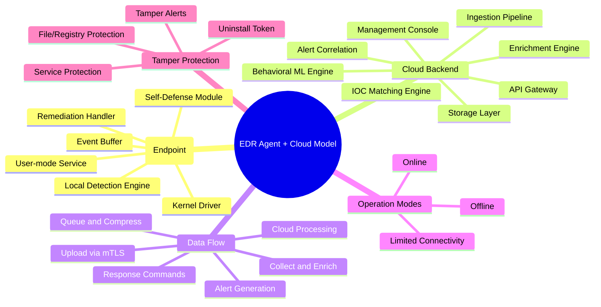
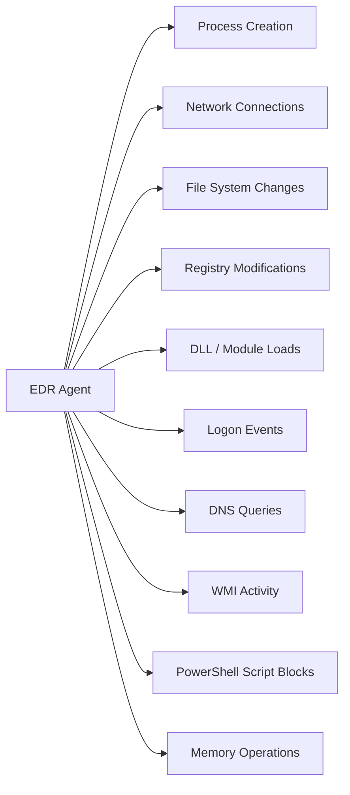
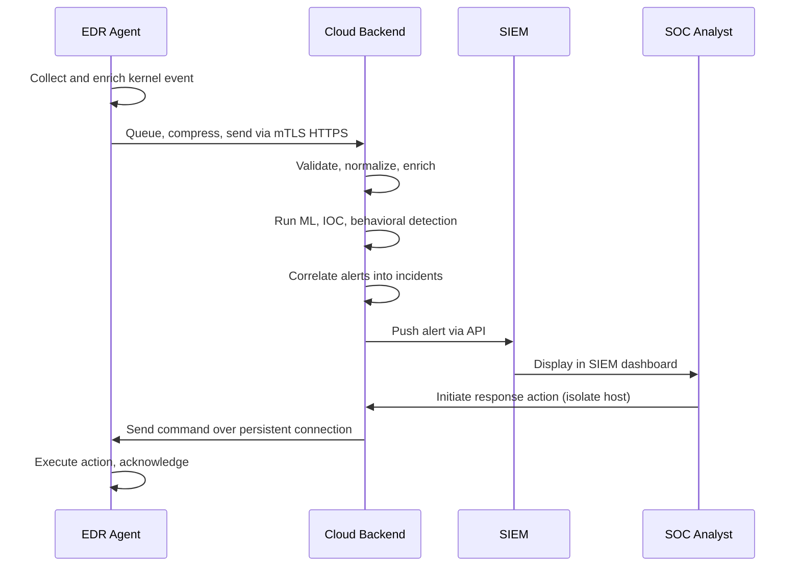
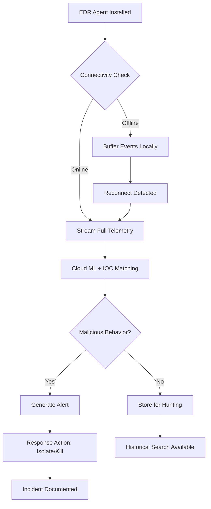

# The EDR Agent and Cloud-Based Analysis Model

## TCM Exam Objectives

- Describe the dual-architecture: on-endpoint agent and cloud-based backend
- Identify core EDR agent components: kernel driver, user-mode service, local engine, buffer, and self-defense
- Understand telemetry collection sources: processes, network, file system, registry, DNS, memory
- Explain cloud-based analysis: ML models, behavioral analytics, IOC matching, and alert correlation
- Distinguish agent operation modes: online, offline, and limited connectivity
- Analyze data flow from endpoint agent to cloud to SIEM to SOC analyst
- Evaluate EDR agent vs traditional antivirus capabilities
- Troubleshoot agent deployment issues including tamper protection and offline detection
- Apply SOC triage steps for an agent that has stopped checking in

Modern Endpoint Detection and Response splits intelligence and analysis between an on-endpoint agent and a cloud-based backend. The agent handles real-time telemetry collection and local filtering, while the cloud provides advanced analytics, ML models, threat intelligence correlation, and a centralized management console.

- Dual-architecture model: agent (on-endpoint) and cloud (backend analysis)
- Core components of an EDR agent: kernel driver, user-mode service, local engine, buffer, self-defense
- Telemetry sources collected by the agent
- Cloud-based analysis engines: ML, behavioral analytics, threat intel matching
- Agent operation modes: online, offline, limited connectivity
- Data flow: endpoint to cloud to analyst
- Agent deployment, configuration, and tamper protection
- Comparison of EDR agent model to legacy antivirus

## 1. The Dual-Architecture Model: Agent + Cloud

Traditional antivirus runs entirely on the endpoint, relying on local signature databases. Modern Endpoint Detection and Response splits intelligence and analysis between two tiers:

| Tier | Location | Role |
|------|----------|------|
| **EDR Agent** | Endpoint (laptop, server) | Real-time telemetry collection, local filtering, in-memory detection, action execution |
| **Cloud Backend** | Vendor-hosted cloud (SaaS) | Advanced analytics, ML model execution, threat-intelligence correlation, long-term data storage, management console, API for SIEM integration |

This split allows the agent to be lightweight and fast, while the cloud brings massive compute power, global threat visibility, and continuous model updates without requiring endpoint restarts [turn0search0].

---

## 2. EDR Agent Architecture

> 📌 **Exam Tip:** A PSAA scenario question may describe an EDR agent that has stopped reporting to the cloud console. The correct response is to treat this as a high-priority security incident — not a network issue. An attacker who kills or disables the EDR agent gains a free operating window. The SOC should immediately isolate the host, check tamper alerts, and investigate concurrent security events.

### 2.1 Core Components

| Component | Type | Function |
|-----------|------|----------|
| **Kernel-level driver (minifilter, ETW, callbacks)** | Kernel | Intercepts process creation, file I/O, registry writes, network events, and DLL loads at the OS level. Hard to bypass from user mode. |
| **User-mode service** | User (SYSTEM) | Receives kernel events, enriches them (hash, signature, file metadata), applies local detections, and manages communication with the cloud. |
| **Local detection engine** | User | Runs a subset of ML models and signatures that can operate offline, enabling detection even without cloud connectivity. |
| **Local event buffer / queue** | User | Temporarily stores telemetry when the cloud is unreachable; forwards events once connectivity is restored. |
| **Self-defense module** | Kernel + User | Prevents unauthorized termination, file deletion, registry tampering, and service stoppage. Often requires administrator rights to disable. |
| **Remediation handler** | User | Executes response actions received from the cloud: isolate host, kill process, quarantine file, run script. |

### 2.2 Telemetry Sources the Agent Collects

The agent is not just a log forwarder; it actively enriches raw events with contextual metadata (file hashes, certificate chains, parent-child relationships) before sending them to the cloud. This enrichment offloads work from the cloud and ensures the cloud sees a rich event, not just a raw syscall [turn0search1][turn0search2].

Telemetry Detail Examples

- **Process creation and termination:** Full command line, parent/child chain, user context
- **Network connections:** TCP/UDP 5-tuple, process ID, bytes sent/received
- **File system changes:** Create, modify, delete, rename, ACL changes
- **Registry modifications:** Value set, key create/delete
- **DLL / module loads:** Full path, signature, load time
- **Logon events:** Logon type, source IP, user, session
- **DNS queries:** Domain, process, response
- **WMI activity:** Subscriptions, method invocations
- **Named pipe connections:** Process, target
- **Memory operations:** Process injection, thread creation, process hollowing

---

## 3. Cloud-Based Analysis Model

### 3.1 Why the Cloud Is Essential

A lone endpoint cannot see the global attack picture. The cloud backend provides:

- **Massive compute:** Running complex behavioral ML models and graph analysis
- **Global threat intelligence:** Correlating events from millions of endpoints to identify new attack campaigns instantly
- **Continuous model updates:** New detection logic and IOCs deployed without requiring agent updates
- **Long-term data retention:** Months or years of endpoint telemetry for historical hunting and forensics
- **Centralized console:** SOC analyst interface for searching, triaging alerts, and initiating response actions
- **SIEM integration:** Cloud APIs push alerts and events to Splunk, Sentinel, Elastic

### 3.2 Cloud Components and Their Functions

| Component | What It Does |
|-----------|--------------|
| **Event Ingestion Pipeline** | Receives, decompresses, and normalizes the stream of events from all agents |
| **Enrichment Engine** | Adds further context: WHOIS for IPs, domain reputation, file sandbox results, threat-intel matches |
| **Behavioral ML Engine** | Runs sequence-based models that detect attack patterns (e.g., macro spawns PowerShell, then downloads EXE, then connects out) |
| **IOC Matching Engine** | Compares hashes, IPs, domains, and file paths against threat-intel feeds in near-real-time |
| **Alert Correlation Engine** | Groups related alerts into a single incident, linking events across multiple endpoints and time windows |
| **Automated Response (SOAR-like)** | Executes pre-defined playbooks based on alert severity and type |
| **Management Console** | Web UI for dashboards, alert triage, process-tree visualization, timeline views, threat hunting |
| **API Gateway** | REST API for SIEM and SOAR platforms to pull alerts, event data, and trigger actions |
| **Storage Layer** | Retains raw event data for compliance and hunting; uses compressed columnar storage for fast querying |

### 3.3 Data Flow: Agent to Cloud to Analyst

---

## 4. Agent Operation Modes

### 4.1 Online Mode (Fully Connected)

- All telemetry streamed in near-real-time (seconds latency)
- Full cloud-based ML and IOC matching applied
- Analyst can live-query the endpoint and take response actions

### 4.2 Offline / Disconnected Mode

- Agent continues to collect telemetry and stores it in a local buffer (typically 100 MB to 1 GB)
- Local detection engine kicks in: a stripped-down ML model and compact IOC database pushed in advance
- Prevention still works: known-bad hashes, certain behavioral blocks enforced locally
- When connectivity is restored, the agent uploads buffered events and receives pending commands

### 4.3 Limited Connectivity (VPN dropping intermittently)

- Agent prioritizes critical events (alerts, malicious detections) over verbose telemetry
- Heartbeat is maintained; if the cloud does not hear from an agent for 15-30 minutes, it raises an "agent offline" alert

| Mode | Telemetry | Detection | Response |
|:---|:---|:---|:---|
| **Online** | Full, real-time | Full cloud ML + local | Full |
| **Offline** | Buffered, delayed on reconnect | Local models only | Local prevention only |
| **Limited** | Prioritized critical events | Local + partial cloud | Local + queued cloud commands |

---

## 5. Agent Deployment and Management

### 5.1 Deployment Methods

| Method | Use Case |
|--------|----------|
| **MSI / EXE installer (SCCM, Intune)** | Silent mass deployment via software management |
| **Group Policy startup script** | Domain-joined machines |
| **Golden image / VM template** | Pre-install agent on base images |
| **Manual installation** | Small environments, tests |
| **Cloud-based deployment** | Auto-onboarding with Azure AD / Intune |

### 5.2 Agent Configuration and Updates

- **Policy** (which events to collect, detection sensitivity, exclusions) is pushed from the cloud console, not edited locally
- **Agent updates** are usually automatic and silent; the cloud gradually rolls out new agent versions
- **Configuration drift** is monitored; if an agent's local policy differs from the cloud-assigned policy, it reports a misconfiguration event

> 📌 **Exam Tip:** Know the difference between online and offline EDR modes for the PSAA. Online mode sends full telemetry in real-time and enables cloud-based ML detection. Offline mode buffers events locally and uses only a compact local ML model. If connectivity is lost, the agent still records everything and uploads when reconnected — it does not stop collecting.

### 5.3 Tamper Protection

- **Service protection:** The agent service is protected by the kernel driver; termination attempts are blocked unless a specific signed uninstaller is used
- **File/registry protection:** Critical agent files and registry keys are ACL-protected; only SYSTEM can modify them
- **Uninstall password / token:** Removal of the agent requires a token generated from the cloud console
- **Tamper alerts:** Any attempt to tamper with the agent generates a high-severity alert that bypasses local buffering

---

## 6. EDR Agent vs. Traditional AV

| Aspect | Traditional AV | EDR Agent |
|--------|---------------|-----------|
| **Data Source** | Scans files on-disk or on-execution | Collects rich telemetry (processes, network, file, registry, memory) |
| **Detection** | Signature, heuristic emulation | Local ML + cloud ML, behavioral analytics, IOC/IOA matching, threat-intel |
| **Local Storage** | Signature database (hundreds of MB) | Lightweight local ML model and IOC set (tens of MB) |
| **Cloud Dependency** | Offline-capable (signature updates periodic) | Can operate offline for limited time; cloud needed for full detection |
| **Console** | Local or on-prem management server | Cloud-based SaaS console with API access |
| **Response** | Quarantine file | Isolate host, kill process, block IP, run custom script, trigger forensics |
| **Visibility** | Only sees malware files | Sees full attack chain: execution, persistence, C2, lateral movement |

---

## 7. Integrating EDR Cloud with SIEM and SOAR

The cloud backend exports data via:
- **Alert APIs** -- push or pull alerts into SIEM
- **Streaming event APIs** -- send raw events to a data lake (Splunk, Elastic, Sentinel)
- **Syslog / CEF connectors** -- for legacy SIEMs
- **SOAR integration** -- cloud triggers automated playbooks based on alert types

The typical flow: **Agent to Cloud to API to SIEM to Analyst Workstation**. The SIEM correlates EDR events with firewall, proxy, email, and identity logs for a complete picture [turn0search10].

---

## 8. Common Vendor Implementations

| Vendor | Agent Name | Cloud Console | Key Characteristic |
|--------|------------|---------------|-------------------|
| Microsoft Defender for Endpoint | Sense service (sense.dll, sense.sys) | security.microsoft.com | Deep OS integration, uses ETW |
| CrowdStrike Falcon | FalconSensor.exe + CSAgent.sys | falcon.crowdstrike.com | Cloud-native, lightweight, strong offline ML |
| SentinelOne | SentinelAgent.exe | sentinelone.com | Single agent for AV, EDR, CWPP; story-line technology |
| Carbon Black | CbDefense sensor | defense.conferdeploy.net | Streaming events, supports on-prem aggregation |

---

## 9. Practical Scenario

**Scenario:** A SOC analyst notices that an endpoint's EDR agent has not checked into the cloud console for 45 minutes. The endpoint is a critical server. What actions should be taken?

Triage and Response Steps

1. **Check agent status locally:** If possible, SSH or RDP into the server and check the agent service (`Get-Service sense`, `sc query "CSAgent"`). If the service is stopped or disabled, this is a red flag -- possible tampering or an attack.

2. **Review recent tamper alerts** in the EDR console: Look for any "agent tamper attempt" or "sensor disabled" alerts that may have fired before connectivity was lost.

3. **Network connectivity:** Verify if the server can reach the cloud endpoint via `Test-NetConnection`. Firewall rules or proxy changes might block the agent.

4. **Check local buffer:** If the agent is running but not uploading, the local buffer may be full due to high event volume.

5. **Investigate concurrent events:** Use the SIEM to check if the server had any suspicious logons (4624) or process creations (Event ID 1) shortly before the agent went silent.

6. **Containment:** If tampering is suspected, physically isolate the host and initiate forensic collection (memory dump, disk image).

**Key Takeaway:** An agent going silent is an incident until proven otherwise.

---

## Recap

The EDR agent collects and enriches raw telemetry via a kernel driver and user-mode service, with local detection capabilities and a buffer for offline operation. The cloud backend performs heavy ML analytics, correlates events globally, stores long-term data, and provides the SOC console and API. Data flows endpoint to cloud to SIEM/SOAR, with commands flowing back from cloud to agent for response actions. Agents operate in online, offline, and limited-connectivity modes. Tamper protection is kernel-enforced. An agent that stops checking in is a high-priority security event requiring immediate investigation.
