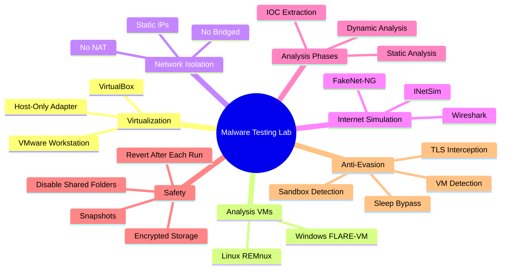
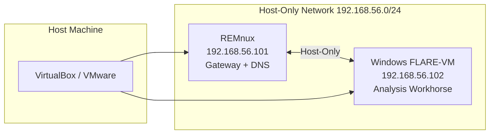
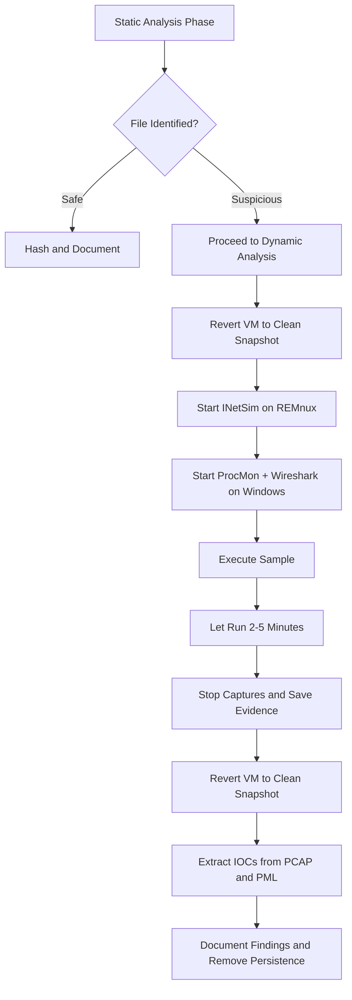

# Creating a Controlled Malware Testing Environment

## TCM Exam Objectives

- Configure VirtualBox host-only networking for isolated malware analysis
- Deploy and configure REMnux as a simulated internet gateway with INetSim
- Install and prepare FLARE-VM on a Windows analysis workhorse
- Implement the snapshot lifecycle for repeatable and safe malware detonation
- Execute static analysis using strings, floss, YARA, and PE-studio before dynamic execution
- Perform dynamic analysis with ProcMon, Wireshark, and RegShot
- Extract network, host, and MITRE ATT&CK IOCs from analysis artifacts
- Identify and counter anti-analysis techniques including VM detection and sleep bypass
- Apply structured safe-handling rules to prevent accidental malware exposure

Malware analysis requires a safe, isolated environment where malicious code can be detonated and observed without risk to production systems. A controlled testing environment uses virtualization, host-only networking, and simulated internet services to contain malware while providing full visibility into its behavior.

- Core principles of malware containment and isolation
- VirtualBox / VMware configuration with host-only networking
- Deployment of Windows analysis VM (FLARE-VM) and Linux analysis gateway (REMnux)
- Internet simulation with INetSim and FakeNet-NG
- Snapshot lifecycle and repeatable analysis workflow
- Static analysis, dynamic analysis, and network simulation tools
- Anti-analysis evasion techniques and countermeasures



## 1. Why a Controlled Environment Is Non-Negotiable

Malware is designed to spread, steal, and destroy. Running a sample on a host workstation or production server can lead to lateral movement, credential theft, and data exfiltration within seconds. Every unknown binary must be treated as hostile and handled only inside a purpose-built, disposable sandbox that has no route to the internet or the organization's network.

The three pillars of a safe analysis lab are:
1. **Virtualization** -- All analysis takes place inside virtual machines that can be snapshotted and reverted
2. **Network Isolation** -- The VMs are connected only to each other through a virtual switch with no physical uplink
3. **Simulated Services** -- A dedicated Linux VM runs tools like INetSim and FakeNet-NG to mimic internet services, tricking the malware into revealing its network behavior without ever touching a real network [turn0search0]

---

## 2. Lab Architecture: The Two-Machine Model

The industry-standard architecture consists of two virtual machines inside a Type 2 hypervisor (VirtualBox or VMware Workstation), connected by a host-only or internal network.

| Machine | OS | Role | Key Software |
|---------|----|------|--------------|
| **Analysis Workhorse** | Windows 10/11 | The "victim" host where malware is detonated | FLARE-VM, Wireshark, ProcMon, RegShot, PE-studio |
| **Analysis Gateway** | Linux (Ubuntu-based) | Simulates the internet, captures network traffic, provides static analysis tools | REMnux toolkit: INetSim, FakeNet-NG, Wireshark, YARA, Ghidra, oledump |

The two VMs sit on the same **Host-Only Adapter**. The Linux REMnux VM is assigned a static IP (e.g., `192.168.56.101`), and the Windows VM uses a static IP in the same subnet (e.g., `192.168.56.102`) with REMnux as its default gateway and DNS server. No NAT, no bridged adapter, no internet. This topology ensures all outbound traffic from the malware goes to REMnux's simulated services, where it can be captured and analyzed safely.



---

## 3. VirtualBox Configuration

### 3.1 Install VirtualBox and the Extension Pack

Download the latest VirtualBox platform package and the Extension Pack from virtualbox.org. The Extension Pack enables USB 3.0, disk encryption, and PXE boot -- capabilities that some sophisticated malware may check for.

> 📌 **Exam Tip:** On the PSAA exam, remember that the Host-Only Adapter is the only safe choice for malware analysis. Never use NAT or Bridged — both provide a route to the real internet, which risks actual infection and legal liability. Confirm isolation by pinging 8.8.8.8 from the Windows VM: it must fail. If it succeeds, the malware can phone home to real C2 servers.

### 3.2 Create the Host-Only Network

1. **VirtualBox Manager -> File -> Tools -> Network Manager**
2. Select the **Host-Only Networks** tab and click **Create**
3. Configure the adapter:
   - IPv4 Address: `192.168.56.1`
   - IPv4 Network Mask: `255.255.255.0`
   - DHCP Server: **Disable** (static IPs will be assigned inside each VM)
   - Adapter: Ensure it is active

**Why disable DHCP?** A fixed, predictable addressing scheme ensures simulated services on REMnux are always reachable at the same IP, and DHCP-based evasion attempts are immediately visible.

### 3.3 Build the REMnux VM

1. Download the REMnux OVA file from remnux.org
2. **File -> Import Appliance** and select the OVA
3. Before starting, open **Settings -> Network**:
   - **Adapter 1:** Enable, Attached to **Host-Only Adapter**, select the created network
   - **Adapter 2, 3, 4:** Disable
4. **Settings -> General -> Advanced:** Set **Shared Clipboard** and **Drag'n'Drop** to **Disabled**
5. **Settings -> Shared Folders:** Remove all
6. Start the VM. Assign the static IP:
   ```bash
   sudo ip addr add 192.168.56.101/24 dev eth0
   sudo ip link set eth0 up
   ```
7. Update the system and REMnux tools:
   ```bash
   sudo apt update && sudo apt upgrade -y
   remnux update
   ```

### 3.4 Build the Windows Analysis VM

1. **Create a new VM:** Type: Microsoft Windows, Version: Windows 10 (64-bit) or Windows 11
2. Allocate resources: **8 GB RAM minimum**, 2+ CPUs, **80-100 GB virtual disk**
3. **Settings -> Network:** Adapter 1 -> Host-Only Adapter (same as REMnux). Disable all other adapters
4. **Settings -> General -> Advanced:** Disable Shared Clipboard and Drag'n'Drop
5. **Settings -> Shared Folders:** Remove all
6. Boot from Windows ISO and complete installation
7. Set a static IP:
   - IP address: `192.168.56.102`
   - Subnet mask: `255.255.255.0`
   - Default gateway: `192.168.56.101` (REMnux)
   - Preferred DNS server: `192.168.56.101`

### 3.5 Install FLARE-VM

FLARE-VM is a community-curated collection of over 150 security tools installed via a single Chocolatey-based PowerShell script [turn0search5].

1. **Disable Windows Defender and Tamper Protection** via Group Policy. These interfere with analysis tools and may quarantine malware samples
2. **Disable Windows Update** so the VM state remains stable across snapshots
3. Open PowerShell as Administrator and execute:
   ```powershell
   (New-Object net.webclient).DownloadFile('https://raw.githubusercontent.com/mandiant/flare-vm/main/install.ps1', "$env:UserProfile\Desktop\install.ps1")
   Unblock-File .\install.ps1
   Set-ExecutionPolicy Unrestricted -Force
   .\install.ps1 -password <YourPassword> -noWait -noGui
   ```
4. Once complete, reboot. The Windows VM now contains:
   - **Disassemblers / Decompilers:** Ghidra, x64dbg, IDA Free, dnSpy
   - **Network Analysis:** Wireshark, FakeNet-NG (Windows version), NetworkMiner
   - **Process Monitoring:** Process Monitor, Process Explorer, Process Hacker
   - **File Analysis:** PE-studio, CFF Explorer, FLOSS, Strings, HxD
   - **Scripting:** Python 3, Visual Studio Code

---

## 4. Simulating the Internet with REMnux

Malware expects to reach the internet to download second-stage payloads, contact C2 servers, and exfiltrate data. Without a simulated internet, many samples simply sleep or exit.

### 4.1 INetSim

INetSim simulates common internet services: HTTP, HTTPS, DNS, SMTP, FTP, IRC, and more.

```bash
sudo apt install inetsim -y
sudo inetsim --host 192.168.56.101
```

By default, INetSim binds to `0.0.0.0` and listens on standard ports. Test from the Windows VM by opening a browser and navigating to `http://192.168.56.101`.

**Key configuration file:** `/etc/inetsim/inetsim.conf`
- Redirect all DNS requests to REMnux: `dns_default_ip 192.168.56.101`
- Log all HTTP requests: examine `/var/log/inetsim/service.log`

### 4.2 FakeNet-NG

FakeNet-NG uses Windows API hooks to intercept network traffic from a single process, redirecting it to simulated listeners. It offers per-process granularity rather than system-wide redirection.

### 4.3 Wireshark on Both Machines

Capture on the REMnux host-only interface to see all traffic between the Windows VM and the simulated internet. This is the primary dynamic analysis data source.

---

## 5. The Snapshot Lifecycle

Snapshots preserve the exact disk and memory state of a VM at a point in time. They are the cornerstone of a safe and repeatable analysis workflow.

### 5.1 Snapshot Strategy

Take snapshots at critical milestones:
1. **Base Install** -- After OS installation, updates, and static IP configuration, before any analysis tools or samples
2. **Tool Suite Installed** -- After FLARE-VM and REMnux tools are fully installed and configured. This is the snapshot to revert to after every malware execution
3. **Pre-Execution** -- Immediately before running a specific sample
4. **During Analysis** -- If needing to pause and return later

### 5.2 VBoxManage Snapshot Commands

```cmd
:: List snapshots for a VM
VBoxManage snapshot "Windows 10 Analysis" list

:: Take a snapshot
VBoxManage snapshot "Windows 10 Analysis" take "clean-base"

:: Restore a snapshot (VM must be powered off)
VBoxManage snapshot "Windows 10 Analysis" restore "clean-base"
```

> 📌 **Exam Tip:** The snapshot lifecycle is frequently tested on the PSAA. The key rule to remember: revert to the "Tool Suite Installed" snapshot after every single malware execution. Treat the VM as fully compromised. Never reuse a VM state across different samples — cross-contamination invalidates your forensic findings and can allow remnants of Sample A to interfere with Sample B's behavior.

### 5.3 The Golden Rule

**After every single malware execution, revert to the "Tool Suite Installed" snapshot.** Treat the VM as completely compromised after detonation. Never use the same VM state for two different samples without reverting.

---

## 6. Critical Safety Rules

1. Never run malware on the host OS. Always use a VM.
2. Never give the analysis VMs internet access. Use Host-Only or Internal Network only.
3. Disable Shared Folders, Drag-and-Drop, and Shared Clipboard in the hypervisor settings.
4. Use a non-admin user inside the Windows VM when possible, to observe UAC bypass and privilege escalation behavior.
5. Keep all malware samples encrypted at rest. Store in password-protected ZIP files (password: `infected`) and extract only inside the analysis VM.
6. Never upload raw samples to public internet services like VirusTotal without understanding the implications.
7. Revert after every execution. No exceptions.
8. Disconnect the host's physical network if unsure about the VM isolation.

---

## 7. Analysis Workflow

### Phase 1: Static Analysis (REMnux + Windows)

Perform static analysis **before** executing the sample. This is safe and often reveals 80% of the malware's behavior.

| Step | Command | Purpose |
|:---|:---|:---|
| File Identification | `file sample.exe` | Determine file type |
| Hashing | `sha256sum sample.exe` | Generate file IOCs |
| Strings | `strings sample.exe`, `floss sample.exe` | Extract readable content, obfuscated strings |
| PE Analysis | PE-studio or `pecheck sample.exe` | Analyze imports, sections, compile timestamp |
| YARA | `yara -r /path/to/rules sample.exe` | Match known malware families |

### Phase 2: Dynamic Analysis (Windows FLARE-VM)

Only after static analysis is complete should the sample be detonated.

1. **Start the Network Simulator on REMnux:**
   ```bash
   sudo inetsim --host 192.168.56.101
   ```
2. **Start Capture Tools on Windows:**
   - Wireshark: Start capturing on the host-only interface
   - Process Monitor (ProcMon): Start capturing with a filter set to show only the sample's process
   - Process Explorer: Launch and keep visible
   - RegShot: Take a "1st shot" of the registry before execution
3. **Execute the Sample:** Run the malware as Administrator (to observe full behavior; also test as non-admin to see UAC bypass)
4. **Let It Run:** Allow 2-5 minutes for the malware to unpack, beacon, drop files, and establish persistence
5. **Stop and Collect:**
   - Stop ProcMon capture. Save as `.pml`
   - Stop Wireshark capture. Save as `.pcapng`
   - Take RegShot "2nd shot" and compare
   - In Process Explorer, check for newly created processes, injected DLLs, and unusual parent-child relationships

### Phase 3: IOC Extraction and Documentation

| IOC Type | Examples | Source |
|:---|:---|:---|
| **Network IOCs** | IPs, domains, ports, protocols | Wireshark PCAP, INetSim logs |
| **Host IOCs** | File paths, registry keys, mutexes, process names, hashes | ProcMon, RegShot, strings |
| **MITRE ATT&CK** | T1059.001 (PowerShell), T1547.001 (Run Keys), T1571 (Non-Standard Port) | Behavioral mapping |

---

## 8. Key Tools Cheat Sheet

### On REMnux (Linux)

| Tool | Purpose | Command Example |
|------|---------|-----------------|
| `strings` | Extract ASCII/Unicode strings | `strings -a sample.exe` |
| `floss` | Extract obfuscated strings | `floss sample.exe` |
| `yara` | Pattern matching on files/memory | `yara rules.yar sample.exe` |
| `pecheck` | Parse PE headers | `pecheck sample.exe` |
| `oledump` | Extract macros from Office docs | `oledump.py sample.docm` |
| `inetsim` | Simulate internet services | `sudo inetsim --host 192.168.56.101` |
| `wireshark` | Capture and analyze network traffic | `wireshark &` |
| `ghidra` | Disassemble and decompile binaries | `ghidraRun` |

### On Windows FLARE-VM

| Tool | Purpose |
|------|---------|
| **Process Monitor (ProcMon)** | Real-time file system, registry, and process/thread activity |
| **Process Explorer (ProcExp)** | Advanced process tree, DLL view, string search in memory |
| **Wireshark** | Network packet capture and analysis |
| **RegShot** | Registry snapshot comparison |
| **PE-studio** | Static PE analysis: imports, sections, anomalies |
| **x64dbg / x32dbg** | User-mode debugger for dynamic code analysis |
| **FakeNet-NG** | Windows-based network simulation (per-process) |
| **HxD** | Hex editor for file inspection |
| **CyberChef** | Data transformation, decoding, encryption analysis |

---

## 9. Limitations and Anti-Analysis Evasion

| Evasion Technique | How It Works | Countermeasure |
|-------------------|--------------|----------------|
| **VM Detection** | Checks for hypervisor artifacts (MAC addresses, registry keys, running processes) | Use VM-hardening scripts, change default VM settings |
| **Sandbox Detection** | Checks disk size, RAM, CPU cores, or analysis tools | Add fake documents, fill virtual disk, rename tool processes |
| **Sleep / Time Delay** | Malware sleeps for hours to outlast sandbox timeouts | Use `faketime` or fast-forward time in VM; debugger to skip sleep calls |
| **Internet Connectivity Check** | Pings `8.8.8.8` or fetches known URL. If no response, exits | INetSim and FakeNet-NG respond to all requests |
| **Stalling Code** | Executes meaningless loops to exhaust sandbox timeouts | Increase sandbox timeout; use debugger to bypass loops |
| **Environment-Specific Payload** | Only activates if certain conditions are met | Set VM hostname, username, and locale to match target environment |

Sophisticated malware may use HTTPS with certificate pinning or custom encryption. INetSim cannot emulate a legitimate, signed TLS certificate. Use `mitmproxy` on REMnux to intercept and re-encrypt HTTPS traffic with a local CA installed in the Windows VM's trust store [turn0search8].

---

## 10. Practical Scenario

**Scenario:** A suspicious executable found on a user's workstation needs to be analyzed. Build an analysis lab from scratch.

<details>
<summary>Step-by-Step Lab Build</summary>

1. **Deploy two VMs:** REMnux (Linux) on `192.168.56.101` for network simulation and static analysis; Windows FLARE-VM on `192.168.56.102` for detonating malware with ProcMon, ProcExp, RegShot, and Wireshark.

2. **Network configuration:** Host-Only Adapter for both VMs. Windows VM uses REMnux's IP as default gateway and DNS server.

3. **Confirm isolation:** Attempt `ping 8.8.8.8` and `nslookup google.com` from the Windows VM. Both must fail. Connection to `192.168.56.101` should succeed (INetSim simulated HTTP page).

4. **Network simulation tools:** INetSim (system-wide internet service simulation) and FakeNet-NG (per-process API hook interception).

5. **Post-execution:** Stop captures, save all output (Wireshark PCAP, ProcMon PML, RegShot comparison), then **revert the VM to the clean snapshot**.
</details>

---



## Recap

An isolated malware analysis lab uses virtualization, host-only networking, and simulated internet services to safely detonate and observe malicious code. The standard architecture is a Windows FLARE-VM and Linux REMnux pair connected via a Host-Only Adapter. INetSim and FakeNet-NG on REMnux provide the fake internet that malware expects, capturing all network IOCs without real connectivity. Snapshots are the safety net -- revert after every single execution. Static analysis precedes dynamic analysis. Anti-analysis techniques (VM detection, sleep delays, internet checks) must be understood and mitigated. A structured, repeatable workflow ensures evidence is not missed and safety is maintained.
