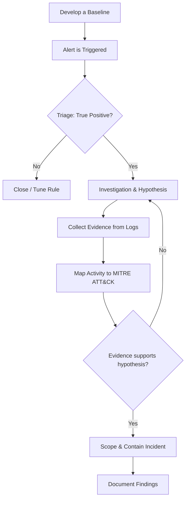
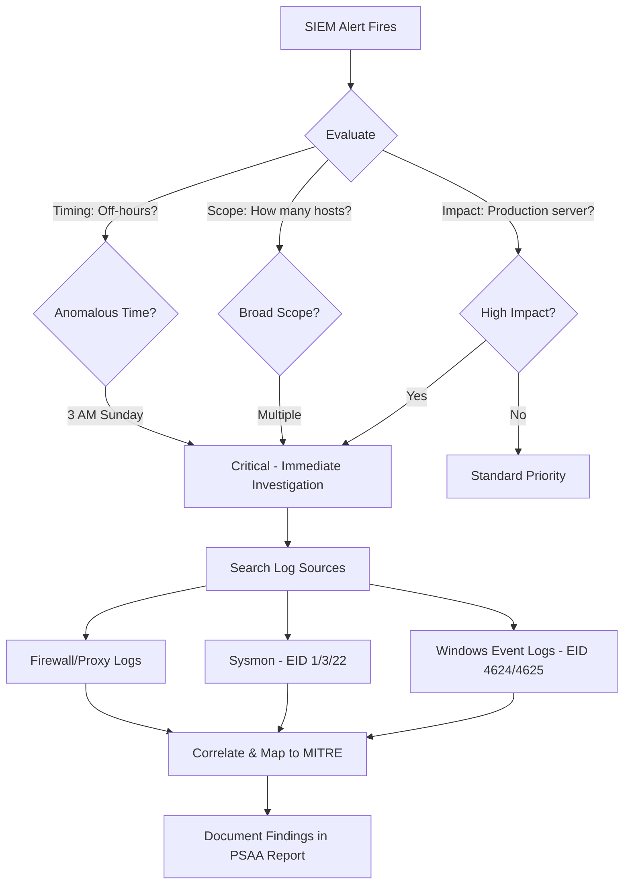
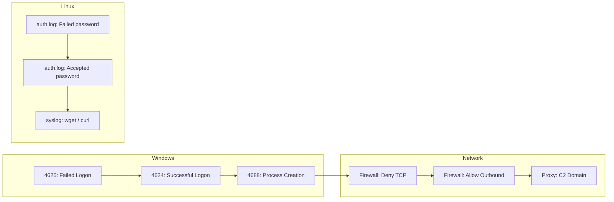

# Identifying Patterns of Suspicious Behavior in Logs

## TCM Exam Objectives

By mastering this module, you will be prepared to:

1. **Apply** a structured SOC investigation methodology: baseline, triage, hypothesis, evidence, decision
2. **Memorize** critical Windows Event IDs (4624, 4625, 4688, 4698, 4720) and Sysmon EIDs (1, 3, 22)
3. **Distinguish** behavioral detection from static IOC matching for evasive threats
4. **Analyze** Linux auth.log for brute-force patterns using grep, awk, and sort
5. **Map** observed attacker actions to MITRE ATT&CK tactics and techniques
6. **Write** Sigma rules to describe suspicious log patterns in SIEM-agnostic YAML format
7. **Correlate** evidence across Windows, Linux, and network logs to reconstruct an attack chain
8. **Triage** alerts by evaluating impact, scope, timing, and severity
9. **Detect** privilege escalation via Event ID 4720 (user creation) followed by group membership changes
10. **Document** investigation findings with a clear chain of evidence for the PSAA report

Log analysis is the foundation of SOC operations. Every security incident leaves traces across multiple log sources, and the ability to recognize suspicious patterns within those logs distinguishes a Tier 1 triage analyst from an investigator who can reconstruct a full attack chain. For the PSAA exam, you will be placed in a simulated environment with pre-loaded logs and expected to identify Indicators of Compromise (IOCs), trace attacker actions, and document findings in a professional report.

- SOC analyst investigation methodology
- Key log sources and their critical event IDs
- Windows and Linux suspicious patterns
- Behavioral detection vs. static IOC matching
- Sigma rules and MITRE ATT&CK mapping



📌 **Exam Tip:** Memorize these event IDs cold: Windows 4624 (successful logon), 4625 (failed logon), 4688 (process creation), 4698 (scheduled task), 4720 (user created), Sysmon 1 (process), 3 (network connect), 22 (DNS query). The PSAA will present log entries and expect you to recognize the event type immediately without looking it up.

## The SOC Analyst Investigation Methodology

A structured methodology ensures investigations are consistent, repeatable, and defensible. Without one, monitoring becomes chaotic and critical details are missed 【turn0search1】【turn0search3】.

### Develop a Baseline

You cannot identify suspicious behavior without understanding normal behavior. In the PSAA environment, quickly assess expected network traffic, common services, and standard user activity patterns. A baseline answers the question: "What does normal look like for this environment?"

### Triaging Alerts

Not every alert represents a critical incident. Triage determines priority and severity by evaluating:

| Factor | Questions to Ask |
|--------|-----------------|
| **Impact** | Is this a production server or a test workstation? Does the alert involve sensitive data? |
| **Nature** | Is this a generic port scan or a confirmed malware callback? |
| **Scope** | How many systems or users are affected? Is there evidence of lateral movement? |
| **Timing** | Is this happening during business hours or at 3 AM on a Sunday? |

### Investigation and Hypothesis

Once an alert passes triage, ask structured questions to build a hypothesis:

- **Who** is the source or target (user, system, IP address)?
- **What** specific event occurred (login failure, process creation, file modification)?
- **When** did it happen, and has this pattern occurred before?
- **Where** did the activity originate (internal host, external IP, geographic location)?
- **Why** might this activity be occurring?

### Collecting Evidence

Evidence collection turns suspicion into fact. Pull logs from multiple sources, examine process trees, and use threat intelligence tools like VirusTotal to validate file hashes and IP addresses against known malicious databases 【turn0search5】【turn0search7】.

## Key Log Sources and Their Event IDs

The PSAA tests your ability to interpret logs from multiple systems. Each log category reveals different parts of an attack.

| Log Category | Source | What It Records | PSAA Relevance |
|---|---|---|---|
| **Windows Event Logs** | Security, System, Sysmon/Operational, PowerShell/Operational | User authentication, process execution, account management, system changes | Primary source for endpoint investigation and lateral movement analysis |
| **Linux System Logs** | `/var/log/auth.log`, `/var/log/syslog` | SSH logins, sudo/su commands, user creation, system service events | Essential for web server attacks, SSH brute-force, and privilege escalation |
| **Network Device Logs** | Firewall, IDS/IPS, Proxy | Allowed/denied traffic flows, detected network attacks, URLs visited | Tracking lateral movement, C2 communication, and data exfiltration |
| **Web Server Logs** | Apache/Nginx access and error logs | HTTP requests, response codes, user agents, accessed URLs | Investigating web application attacks (SQLi, XSS), brute-force, directory traversal |
| **SIEM Tools** | Splunk, ELK Stack, Wazuh | Aggregated and correlated view from all sources | Central hub for searching, correlating, and detecting threats |

### Critical Windows Event IDs and Sysmon Events

Recognizing these event IDs is essential for analyzing the attacks presented in the exam 【turn0search2】【turn0search8】.

| Event ID | Source | Description | Suspicious Pattern | MITRE ATT&CK Tactic |
|---|---|---|---|---|
| **4624** | Security | Successful account logon | Logon Type 3 (Network) or 10 (RemoteInteractive) from unexpected IPs or off-hours | Initial Access, Lateral Movement |
| **4625** | Security | Failed logon attempt | Large volume from a single source IP targeting multiple accounts | Credential Access |
| **4688** | Security | Process creation | Suspicious command-line arguments like `powershell.exe -enc ...` | Execution |
| **4698** | Security | Scheduled task created | Malware creating tasks for persistence | Persistence, Privilege Escalation |
| **4720** | Security | User account created | Unauthorized creation followed by addition to privileged groups | Persistence |
| **Sysmon EID 1** | Sysmon/Operational | Process creation (enriched) | Provides file hashes, original filename, parent process for execution chain | Execution |
| **Sysmon EID 3** | Sysmon/Operational | Network connection | C2 beacons, reverse shells, data exfiltration via DestinationIP/Port | Command & Control |
| **Sysmon EID 22** | Sysmon/Operational | DNS query | Host querying algorithmically generated domains (DGA) | Command & Control |

<details>
<summary>Common Linux Log Patterns</summary>

For Linux systems, command-line tools (`grep`, `awk`, `tail`) are primary analysis tools.

**`/var/log/auth.log` - Authentication Issues:**

Brute-force detection:
```bash
sudo grep "Failed password" /var/log/auth.log | awk '{print $11}' | sort | uniq -c | sort -nr
```

Privilege escalation monitoring:
```bash
sudo grep "sudo:" /var/log/auth.log
```

**`/var/log/syslog` - Service-Level Anomalies:**

Service crashes and restarts:
```bash
journalctl -u ssh --since "YYYY-MM-DD" -p err
```
</details>

📌 **Exam Tip:** Attackers change IPs and recompile binaries (changing hashes), but behavioral patterns are harder to mask. The PSAA tests behavioral detection — for example, an external IP that fails login 500 times, succeeds once, then immediately runs `whoami` and `net localgroup administrators`. This chain of behavior is more reliable than any single IOC.

## From Pattern to Detection: Sigma Rules

Sigma is an open-source, generic signature format for logs. It allows you to describe suspicious log events in a SIEM-agnostic YAML format that can be converted to run on any major SIEM platform 【turn0search4】【turn0search9】.

```yaml
title: Suspicious PowerShell Download Cradle
id: xxxxxxxx-xxxx-xxxx-xxxx-xxxxxxxxxxxx
status: experimental
description: Detects PowerShell commands that download content from the internet
logsource:
  product: windows
  category: process_creation
detection:
  selection:
    EventID: 4688
    CommandLine|contains:
      - 'Net.WebClient'
      - 'DownloadString'
      - 'Invoke-WebRequest'
      - 'Start-BitsTransfer'
  condition: selection
falsepositives:
  - Legitimate administrative scripts
  - Software update processes
level: high
```

## Behavioral Detections Over Static IOCs

Attackers easily change IP addresses or recompile binaries to alter hashes, but underlying behaviors are much harder to mask. The PSAA tests your ability to spot behavioral patterns 【turn0search6】.

Consider this alert investigation chain:

**Scenario:** A critical server was accessed by `user_analyst` at 3:00 AM from an external IP.

1. **Triage:** Highly anomalous - standard users do not access critical servers at 3 AM.
2. **Hypothesis:** Compromised credentials or insider threat.
3. **Evidence Collection:**
   - Windows Event ID 4624 (Logon Type 10) confirms remote interactive login.
   - Event ID 4688 shows `whoami` and `net localgroup administrators` executed.
   - Firewall logs show outbound connection to a known malicious domain.
4. **MITRE ATT&CK Mapping:**
   - Initial Access: Valid Accounts (T1078)
   - Discovery: System Information Discovery (T1082)
   - Command and Control: Application Layer Protocol (T1071)

This chain of correlated behaviors across different log sources is the hallmark of a true SOC analyst.



## Practical Checklist for the PSAA

- Practice using `grep`, `awk`, `sort`, `uniq` on Linux and `Get-WinEvent` in PowerShell on Windows.
- Build a home lab with VMs and a SIEM to generate and analyze logs from simulated attacks.
- Memorize critical Windows Event IDs (4624, 4625, 4688, 4698, 4720) and Sysmon Event IDs (1, 3, 22).
- Document every investigation step clearly - the PSAA report is equally weighted with the technical assessment.



## Recap

Log analysis is the bedrock skill for the PSAA exam. A structured methodology (baseline, triage, hypothesis, evidence collection, decision, documentation) ensures consistent and repeatable investigations. Mastery of critical event IDs, behavioral detection patterns, and Sigma rules enables you to identify threats that static IOC matching would miss. The exam rewards analysts who can correlate events across multiple log sources to reconstruct the full attack narrative.
