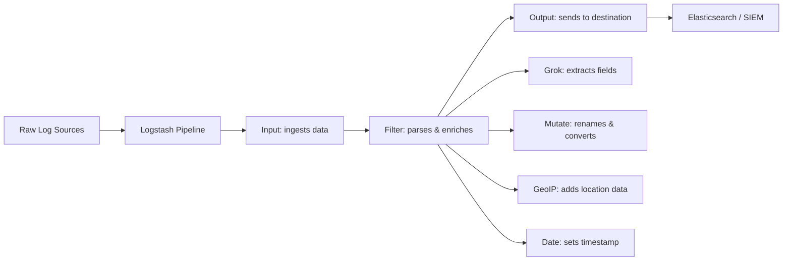
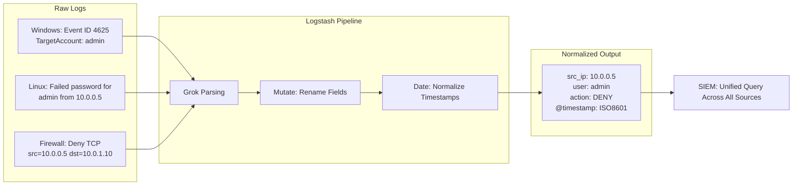

# Log Normalization and Parsing

## TCM Exam Objectives

By mastering this module, you will be prepared to:

1. **Distinguish** between normalization (standardizing field names) and enrichment (adding context)
2. **Design** a Logstash pipeline with Input, Filter, and Output stages
3. **Write** Grok patterns to extract structured fields from unstructured syslog messages
4. **Parse** SSH failed login messages into username, source IP, and port using Grok
5. **Apply** the mutate filter to rename, convert, and remove fields for schema compliance
6. **Enrich** logs with GeoIP data to identify geographic attack origins
7. **Debug** Grok patterns using online debuggers before production deployment
8. **Configure** date filter to normalize timestamps across time zones
9. **Evaluate** the role of normalization in enabling cross-source correlation
10. **Map** normalized field schemas to the PSAA investigation reporting requirements

Log normalization and parsing transform raw, inconsistent log data from thousands of sources into structured, searchable fields that a SIEM can analyze. Without normalization, a SOC analyst cannot efficiently correlate events across Windows, Linux, network, and cloud systems. The PSAA exam expects you to understand how normalized data powers detection rules and enables cross-source investigations.

- Normalization vs. enrichment
- Logstash pipeline architecture (Input, Filter, Output)
- Grok pattern matching for unstructured logs
- Practical parsing examples for security logs



📌 **Exam Tip:** Normalization is what makes `src_ip` the same field name across Windows, Linux, and firewall logs. Without it, you would need separate queries for each source. In the PSAA, the SIEM data is pre-normalized — but understanding how Grok patterns extract fields helps you interpret the raw `message` field when the normalized values seem wrong.

## The Problem: Logs Speak Different Languages

Before an attack pattern can be identified, the fundamental problem of log heterogeneity must be solved. Logs from different sources arrive in wildly different formats 【turn0search1】【turn0search3】.

**Windows Event (Unstructured):**
```
The computer attempted to validate the credentials for an account.
Authentication Package: MICROSOFT_AUTHENTICATION_PACKAGE_V1_0.
Logon Account: Administrator. Error Code: 0xC000006A.
```

**Apache Web Server (Semi-Structured):**
```
192.168.1.100 - admin [10/Oct/2023:13:55:36 -0500] "GET /admin/deleteUser?id=101 HTTP/1.1" 200 2563
```

**Cisco ASA Firewall (Structured Syslog):**
```
<134>Oct 10 2023 13:55:36 ASA-1 : %ASA-6-106015: Deny TCP (no connection) from 10.0.0.5/52341 to 10.0.1.10/22 flags RST ACK
```

A SIEM needs these in a consistent field-value format to run queries, generate alerts, and correlate events. Normalization solves this by transforming inconsistent data into a standard schema.

## Normalization vs. Enrichment

| Concept | Definition | Logstash Implementation | SOC Goal |
|---|---|---|---|
| **Normalization** | Standardizing field names and values to a common schema | Parsing with Grok to extract consistent fields like `src_ip`, `user_name` | Ensures cross-source correlation on unified field names |
| **Enrichment** | Adding contextual information to a log | GeoIP filter adds geographic data; threat intel lookup adds reputation scores | Turns raw IP addresses into actionable context |

The PSAA provides normalized data in the SIEM. You must use those standard fields to trace attacks, but understanding how data was standardized helps you interpret it correctly 【turn0search5】.

## Logstash Pipeline Architecture

Logstash serves as the data processing pipeline in the ELK Stack, handling collection, parsing, transformation, and enrichment before indexing 【turn0search7】【turn0search9】.

### Input Stage

The input ingests data from various sources:

| Input Plugin | Use Case | Configuration Example |
|---|---|---|
| `file` | Reads from log files on disk | `path => "/var/log/syslog"` |
| `syslog` | Listens for syslog messages on port 514 | `port => 514` |
| `beats` | Receives from lightweight shippers (Filebeat, Winlogbeat) | `port => 5044` |
| `tcp` | Generic TCP listener for custom log formats | `port => 5000` |

### Filter Stage

Filters are where parsing and enrichment occur. This is the core of the pipeline.

| Filter Plugin | Function | Security Use Case |
|---|---|---|
| **grok** | Parses unstructured text into structured fields | Extract username, IP, and port from SSH failed login messages |
| **mutate** | Modifies fields - rename, convert types, remove fields | Rename `src_ip` to `source.address` for CEF compatibility |
| **date** | Parses timestamps and sets `@timestamp` | Ensure chronological accuracy across time zones |
| **geoip** | Adds geographic metadata from IP addresses | Add country, city, coordinates to identify attack origin |

### Output Stage

The output sends processed data to its destination:

| Output Plugin | Destination | Use Case |
|---|---|---|
| `elasticsearch` | Elasticsearch cluster | Primary storage and indexing for SIEM analysis |
| `stdout` | Console output | Debugging and pipeline testing |
| `kafka` | Apache Kafka topic | Buffering for high-volume environments |

### Example Pipeline Configuration

```
input {
  file {
    path => "/var/log/syslog"
    start_position => "beginning"
  }
}

filter {
  grok {
    match => { "message" => "%{SYSLOGTIMESTAMP:timestamp} %{HOSTNAME:host} %{GREEDYDATA:msg}" }
  }
}

output {
  stdout { codec => rubydebug }
  elasticsearch { hosts => ["http://localhost:9200"] index => "security-logs-%{+YYYY.MM.dd}" }
}
```

📌 **Exam Tip:** When writing Grok patterns for the PSAA, use `%{GREEDYDATA:message}` as a fallback to capture the remaining log body. This ensures you never lose data even if your pattern doesn't match perfectly. Always test patterns with the Grok Debugger before deployment to avoid ingestion failures.

## Mastering Grok Patterns

Grok is the sharpest tool for parsing unstructured logs. It uses predefined patterns and regular expressions to match text and extract named fields 【turn0search4】【turn0search8】.

### SSH Failed Login Parsing

**Raw Log:**
```
Failed password for root from 203.0.113.5 port 22 ssh2
```

**Grok Pattern:**
```
^Failed password for %{USER:username} from %{IP:src_ip} port %{NUMBER:port} ssh2$
```

**Resulting JSON:**
```json
{
  "message": "Failed password for root from 203.0.113.5 port 22 ssh2",
  "username": "root",
  "src_ip": "203.0.113.5",
  "port": "22"
}
```

Now `src_ip` can be enriched with GeoIP data and correlated across other log sources.

### Common Grok Patterns for Security Analysts

| Pattern | Matches | Security Use Case |
|---|---|---|
| `%{IP:src_ip}` | IPv4 or IPv6 address | Extract source IP from any log |
| `%{USER:username}` | Username | Identify the account involved in authentication events |
| `%{TIMESTAMP_ISO8601:timestamp}` | ISO 8601 timestamps | Standardize event timing |
| `%{NUMBER:port:int}` | Numeric port value | Extract port numbers (with type conversion) |
| `%{GREEDYDATA:message}` | Everything remaining | Capture full log body for fallback analysis |
| `%{URIPATHPARAM:url}` | URL path and parameters | Extract requested URLs from web logs |

<details>
<summary>Using Online Grok Debuggers</summary>

Before deploying patterns to production, validate them using Grok debuggers. Tools like the Grok Debugger (heroku) and Grok Constructor let you paste raw logs, test patterns, and see resulting JSON in real time. This practice prevents ingestion failures caused by incorrectly parsed fields.

Steps:
1. Paste a sample raw log line.
2. Write or select a Grok pattern.
3. Review the extracted fields.
4. Adjust the pattern until all required fields are correctly extracted.
</details>



## How Normalization Fuels PSAA Investigations

In the exam, normalized data enables rapid cross-source correlation. A well-tuned detection rule might fire an alert stating: "Brute-force attack detected against server WEB-01. Source IP: 203.0.113.5" 【turn0search2】【turn0search6】.

Because the data was normalized, you immediately query every log source using a unified field name like `src_ip`. The query shows the same IP triggered a failed login (Logon Type 10) on a Windows domain controller right after the web server attack. This correlation across diverse sources was only possible because of normalization.

```mermaid
flowchart TD
    A[Raw SSH Log: Failed password for root from 203.0.113.5 port 22] --> B{Write Grok Pattern}
    B --> C[^Failed password for %{USER:username} from %{IP:src_ip} port %{NUMBER:port}]
    C --> D[Test with Grok Debugger]
    D --> E{Matches?}
    E -->|Yes| F[Extract fields: username, src_ip, port]
    E -->|No| G[Adjust pattern / use GREEDYDATA fallback]
    G --> C
    F --> H[Apply mutate: rename & convert types]
    H --> I[Enrich with geoip]
    I --> J[Output to Elasticsearch]
```

## Recap

Log normalization and parsing convert raw, heterogeneous log data into structured, searchable fields. Logstash pipelines use a three-stage architecture (Input, Filter, Output) with Grok patterns as the primary parsing mechanism. Normalization ensures consistent field names across sources, while enrichment adds contextual data like geolocation. In the PSAA, understanding how normalized data enables correlation across Windows, Linux, and network logs is essential for efficient investigation and professional reporting.
