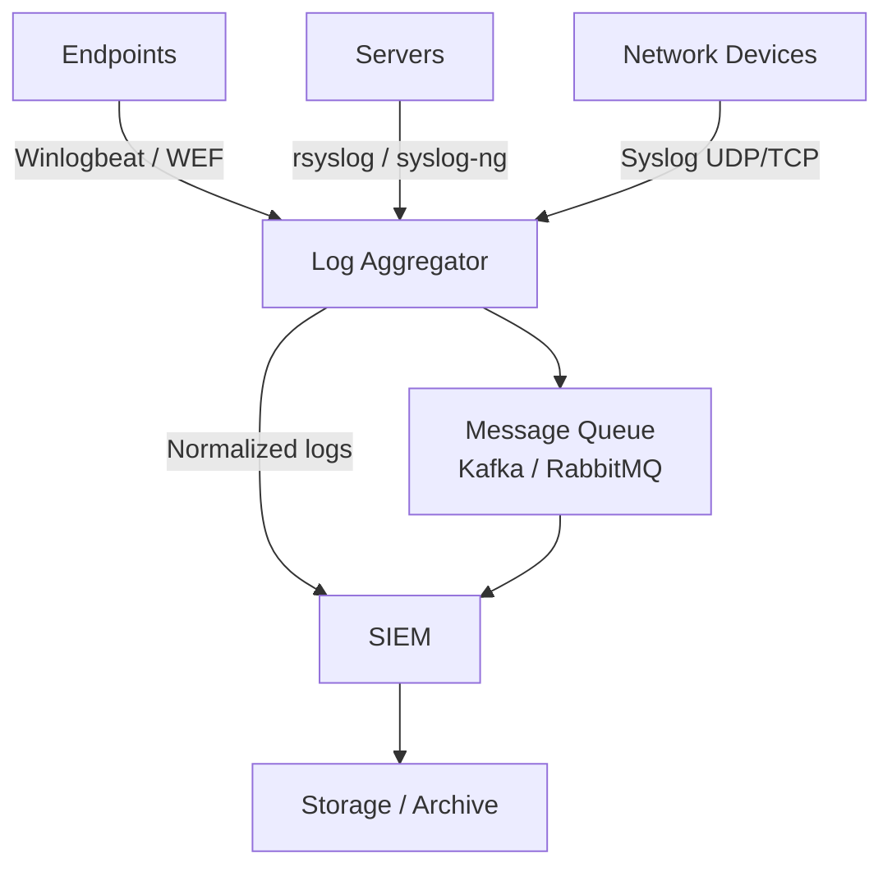

# Collecting Logs from Network Devices, Servers, and Endpoints

## TCM Exam Objectives

By mastering this module, you will be prepared to:

1. **Categorize** log sources into network devices, servers, and endpoints for collection planning
2. **Configure** syslog on Cisco IOS, Juniper JunOS, and Palo Alto firewalls
3. **Implement** WEF for agentless Windows log collection using Group Policy
4. **Deploy** agent-based forwarders (Winlogbeat, NXLog, Splunk UF) for non-domain environments
5. **Design** a tiered log collection architecture with relays and queues
6. **Validate** log flow end-to-end by triggering test events
7. **Secure** log transport using TLS encryption and certificate authentication
8. **Troubleshoot** common collection failures (NTP skew, disk full, firewall blocks)
9. **Apply** log retention policies aligned with compliance requirements
10. **Select** appropriate Linux log files (/var/log/auth.log, syslog, audit.log) for security monitoring

Centralized log collection is the backbone of SOC visibility. A SOC cannot detect threats by manually accessing every router and server. Instead, logs must be automatically transported from all sources to a central SIEM for search, correlation, and alerting. The PSAA expects you to understand which logs to collect, which protocols to use, and how to design a reliable collection architecture.

- The three log source categories (network, servers, endpoints)
- Syslog protocol standards and configuration
- Windows Event Forwarding and agent-based collection
- Architecture design for reliability and integrity



📌 **Exam Tip:** Legacy network devices use RFC 3164 syslog over UDP 514 by default. If you see intermittent log loss, the fix is to upgrade to RFC 5424 over TCP 601 or TLS 6514. In the PSAA, missing firewall logs during an incident investigation often point to UDP packet drops — recommend switching to TCP.

## The Three Log Source Categories

Each category requires a different collection approach due to native capabilities and protocols 【turn0search1】【turn0search3】.

| Category | Examples | Typical Log Types | Collection Method |
|---|---|---|---|
| **Network Devices** | Routers, switches, firewalls, load balancers | Syslog (events, ACL denies, VPN, config changes), NetFlow, SNMP traps | Syslog (UDP 514 legacy, TCP 601 reliable, TLS 6514 encrypted) |
| **Servers** | Windows Server (DC, IIS, SQL), Linux (web, database, application) | Windows Security/System/Application, syslog, application logs | WEF (Windows), rsyslog (Linux), agent-based (Winlogbeat, NXLog) |
| **Endpoints** | Windows 10/11, macOS, Linux laptops | Windows Event Logs, Sysmon, PowerShell, EDR telemetry | WEF (agentless) or agent-based (Winlogbeat, Splunk UF) |

## Syslog - The Universal Network Protocol

Syslog is the standard for network devices and Unix-like servers. It uses a lightweight, text-based message format 【turn0search4】【turn0search7】.

### Syslog Standards

| Standard | Port(s) | Transport | Features |
|---|---|---|---|
| **RFC 3164** (legacy BSD syslog) | 514 UDP | UDP only, unreliable | Simple PRI + header + message; no year in timestamp |
| **RFC 5424** (IETF syslog) | 601 TCP, 6514 TLS | TCP/TLS with framing | Structured data, millisecond timestamps, reliable delivery |

Legacy network devices (Cisco IOS, older Juniper) use RFC 3164 UDP on port 514. Modern deployments prefer RFC 5424 over TCP or TLS to avoid log loss and provide encryption.

### Syslog Facility and Severity

Every syslog message contains a facility (which subsystem generated it) and a severity level.

**Common facilities:** `auth` (4), `daemon` (3), `kern` (0), `local0-local7` (16-23). Custom facilities are often assigned to specific log streams.

| Severity Code | Keyword | Meaning |
|---|---|---|
| 0 | Emergency | System unusable |
| 1 | Alert | Immediate action required |
| 2 | Critical | Critical conditions |
| 3 | Error | Error conditions |
| 4 | Warning | Warning conditions |
| 5 | Notice | Normal but significant |
| 6 | Informational | Informational messages |
| 7 | Debug | Debug-level messages |

Collect at least severity 5 (Notice) and above. Debug (7) can flood the SIEM.

### Configuring a Syslog Server

To receive logs from network devices, designate a hardened Linux host as the syslog relay.

**Enable TCP reception in `/etc/rsyslog.conf`:**
```bash
module(load="imtcp")
input(type="imtcp" port="514")
module(load="imtcp")
input(type="imtcp" port="6514" tls="on")
```

**Store logs by host:**
```
$template RemoteLogs,"/var/log/remote/%HOSTNAME%/%$YEAR%/%$MONTH%/%$DAY%/syslog.log"
*.* ?RemoteLogs
```

**Cisco router configuration:**
```
logging host 192.168.1.50 transport udp port 514
logging trap informational
```

## Collecting Windows Event Logs

Windows does not natively speak syslog. You must either pull logs (Windows Event Forwarding) or push them (agent).

### Windows Event Forwarding (WEF)

WEF uses Windows Remote Management (WinRM) to collect events from domain-joined Windows machines. It is agentless and perfect for domain environments.

| Subscription Type | Description | Use Case |
|---|---|---|
| **Source-initiated** | Source machines push events to the collector via WinRM (5985 HTTP, 5986 HTTPS) | Most common; works through firewalls |
| **Collector-initiated** | Collector pulls events from source machines | Smaller, tightly controlled networks |

### Agent-Based Forwarding

For non-domain machines, cloud servers, or high-fidelity telemetry, deploy a lightweight agent.

| Agent | Typical Destination | Protocol |
|---|---|---|
| **Winlogbeat** | Elasticsearch / Logstash | Beats protocol (JSON over TCP) |
| **NXLog Community Edition** | Syslog server, SIEM | TCP/TLS syslog or JSON |
| **Splunk Universal Forwarder** | Splunk Indexer | Splunk-specific TCP |
| **Fluentd (td-agent)** | Any backend | Multiple output plugins |

**Winlogbeat configuration:**
```yaml
winlogbeat.event_logs:
  - name: Security
    forwarded: true
  - name: Microsoft-Windows-Sysmon/Operational
  - name: Microsoft-Windows-PowerShell/Operational
output.logstash:
  hosts: ["192.168.1.100:5044"]
```

## Collecting Linux Server Logs

Linux writes logs to flat files in `/var/log/`. Use rsyslog or syslog-ng to forward them to a central server.

| Log File | Content | Security Value |
|---|---|---|
| `/var/log/auth.log` (Debian) / `secure` (RHEL) | Authentication events (sshd, sudo, su) | Brute-force, privilege escalation |
| `/var/log/syslog` | System-wide events, cron, kernel | Service crashes, kernel exploits |
| `/var/log/apache2/access.log` | Web server access | Web attacks, C2 communication |
| `/var/log/mysql/error.log` | Database errors | SQL injection attempts |
| `/var/log/audit/audit.log` | Linux Audit Framework | Fine-grained file access, system calls |

**Rsyslog forwarding configuration:**
```
*.* @@192.168.1.50:514
auth,authpriv.* @@192.168.1.50:514
```

## Network Device Log Collection

**Cisco IOS / IOS-XE:**
```
logging host 192.168.1.50 transport udp port 514
logging trap notifications
```

**Juniper JunOS:**
```
set system syslog host 192.168.1.50 any info
```

**Palo Alto Firewall:** Configure a Syslog server profile under Device > Server Profiles > Syslog, then attach to log forwarding profiles.

📌 **Exam Tip:** In the PSAA, logs collected before a host was compromised are your only trustworthy evidence. Always verify NTP synchronization — clock skew can break correlation across log sources. Use UTC on all devices and at least three NTP servers for redundancy.

## Log Integrity and Reliability

| Concern | Mitigation |
|---|---|
| Log loss due to UDP | Use TCP/TLS syslog or agent-based reliable delivery |
| Tampering in transit | TLS encryption |
| Clock skew | Enforce NTP on all devices; use UTC |
| Disk full on relay | Set log rotation and size quotas |
| Retention requirements | Define policy based on compliance |

<details>
<summary>PSAA Exam Traps and Tips</summary>

- Legacy syslog uses UDP 514, not TCP. RFC 5424 uses TCP 601.
- WEF requires WinRM to be enabled; it is not automatic.
- Firewall "permitted" traffic logs are security-relevant - they may show successful C2 callbacks.
- Syslog is cleartext by default. Use TLS or a VPN for encryption.
- Use at least three NTP servers for redundancy.
- Logs collected before a host is compromised remain safe. Centralized collection is critical.
</details>

```mermaid
flowchart TD
    Sources[Log Sources] --> Category{Source Type}
    Category -->|Network Device| SD[Switch / Router / Firewall]
    Category -->|Windows Server| WS[Windows Event Log]
    Category -->|Linux Server| LS[/var/log/ files]
    Category -->|Endpoint| EP[Workstation Telemetry]
    
    SD -->|Syslog UDP/TCP| Relay[Log Relay / Aggregator]
    WS -->|WEF or Winlogbeat| Relay
    LS -->|rsyslog / syslog-ng| Relay
    EP -->|Winlogbeat / NXLog| Relay
    
    Relay -->|Parsing, Filtering, Enrichment| Queue[Kafka / Message Queue]
    Queue --> SIEM[SIEM Platform]
    SIEM --> Storage[Long-Term Archive]
```

## Centralized Collection Architecture Design

A resilient log pipeline often uses a tiered architecture:

```
[Endpoints/Servers/Devices] -> [Log Forwarders/Relays] -> [Queue/Stream] -> [SIEM] -> [Storage]
```

Design steps:
1. Inventory all log sources (IPs, log types, volume, native protocol).
2. Deploy a central syslog relay to ingest network and Linux logs.
3. Set up WEF for domain-joined workstations or Winlogbeat for hybrid environments.
4. Configure NTP on every device.
5. Normalize logs at the relay.
6. Forward to SIEM over TCP/TLS.
7. Validate by triggering test events.

```mermaid
flowchart TD
    A[Inventory Log Sources] --> B{Categorize}
    B -->|Network Device| N[Switch / Router / Firewall]
    B -->|Windows Server| W[Event Logs via WEF or Winlogbeat]
    B -->|Linux Server| L[/var/log/ via rsyslog]
    B -->|Endpoint| E[Workstation via Winlogbeat]
    N --> C[Configure syslog UDP/TCP/TLS]
    W --> D[Configure GPO + WinRM]
    L --> F[Configure rsyslog forwarding]
    E --> G[Deploy agent]
    C --> H[Test log flow end-to-end]
    D --> H
    F --> H
    G --> H
    H --> I[Verify NTP sync across all sources]
    I --> J[Production ready]
```

## Recap

Centralized log collection is a SIEM prerequisite. Syslog serves network devices and Linux servers (UDP 514 legacy, TCP 601 reliable, TCP 6514 encrypted). Windows Event Forwarding provides agentless collection for domain-joined machines via WinRM (5985/5986). Agents (Winlogbeat, NXLog, Splunk UF) are required for non-domain or high-volume sources. Reliability depends on TCP/TLS transport, NTP synchronization, and buffering queues. Always test and validate log flow before relying on it during an incident.
