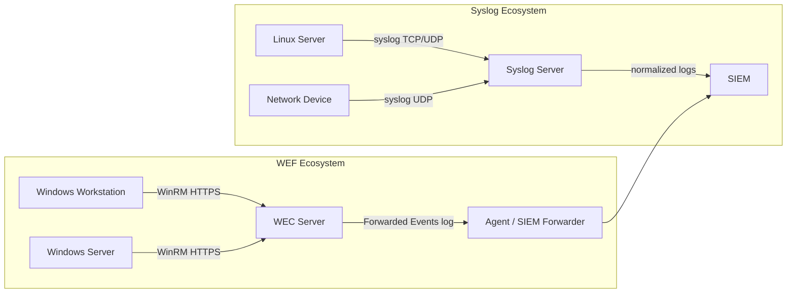
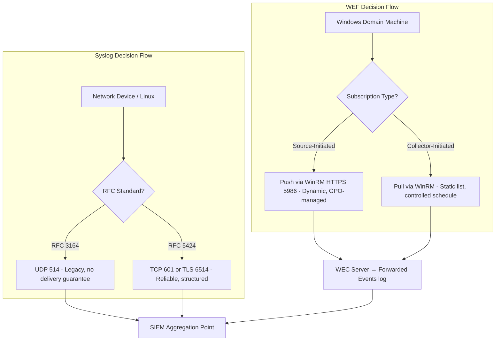
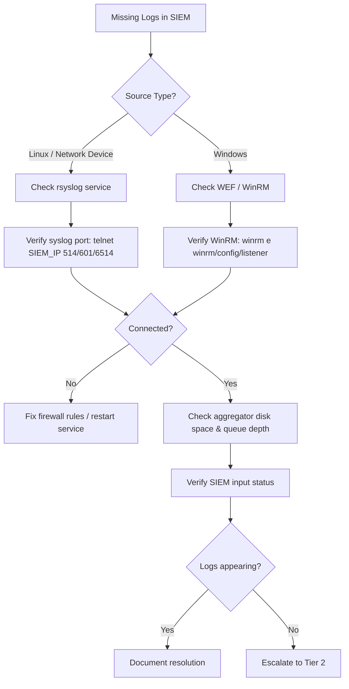

---
tags: [log-analysis]
---

# Log Forwarding Protocols: Syslog and WEF

## TCM Exam Objectives

By mastering this module, you will be prepared to:

1. **Compare** RFC 3164 (BSD) and RFC 5424 (structured) syslog standards
2. **Calculate** the PRI code using Facility × 8 + Severity
3. **Configure** WEF subscriptions (source-initiated vs. collector-initiated) via Group Policy
4. **Troubleshoot** WinRM communication for WEF log collection
5. **Select** the appropriate transport (UDP, TCP, TLS) based on reliability and security requirements
6. **Analyze** log delivery gaps when syslog messages are missing from the SIEM
7. **Implement** TLS encryption for syslog forwarding to prevent eavesdropping
8. **Evaluate** the trade-offs between agent-based (Winlogbeat) and agentless (WEF) Windows log collection
9. **Diagnose** authentication failures in WEF using Kerberos and WinRM logs
10. **Design** a hybrid collection strategy combining syslog for Linux/network devices with WEF for Windows endpoints

Log forwarding protocols are the transport layer that moves log data from source systems to central collectors and SIEM platforms. Syslog and Windows Event Forwarding (WEF) are the two primary native protocols used in enterprise environments. Understanding their architectures, strengths, and limitations is essential for designing reliable log pipelines and troubleshooting missing evidence during an investigation.

- Syslog protocol standards (RFC 3164 vs. RFC 5424)
- Facility and severity calculation
- WEF architecture and WinRM communication
- Side-by-side comparison of Syslog and WEF



📌 **Exam Tip:** Memorize the PRI calculation: `PRI = Facility × 8 + Severity`. For example, `auth` facility (4) with `crit` severity (2) = 4×8+2 = 34. The PSAA may give you a raw syslog message and ask you to decode the facility and severity from the PRI number in angle brackets.

## Syslog Protocol - The Universal Standard

Syslog operates on a client-server model where a sender transmits a text-based message to a receiver over UDP, TCP, or TLS. It is the de facto standard for network devices, Linux/Unix servers, and many applications 【turn0search1】【turn0search4】.

### RFC 3164 vs. RFC 5424

| Feature | RFC 3164 (BSD Syslog) | RFC 5424 (Structured Syslog) |
|---|---|---|
| Header Format | Simple PRI + Header (TIMESTAMP HOSTNAME) | PRI + VERSION + TIMESTAMP + HOSTNAME + APP-NAME + PROCID + MSGID + STRUCTURED-DATA |
| Structured Data | Not supported | Key-value pairs in STRUCTURED-DATA field |
| Precision | Varies, can be ambiguous | ISO 8601 with optional fractional seconds and timezone |
| Transport | Typically UDP/514 | Recommends TCP or TLS |
| Current Use | Legacy devices, broad compatibility | Modern systems, SIEM integrations |

### Message Classification: Facilities and Severities

The PRI code is calculated as: **PRI = Facility * 8 + Severity**

| Code | Facility Keyword | Description |
|---|---|---|
| 0 | `kern` | Kernel messages |
| 1 | `user` | User-level messages |
| 2 | `mail` | Mail system |
| 3 | `daemon` | System daemons |
| 4 | `auth` | Security/authorization messages |
| 10 | `authpriv` | Security/authorization (private) |
| 16-23 | `local0 - local7` | Reserved for custom use |

**Severity Levels:**

| Code | Keyword | Description |
|---|---|---|
| 0 | `emerg` | System unusable |
| 1 | `alert` | Immediate action required |
| 2 | `crit` | Critical conditions |
| 3 | `err` | Error conditions |
| 4 | `warning` | Warning conditions |
| 5 | `notice` | Normal but significant |
| 6 | `info` | Informational |
| 7 | `debug` | Debug-level messages |

### Protocol Operation and Security

**Transport:** Classic syslog uses UDP port 514 for speed but offers no delivery guarantee. TCP provides reliable delivery. TLS encrypts the entire channel, providing confidentiality and integrity 【turn0search5】.

**Security:** Syslog over UDP is plaintext and susceptible to eavesdropping, packet injection, and spoofing. Sensitive log data should never traverse untrusted networks without TLS encapsulation.

📌 **Exam Tip:** WEF is agentless but requires WinRM enabled on source machines (`winrm quickconfig`). If WEF logs are missing, check that the WinRM service is running, the WEC server is trusted (`TrustedHosts`), and firewall rules allow port 5985/5986. The PSAA may present a scenario where Windows event logs are not appearing — WEF misconfiguration is a common root cause.

## Windows Event Forwarding (WEF)

WEF is a native Windows feature that centrally collects logs from multiple Windows clients to a Windows Event Collector (WEC) server without third-party agents. It is the Microsoft-preferred method for security log collection in domain-joined environments 【turn0search3】【turn0search8】.

### Architecture

The WEF architecture has two primary roles:

1. **Windows Event Collector (WEC):** The central server that receives and stores logs.
2. **Windows Event Forwarder (Source Computers):** The clients and servers that generate and forward events.

### Subscription Types

| Type | Description | Use Case |
|---|---|---|
| **Collector-initiated** | WEC server pulls logs from a defined list of source computers | Tight control over collection schedule |
| **Source-initiated** | Source computers push logs to the WEC | Larger, dynamic environments; configured via Group Policy |

Forwarded events are stored in the **Forwarded Events** log on the WEC server, which can then be ingested by a SIEM.

### Communication Protocol: WinRM

WEF relies on Windows Remote Management (WinRM), which uses the WS-Management (WS-Man) protocol. By default, this occurs over HTTP (port 5985), but production environments should use HTTPS (port 5986) with Kerberos or certificate-based authentication 【turn0search7】.

### Configuration Commands

```cmd
:: Enable WinRM on the forwarder
winrm quickconfig

:: Configure trusted hosts
winrm set winrm/config/client @{TrustedHosts="COLLECTOR-HOST"}

:: Quick configure the WEC server
wecutil qc
```

### Advantages and Limitations

| Aspect | Advantage | Limitation |
|---|---|---|
| **Deployment** | Agentless; uses built-in Windows services | Windows-only ecosystem |
| **Authentication** | Kerberos for mutual authentication | Requires domain-joined environment |
| **Management** | Group Policy for zero-touch deployment | Lossy under high log volume |
| **Security** | Encrypted by default with Kerberos | Event processing overhead on endpoints |



## Side-by-Side Technical Comparison

| Feature | Syslog | WEF |
|---|---|---|
| Primary Ecosystem | Multi-platform (Linux, Unix, network devices) | Windows-only |
| Standard | IETF RFC 3164 & RFC 5424 | Microsoft WS-Management (WinRM) |
| Transport | UDP (514), TCP, TLS | HTTP/HTTPS (5985/5986) via WinRM |
| Message Format | Plain text with PRI code | XML-based Windows Event Log |
| Authentication | None built-in (UDP/TCP); Certificate for TLS | Native Kerberos (domain); Certificate (HTTPS) |
| Security | Plaintext by default; encrypt with TLS | Encrypted and authenticated by default |
| Configuration | Per-host agent configuration (rsyslog.conf) | Centralized via Group Policy |
| Pros | Universal support, simple, cross-platform | AD integration, rich XML filtering, secure by default |
| Cons | No guaranteed delivery (UDP), no native auth | Windows-only, lossy under high load |

## Architectural Context in a SOC Environment

In a real enterprise SOC, Syslog and WEF coexist as complementary protocols:

- **Linux servers and network devices** forward logs via Syslog (ideally over TLS) to a centralized aggregator.
- **Windows workstations and member servers** forward critical events via WEF to a WEC server.
- A tool like NXLog, Logstash, or the SIEM agent on the WEC server reads the Forwarded Events log and forwards to the final SIEM alongside syslog data streams.

<details>
<summary>PSAA Investigation Workflow for Missing Logs</summary>

When logs are missing from the SIEM during an investigation, follow this structured troubleshooting approach:

1. **Check the forwarder's configuration:** On Linux, verify `systemctl status rsyslog` and check `/etc/rsyslog.conf`. On Windows, use `wecutil qc` and `gpresult /r`.

2. **Test network connectivity:** For syslog, use `telnet <SIEM_IP> 514` or `nc -u <SIEM_IP> 514`. For WEF, check the WinRM listener with `winrm e winrm/config/listener`.

3. **Verify log generation on the endpoint:** On Linux, check `/var/log/auth.log`. On Windows, check the local Security log (`eventvwr.msc`).

4. **Check the aggregator and SIEM ingestion:** Verify the intermediate log aggregator's health and the SIEM's data input status.
</details>



## Recap

Syslog is the universal log forwarding protocol for multi-platform environments, using facility and severity codes calculated as PRI = Facility * 8 + Severity. RFC 3164 (UDP 514) is legacy; RFC 5424 (TCP 601, TLS 6514) provides reliability and structure. WEF is the agentless, Kerberos-authenticated method for Windows log collection within a domain, using WinRM over HTTPS (5986) with Group Policy management. They are complementary protocols in a mixed-OS environment, with the SIEM as the ultimate aggregation point for both streams.
