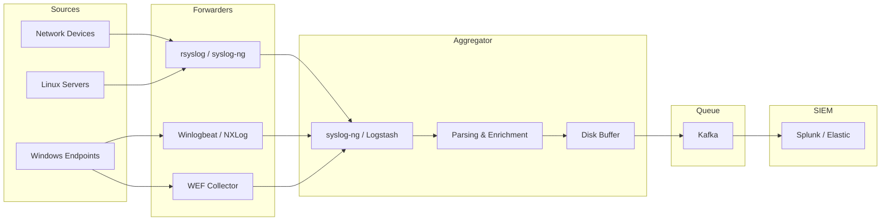
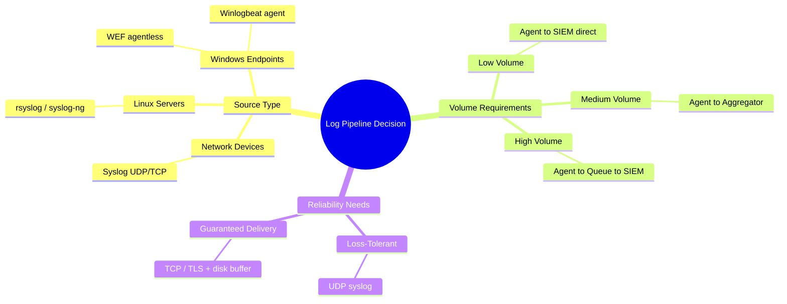
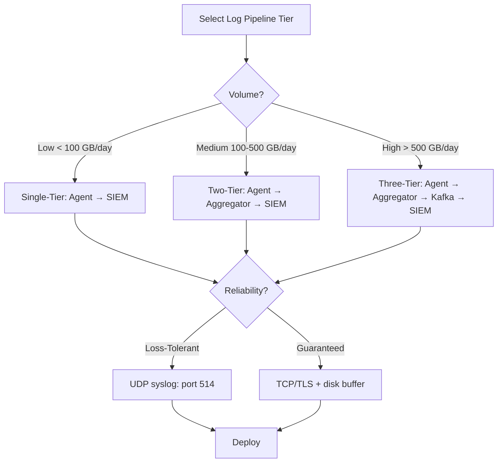

# The Role of Log Aggregators and Forwarders

## TCM Exam Objectives

By mastering this module, you will be prepared to:

1. **Differentiate** between log forwarders, aggregators, and brokers in a SIEM pipeline
2. **Design** a multi-tier log collection architecture for enterprise environments
3. **Configure** rsyslog and syslog-ng for protocol translation, buffering, and routing
4. **Select** appropriate log shippers (Winlogbeat, NXLog, Splunk UF) per platform
5. **Troubleshoot** missing log issues by testing forwarder health and network paths
6. **Implement** disk-assisted queuing to guarantee loss-free log delivery
7. **Evaluate** TCP/TLS vs. UDP transport trade-offs for reliability and security
8. **Recommend** aggregation improvements based on incident forensic findings
9. **Analyze** the role of message brokers (Kafka) in decoupling ingestion from indexing
10. **Map** log pipeline components to the PSAA incident investigation workflow

Log aggregators and forwarders are the invisible plumbing that ensures every log from every device reaches the SOC analyst reliably and at scale. Without them, a SIEM would be overwhelmed by direct connections from thousands of disparate sources. These components translate protocols, filter noise, enrich data, and buffer during outages. The PSAA expects you to understand the difference between forwarders and aggregators and how to architect a resilient log pipeline.

- Forwarder, aggregator, and broker definitions
- Core functions: translation, parsing, filtering, enrichment, buffering, routing
- Common tools: rsyslog, syslog-ng, NXLog, Winlogbeat
- Tiered architecture design



## Definitions: Forwarder, Aggregator, Broker

| Component | Function | Analogy |
|---|---|---|
| **Log Forwarder (Agent)** | Reads logs from a single source and sends to a central server; lightweight, source-side | Mail carrier picking up from a single house |
| **Log Aggregator (Collector/Relay)** | Receives logs from many sources, consolidates, parses, filters, enriches, and forwards | Post office sorting facility |
| **Message Queue / Broker** | Durable buffer that decouples producers from consumers | Warehouse with pallets waiting for trucks |

In small environments, a single Linux server running rsyslog performs both aggregation and forwarding. In large SOCs, lightweight agents on each endpoint forward to a cluster of aggregators, which push logs into a Kafka queue before the SIEM indexes them 【turn0search1】【turn0search4】.

📌 **Exam Tip:** Remember the key ports for the PSAA: Syslog UDP 514, Syslog TCP 601, Syslog TLS 6514, WinRM 5985/5986, Beats 5044, Kafka 9092. The exam may present a scenario where you must identify the correct forwarding protocol based on port numbers in firewall logs or SIEM source configuration.

## Core Functions of a Log Aggregator

### Protocol Translation

Not all sources speak the same language. The aggregator accepts syslog (UDP, TCP, TLS), Windows Event Log (via agent), JSON over HTTP, and NetFlow, then outputs everything as JSON or syslog to the SIEM.

### Parsing and Normalization

Raw syslog messages are unstructured text. The aggregator uses parsers (regex, Grok patterns) to extract key fields and rewrite the log into a structured format like JSON or CEF.

**Example:** Cisco ASA syslog `%ASA-6-106015: Deny TCP...` becomes:
```json
{"src_ip": "10.0.0.1", "dst_port": 22, "action": "DENY"}
```

### Filtering and Dropping

Not all logs are worth storing. The aggregator can drop debug-level messages, known noisy events, or logs from misconfigured devices before they consume SIEM license volume.

**Syslog-ng filter example:**
```
filter f_noise { level(debug); };
log { source(s_net); filter(f_noise); flags(final); };
```

### Enrichment

The aggregator can add context the source did not include: GeoIP location, asset criticality from a CMDB, or threat intelligence reputation scores. Enrichment at the aggregator makes every downstream system smarter.

### Buffering and Queuing

If the SIEM goes down, the aggregator buffers logs to disk. Without buffering, logs are lost during outages.

**rsyslog disk-assisted queue:**
```
$WorkDirectory /var/spool/rsyslog
$MainMsgQueueFileName mainqueue
$MainMsgQueueType LinkedList
$MainMsgQueueSaveOnShutdown on
$MainMsgQueueMaxDiskSpace 1g
```

### Routing

Different log types go to different destinations: security events to the SIEM, flow data to a flow analyzer, compliance logs to long-term archive.

## Common Tools

### Syslog Daemons (Linux)

| Tool | Strengths | Typical Role |
|---|---|---|
| **rsyslog** | Fast, modular, JSON output, TCP/TLS, default on RHEL/Debian | Local collector and forwarder |
| **syslog-ng** | Rich filtering language, direct database output, advanced parsing | Central relay with complex filtering |
| **NXLog** | Cross-platform (Windows + Linux), native Windows Event Log support | Agent on Windows servers, central relay |

### Windows Log Shippers

| Tool | How It Works | Typical Destination |
|---|---|---|
| **Winlogbeat** | Reads Windows Event Log channels | Elasticsearch, Logstash, Kafka |
| **Splunk Universal Forwarder** | Reads Windows Event Logs and files | Splunk Indexer |
| **Fluentd (td-agent)** | Plugin-based; Windows Event Log input | Any SIEM |
| **WEF** | Native Windows pull/push; no agent | Windows Event Collector |

### Stream Processors

| Tool | Function |
|---|---|
| **Logstash** | Elastic stack pipeline with hundreds of plugins |
| **Cribl Stream** | Observability pipeline for routing, reducing, enriching |
| **Apache Kafka** | Distributed streaming platform for durable central buffering |

📌 **Exam Tip:** In the PSAA, if you encounter missing logs during an investigation, follow this chain: check the forwarder service status → verify network connectivity to the aggregator port → inspect the aggregator's disk space and queue depth → confirm the SIEM input is active. A full disk buffer still causes data loss — always monitor disk usage and set quotas.

## Architecture Patterns

### Single-Tier (Agent to SIEM)
```
[Endpoint with agent] ---> [SIEM]
```
Suitable for small environments. No buffering; agents buffer locally but may drop logs.

### Two-Tier (Agent to Aggregator to SIEM)
```
[Endpoints/Devices] ---> [Central syslog-ng/rsyslog relay] ---> [SIEM]
```
The most common mid-size design. The aggregator handles protocol translation, filtering, and TCP/TLS termination.

### Three-Tier with Queue
```
[Agents] ---> [Aggregator Cluster] ---> [Kafka] ---> [Logstash/Cribl] ---> [SIEM]
```
The gold standard for large SOCs. Kafka decouples ingestion from indexing.

## Key Ports Reference

| Protocol | Port | Transport |
|---|---|---|
| Syslog (legacy) | 514 | UDP |
| Syslog (reliable) | 601 | TCP |
| Syslog over TLS | 6514 | TCP/TLS |
| WinRM (WEF) | 5985 (HTTP), 5986 (HTTPS) | TCP |
| Beats (Winlogbeat) | 5044 (Logstash) | TCP |
| Kafka | 9092 | TCP |



<details>
<summary>PSAA Exam Traps and Tips</summary>

- A forwarder guarantees delivery only if it uses TCP/TLS and disk-assisted queuing. UDP syslog offers zero guarantees.
- WEF is agentless but requires WinRM enabled and configured on source machines.
- A full disk buffer still causes data loss. Monitor disk usage and set quotas.
- Parsing at the aggregator reduces SIEM load and normalizes data early.
- A single syslog server is a single point of failure. Configure clients with a secondary server.
</details>



## Recap

Log forwarders move logs from source to central location; aggregators consolidate from many sources, parse, enrich, filter, and route. Protocol translation, buffering, and filtering are the three most critical functions. Common tools include rsyslog, syslog-ng, NXLog, and Winlogbeat. TCP/TLS and disk-assisted queues are required for loss-free delivery. A multi-tier architecture (agent to aggregator to queue to SIEM) provides resilience, scalability, and future-proofing.
