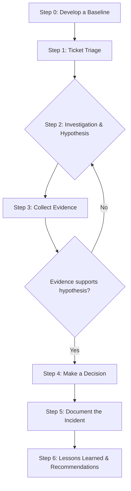
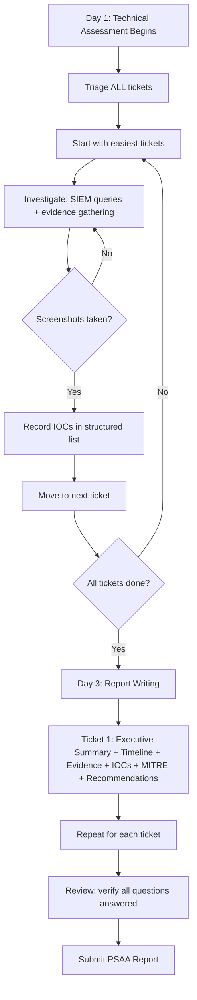

# Completing Guided Investigation Scenarios

## TCM Exam Objectives

By mastering this module, you will be prepared to:

1. **Apply** the seven-step investigation methodology: baseline, triage, hypothesis, evidence, decision, containment, documentation
2. **Triage** multiple tickets efficiently by assessing severity, impact, scope, and timing
3. **Formulate** a structured hypothesis using who/what/when/where/why for each incident
4. **Collect** evidence across SIEM, EDR, packet capture, and threat intelligence platforms
5. **Determine** if an alert is a true positive, false positive, or benign positive with supporting evidence
6. **Recommend** appropriate containment actions based on incident type (ransomware, C2, credential theft)
7. **Document** findings in a professional report with executive summary, timeline, IOCs, MITRE mapping, and recommendations
8. **Manage** the 48-hour technical assessment time window by prioritizing easy tickets first
9. **Identify** common scenario types: phishing, network intrusion, endpoint compromise, brute-force, insider threat, web attack, lateral movement
10. **Produce** actionable remediation recommendations tied directly to incident findings

Guided investigation scenarios are the core of the PSAA exam. You are dropped into a simulated SOC environment with multiple security tickets, each representing a real-world incident. Your task is to investigate each ticket, identify IOCs, analyze activity across systems, and produce a professional report. This module integrates every skill from log analysis to pivoting into a repeatable investigation methodology.

- The PSAA exam structure and timeline
- The seven-step SOC analyst investigation methodology
- Common scenario types and their required tools
- Report writing best practices

📌 **Exam Tip:** Time management is critical in the 48-hour technical assessment. Triage all tickets first — identify which are straightforward and which are complex. Complete 2-3 easy tickets on Day 1 morning to build momentum, then tackle the harder ones. Never spend more than 4 hours stuck on a single ticket; document what you have and move on.

## The Exam Landscape

The PSAA is not a multiple-choice test or a CTF. You are given a set of real-world investigation tickets based on user reports, triggered alerts, and system artifacts. Your task is to investigate each and document findings.

### The Four-Day Exam Cycle

| Phase | Duration | What You Do |
|---|---|---|
| **Technical Assessment** | 48 hours | Investigate incidents using SIEMs, EDRs, Wireshark, and other tools. Gather evidence and answer ticket questions. |
| **Report Writing** | 48 hours | Document findings, investigation steps, IOCs, and recommendations using the provided template. |

### What the Exam Tests

- Ability to use analysis tools and interpret artifacts
- Triage of real-world alerts (not multiple-choice questions)
- Identification of IOCs across multiple systems
- Production of a detailed, professional report

## The Seven-Step Investigation Methodology

### Step 0: Develop a Baseline

Understand what normal looks like in the environment. Assess expected network traffic patterns, common services, and user behavior. A strong baseline forms the foundation for spotting suspicious activity.

### Step 1: Triaging Alerts

Read the ticket carefully. Determine severity and priority by evaluating potential business impact. Ask: Is this a production server or a low-priority workstation? Is it a generic scan or a confirmed malware callback?

### Step 2: Investigation and Hypothesis

Ask structured questions: Who is the user or system? What event took place? When did it happen, and has it happened before? Where did it originate? Map activity to MITRE ATT&CK to understand adversary tactics.

### Step 3: Collecting Evidence

Turn suspicion into fact by gathering logs, process trees, and network artifacts. Use VirusTotal to check file hashes and IPs. Cross-validate findings with threat intelligence feeds and historical data.

### Step 4: Making a Decision

Determine if the alert is a true positive or false positive. If benign, document and close. If malicious, proceed to containment and remediation.

### Step 5: Containment

Recommend appropriate containment steps: quarantining the affected endpoint, blocking malicious IPs, disabling compromised accounts. Speed of containment is critical.

### Step 6: Documenting the Incident

Thorough documentation answers three questions: What was observed? What actions were taken? What was the final outcome?

### Step 7: Lessons Learned and Recommendations

Every investigation strengthens defenses. Identify new IOCs for tighter detection rules, update playbooks, and recommend both reactive and proactive security measures.

## PSAA Scenario Types

| Scenario Category | Ticket Example | Key Tools | Core Skills |
|---|---|---|---|
| **Phishing Analysis** | "User reported suspicious email with attachment." | Email headers, URLScan.io, VirusTotal, sandbox | Header analysis, URL deobfuscation, attachment analysis |
| **Network Intrusion / C2** | "Outbound connection to known-malicious IP." | Wireshark, firewall logs, IDS/IPS alerts, NetFlow | PCAP analysis, C2 beaconing, lateral movement tracking |
| **Endpoint Compromise** | "Suspicious process execution on workstation." | Windows Event Logs, Sysmon, EDR telemetry, PowerShell logs | Process lineage, command-line analysis, root cause |
| **Brute-Force / Credential Attack** | "Multiple failed logins followed by success." | Auth logs (4625/4624), VPN logs, Azure AD sign-in logs | Pattern recognition, lateral movement tracking |
| **Insider Threat / Data Exfiltration** | "Large data upload to external cloud storage." | DLP alerts, proxy logs, file audit logs, email logs | User behavior analysis, cross-source correlation |
| **Web Application Attack** | "Unusual SQL queries against customer database." | Web server logs, WAF alerts, database audit logs | SQL injection detection, log correlation |
| **Lateral Movement** | "Multiple 4624 events across servers from one workstation." | Windows Security Logs, Sysmon EID 3, service logs | Tracing movement paths, analyzing privileged account usage |

## Essential Tools for the PSAA

| Category | Examples | Primary Use |
|---|---|---|
| **SIEM Platforms** | Splunk (SPL), Kibana/Elastic (KQL), Wazuh | Central hub for searching, correlating, detecting threats |
| **EDR Platforms** | LimaCharlie, Elastic Defend, Wazuh | Endpoint telemetry analysis, process trees, threat hunting |
| **Packet Analyzers** | Wireshark, TShark, TCPDump | Network traffic analysis, C2 identification |
| **Threat Intelligence** | VirusTotal, AbuseIPDB, URLScan.io | Validating suspicious IPs, domains, hashes |
| **Email Analysis** | Manual header inspection, MXToolbox, PhishTool | Phishing email analysis |
| **Windows Tools** | Event Viewer, PowerShell, Sysinternals | Deep-dive Windows artifact analysis |
| **Linux Tools** | grep, awk, sed, journalctl, tcpdump | Linux log analysis |

## The Report - Your Path to a Passing Grade

The exam not only tests technical abilities but also evaluates documentation and communication. The quality of your report directly ties to how well incidents and recommendations are communicated.

📌 **Exam Tip:** Your PSAA report is equally weighted with the technical assessment. A perfect investigation with a poorly written report can still fail. Structure each ticket write-up with: executive summary, investigation steps with screenshots, IOCs table, MITRE ATT&CK mapping, and both reactive and proactive recommendations.

### What to Document for Each Ticket

- Incident summary
- Investigation or executive summary
- Detailed answers to incident questions with evidence and screenshots
- List of IOCs
- Reactive and proactive recommendations

### Report Best Practices

- Structure in a clear, concise, professional format
- Include step-by-step walkthroughs
- Reference command-line outputs and gathered indicators
- Tie recommendations directly to incident findings

Time Management Strategy

**Day 1, Morning:** Rapidly triage all tickets. Prioritize - which are straightforward, which are complex? Begin with the easiest to build momentum.

**Day 1, Afternoon:** Complete 2-3 tickets. Capture screenshots and evidence as you go.

**Day 2, Morning:** Complete remaining tickets. If stuck, document what you have and move on.

**Day 2, Afternoon:** Review all tickets. Verify you answered every question and captured all IOCs.

**Day 3-4:** Write the report systematically, ticket by ticket. Follow the template. Include screenshots. Proofread.

## Recap

Guided investigation scenarios are the capstone of PSAA preparation. The seven-step methodology (baseline, triage, hypothesis, evidence collection, decision, containment, documentation) provides a repeatable framework for every ticket. Common scenario types include phishing, network intrusion, endpoint compromise, brute-force, insider threat, web application attack, and lateral movement. The report is equally weighted with the technical assessment - clear documentation and actionable recommendations are essential for a passing grade.
