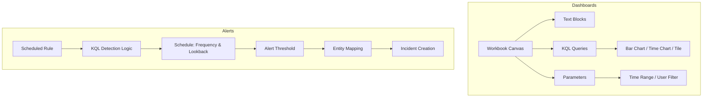
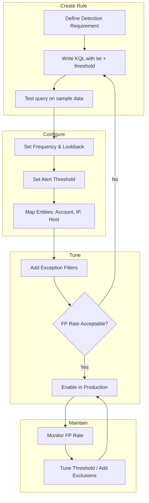

# Creating Custom Dashboards and Alerts

## TCM Exam Objectives

By mastering this module, you will be prepared to:

1. **Build** an Azure Monitor Workbook with text, query, and parameter items
2. **Configure** KQL query visualizations as bar charts, time charts, and tiles in workbooks
3. **Add** interactive parameters (time range, user, IP) to enable pivoting in dashboards
4. **Create** a Scheduled Analytics Rule with proper frequency, lookback, and alert threshold
5. **Map** entities (Account, IP, Host) in alert rules for investigation graph integration
6. **Write** rule logic using `let` statements for thresholds and time windows
7. **Apply** exception filters and exclusions to reduce false positive alerting
8. **Compare** scheduled rules with NRT (near-real-time) rules and choose the appropriate type
9. **Design** a multi-section PSAA dashboard: incident overview, compromised user timeline, top malicious IPs, IOCs
10. **Tune** alert rules by adjusting thresholds, time windows, and exclusion lists

Custom dashboards and alerts transform raw security data into actionable intelligence. Dashboards provide real-time visual situational awareness, while alerts automate detection and notification. In the PSAA exam, demonstrating the ability to build these tools proves you can operationalize detection, not just react to incidents. This module covers Azure Monitor Workbooks for dashboards and Scheduled Analytics Rules for alerts in Microsoft Sentinel.

- Azure Monitor Workbook anatomy and query integration
- Building interactive dashboards with parameters
- Scheduled Analytics Rule configuration
- Entity mapping and alert tuning



## Custom Dashboards with Azure Monitor Workbooks

Microsoft Sentinel uses Azure Monitor Workbooks as its dashboard platform. Workbooks combine rich visualizations, text explanations, and parameter-driven interactivity on a single canvas 【turn0search1】【turn0search3】.

📌 **Exam Tip:** Use parameters in your workbooks to make them reusable for any investigation. A `TargetUser` parameter with the pattern `where UserPrincipalName == '{TargetUser}' or '{TargetUser}' == ''` lets you filter by user or return all results — critical for rapid pivoting during the exam.

### Workbook Anatomy

A workbook is composed of items. The three most important for the exam:

| Item Type | Purpose |
|---|---|
| **Text** | Add markdown to explain charts, document findings, create section headers |
| **Query** | Run KQL queries and render results as tables, charts, or tiles |
| **Parameters** | Create dropdowns, time range pickers, and other interactive controls |

### Building a Dashboard Query

To create a dashboard showing the top 10 failed sign-in IPs in the last 24 hours:

1. In Sentinel, go to Workbooks > + New.
2. Click Add > Add query.
3. Paste KQL:
```kusto
SigninLogs
| where TimeGenerated > ago(24h)
| where ResultType != 0
| summarize FailedAttempts = count() by IPAddress
| top 10 by FailedAttempts desc
```
4. Under Visualization, choose Bar chart. Set X-axis to `IPAddress` and Y-axis to `FailedAttempts`.
5. Click Done Editing.

### Adding Parameters for Interactivity

Parameters make dashboards reusable for pivoting during investigations:

1. Click Add > Add parameters.
2. Create a parameter: Name `TargetUser`, Display name "User Principal Name", Type Text.
3. Modify the query:
```kusto
SigninLogs
| where TimeGenerated > ago(24h)
| where UserPrincipalName == '{TargetUser}' or '{TargetUser}' == ''
| where ResultType != 0
| summarize FailedAttempts = count() by IPAddress
| top 10 by FailedAttempts desc
```

When the parameter is empty, the filter returns results for all users. This pattern is invaluable for rapid pivoting 【turn0search4】.

### Advanced Visualizations

**Tile** - Summarize a single number:
```kusto
SigninLogs
| where TimeGenerated > ago(24h)
| where ResultType != 0
| summarize TotalFailed = count()
```

**Time Chart** - Show trend over time:
```kusto
SigninLogs
| where TimeGenerated > ago(7d)
| where ResultType != 0
| summarize Failed = count() by bin(TimeGenerated, 1h)
| render timechart
```

**Multi-table correlation** - List incidents with key details:
```kusto
SecurityIncident
| order by CreatedTime desc
| project Title, Severity, Status, CreatedTime, Description
```

### Dashboard Template for the PSAA

Create a workbook with these sections:

- **Section 1: Incident Overview** - Query from `SecurityIncident` table with time range parameter.
- **Section 2: Compromised User Timeline** - `union` query showing all activity for a specific user.
- **Section 3: Top Malicious IPs** - Bar chart of IPs from failed logins or beaconing.
- **Section 4: IOCs** - Text item listing discovered indicators for your report.

## Custom Alerts (Scheduled Analytics Rules)

Alerts are the core of a SOC detection capability. The PSAA may ask you to create or interpret alert rules. Understanding the full configuration of a Scheduled Analytics Rule is essential 【turn0search2】【turn0search6】.

### Rule Anatomy

| Setting | Description | PSAA Importance |
|---|---|---|
| **Name and Description** | Clear title and summary | Use naming convention like "Possible Brute Force - Azure AD" |
| **Tactics and Techniques** | MITRE ATT&CK mapping | Always map at least one Tactic (e.g., `CredentialAccess`) |
| **Severity** | High/Medium/Low/Informational | Set based on impact |
| **Rule query** | The KQL query that runs on schedule | Must be efficient and return manageable rows |
| **Query scheduling** | Frequency and lookback period | Lookback must be >= frequency to avoid gaps |
| **Alert threshold** | Number of results > 0 or custom expression | Almost always > 0 |
| **Entity mapping** | Maps columns to Accounts, IPs, Hosts | Crucial for investigation graph |
| **Incident settings** | Create incident, group by entities | Group on entities to avoid alert flooding |

### Writing the Rule Query

**Basic Template - Excessive Failed Logins:**
```kusto
let threshold = 15;
let timeFrame = 1h;
SigninLogs
| where TimeGenerated > ago(timeFrame)
| where ResultType != 0
| summarize FailedCount = count() by IPAddress, UserPrincipalName
| where FailedCount >= threshold
| project IPAddress, UserPrincipalName, FailedCount
```

**Rule Setup:**
- Frequency: 5 minutes
- Lookback: 1 hour
- Threshold: Number of results > 0
- Entity mappings: `UserPrincipalName` to Account, `IPAddress` to IP
- Group alerts by `UserPrincipalName`

### Advanced Alert Logic

**Excluding known internal IPs:**
```kusto
| where IPAddress !startswith "10." and IPAddress !startswith "192.168."
```

**Requiring multiple failure types or subsequent success:**
```kusto
let failures = SigninLogs
| where TimeGenerated > ago(1h)
| where ResultType != 0
| summarize FailureCount = count() by UserPrincipalName, IPAddress;
let successes = SigninLogs
| where TimeGenerated > ago(1h)
| where ResultType == 0
| summarize by UserPrincipalName, IPAddress;
failures
| join kind=leftanti successes on UserPrincipalName, IPAddress
| where FailureCount > 10
```

📌 **Exam Tip:** Entity mapping is the single most important configuration in a Scheduled Analytics Rule. Without it, the investigation graph cannot connect alerts to entities, and you lose the visual lateral movement view. Always map Account, IP, and Host entities — even if you only use one in the exam, configuring all three demonstrates competence.

### Entity Mapping

| Entity | Typical Column | Example Mapping |
|---|---|---|
| **Account** | UserPrincipalName, SubjectUserName | UserPrincipalName to Name |
| **IP** | IPAddress, ClientIP | IPAddress to Address |
| **Host** | Computer, DeviceName | Computer to HostName |
| **AzureResource** | ResourceId | ResourceId to ResourceId |



### NRT Rules and Other Alert Types

| Type | Frequency | Use Case |
|---|---|---|
| **Scheduled** | 5-60 minutes | Standard detection rules |
| **Near-Real-Time (NRT)** | Every 1 minute | High-severity threats (impossible travel, suspicious admin actions) |
| **Microsoft Security** | Passive | Automatically create incidents from Defender alerts |
| **Fusion** | ML-based | Correlates anomalies into attack stories |

<details>
<summary>Best Practices for PSAA Dashboards and Alerts</summary>

**Dashboards:**
- Keep each dashboard focused on a specific question.
- Use parameters to enable pivoting.
- Document visualizations with captions in the report.
- Export workbook as JSON for evidence.

**Alerts:**
- Tune for signal, not noise. An alert that fires 100 times a day is useless.
- Always map entities - it is the single most important configuration.
- Name rules clearly with a consistent pattern.
- Document why you chose the threshold.
- Never enable a rule without testing.
</details>

```mermaid
flowchart TD
    A[PSAA Dashboard Requirement] --> B[Create Azure Monitor Workbook]
    B --> C[Add Text: Section Header]
    B --> D[Add Query: KQL for failed logins]
    B --> E[Add Parameter: TargetUser dropdown]
    D --> F[Visualization: Bar chart / Time chart]
    E --> G[Modify KQL: use {TargetUser} param]
    F --> H[Add to Dashboard Canvas]
    G --> H
    H --> I[Save & Test Interactivity]
    I --> J[Export workbook as JSON for report evidence]
    J --> K[Screenshot dashboard panels for Appendix]
```

## Recap

Custom dashboards (Azure Monitor Workbooks) combine KQL queries, parameters, and visualizations into interactive investigation canvases. Custom alerts (Scheduled Analytics Rules) automate detection by running KQL queries on a schedule with entity mapping and incident creation. Key configurations include frequency, lookback period, alert threshold, and entity mapping. A well-designed dashboard with properly tuned alerts demonstrates the ability to operationalize security detection and is a significant component of the PSAA report.
