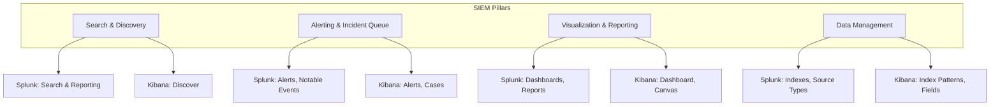
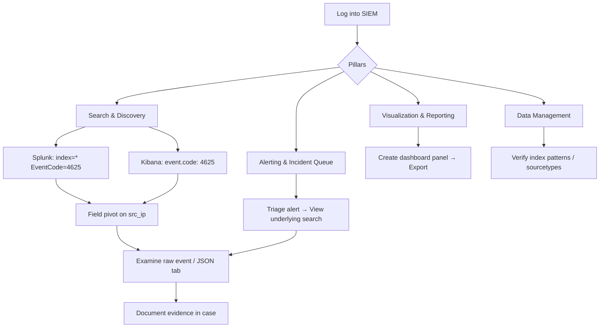

# Exploring SIEM Interfaces and Features

## TCM Exam Objectives

By mastering this module, you will be prepared to:

1. **Navigate** the four SIEM pillars: Search & Discovery, Alerting & Incident Queue, Visualization & Reporting, Data Management
2. **Use** Splunk SPL with index selection, field pivoting, timeline histogram, and raw event expansion
3. **Use** Kibana KQL with index pattern selector, field browser, document table, and JSON raw view
4. **Pivot** from dashboard to search by clicking chart segments or field values
5. **Inspect** underlying alert logic by viewing rule query details in both Splunk and Kibana
6. **Interpret** the Splunk timeline histogram to identify event distribution spikes
7. **Export** raw log evidence from the JSON tab in Kibana for the PSAA report
8. **Apply** time range adjustments to scope investigations to relevant windows
9. **Utilize** advanced features: lookups, macros, workflow actions, and alert tuning
10. **Execute** a full SIEM workflow: dashboard triage → search pivot → raw log collection → case documentation

A Security Information and Event Management (SIEM) platform is the central nervous system of a SOC. It collects, normalizes, stores, and correlates log data from across the environment, presenting it through a unified, searchable interface. The PSAA places you directly into a working SIEM and expects you to navigate its features efficiently to investigate alerts and document findings.

- The four pillars of SIEM interfaces
- Splunk Search Processing Language (SPL) workflow
- Kibana Discover tab and KQL workflow
- Alerting, dashboards, and case management

## The Four Pillars of SIEM Interfaces

A SIEM interface is organized around four core pillars. Your ability to move fluidly between them is what the PSAA evaluates 【turn0search1】【turn0search3】.

| Pillar | Splunk Implementation | Kibana (Elastic) Implementation | Your PSAA Workflow |
|---|---|---|---|
| **Search & Discovery** | Search & Reporting app (SPL) | Discover (KQL) | Pivot to raw logs and hunt for patterns |
| **Alerting & Incident Queue** | Alerts, Triggered Alerts, Notable Events | Alerting, Rules, Cases | Where investigation starts; the SOC inbox |
| **Visualization & Reporting** | Dashboards, Reports | Dashboard, Canvas | Build command center and present findings |
| **Data Management** | Indexes, Source Types, Fields | Index Patterns, Data Streams, Field Browser | Understand available data and structure |

📌 **Exam Tip:** In Splunk, the left-hand field sidebar is your most powerful ally. After running a query, click any field value to instantly add it as a filter. In Kibana, use the magnifying glass icons in the field browser for the same effect. Never manually type values you can click.

## The Universal Search Interface

Every action in a SIEM begins with a search. Both Splunk and Kibana offer a search bar, time-range picker, and results area, but use distinct query languages.

### Splunk Search Processing Language (SPL)

**Search Anatomy:**
- `index=*` is the starting point. In the PSAA, specific indexes are provided (`index=windows`, `index=linux`, `index=firewall`).
- **Field Pivoting:** The left-hand field sidebar makes every value clickable. Clicking a suspicious `src_ip` instantly adds it to your search.
- **The Timeline:** A histogram above results shows event distribution; spikes indicate anomalies.

**Splunk Workflow:**
1. Select an index and time range.
2. Type: `index=windows EventCode=4625`.
3. Click on a field like `user` to see top values.
4. Click a suspicious value to filter.
5. Use the timeline to scope the exact attack moment.
6. Expand a raw event to see the full, pre-parsed log.

### Kibana Discover Tab (KQL)

**Search Anatomy:**
- **Index Pattern Selector:** Dropdown defining search scope. Always select the broadest relevant pattern to avoid missing cross-source evidence.
- **Field Browser:** Lists all available fields; clicking shows top values. Use magnifying glass icons to filter.
- **Document Table:** Shows individual log entries. Expanding reveals table view and JSON tab.
- **Time Histogram:** Event distribution chart across the top.

**Kibana Workflow:**
1. Select a broad index pattern (e.g., `security*`, `logs*`).
2. Use KQL: `event.code : "4625" and user.name : "administrator"`.
3. Scan the field browser for anomalous fields.
4. Filter by clicking the magnifying glass on a suspicious value.
5. Click the JSON tab on a key event for raw, unprocessed evidence.

## The Alerting Interface

In the PSAA, you are given specific alerts to triage. The alerting interface is your to-do list.

**Splunk Alerts:** Alerts are triggered by scheduled searches. Click "View Results" to run the underlying search and see triggering events. This is your immediate pivot into raw data.

**Kibana Alerting and Cases:** Alerts are managed under Security > Alerts. Alerts can be assigned to a Case, a centralized investigation workspace holding relevant alerts, notes, and evidence.

Critical Insight for the PSAA

Do not just read the alert summary. Always examine the underlying search logic. In Splunk, click "View Results" or "Open in Search." In Kibana, look at the rule details. Understanding why the rule fired determines whether it is a true positive and what to look for next.

## Dashboards and Visualization Editors

During the PSAA, you will interact with pre-built dashboards and may need to interpret or modify them.

**Creating Visualizations:**
- **Splunk:** Run a search, switch to the Visualization tab, pick a chart type, save as a Dashboard Panel.
- **Kibana:** Click Create Visualization, choose a type, select index pattern, configure axes using bucket/aggregation.

**Interactive Dashboards:** Clicking a chart segment filters the entire dashboard. A single click on a suspicious country instantly reveals all related failed logins, source IPs, and target accounts.

**The Inspect/Edit Function:** If you encounter a dashboard panel and want to know how it was built, use Edit (Splunk) or Inspect (Kibana) to see the underlying query. Copying and modifying these queries is a massive time-saver.

📌 **Exam Tip:** Always click the JSON tab in Kibana when examining a raw event. The table view only shows parsed fields, but the raw JSON often contains the original `message` field with all the detail you need for evidence collection. Screenshots of raw JSON are strong report evidence.

## Advanced Features

| Feature | Splunk | Kibana | PSAA Value |
|---|---|---|---|
| **Lookups** | CSV lookups for enrichment | Runtime fields | Adds context like geo or asset info |
| **Macros** | Reusable SPL chunks | Tags, pre-built queries | Reduces repetitive typing |
| **Workflow Actions** | Buttons next to fields | Custom links | Quick VirusTotal lookups |
| **Alert Tuning** | Edit alert SPL | Add exception lists | Improve detection accuracy |

## Practical PSAA Walkthrough

**Scenario:** You log into the exam SIEM and see a dashboard showing a spike in "Failed Logins from External Sources." The top source country is North Korea.

1. **Dashboard Triage:** Click the North Korea section on the map. The dashboard filters to that country. Top Source IP bar chart shows `203.0.113.55`.
2. **Pivot to Discovery:** Click the IP and select "New search with this value." You are now in Search/Discover, looking at raw events from this IP.
3. **Correlate in Search:** Browse raw events. You see hundreds of 4625 failures, then a single 4624 success for `administrator`. Pivot on the user to reveal a Sysmon Event ID 1 showing `psexec.exe` targeting `DC01`.
4. **Document in the Case:** Copy the raw log entry into your evidence file. Use case management to log steps.

This workflow - from dashboard to search to raw log to documentation - is the PSAA in microcosm.

## Recap

SIEM interfaces are organized around four pillars: search, alerting, visualization, and data management. Splunk uses SPL with field-based pivoting and the timeline histogram. Kibana uses KQL with the Discover tab, field browser, and JSON view for raw evidence. The alerting interface provides the underlying search logic for each alert, and dashboards enable interactive pivoting through click-to-filter. Mastering the interface workflow from dashboard to raw log to documentation is essential for efficient PSAA investigation.
