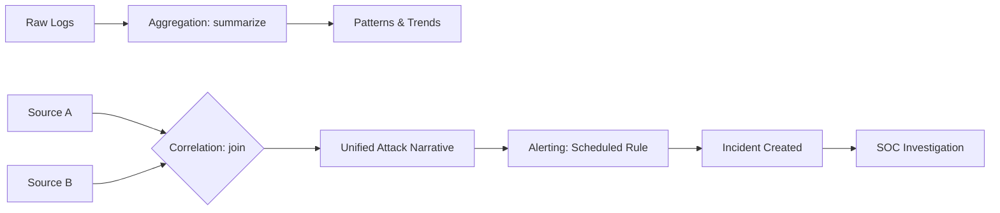
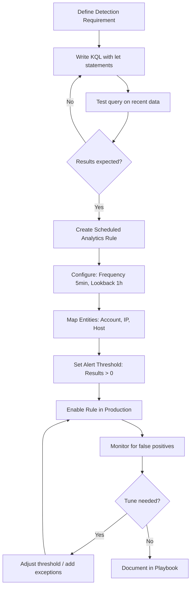

# Aggregation, Correlation, and Alerting

## TCM Exam Objectives

By mastering this module, you will be prepared to:

1. **Apply** the `summarize` operator with aggregation functions: `count()`, `dcount()`, `make_set()`, `bin()`
2. **Differentiate** between aggregation (summarizing one stream) and correlation (linking multiple streams)
3. **Write** KQL `join` queries using innerunique, inner, leftouter, and fullouter kinds
4. **Use** the `lookup` operator for enrichment against reference tables (e.g., asset inventory)
5. **Build** a scheduled analytics rule in Microsoft Sentinel with proper frequency, lookback, and threshold
6. **Map** entities (Account, IP, Host) in alert rules to enable the investigation graph
7. **Implement** a correlation query that links account creation with account deletion to detect cover-up behavior
8. **Choose** the right alert type: Scheduled, NRT, Microsoft Security, or Fusion based on detection needs
9. **Design** an impossible travel detection rule using `make_set(Location)` and `array_length()`
10. **Tune** alert thresholds to balance false positives against false negatives

Aggregation, correlation, and alerting are the three core competencies that transform raw log data into actionable security intelligence. Aggregation summarizes millions of events into manageable patterns. Correlation connects discrete events across different sources to reveal the full scope of an attack. Alerting automates detection so the SOC is notified when suspicious activity occurs. This module covers KQL techniques for each in Microsoft Sentinel.

- Aggregation functions and the `summarize` operator
- Correlation with the `join` and `lookup` operators
- Building Scheduled Analytics Rules for automated alerting
- Practical detection examples



📌 **Exam Tip:** Always isolate before aggregating. Apply your `where` filters (time range, event type, source) before `summarize`. Aggregating on unfiltered data wastes compute time and may cause query timeouts in the exam environment.

## Aggregation: From Noise to Intelligence

Aggregation summarizes large datasets into meaningful patterns. In the PSAA, you rarely report on a single log entry - you report on counts, patterns, and outliers 【turn0search1】【turn0search4】.

### The `summarize` Operator

`summarize` groups rows by one or more columns and performs calculations on each group.

| Function | Description | PSAA Use Case |
|---|---|---|
| `count()` | Counts events in each group | Counting failed logins per user for brute-force detection |
| `dcount()` | Counts distinct unique values | Counting unique IPs used by a single account |
| `avg()` / `sum()` | Calculates average or sum | Measuring average outbound data transfer size |
| `min()` / `max()` | Finds minimum or maximum value | Identifying first and last time an action was seen |
| `arg_max()` / `arg_min()` | Returns entire row with max/min value | Finding the most recent event for an incident ID |
| `make_list()` | Creates JSON array of all values (with duplicates) | Compiling a full timeline of user actions |
| `make_set()` | Creates JSON array of distinct values | Collecting unique commands a process has run |
| `bin()` | Rounds timestamps to specified interval | Grouping events by hour to visualize attack progression |

### Practical Aggregation Examples

**Detecting a Brute-Force Attack:**
```kusto
SigninLogs
| where TimeGenerated > ago(24h)
| where ResultType != 0
| summarize FailedAttempts = count() by UserPrincipalName, IPAddress
| where FailedAttempts > 10
| order by FailedAttempts desc
```

**Analyzing Trend with Time Bins:**
```kusto
SecurityEvent
| where TimeGenerated > ago(7d) and EventID == 4688
| summarize ProcessCount = count() by bin(TimeGenerated, 1h), ProcessName
| order by ProcessCount desc
```

## Correlation: Connecting the Dots

While aggregation summarizes a single stream, correlation links multiple streams together. A single alert is just a symptom - the analyst's job is to find the root cause by correlating that symptom with other events 【turn0search2】【turn0search6】.

### The `join` Operator

`join` merges rows from two tables based on a shared key.

| Join Kind | Description | PSAA Use Case |
|---|---|---|
| `innerunique` (default) | Deduplicates left table before joining | General-purpose safe joining |
| `inner` | Returns only rows where key exists in both tables | Correlating firewall logs with threat intelligence feeds |
| `leftouter` | Returns all rows from left table, matches from right | Taking sign-ins and attaching location data |
| `rightouter` | Opposite of leftouter | Taking known-bad IPs and checking against logs |
| `fullouter` | Returns all rows from both tables | Combining logs from different dates |

### Correlation Walkthrough: Account Created and Deleted

Attackers often create accounts, use them, and delete them to cover tracks.

```kusto
let UserCreatedEvents = AuditLogs
| where OperationName == "Add user"
| project TimeGenerated, User = tostring(TargetResources[0].userPrincipalName);
let UserDeletedEvents = AuditLogs
| where OperationName == "Delete user"
| project TimeGenerated, User = tostring(TargetResources[0].userPrincipalName);
UserCreatedEvents
| join kind=inner UserDeletedEvents on User
| where TimeGenerated < TimeGenerated1
| extend TimeDelta = TimeGenerated1 - TimeGenerated
| where TimeDelta < 1d
| project CreatedTime = TimeGenerated, DeletedTime = TimeGenerated1, User, TimeDelta
| order by CreatedTime desc
```

### The `lookup` Operator

For enrichment operations, `lookup` is a simplified, optimized version of join:

```kusto
SecurityEvent
| lookup (AssetInventory) on Computer
```

## Alerting: From Query to Action

A sophisticated KQL query is only useful if it runs at the right time. The final step is creating a Scheduled Analytics Rule that automatically executes your logic 【turn0search3】【turn0search8】.

### Anatomy of a Sentinel Scheduled Analytics Rule

| Setting | Description | Configuration |
|---|---|---|
| **General** | Name, severity, MITRE ATT&CK mapping | Descriptive name, map to tactic |
| **Rule Logic** | KQL query | Designed to run against specific tables |
| **Query Scheduling** | Frequency and lookback | Lookback must be >= frequency |
| **Alert Threshold** | When to trigger an alert | Usually "Number of results > 0" |
| **Entity Mapping** | Identify Accounts, Hosts, IPs | Enables investigation graph |
| **Automated Response** | Playbooks or automation rules | Optional but valuable |

### Example: Impossible Travel Alert Rule

```kusto
let timeframe = 1h;
SigninLogs
| where TimeGenerated > ago(timeframe)
| summarize Locations = make_set(Location), FirstSeen = min(TimeGenerated), LastSeen = max(TimeGenerated) by UserPrincipalName
| where array_length(Locations) > 1
| mv-expand Locations to typeof(string)
| order by UserPrincipalName, FirstSeen desc
```

This rule detects users authenticating from two or more locations within one hour, a classic credential-compromise indicator.

📌 **Exam Tip:** When using the `join` operator, choose `innerunique` (default) for most cases — it deduplicates the left table before joining, which prevents inflated counts. Use `leftouter` when you need to preserve all original events even if no match exists on the right side.

## PSAA Success Tips

- **Isolate before aggregating:** Start with a focused `where` clause to narrow your dataset before `summarize`.
- **Choose the right join:** `inner` drops unmatched rows; use `leftouter` to keep all original events.
- **Document every step:** Include the final KQL query, time window rationale, and rule configuration in your report.

<details>
<summary>Quick Reference Card</summary>

| Task | KQL Operator/Method | Example |
|---|---|---|
| Group and count events | `summarize count() by Column` | `summarize count() by UserPrincipalName` |
| Count unique values | `summarize dcount(Column) by Group` | `summarize dcount(IPAddress) by UserPrincipalName` |
| Group events by time | `summarize ... by bin(Time, Interval)` | `summarize count() by bin(TimeGenerated, 1h)` |
| Merge two tables on a key | `join kind=inner (Table2) on Key` | `SigninLogs \| join kind=inner (AuditLogs) on CorrelationId` |
| Enrich with lookup table | `lookup (DimensionTable) on Key` | `SecurityEvent \| lookup (AssetInventory) on Computer` |
| Create a scheduled alert | Sentinel Analytics Wizard | Rule Logic, Threshold: Results > 0 |
</details>



## Cross-SIEM Comparison: Microsoft Sentinel vs Splunk vs Elastic

The PSAA exam environment may use Sentinel, Splunk, or Elastic. Each platform achieves the same detection outcomes with different syntax and terminology. This table maps the core operations across all three.

| Operation | Microsoft Sentinel (KQL) | Splunk (SPL) | Elastic (EQL/ES|QL) |
| :--- | :--- | :--- | :--- |
| **Filter by time** | `where TimeGenerated > ago(1h)` | `earliest=-1h` | `@timestamp > now()-1h` |
| **Filter by field** | `where EventID == 4625` | `EventCode=4625` | `event.code : "4625"` |
| **Group and count** | `summarize count() by User` | `stats count by user` | `stats count by user` |
| **Distinct count** | `summarize dcount(IP)` | `stats dc(src_ip)` | `card(IP)` |
| **Time bucket** | `summarize by bin(Time, 1h)` | `timechart span=1h` | `date_histogram(field="@timestamp", calendar_interval="1h")` |
| **Join two tables** | `join kind=inner (T2) on Key` | `append` + `stats` or `lookup` | `lookup` or `left_join` |
| **Union tables** | `union T1, T2, T3` | `index=* sourcetype=*` | `FROM T1, T2` |
| **Create alert** | Scheduled Analytics Rule | `alert` in saved search | Watch or rule engine |
| **Entity mapping** | Entities tab in rule wizard | `action.case` in alert | Threat intel enrichment |

### Splunk (SPL) Query Examples

The PSAA expects proficiency in both KQL and SPL. Below are common detection queries in SPL covering the same use cases as the KQL examples above.

```spl
# Brute-force detection: failed logins per user per source IP
index=windows EventCode=4625
| stats count as FailedAttempts by Account_Name, Source_Network_Address
| where FailedAttempts > 10
| sort - FailedAttempts

# Impossible travel correlation: same user, two locations, < 1 hour
index=windows EventCode=4624
| table _time, Account_Name, Source_Network_Address
| sort 0 Account_Name _time
| streamstats last(_time) as prev_time last(Source_Network_Address) as prev_ip by Account_Name
| where prev_ip != Source_Network_Address
| eval time_diff = _time - prev_time
| where time_diff < 3600

# New account creation followed by deletion (cover-up pattern)
index=windows EventCode IN (4720, 4726)
| stats values(EventCode) as Events, count as EventCount by Account_Name
| where EventCount >= 2
| search Events="*4720*" AND Events="*4726*"

# Process creation timeline for a specific host
index=windows EventCode=4688 ComputerName=DESKTOP-WIN10
| table _time, Account_Name, New_Process_Name, Parent_Process_Name
| sort _time
# Look for unusual parent-child chains like word.exe -> powershell.exe
```

### Alert Rule Comparison

| Feature | Sentinel (KQL) | Splunk | Elastic |
| :--- | :--- | :--- | :--- |
| **Rule type** | Scheduled Analytics | Saved Search → Alert | Detection Rule |
| **Schedule** | Frequency (5 min - 24h) | Cron / interval | Interval |
| **Lookback** | Configurable (>= frequency) | `earliest` parameter | `lookback` parameter |
| **Threshold** | Results > N | `count > N` in search | `threshold` parameter |
| **MITRE mapping** | Built-in tactic/technique UI | Custom field | MITRE tags |
| **Entity mapping** | Account, Host, IP fields | Custom | `related.*` fields |
| **Response** | Playbooks (Logic Apps) | Alert actions | Actions (webhook, email) |

## Recap

Aggregation (summarize) reduces millions of events into manageable patterns for trend analysis and brute-force detection. Correlation (join, lookup) links events across different data sources to reveal the full attack narrative. Alerting (Scheduled Analytics Rules) automates detection by running KQL queries on a schedule with entity mapping and incident creation. Together, these three capabilities form the core of SIEM-based threat detection and are essential skills for the PSAA. Cross-SIEM proficiency — knowing KQL, SPL, and EQL — ensures success regardless of which platform appears on the exam.
