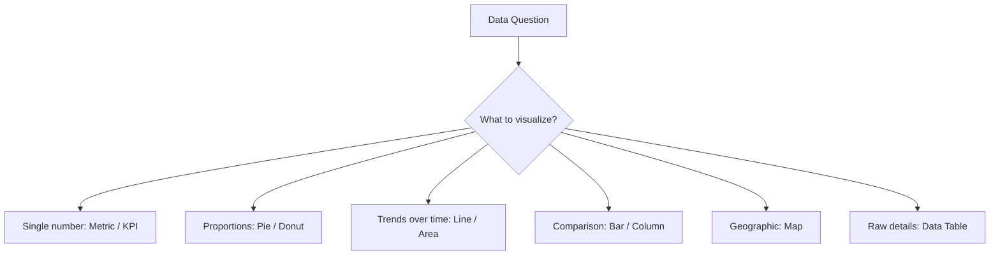
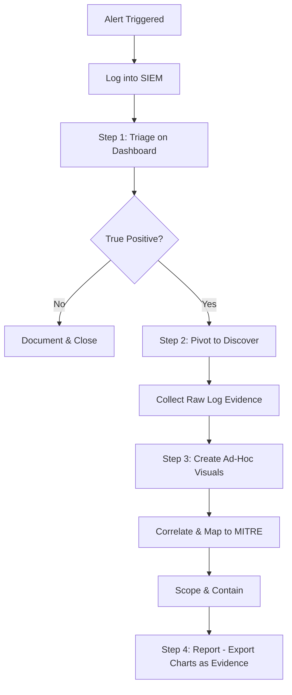
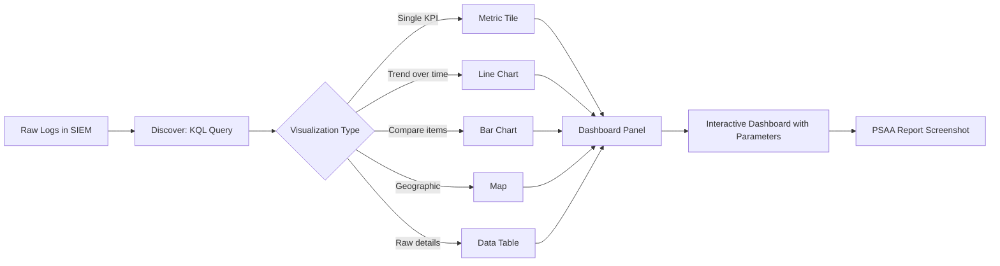

# Dashboards and Visualizations

## TCM Exam Objectives

By mastering this module, you will be prepared to:

1. **Select** the correct visualization type (metric, bar, line, pie, map, table) based on the data question
2. **Navigate** Kibana Discover to filter raw events and build ad-hoc visualizations
3. **Create** a Kibana dashboard by saving visualizations as panels in a structured layout
4. **Interpret** dashboard KPIs to identify anomalies (failed login spikes, unusual geographic traffic, outbound data surges)
5. **Apply** the visual-driven investigation workflow: triage on dashboard → pivot to Discover → build ad-hoc visual → report
6. **Design** dashboards with KPIs at top, trends in the middle, and raw data tables at the bottom
7. **Use** interactive filtering by clicking chart segments to drill into specific data subsets
8. **Export** dashboard visualizations as evidence screenshots for the PSAA report
9. **Identify** SOC KPI calculations: failed login rate, MTTD, top alert signatures, unique source IPs
10. **Follow** dashboard design principles: consistent color coding, time range selectors, focused use-case per dashboard

Dashboards and visualizations transform normalized security data into a dynamic, visual command center that enables rapid incident detection and triage. In the PSAA exam, your ability to interpret dashboards and build visualizations demonstrates that you can move from raw data to actionable intelligence efficiently.

- The hierarchy of SOC visualizations
- Building Kibana dashboards from search to visualization to dashboard
- The visual-driven investigation workflow
- Key SOC KPIs and dashboard design principles



## The Strategic Role of Visuals

A SIEM is a massive data lake. Dashboards are your map and sonar, preventing you from drowning in raw data and allowing you to instantly spot threats 【turn0search1】【turn0search4】.

**Core Purpose:** Consolidate diverse, normalized security data into a single, real-time, actionable interface for rapid incident detection, triage, and investigation.

**PSAA Context:** You will be dropped into a pre-configured SIEM (Splunk or Elastic) and expected to use its dashboards to orient yourself, understand the security landscape, and launch your investigation.

📌 **Exam Tip:** In the PSAA, use the time histogram at the top of Discover to spot anomalies. A sudden spike in event count at 3 AM is a strong triage signal. Click on the spike to automatically filter to that time window — this is your fastest path from dashboard to raw evidence.

## The Hierarchy of SOC Visuals

Choosing the right visual for your question is critical.

| Data Question | Best Visualization | Why It Is Effective | PSAA Example |
|---|---|---|---|
| What is the single most important number? | **Metric / KPI** | Shows a single aggregated value | Unique failed login sources, total blocked connections |
| How do categories compare? | **Pie / Donut Chart** | Quickly shows proportions | Top 5 alert signatures, protocol distribution |
| What is the trend over time? | **Line / Area Chart** | Tracks metrics to reveal patterns | Failed logins over 24 hours, network traffic volume |
| How do items compare? | **Bar / Column Chart** | Compares aggregated counts | Top 10 source IPs, failed auths by user |
| Where is traffic from? | **Map** | Instantly contextualizes IPs geographically | Traffic originating from high-risk countries |
| What are the raw events? | **Data Table** | Shows granular log entries | Detailed event list for deep-dive analysis |

## Building a Kibana Dashboard

This process translates directly to Splunk and the PSAA environment.

### Step 1: The Discover / Search Phase

**Elastic (Kibana Query Language):**
Navigate to the Discover tab and select the correct index pattern. Build your KQL query:

```kusto
event.code: "4625"
```

**Splunk (Search Head):**
Navigate to Search & Reporting and build your SPL query:

```spl
index=windows EventCode=4625
| stats count by Source_Network_Address, Account_Name
| where count > 10
| sort - count
```

Add context with filters - click on suspicious `source.ip` / `src_ip` or `user.name` / `Account_Name` values. Adjust the time picker to your investigative window.

### Step 2: The Visualize Phase

Once your query is precise, save it as a visualization:

1. Click Create Visualization / Save As Report and choose a type (e.g., Vertical Bar chart for top attacking IPs).
2. Configure the axes:
   - Y-axis: Count of records
   - X-axis: Terms, choose `source.ip` / `src_ip`, order by Count descending, size 10
3. Save with a descriptive title like "Top 10 Brute-Force Source IPs"

### Step 3: The Dashboard Phase

Bring saved visualizations together:

1. Create new dashboard.
2. Add panels from saved visualizations.
3. Arrange for analysis: trend line at top for context, bar chart next for breakdown, data table at bottom for drill-down.
4. Set auto-refresh for real-time monitoring.

## The Visual-Driven Investigation Workflow



1. **Triage on Dashboard:** A panel shows a sudden spike in failed logins from an unexpected country. This tells you it is worth investigating.
2. **Pivot to Discover:** Click the spike in the line graph to apply a filter and navigate to raw logs.
3. **Create Ad-Hoc Visuals:** You notice a single IP trying dozens of usernames. Create a bar chart on `source.ip` to confirm.
4. **Reporting:** Screenshot the bar chart as visual evidence for your report.

📌 **Exam Tip:** When building a dashboard panel, always include the underlying KQL query as a text annotation below the chart. This serves two purposes: it helps you remember how the data was derived, and it provides ready-made evidence for your PSAA report appendix.

## Key SOC KPIs to Include in Dashboards

| KPI | Calculation | What It Tells You |
|---|---|---|
| **Failed Login Rate** | `countif(ResultType != 0) / total` | Brute-force activity |
| **Mean Time to Detect (MTTD)** | Average time from compromise to alert | Detection effectiveness |
| **Alert Volume by Severity** | Count of alerts by severity level | SOC workload and tuning needs |
| **Unique Source IPs** | `dcount(IPAddress)` | Scope of scanning activity |
| **Top Alert Signatures** | Count by alert name | Most common threats |
| **Coverage by MITRE Tactic** | Techniques detected vs. total | Detection gap analysis |

<details>
<summary>Dashboard Design Principles</summary>

- Start with high-level KPIs at the top for quick situational awareness.
- Group related visualizations into logical sections (authentication, network, endpoint).
- Use consistent color coding (red for critical, yellow for warning, green for normal).
- Add text annotations to explain what each panel shows.
- Include time range selectors to make the dashboard interactive.
- Keep dashboards focused on a single use case - do not cram everything onto one canvas.
</details>



## Recap

Dashboards and visualizations transform normalized security data into an actionable command center. The hierarchy of SOC visuals guides the choice of chart type based on the data question: metrics for single numbers, line charts for trends, bar charts for comparisons, maps for geographic context. The visual-driven investigation workflow moves from dashboard triage to Discover pivot to ad-hoc visualization to report evidence. Effective dashboards are focused, interactive, and organized with clear KPIs at the top for rapid situational awareness.
