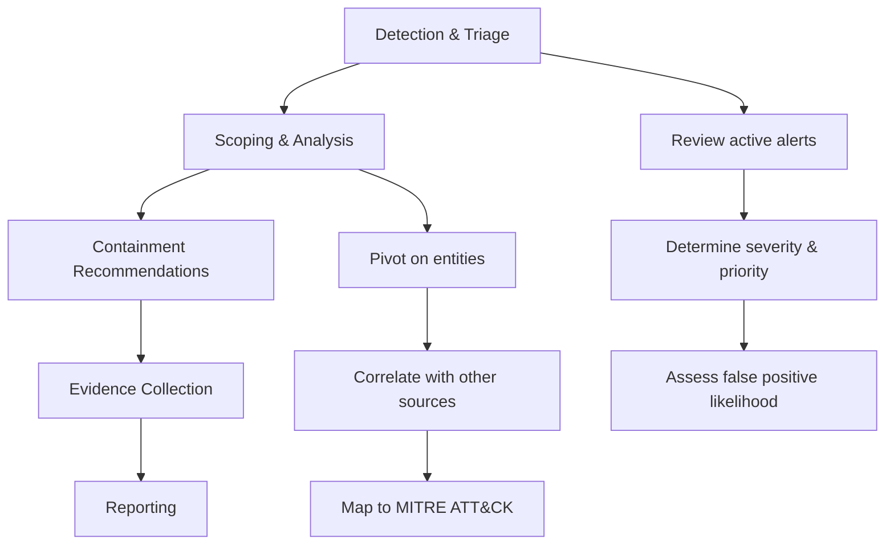
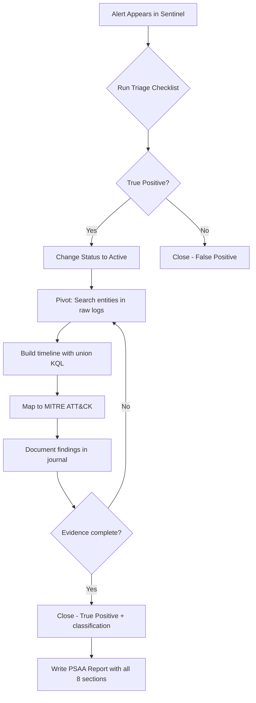

# Incident Case Management

## TCM Exam Objectives

By mastering this module, you will be prepared to:

1. **Navigate** Microsoft Sentinel's incident management interface (blade, queue, entities)
2. **Apply** a triage checklist to classify alerts as true positive, false positive, or benign positive
3. **Use** the investigation graph to visualize entity relationships and lateral movement
4. **Build** a KQL timeline query using `union` across SigninLogs, AuditLogs, OfficeActivity, and SecurityEvent
5. **Maintain** an investigation journal with timestamps for exam report evidence
6. **Map** incident findings to the NIST incident response lifecycle stages
7. **Classify** incidents correctly (True Positive, False Positive, Benign Positive) with justification
8. **Structure** a PSAA incident report with executive summary, timeline, evidence, MITRE mapping, and remediation
9. **Screenshot** critical evidence including query results and entity graphs for the deliverable
10. **Manage** incident status workflow from New → Active → Closed with appropriate comments

Incident case management is the structured process of triaging, investigating, documenting, and closing security incidents within a SIEM platform. In the PSAA exam, you manage each alert as a case within Microsoft Sentinel, tracking your analysis from initial triage through final report. Effective case management directly dictates the quality of your final deliverable and your score.

- The incident response lifecycle in the PSAA context
- Triage methodology and checklist
- Deep-dive investigation with KQL and the investigation graph
- Incident closure, classification, and report writing



## The Incident Response Lifecycle and the PSAA

The PSAA mirrors the early phases of the NIST and SANS incident response frameworks. Understanding this structure helps you stay organized 【turn0search1】【turn0search3】.

| Phase | NIST/SANS Term | What You Do in the PSAA |
|---|---|---|
| **Detection & Triage** | Detection/Identification | Review active alerts in Sentinel. Determine true positive, false positive, or needs investigation. Prioritize by severity. |
| **Scoping & Analysis** | Analysis | Use KQL to pivot from the alert. Examine entities (users, IPs, hosts), correlate with other log sources, map to ATT&CK. |
| **Containment Recommendations** | Containment | Recommend isolation, account disablement, IP blocking in your report. |
| **Evidence Collection** | Documentation | Screenshots, query results, timelines, entity mappings preserved in investigation notes. |
| **Reporting** | Lessons Learned | Compile formal incident report: executive summary, timeline, evidence, MITRE mapping, remediation. |

## Triage: From Alert to Incident

Triage is the gatekeeping function. Your first decision for every alert: Is this worth my limited time?

📌 **Exam Tip:** The PSAA report structure is worth significant points. Always include all eight sections: Executive Summary, Incident Timeline, Investigation Summary, Evidence, MITRE ATT&CK Mapping, IOCs, Remediation Recommendations, and Appendix. A missing section can drop your score even if the investigation was perfect.

### The Triage Checklist

Run through this mental checklist for every alert:

1. **Alert Severity (High/Medium/Low):** Start with High and Medium. Clearly benign Low alerts can be closed immediately.
2. **Alert Title and Description:** Does the name suggest a known attack pattern? Read the description for context.
3. **MITRE ATT&CK Mapping:** An alert mapped to Credential Access, Persistence, or Exfiltration is usually more critical than Reconnaissance.
4. **Entities Involved:** Examine user, host, IP, or application entities. Have these appeared in previous incidents? Is the user a privileged account?
5. **Evidence / Supporting Data:** Alerts often include query results directly in the detail pane. Look for obvious signs of malice.
6. **False Positive Likelihood:** Does the activity align with a maintenance window? Is it a test account?

### Actions in the Sentinel Incident Blade

- **Create an Incident:** High-fidelity alerts auto-generate incidents. Create manually if needed.
- **Assign Owner:** In the exam, you are the owner.
- **Set Severity and Status:** New to Active once investigating, to Closed after resolution.
- **Add Comments:** Note initial triage thoughts immediately.

## Deep-Dive Investigation

Once an incident is active, your goal is to build a timeline and scope the impact.

### Investigating Entities

Sentinel's Investigation Graph shows a visual graph connecting the alert to associated entities and related alerts. Click any entity to see attributes, recent activity, and related alerts. Use the graph to uncover lateral movement - an IP that touched multiple users or a host that generated multiple alerts.

### Building a Timeline with KQL or SPL

**Microsoft Sentinel (KQL):**

```kusto
let TargetUser = "compromised.user@domain.com";
let StartTime = datetime(2024-01-15T08:00:00Z);
union SigninLogs, AuditLogs, OfficeActivity, SecurityEvent
| where TimeGenerated between (StartTime .. now())
| where UserPrincipalName == TargetUser or UserId == TargetUser or Account == TargetUser
| project TimeGenerated, Source = $table, Operation, ResultType, IPAddress, Computer
| order by TimeGenerated asc
```

The `$table` column automatically tells you which log source the event came from, making the timeline self-documenting.

**Splunk (SPL):**

```spl
index=* (Account_Name="compromised.user@domain.com" OR user="compromised.user@domain.com")
| table _time, source, EventCode, Account_Name, src_ip, ComputerName
| sort _time
| eval Source = case(
    match(source, "Security"), "SecurityEvent",
    match(source, "O365"), "OfficeActivity",
    1=1, source)
```

The `source` field tells you which log source generated each event.

### The Investigation Journal

Maintain a running log of every query and conclusion. This journal is critical because you will need to recall your reasoning 48 hours later when writing the report.

```
[14:03] Opened incident #2024. Alert "Suspicious sign-in from Tor exit node".
[14:05] Reviewed entities: user=jsmith, IP=185.220.101.34.
[14:07] Ran KQL: SigninLogs | where UserPrincipalName == "jsmith"... Found 3 successful sign-ins.
[14:15] Pivoted to OfficeActivity: suspicious file download from OneDrive.
[14:25] Conclusion: Likely credential compromise. Scope: user jsmith, single IP.
```

## Incident Status Management

| Status | When to Use |
|---|---|
| **New** | Default upon creation. No action taken yet. |
| **Active** | You are actively investigating. |
| **Closed - True Positive** | Security incident occurred, fully investigated. Requires classification and reason. |
| **Closed - False Positive** | Alert was incorrect. State the justification. |
| **Closed - Benign Positive** | Activity was real but not malicious (e.g., pen test). Document authorization. |

## From Investigation to Report

The PSAA report is the ultimate deliverable. Your case management process should feed directly into it.

📌 **Exam Tip:** Start your investigation journal from the moment you open an incident. Record every query, pivot, and finding with timestamps. In the exam, you may need to reconstruct your thought process 24+ hours later — a well-maintained journal is the difference between a coherent report and a scattered one.

### Recommended Report Structure

1. **Executive Summary** - 2-3 paragraph overview for management.
2. **Incident Timeline** - Table with Timestamp, Event Description, Log Source, Analyst Notes.
3. **Investigation Summary** - Narrative of triage, key queries, findings.
4. **Evidence** - Screenshots of critical query results with captions.
5. **MITRE ATT&CK Mapping** - Table of observed techniques.
6. **Indicators of Compromise** - Malicious IPs, domains, hashes.
7. **Remediation Recommendations** - Actionable steps.
8. **Appendix** - Full KQL queries, incident management screenshots.

<details>
<summary>Practical Scenario: Managing a Compromised Account</summary>

**Scenario:** High severity alert: "Impossible travel activity by user jdoe." Logins from New York and Moscow within 30 minutes. No VPN on the account.

**Step 1 - Triage:** Open incident. Status: New to Active. Add comment. Check entities: user=jdoe, IPs=74.x.x.x (NY), 5.x.x.x (Moscow).

**Step 2 - Scoping with KQL or SPL:**

```kusto
// KQL (Sentinel)
let compromisedUser = "jdoe@company.com";
let queryStart = datetime(2024-01-15T06:00:00Z);
union SigninLogs, OfficeActivity
| where TimeGenerated > queryStart
| where UserPrincipalName == compromisedUser or UserId == compromisedUser
| project TimeGenerated, Type=$table, Operation, ClientIP, ResultStatus
| order by TimeGenerated asc
```

```spl
// SPL (Splunk)
index=* user="jdoe@company.com" OR Account_Name="jdoe@company.com"
| table _time, sourcetype, EventCode, Account_Name, src_ip, signature
| sort _time
```

Findings: 08:30 UTC NY login, 08:58 UTC Moscow login, 09:10 UTC inbox rule "." forwarding to external Gmail, 09:15 UTC SharePoint file downloads.

**Step 3 - Close:** Set status to Closed - True Positive. Classification: "True Positive - Credential Theft."

**Step 4 - Report:** Timeline table, MITRE mapping (T1078, T1114, T1530), remediation recommendations.
</details>

## Best Practices

- Start with high severity incidents - they represent the core of the exam.
- Use a single investigation journal per incident.
- Leverage the investigation graph and Related alerts tab.
- Take clean, focused screenshots with timestamps.
- Be explicit in recommendations - not "remediate" but "Force password reset, revoke sessions, block IP."



## Recap

Incident case management in the PSAA follows the NIST lifecycle: detection, triage, scoping, containment recommendations, evidence collection, and reporting. The triage checklist (severity, title, MITRE mapping, entities, evidence, false positive likelihood) ensures consistent prioritization. The investigation journal and KQL timeline queries build the evidentiary foundation for the final report. Proper incident closure with classification and justification demonstrates analytical rigor and directly contributes to the exam score.
