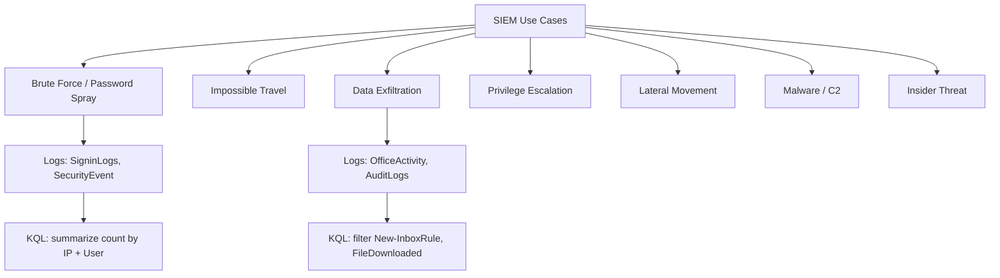
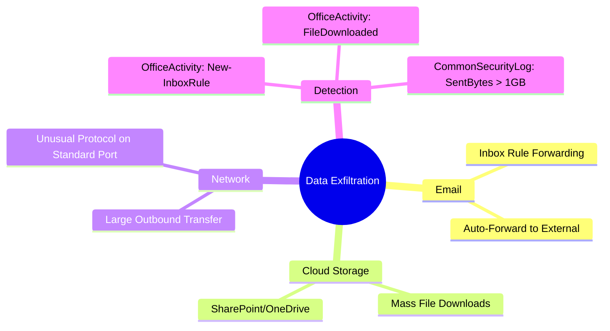
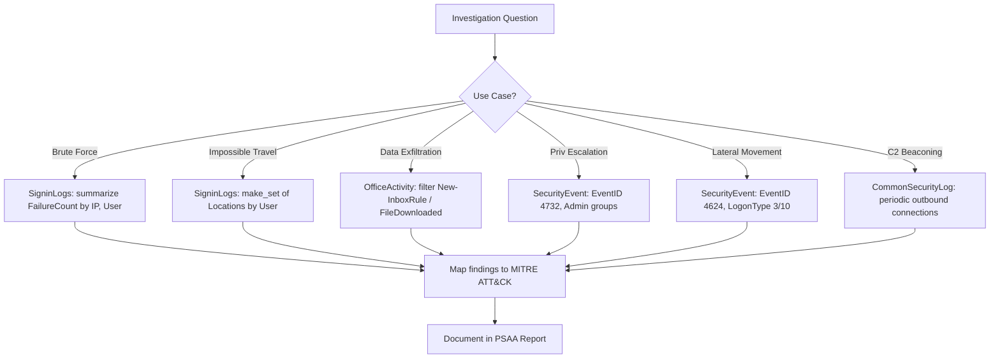

# Common SIEM Use Cases

## TCM Exam Objectives

By mastering this module, you will be prepared to:

1. **Detect** brute-force and password spray attacks using SigninLogs aggregation queries
2. **Identify** impossible travel by analyzing geographic login patterns within time windows
3. **Investigate** data exfiltration via suspicious inbox rules and mass file downloads
4. **Detect** privilege escalation through sensitive group membership changes (Event ID 4732)
5. **Trace** lateral movement via Event ID 4624 (Logon Types 3 and 10) and Event ID 4648
6. **Identify** malware C2 beaconing through periodic outbound connection patterns
7. **Map** each use case to the appropriate MITRE ATT&CK technique (T1110, T1078, T1048, T1098, T1021, T1071)
8. **Write** targeted KQL queries for each detection scenario
9. **Scope** the blast radius by combining multiple detection queries
10. **Document** findings with specific evidence and MITRE mappings in the PSAA report

SIEM use cases are the bridge between raw telemetry and actionable detection. They represent the attack scenarios you will repeatedly encounter: brute-force, data exfiltration, privilege escalation, lateral movement, and malware C2. For each use case, you must know the threat model, log sources, detection queries, investigation steps, and reporting essentials.

- Brute-force and password spray detection
- Impossible travel analysis
- Data exfiltration via email forwarding and file downloads
- Privilege escalation and lateral movement
- Malware C2 beaconing and insider threats



📌 **Exam Tip:** Memorize which log tables map to each use case. SigninLogs for brute-force and impossible travel, SecurityEvent for privilege escalation and lateral movement, OfficeActivity for data exfiltration, CommonSecurityLog for C2 beaconing. The PSAA will present a scenario and expect you to know which table to query first without browsing the schema.

## Brute-Force and Password Spray Attacks

**Threat Model:** Attackers repeatedly attempt to authenticate using many passwords against one account (brute force) or a few common passwords against many accounts (password spray). Success leads to initial access 【turn0search1】【turn0search4】.

### Log Sources and Key Fields

| Source | Key Fields |
|---|---|
| SigninLogs (Azure AD) | ResultType, UserPrincipalName, IPAddress |
| SecurityEvent (Windows) | Event ID 4625 (failures), 4624 (success) |
| Syslog (Linux SSH) | Failed password entries in auth.log |

### Detection Query - Azure AD Brute Force

```kusto
let failure_threshold = 10;
let time_window = 30m;
SigninLogs
| where TimeGenerated > ago(time_window)
| where ResultType != 0
| summarize FailureCount = count(), FailedApps = make_set(AppDisplayName),
    FirstAttempt = min(TimeGenerated), LastAttempt = max(TimeGenerated)
    by UserPrincipalName, IPAddress
| where FailureCount >= failure_threshold
| project UserPrincipalName, IPAddress, FailureCount, FailedApps, FirstAttempt, LastAttempt
| order by FailureCount desc
```

### Password Spray Variant

```kusto
let time_window = 1h;
SigninLogs
| where TimeGenerated > ago(time_window)
| where ResultType != 0
| summarize TargetedUsers = dcount(UserPrincipalName), UserList = make_set(UserPrincipalName, 20) by IPAddress
| where TargetedUsers > 5
| order by TargetedUsers desc
```

### Investigation Steps

1. Check if failures were followed by a success for the same user.
2. If success exists, pivot to OfficeActivity and AuditLogs for post-compromise actions.
3. Check if the source IP is known-bad via threat intelligence.

### MITRE ATT&CK

T1110 (Brute Force), T1110.003 (Password Spray)

## Impossible Travel

**Threat Model:** A user authenticates from two geographic locations in a time frame that is physically impossible to travel between. This indicates credential theft or token replay 【turn0search2】【turn0search5】.

### Detection Query

```kusto
let timeframe = 7d;
SigninLogs
| where TimeGenerated > ago(timeframe)
| where ResultType == 0
| summarize Locations = make_set(pack("Time", TimeGenerated, "City", City, "Country", CountryOrRegion), 5) by UserPrincipalName
| where array_length(Locations) > 1
| mv-expand Locations
| extend Time = tostring(Locations.Time), City = tostring(Locations.City), Country = tostring(Locations.Country)
| where isnotempty(City)
| project UserPrincipalName, Time, City, Country
| order by UserPrincipalName, Time asc
```

### MITRE ATT&CK

T1078 (Valid Accounts)

## Data Exfiltration

**Threat Model:** An attacker or insider transfers sensitive data outside the organization via email forwarding, cloud storage downloads, or network transfers 【turn0search3】【turn0search7】.

### Detection - Suspicious Inbox Rule

```kusto
OfficeActivity
| where TimeGenerated > ago(24h)
| where Operation in ("New-InboxRule", "Set-InboxRule")
| extend ForwardTo = tostring(parse_json(Parameters).ForwardTo)
| where isnotempty(ForwardTo)
| project TimeGenerated, UserId, Operation, ForwardTo, ClientIP
```

### Detection - Mass File Downloads

```kusto
OfficeActivity
| where TimeGenerated > ago(24h)
| where Operation == "FileDownloaded"
| summarize FileCount = count(), FileNames = make_set(SourceFileName, 20) by UserId, ClientIP
| where FileCount > 50
| project UserId, ClientIP, FileCount, FileNames
| order by FileCount desc
```

### Detection - Large Outbound Network Transfer

```kusto
CommonSecurityLog
| where TimeGenerated > ago(24h)
| where CommunicationDirection == "Outbound"
| summarize TotalBytesSent = sum(SentBytes) by SourceIP, DestinationIP, DestinationPort
| where TotalBytesSent > 1073741824  // 1 GB
| order by TotalBytesSent desc
```

### MITRE ATT&CK

T1114 (Email Collection), T1048 (Exfiltration Over Alternative Protocol), T1530 (Data from Cloud Storage)



## Privilege Escalation

**Threat Model:** An attacker with limited access attempts to gain higher privileges (local admin, domain admin, global admin) 【turn0search6】.

### Detection - User Added to Sensitive Group

```kusto
SecurityEvent
| where TimeGenerated > ago(1d)
| where EventID == 4732
| extend GroupName = tostring(TargetUserName), AddedUser = tostring(MemberName)
| where GroupName in ("Domain Admins", "Enterprise Admins", "Administrators")
| project TimeGenerated, Computer, GroupName, AddedUser, SubjectUserName
```

### Detection - New Global Admin in Azure AD

```kusto
AuditLogs
| where TimeGenerated > ago(7d)
| where OperationName == "Add member to role"
| extend RoleName = tostring(TargetResources[0].displayName), AddedUser = tostring(TargetResources[0].userPrincipalName)
| where RoleName == "Global Administrator"
| project TimeGenerated, InitiatedBy = tostring(InitiatedBy.user.userPrincipalName), AddedUser, RoleName
```

### MITRE ATT&CK

T1098 (Account Manipulation), T1078 (Valid Accounts), T1548 (Abuse Elevation Control Mechanism)

## Lateral Movement

**Threat Model:** After initial compromise, the attacker moves laterally to other systems to escalate privileges, locate data, or deploy ransomware 【turn0search8】.

### Detection - Multiple Unusual Logons from a Single Host

```kusto
SecurityEvent
| where TimeGenerated > ago(1d)
| where EventID == 4624
| where LogonType in (3, 10)
| extend TargetComputer = Computer, SourceIP = IpAddress
| summarize TargetComputers = dcount(TargetComputer), ComputerList = make_set(TargetComputer) by SourceIP
| where TargetComputers > 5
```

### Detection - Explicit Credential Use

```kusto
SecurityEvent
| where TimeGenerated > ago(24h)
| where EventID == 4648
| where TargetServerName != "localhost"
| project TimeGenerated, SubjectUser = tostring(SubjectUserName), TargetUser = tostring(TargetUserName),
    TargetServer = TargetServerName, Process = ProcessName
```

### MITRE ATT&CK

T1021 (Remote Services), T1550 (Use Alternate Authentication Material)

## Malware and C2

**Threat Model:** Malware establishes a foothold and communicates with an attacker-controlled server for instructions or data staging 【turn0search1】.

### Detection - Beaconing Activity

```kusto
let interval = 5m;
CommonSecurityLog
| where TimeGenerated > ago(1d)
| where CommunicationDirection == "Outbound"
| summarize ConnectionCount = count() by SourceIP, DestinationIP, bin(TimeGenerated, interval)
| where ConnectionCount > 0
| summarize Beacons = count() by SourceIP, DestinationIP
| where Beacons > 50
| project SourceIP, DestinationIP, Beacons
```

### MITRE ATT&CK

T1071 (Application Layer Protocol), T1059 (Command and Scripting Interpreter)

📌 **Exam Tip:** When investigating lateral movement, always check Event ID 4624 with Logon Type 3 (network) and Logon Type 10 (remote interactive). A single workstation that authenticates to 5+ servers within minutes is a classic lateral movement pattern. In the PSAA, pivot on the source workstation name and look for 4624 events where `LogonType` is 3 or 10 across different target computers.

## Quick Reference Card

| Use Case | Key Log Tables | Key Fields / Query Snippet | MITRE |
|---|---|---|---|
| **Brute Force** | SigninLogs, SecurityEvent | `where ResultType != 0 \| summarize count() by UserPrincipalName, IPAddress` | T1110 |
| **Password Spray** | SigninLogs | `where ResultType != 0 \| summarize dcount(UserPrincipalName) by IPAddress` | T1110.003 |
| **Impossible Travel** | SigninLogs | `summarize make_set(pack("city", City, "time", TimeGenerated), 2) by UserPrincipalName` | T1078 |
| **Data Exfiltration (Email)** | OfficeActivity | `where Operation == "New-InboxRule" \| extend ForwardTo` | T1114 |
| **Data Exfiltration (Files)** | OfficeActivity | `where Operation == "FileDownloaded" \| summarize count() by UserId` | T1530 |
| **Privilege Escalation** | SecurityEvent, AuditLogs | `where EventID == 4732 and TargetUserName in ("Domain Admins")` | T1098 |
| **Lateral Movement** | SecurityEvent | `where EventID == 4624 and LogonType in (3,10)` | T1021 |
| **C2 Beaconing** | CommonSecurityLog | `summarize count() by SourceIP, DestinationIP, bin(TimeGenerated, 5m)` | T1071 |



## Recap

SIEM use cases map common attack patterns to specific detection queries. Brute-force detection relies on counting failed logins by user and IP. Impossible travel analyzes geographic login patterns. Data exfiltration detects email forwarding rules and mass file downloads. Privilege escalation and lateral movement are tracked through group membership changes and remote logon events. Each use case includes a specific MITRE ATT&CK mapping, and investigation steps guide the analyst from detection to scope assessment.
