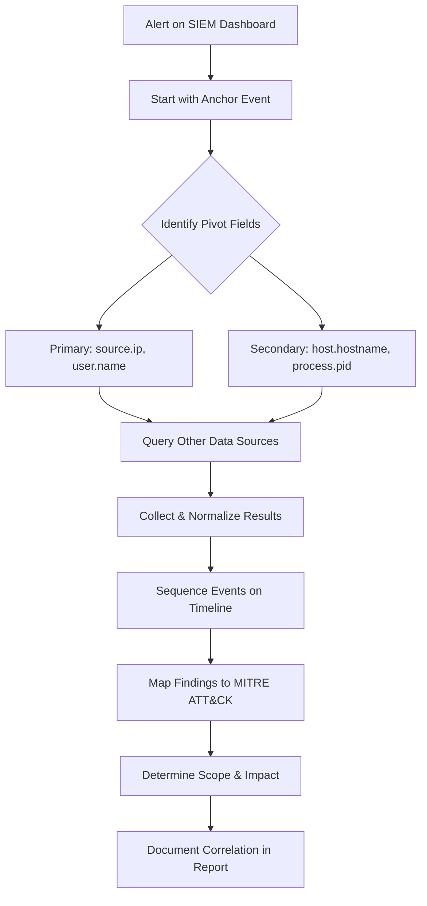
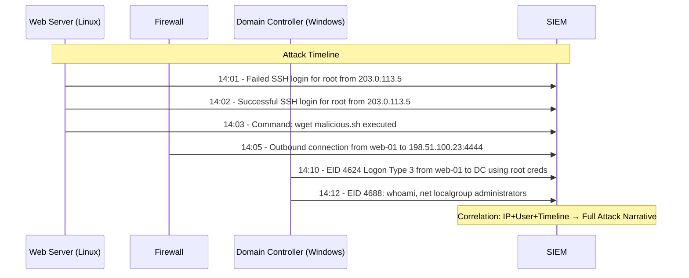
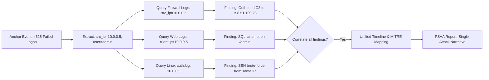

# Correlating Events Across Multiple Data Sources

## TCM Exam Objectives

By mastering this module, you will be prepared to:

1. **Apply** the three pillars of correlation: field-based, time-based, and sequence-based
2. **Identify** an anchor event and extract pivot fields for cross-source querying
3. **Build** a unified timeline from Windows, Linux, network, and cloud logs
4. **Use** Splunk's `transaction` command to group related events by time window
5. **Write** sequential KQL queries to manually correlate across tables in Sentinel
6. **Map** correlated events to MITRE ATT&CK tactics (T1110, T1078, T1059, T1071)
7. **Distinguish** between correlation (linking events) and aggregation (summarizing events)
8. **Scope** the full blast radius by connecting the initial breach to lateral movement
9. **Reconstruct** an attack narrative from isolated log entries for the PSAA report
10. **Validate** correlation findings by verifying timestamps and log source integrity

Event correlation is the process of connecting related events from different data sources to reveal a security incident that no single log could tell. It is the single most important skill demonstrated in the PSAA exam - the ability to pivot across Windows, Linux, network, and cloud logs to reconstruct the full attack narrative. A failed SSH login from an external IP is just noise until correlated with a successful login, a web shell upload, and an outbound C2 connection.

- The three pillars of correlation: field-based, time-based, sequence-based
- The correlation workflow from anchor event to documented narrative
- Implementing correlation in Splunk and Elastic
- Building timelines and mapping to MITRE ATT&CK



📌 **Exam Tip:** Field-based correlation is the most powerful tool in the PSAA. Take a single value like `203.0.113.5` and search for it across firewall logs, Windows Security logs, Linux auth logs, and web server logs. The same IP appearing in different log types is the strongest evidence of a coordinated attack.

## The Three Pillars of Correlation

| Pillar | Description | PSAA Example | SIEM Technique |
|---|---|---|---|
| **Field-Based** | Connecting events that share a common normalized field | All events where `source.ip = 203.0.113.5` or `user.name = jsmith` | Pivot on a field in Discover/Kibana |
| **Time-Based** | Grouping events within a close temporal window | Failed login followed within 2 minutes by a successful login for the same account | SPL `transaction`, range queries in Elastic |
| **Sequence-Based** | Looking for a specific ordered chain of events across systems | 1. Firewall deny for RDP 2. Web server SQLi 3. Outbound C2 connection | Join/sequence commands, custom rules |

These methodologies work together. Start with a field-based pivot (an IP address), apply time-based constraints (within 1 hour), and map to a known behavioral sequence 【turn0search1】【turn0search4】.

📌 **Exam Tip:** A bad report lists isolated findings. A PSAA-winning report connects them in a narrative: "The attacker brute-forced SSH from IP X (T1110), succeeded (T1078), downloaded malware (T1059), and established C2 to Y (T1071)." Each step must be supported by evidence from a different log source.

## The Correlation Workflow

### Step 1: Anchor Event Identification

The anchor is the initial suspicious event that triggers your investigation - a SIEM alert or a manual observation on your dashboard.

### Step 2: Extract Pivot Fields

The most powerful pivot fields:

| Field | Example | What It Unlocks |
|---|---|---|
| `source.ip` / `client.ip` | `203.0.113.15` | All network, auth, and endpoint logs from that IP |
| `user.name` / `user.effective.name` | `jsmith` | All auth, process, and file logs for that account |
| `host.hostname` / `host.name` | `SRV-01` | All system and security logs for that machine |
| `process.pid` / `process.ppid` | `0x1a4` | Process lineage for execution tracing |
| `file.hash.sha256` | `e3b0c44...` | File creation and execution events across hosts |

### Step 3: Query Other Data Sources

Take the pivot field and search for it in completely different log index sets. For example, take `source.ip` from a Windows Security log and search for it in firewall logs, web server logs, and VPN logs.

### Step 4: Create a Unified Timeline

Order events chronologically to understand the sequence:

| Timestamp | Source System | Event Description | Correlation Field |
|---|---|---|---|
| 14:01:02 | Linux Web Server | Failed SSH login for `root` from `203.0.113.5` | `src_ip: 203.0.113.5` |
| 14:02:15 | Linux Web Server | Successful SSH login for `root` from `203.0.113.5` | `src_ip: 203.0.113.5`, `user: root` |
| 14:03:42 | Linux Web Server | Command `wget malicious.sh` executed by `root` | `host: web-01`, `user: root` |
| 14:05:01 | Firewall | Allowed outbound from `web-01` to `198.51.100.23:4444` | `src_ip: 10.0.1.5`, `dst_ip: 198.51.100.23` |

### Step 5: Map to MITRE ATT&CK

Overlay your timeline onto MITRE ATT&CK:
- T1110 - Brute Force
- T1078 - Valid Accounts
- T1059.004 - Command and Scripting Interpreter: Unix Shell
- T1071.001 - Application Layer Protocol

## Implementing Correlation in Your SIEM

### Splunk: The `transaction` Command

The `transaction` command groups related events together:

```spl
index=main (EventID=4625 OR EventID=4624)
| transaction src_ip startswith="EventID=4625" endswith="EventID=4624" maxspan=2m
| table _time, src_ip, user, EventID, duration
```

This connects failure and success events from the same IP into a single correlated transaction.

### Elastic: KQL and Timelion

1. **Anchor Search:** `event.code: 3 AND destination.ip: "10.0.1.100" AND source.ip: "10.0.1.50"`
2. **Pivot:** Take `process.executable` from the Sysmon event and search for its parent process.
3. **Visual Correlation:** Bar chart with X-axis `source.ip` and Y-axis unique `destination.ip` targets.

### Manual Correlation in the PSAA

In the exam, you will manually correlate by running sequential KQL queries. Start with the anchor, extract pivot fields, and query other tables:

```kusto
// Step 1: Find initial compromise
SigninLogs
| where IPAddress == "203.0.113.5"
| where TimeGenerated > ago(2h)

// Step 2: Pivot on user
OfficeActivity
| where UserId == "compromised@domain.com"
| where TimeGenerated > ago(2h)

// Step 3: Pivot on host
SecurityEvent
| where Computer == "WEB-01"
| where TimeGenerated > ago(2h)
```



## The PSAA Report - A Correlated Story

A bad report lists isolated findings. A PSAA-winning report connects them: "I correlated the initial brute-force from IP X, which led to a successful login and execution of malware.exe. This malware established C2 to Y, and the attacker moved laterally to Z using credential dumping."

<details>
<summary>Practical Lab Exercise</summary>

**Setup:** Windows domain with workstation, server, and SIEM ingesting Windows Event Logs and Sysmon.

**Simulate Attack:**
1. Run mimikatz on workstation (Sysmon EID 10).
2. Use stolen token to connect to server via SMB (Event 4624 Logon Type 3 on server, Sysmon EID 3 from workstation).

**Correlation Task:**
1. Start with mimikatz execution anchor. Note source user and process.
2. Using the timestamp, pivot to the server's security logs for a login by the same account within 10 seconds.
3. Connect this to the network connection event from workstation to server on port 445.
4. Write a short report with timeline proving credential dumping led to lateral movement.
</details>



## Recap

Event correlation is the defining skill of a SOC analyst. Field-based correlation connects events sharing a common value like IP or user. Time-based correlation groups events within a temporal window. Sequence-based correlation matches specific attack chains across systems. The correlation workflow moves from anchor event identification through pivot field extraction, cross-source querying, timeline construction, and MITRE ATT&CK mapping. In the PSAA report, correlation transforms isolated findings into a coherent attack narrative that demonstrates analytical depth.
