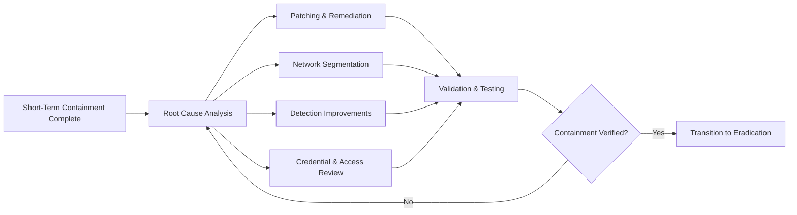
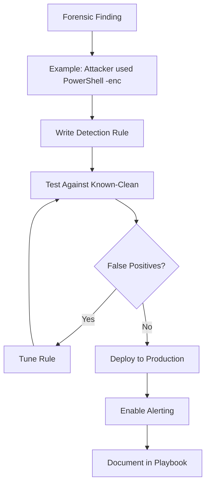
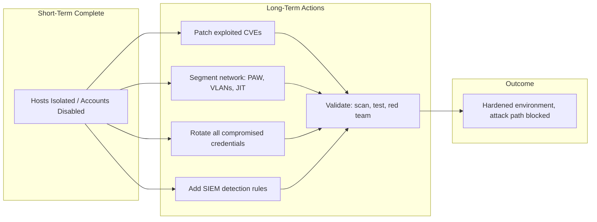

# Long-Term Containment: Patching, Network Segmentation

## TCM Exam Objectives

By mastering this module, you will be prepared to:

1. **Prioritize** patching based on exploit status, workaround availability, and CVSS score
2. **Design** network segmentation models (DMZ, internal DMZ, PAW, server VLAN, OT) to limit lateral movement
3. **Implement** credential rotation for compromised user accounts, service accounts, API keys, and certificates
4. **Convert** forensic findings into SIEM detection rule improvements
5. **Map** segmentation zones with access control rules for east-west traffic restriction
6. **Deploy** just-in-time (JIT) access and privileged access workstations (PAW) for admin tasks
7. **Validate** containment effectiveness through network segmentation tests, vulnerability scans, and red team simulations
8. **Review** privileged group memberships and remove unnecessary accounts and dormant users
9. **Update** detection playbooks based on attacker TTPs observed during the incident
10. **Document** the full remediation roadmap with timelines for critical, high, medium, and low priority actions

Long-term containment follows short-term containment and shifts the focus from stopping the immediate bleed to securing the environment against re-infiltration. While short-term containment isolates the burning building, long-term containment rebuilds the firewalls. This phase includes patching vulnerabilities, implementing network segmentation, updating detection rules, and hardening the security posture to prevent the same attack from recurring.

- Patching exploited vulnerabilities and addressing root causes
- Network segmentation strategies for containment and access control
- Updating SIEM detection rules based on forensic findings
- Credential rotation and privilege adjustments
- Validate containment effectiveness through testing

📌 **Exam Tip:** Always patch domain controllers first before reconnecting them to production. A restored but unpatched DC is immediately re-exploitable. In the PSAA, recommend patching in an isolated restore VLAN before production reconnection — this demonstrates understanding of containment sequencing.

## Patching and Vulnerability Remediation

The most important long-term containment action is removing the vulnerability that allowed the incident.

### Patch Prioritization Framework

| Priority | Timeline | Examples |
|---|---|---|
| **Critical** — Exploited in the incident, actively weaponized, no workaround | Within 4 hours | Public-facing RCE (e.g., Log4j), VPN vulnerability |
| **High** — Exploited in the incident, but workaround exists | Within 24 hours | SMB vulnerability, Exchange CVEs with workaround |
| **Medium** — Identified during forensic review, not exploited | Within 1 week | Weak TLS cipher, unpatched internal service |
| **Low** — Discovery gap, no active threat | Next maintenance window | Missing feature update, minor scanning finding |

### Patch Execution Strategies

- **Automated Patching:** Use SCCM, WSUS, or Intune for rapid deployment.
- **Air-Gapped Patching:** For isolated systems, use USB-based manual patching or temporary network access for updates.
- **Virtual Patching:** Deploy WAF rules or IDS signatures as a temporary measure when a patch cannot be immediately applied.

## Network Segmentation

Segmentation limits lateral movement — the single most effective long-term containment control. In the PSAA exam, you will be asked to propose segmentation for a compromised environment 【turn0search2】【turn0search5】.

### Recommended Segmentation Model

| Segment | Systems | Access Control | Risk |
|---|---|---|---|
| **Public DMZ** | Web servers, Reverse proxies | Internet -> DMZ only (port 80/443) | Direct internet exposure |
| **Internal DMZ** | API servers, application logic | DMZ -> Internal DMZ only over specific ports | Application compromise |
| **User Workstations** | Employee laptops, VDI | DMZ access restricted, no direct internet | Phishing, credential theft |
| **Privileged Access (PAW)** | Admin workstations, jump boxes | Strictly controlled paths to management interfaces | Admin credential theft |
| **Server / Critical Data** | Domain controllers, SQL, file servers | Only PAW can access, no direct user access | Data exfiltration |
| **OT / ICS** | Industrial control systems | Full air gap or diode-based filtering | Critical infrastructure |

### Implementation Steps

1. Map current network topology and identify gaps.
2. Define east-west traffic policies (prevent server-to-server lateral movement).
3. Implement VLANs or micro-segmentation (NSX, Azure vNet).
4. Deploy jump boxes for admin access (no direct RDP/SSH to servers).
5. Enable just-in-time (JIT) access instead of always-on admin rights.

### Segmentation Example: After Ransomware

**Before:** Flat network. All systems in the same subnet. Ransomware from one workstation can spread easily.

**After:**
- Workstations isolated in a separate VLAN with no direct server access.
- Server VLAN accessible only through jump box with MFA.
- Domain controllers in a dedicated management VLAN.
- Outbound internet for servers restricted to specific update servers only.

## Credential Rotation and Access Review

Every credential touched by the attacker must be rotated.

| Credential Type | Action | Verification |
|---|---|---|
| Compromised user password | Force reset, require MFA re-enrollment | Verify login fails with old password |
| Service account passwords | Rotate, consider gMSA for automatic rotation | Monitor for authentication failures |
| Application API keys | Regenerate, rotate secrets in Key Vault | Monitor for old key usage |
| Local admin passwords | Rotate via LAPS or similar | Verify new password applied |
| Certificate-based auth | Revoke and reissue certificates | Check CRL has old cert |
| SSH keys | Remove old key, deploy new key via config management | Verify SSH access with new key |

### Access Review Checklist

- Remove users from unnecessary privileged groups.
- Implement role-based access control (RBAC) with least privilege.
- Review external vendor / partner access accounts.
- Remove dormant accounts (90+ days inactive).
- Implement approval workflows for elevated access.

## Updating SIEM Detection Rules

Forensic findings from the incident must be converted to detection rules.

### Rule Improvement Process

### Examples of Rule Updates

| Finding | Original Detection Gap | New Rule |
|---|---|---|
| Attacker used `mshta.exe` to execute JavaScript | No `mshta` monitoring | Alert on `mshta.exe` spawned from Office apps |
| Data exfiltrated via `BITSAdmin` | Outbound BITS not monitored | Alert on `bitsadmin.exe` creating remote jobs |
| C2 over port 443 on non-standard protocol | Only port-based detection | Add JA3 hash and TLS certificate anomaly detection |
| Attacker disabled logging | No log tampering alerts | Alert on service stop events for `winevt`, `auditd` |

📌 **Exam Tip:** Network segmentation is the single most effective long-term containment control for preventing lateral movement. In the PSAA, propose that workstations should never have direct access to servers — all administrative access must go through a jump box with MFA. This is expected knowledge for the exam report.

## Validation and Testing

Before declaring long-term containment complete, validate that controls work.

- **Network Segmentation Test:** Try to connect from a workstation VLAN to server VLAN (should be blocked).
- **Patch Verification:** Run vulnerability scan to confirm CVE no longer present.
- **Rule Validation:** Re-run the original detection query on clean traffic (should be FP-free).
- **Credential Test:** Attempt to authenticate with old credentials (should fail).
- **Red Team Validation:** Simulate the same attack path and confirm a kill chain break.

Case Study: Long-Term Containment After a Phishing Attack

**Incident:** Credential phishing via fake Office 365 login page. 20 users entered credentials. Attacker accessed mailboxes, set up inbox rules, and attempted Business Email Compromise (BEC).

**Short-Term Actions:** User accounts disabled, inbox rules removed, passwords reset.

**Long-Term Actions:**
1. **Root Cause:** No MFA enabled. Adversary-in-the-middle phishing page.
2. **Patching:** Enforced MFA for all users within 24 hours via Conditional Access.
3. **Segmentation:** Restricted mailbox access via Conditional Access (only from compliant device, corp IP).
4. **Detection:** Deployed alert rule for bulk inbox rule creation (more than 5 rules in 1 hour across an OU).
5. **Credentials:** All 20 affected users had their tokens revoked and a mandatory password reset.
6. **Testing:** Ran a simulated phishing test targeting the same 20 users. 0 successful clicks.
7. **Validation:** Verified that mailbox access from non-corp IPs without MFA was blocked.

## Recap

Long-term containment transitions from stopping immediate damage to hardening the environment. Patching exploited vulnerabilities is the highest priority. Network segmentation — especially east-west restrictions — prevents lateral movement. Credential rotation removes attacker access. Detection rules are updated based on forensic findings. Every control must be validated before the containment phase is considered complete. The final output is a documented, tested, and verified security posture that prevents the same attack from succeeding again.
