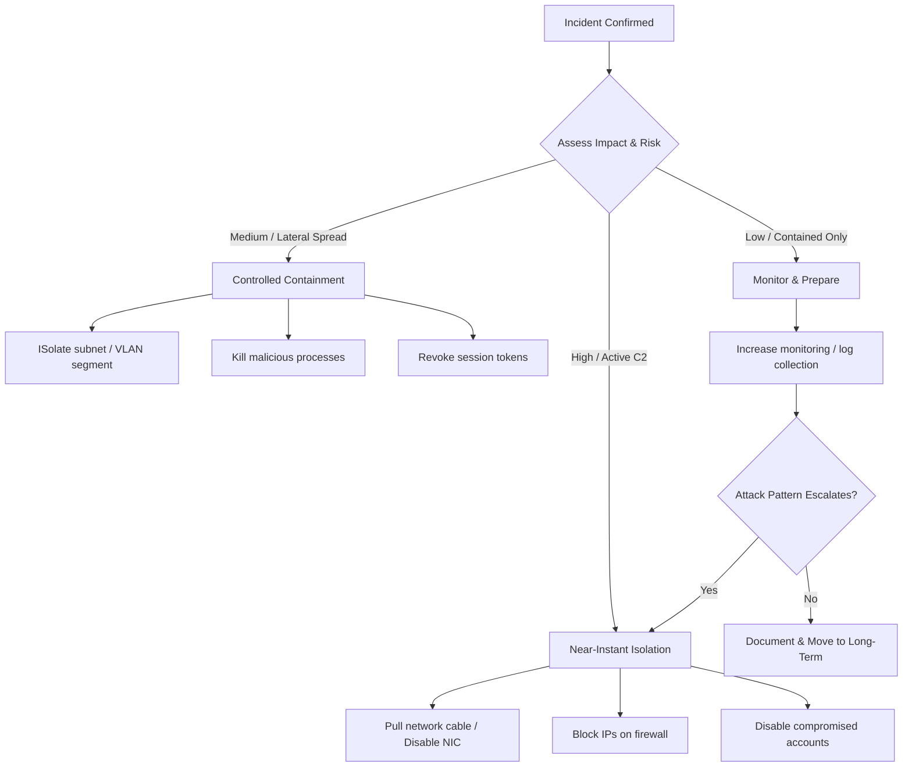
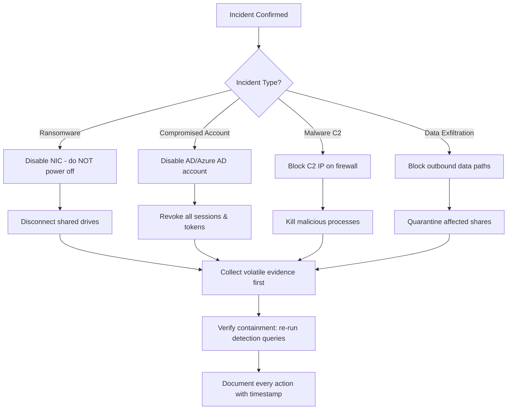

# Short-Term Containment: Isolating Affected Systems

## TCM Exam Objectives

By mastering this module, you will be prepared to:

1. **Execute** immediate containment actions: NIC disable, firewall ACL block, account disable, process kill
2. **Decide** when to pull the plug vs. disable the NIC vs. suspend a VM based on evidence preservation needs
3. **Apply** incident-type-specific playbooks for ransomware, compromised accounts, malware C2, and data exfiltration
4. **Preserve** volatile evidence (memory, process list, network connections) before executing containment actions
5. **Follow** the order of volatility: cache → memory → swap → processes → network state → disk → backup
6. **Block** C2 infrastructure by adding firewall deny rules for malicious IPs and domains
7. **Disable** compromised accounts in Active Directory and Azure AD with session token revocation
8. **Document** exact timestamps and actions taken for each containment step in the incident report
9. **Verify** containment effectiveness by checking network flows and re-running detection queries
10. **Escalate** to incident commander for authorization before executing disruptive containment measures

Short-term containment is the immediate, often aggressive action taken to prevent an active incident from spreading while preserving forensic evidence. Speed is the priority. Every additional minute an attacker maintains access increases the blast radius. The goal is not elegance — it is stopping the bleed. Short-term containment actions are reversible in some cases but must be executed decisively.

- Types of short-term containment actions
- Isolation, firewall blocking, credential invalidation, and account suspension
- When to pull the plug versus graceful disconnection
- Preserving evidence during containment
- Incident commander checklist

📌 **Exam Tip:** In the PSAA exam, never pull the power cable unless the scenario explicitly requires memory preservation. The safest answer is disable the NIC or unplug the network cable — this stops C2 traffic while preserving volatile evidence for forensic collection.

## Critical Decision: Pull the Plug or Not

The oldest debate in incident response: do you immediately power off a compromised system?

| Action | Pros | Cons |
|---|---|---|
| Pull power cable | Instantly stops attacker activity, contains ransomware encryption | Destroys memory evidence, kills in-progress forensic artifacts |
| Disable NIC / Unplug cable | Stops network-based C2, keeps system running for memory collection | Attacker's on-disk persistence remains active |
| Graceful shutdown | Preserves file system integrity | Gives malware time to clean-up, overwrite evidence, or trigger cryptors |
| Suspend VM (hypervisor) | Freezes memory and disk state perfectly | Can be detected by malware that monitors hypervisor activity |

**PSAA Guidance:** In the exam, choose **disable the NIC or unplug the network cable** unless the question specifically asks about preserving memory (where suspend is required). Pulling the plug is rarely the right answer in the exam because it destroys volatile evidence 【turn0search1】【turn0search4】.

## Containment Actions by Incident Type

### Ransomware

**Immediate Actions:**
1. Isolate affected systems from the network immediately (disable NIC or remove network cable).
2. Do not power off — ransomware encryption may be incomplete and shutting down could prevent decryption.
3. Identify and block C2 IPs on perimeter firewalls.
4. Disconnect shared drives and network shares accessible to the affected system.
5. If using a hypervisor, create a memory snapshot first, then suspend the VM.

### Compromised Account

**Immediate Actions:**
1. Disable the user account in Active Directory / Azure AD.
2. Force password reset and revoke all active sessions and tokens.
3. Check for and remove any unauthorized inbox rules or email forwarding.
4. Invalidate all refresh tokens for cloud applications.
5. Check for mailbox delegation changes.

### Malware / C2 Beaconing

**Immediate Actions:**
1. Block C2 IPs and domains on perimeter firewalls and DNS sinkholes.
2. Kill identified malicious processes (via remote management tools or endpoint security).
3. Isolate the infected host from the network.
4. Collect a process memory dump before killing if possible.

### Data Exfiltration

**Immediate Actions:**
1. Block outbound data paths (disable USB ports, block external email forwarding).
2. Quarantine affected file shares and databases.
3. Engage legal and compliance teams (data breach notification requirements).
4. Revoke API keys and service account tokens used in the exfiltration.

📌 **Exam Tip:** Always collect volatile data before executing containment actions. Run `tasklist`, `netstat -anob`, and capture memory before disabling the NIC or killing processes. Once containment is applied, volatile evidence is lost forever. In the PSAA, document the exact order of evidence collection in your report.

## Evidence Preservation During Containment

Containment and evidence are often in tension. Before executing disruptive containment, collect:

- **Volatile Data:**
  - Running processes (tasklist)
  - Active network connections (netstat -anob)
  - Memory dump (using FTK Imager Live, Magnet RAM Capture, or Sysinternals)
  - Network flows and PCAP from the detection window

- **Non-Volatile Data:**
  - Event logs (export evtx)
  - Registry hives (for persistence analysis)
  - Prefetch files
  - USN journal (file system change tracking)

**Order of Volatility:** Cache > Memory > Swap/Pagefile > Processes > Network State > Disk > Backup

## Execution Methods for Containment

| Method | How | Best For | Pitfall |
|---|---|---|---|
| **Firewall ACL** | Add deny rule for C2 IP / block all outbound for infected host | Network-based containment for known C2 | Attacker changes C2 IP quickly |
| **NIC Disable** | `netadm stop "Local Area Connection"` or hardware unplug | Instant host isolation | Remote admins lose access |
| **Account Disable** | AD: `Disable-ADAccount -Identity jdoe` | Credential theft / insider threat | High-impact user may be legitimate |
| **Process Kill** | `taskkill /F /IM evil.exe` | Malware on a single host | Process restarts as service |
| **DNS Sinkhole** | Redirect known-bad domains to internal blackhole | Blocking C2 at scale | May also block legitimate traffic |
| **Session Revoke** | `Revoke-AzureADUserAllRefreshToken` | Cloud identity compromise | Disrupts user productivity |

## Incident Commander Checklist

1. Confirm incident classification and severity.
2. Brief incident commander on proposed containment action.
3. Obtain authorization (verbal or written) for containment.
4. Assign a collector to preserve evidence before action.
5. Execute containment.
6. Verify containment was effective (check network flows, re-run detection queries).
7. Document exactly when and how containment was performed.
8. Notify stakeholders (legal, compliance, management) if required.

Playbook Example: Ransomware Short-Term Containment

**Scenario:** Analyst detects `encrypt.exe` executing on a finance workstation, creating files with `.locked` extension. Endpoint alert confirmed. Time is 10:15 AM.

**Steps:**
1. 10:15 AM — Analyst confirms true positive. Incident declared. Incident commander notified.
2. 10:16 AM — Analyst disables NIC on affected workstation via endpoint management. Documents exact timestamp.
3. 10:16 AM — Analyst runs `handle.exe` and `tcpview` from Sysinternals remotely to enumerate open handles and connections.
4. 10:17 AM — Analyst identifies C2 IP `198.51.100.23:8443` from captured connections. Blocked on perimeter firewall.
5. 10:18 AM — Analyst runs `Get-Process | Export-CSV processes.csv` for process snapshot.
6. 10:19 AM — Analyst identifies shared drives: finance-shares DFS path. Disconnects workstation from DFS and disables SMB on the workstation via GPO block.
7. 10:22 AM — Analyst verifies no new encrypted files detected in file server logs.
8. 10:25 AM — Containment confirmed. Handoff to long-term containment team.

## Recap

Short-term containment prioritizes speed over elegance to stop active harm. The decision to pull the plug, disable the NIC, or suspend the VM depends on the incident type and evidence preservation needs. Ransomware requires immediate isolation without power-off. Compromised accounts need immediate disablement and session revocation. Evidence must be collected before disruption. The incident commander provides authorization while the analyst executes and documents each step.
