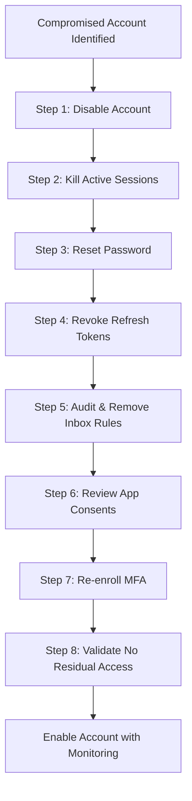
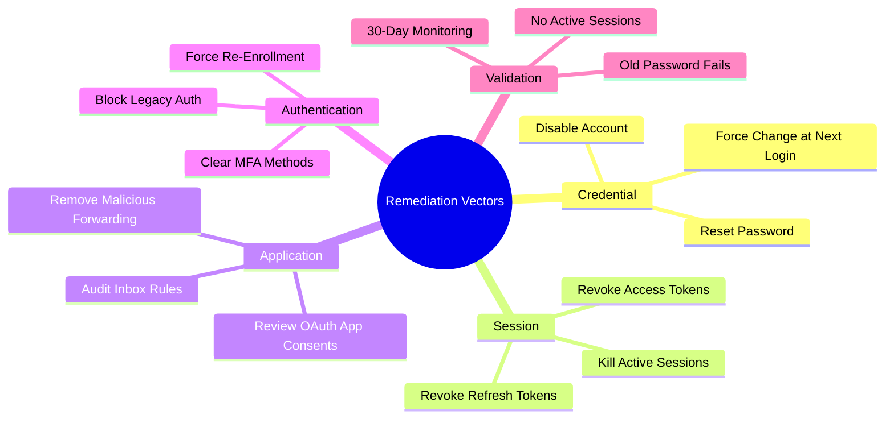
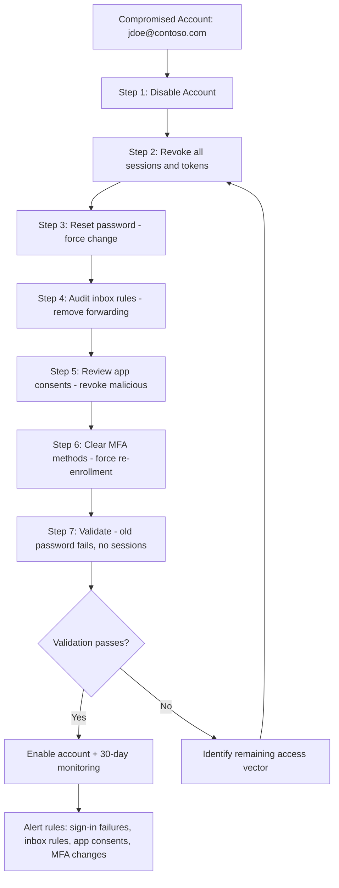

# Remediating Compromised User Accounts

## TCM Exam Objectives

By mastering this module, you will be prepared to:

1. **Execute** the eight-step account remediation workflow: disable, kill sessions, reset password, revoke tokens, audit inbox rules, review app consents, re-enroll MFA, validate
2. **Disable** accounts across Active Directory, Azure AD, AWS IAM, and Linux platforms
3. **Revoke** all active sign-in sessions and refresh tokens using `Revoke-MgUserSignInSession`
4. **Identify** and remove malicious inbox rules that forward email to external attackers
5. **Audit** OAuth application consents and remove unauthorized app permissions
6. **Clear** compromised MFA registrations and force fresh enrollment
7. **Validate** remediation by attempting old credentials and checking sign-in logs for residual access
8. **Monitor** for 30 days post-remediation for re-infection indicators
9. **Generate** strong passwords and force change at next login
10. **Document** the complete remediation chain with PowerShell commands and validation results
11. **Perform** Linux account remediation: lock user, kill SSH sessions, audit `.ssh/authorized_keys`, review `.bash_history`, check cron jobs
12. **Compare** remediation approaches across Azure AD, Active Directory, Linux, and AWS IAM platforms

Remediating a compromised user account requires more than a password reset. Modern attacks leverage session tokens, refresh tokens, inbox rules, application consents, and MFA enrollment to maintain persistent access. If you only reset the password, the attacker retains access through active sessions and registered MFA devices. Complete remediation follows a structured checklist that covers credential, session, application, and configuration vectors.

- Immediate credential and session remediation steps
- Email and cloud application cleanup
- MFA and device enrollment review
- Post-remediation validation and monitoring



📌 **Exam Tip:** Disable the account before resetting the password. Disabling is instantaneous and reversible; a password reset alone does not invalidate active OAuth sessions or refresh tokens. In the PSAA, always list account disablement as Step 1 in your remediation recommendations.

## Step 1 — Disable the Account

The first action is to stop the attacker from authenticating. Disablement is reversible and should be done before any other step.

### Active Directory

```powershell
Disable-ADAccount -Identity "jdoe"
```

### Azure AD / Microsoft 365

```powershell
$user = Get-MgUser -UserId "jdoe@contoso.com"
Update-MgUser -UserId $user.Id -AccountEnabled:$false
```

### Other Platforms
- **AWS IAM:** Attach a deny-all policy to the user.
- **GCP / GWS:** Suspend the user account in Admin Console.

## Step 2 — Kill Active Sessions

Disabled accounts with active token-based sessions can continue accessing resources until the token expires (up to 90 days for Azure AD).

### Kill All Active Sessions (Azure AD)

```powershell
Revoke-MgUserSignInSession -UserId "jdoe@contoso.com"
```

Alternatively, use the Microsoft Graph API:

```
POST https://graph.microsoft.com/v1.0/users/jdoe@contoso.com/revokeSignInSessions
```

### Kill Web Sessions (Active Directory Domain Services)

There is no equivalent of `revokeSignInSessions` for on-prem AD. Force Kerberos ticket expiration by changing the password (Step 3), which invalidates all TGTs.

## Step 3 — Reset Password

Resetting the password invalidates the user's current Kerberos tickets and any cached credentials.

### Best Practices for Password Reset

| Requirement | Reason |
|---|---|
| Generate random, strong passphrase | Avoids predictable patterns that attackers could guess |
| Do not reuse last 10 passwords | Prevents password cycling guess attacks |
| Force change at next login | Ensures user knows the new password |
| Do not communicate via email | Email accounts may still be compromised |

### PowerShell (Azure AD)

```powershell
$params = @{
    passwordProfile = @{
        forceChangePasswordNextSignIn = $true
        password = "N3wRand0mP@ssphr@se!"
    }
}
Update-MgUser -UserId "jdoe@contoso.com" -BodyParameter $params
```

## Step 4 — Revoke Refresh and Access Tokens

This is the most overlooked step. Resetting the password does not invalidate existing OAuth refresh tokens issued to apps or devices.

```powershell
# Revoke all refresh tokens for a user
Revoke-MgUserSignInSession -UserId "jdoe@contoso.com"
```

This call invalidates all sessions, tokens, and MFA sessions for the user. The user will be forced to re-authenticate completely 【turn0search3】【turn0search7】.

## Linux Account Remediation Walkthrough (SSH Key Audit, .bash_history, lastlog)

The Linux remediation workflow follows the same eight-step logic but uses different tools and surfaces unique forensic artifacts attackers leave on Linux systems.

### Step 1 — Disable the Account

```bash
# Lock the account immediately
sudo usermod -L jsmith
# Alternative: set expired date to past
sudo chage -E 0 jsmith

# Verify account is locked
sudo passwd -S jsmith
# Expected output: jsmith L (locked)
```

### Step 2 — Kill Active Sessions

```bash
# List all active SSH sessions
sudo w
sudo who -u

# Force-kill all sessions for the compromised user
sudo pkill -u jsmith
# Or kill specific SSH PID
sudo kill -9 <PID>

# Verify no remaining sessions
sudo w | grep jsmith
# Expected: no output
```

> Note: Unlike Azure AD's `Revoke-MgUserSignInSession`, Linux has no token-revocation mechanism. Killing processes and resetting the password (Step 3) is the best approximation.

### Step 3 — Reset Password

```bash
# Set new password (will prompt for input)
sudo passwd -e jsmith
# The -e flag forces password expiration, user must change on next login

# Non-interactive alternative (for automation):
echo "jsmith:NewStr0ngP@ssword!" | sudo chpasswd
sudo passwd -e jsmith
```

### Step 4 — Audit SSH Authorized Keys

Attackers frequently add their own SSH public key to maintain persistence. This is the Linux equivalent of auditing inbox rules.

```bash
# Check authorized_keys for unknown keys
sudo cat /home/jsmith/.ssh/authorized_keys

# Look for:
# - Keys you did not create
# - Keys with suspicious comments (note at end of line)
# - Keys added at the time of compromise (check file timestamp)

# Check file modification time
sudo stat /home/jsmith/.ssh/authorized_keys

# Remove unknown keys
sudo nano /home/jsmith/.ssh/authorized_keys
# Or replace with safe backup
```

### Step 5 — Review .bash_history and Command Artifacts

The shell history is the Linux equivalent of the Windows Timeline / Prefetch — it reveals exactly what the attacker executed.

```bash
# Examine the user's command history
sudo cat /home/jsmith/.bash_history
# Or for root-level activity
sudo cat /root/.bash_history

# Look for suspicious commands:
# - wget/curl downloads
# - chmod/chown changes on unusual files
# - crontab modifications
# - SSH connections to external hosts
# - sudo or su usage
# - netcat (nc) listeners

# Check if history was cleared (attacker cover-up)
# If .bash_history is empty or truncated, this is suspicious
ls -la /home/jsmith/.bash_history
# Compare file size to expected user activity duration
```

### Step 6 — Audit Cron Jobs and Systemd Timers

Attackers use cron or systemd timers for persistence — the Linux equivalent of Windows scheduled tasks.

```bash
# Check user's crontab
sudo crontab -u jsmith -l

# Check system-wide cron directories
ls -la /etc/cron.d/
ls -la /etc/cron.hourly/
ls -la /etc/cron.daily/

# Check systemd timers
sudo systemctl list-timers --all

# Check for suspicious services
sudo systemctl list-units --type=service --state=running
# Look for unfamiliar service names
```

### Step 7 — Review lastlog and Auth Logs

```bash
# Check last login times and source IPs
sudo lastlog -u jsmith

# Check recent authentications
sudo last -u jsmith

# Review auth log for the compromise window
sudo grep jsmith /var/log/auth.log | tail -50

# Check sudo commands executed
sudo grep jsmith /var/log/auth.log | grep -i sudo

# Check for SSH from unusual IPs
sudo grep "Accepted publickey\|Accepted password" /var/log/auth.log | grep jsmith
```

### Step 8 — Validate and Monitor

```bash
# Validation: verify old password fails
su jsmith
# Enter old password — should fail

# Verify cron jobs are clean
sudo crontab -u jsmith -l
# Expected: empty or no suspicious entries

# Verify SSH keys are clean
sudo cat /home/jsmith/.ssh/authorized_keys
# Expected: only known authorized keys

# Post-remediation monitoring (add to /etc/rsyslog.d/ or SIEM)
# Watch for:
# - Failed SSH auth attempts for jsmith
# - New cron jobs created
# - New SSH key writes to .ssh/authorized_keys
```

### Linux vs Azure AD Remediation Comparison

| Step | Azure AD / M365 | Linux |
| :--- | :--- | :--- |
| Disable | `Update-MgUser -AccountEnabled:\$false` | `usermod -L jsmith` |
| Kill sessions | `Revoke-MgUserSignInSession` | `pkill -u jsmith` |
| Reset password | `Update-MgUser -PasswordProfile @{}` | `passwd -e jsmith` |
| Persistence audit | Check inbox rules | Check `.ssh/authorized_keys`, cron, systemd timers |
| Token / artifact audit | Check OAuth consents | Check `.bash_history`, `lastlog` |
| Validate | Check sign-in logs | Check `auth.log` for residual access |

## Step 5 — Audit and Remove Malicious Inbox Rules

Attackers almost always create inbox rules to hide their activity or exfiltrate data.

```powershell
Connect-ExchangeOnline
Get-InboxRule -Mailbox jdoe | Select Name, Description, ForwardTo, ForwardAsAttachmentTo, RedirectTo, DeleteMessage
```

**Look for:**
- Rules that forward to external addresses.
- Rules that delete or mark messages as read.
- Rules that move messages to less monitored folders.
- Rules with non-descriptive names.

### Remove Malicious Rules

```powershell
$maliciousRules = Get-InboxRule -Mailbox jdoe | Where-Object { $_.ForwardTo -match "@externaldomain" }
foreach ($rule in $maliciousRules) {
    Remove-InboxRule -Identity $rule.Identity -Mailbox jdoe -Confirm:$false
}
```

## Step 6 — Review and Remove Malicious Application Consents

Attackers register OAuth applications and grant them permissions to read mail, access files, or send email.

```powershell
# List all app role assignments for the user
Get-MgUserAppRoleAssignment -UserId "jdoe@contoso.com" | fl
```

**Suspicious consents include:**
- Apps from unknown publishers.
- Apps with broad permissions (Mail.Read, Files.ReadWrite.All).
- Apps granted outside of your consent policy.

### Remove Malicious Consent

```powershell
Remove-MgUserAppRoleAssignment -UserId "jdoe@contoso.com" -AppRoleAssignmentId "approleassignment-id"
```

📌 **Exam Tip:** Password resets alone do not invalidate MFA registrations. Attackers often enroll their own MFA methods (authenticator app, FIDO2 key) to maintain persistent access. Always clear all existing MFA methods with `Remove-MgUserAuthenticationMethod` and require fresh enrollment. This is a commonly overlooked step in the exam.



## Step 7 — Re-enroll MFA

Attackers enroll their own MFA devices to maintain access after the password is reset. You must clear existing MFA registrations.

### Azure AD / Microsoft 365

```powershell
# Remove all MFA authentication methods
Remove-MgUserAuthenticationMethod -UserId "jdoe@contoso.com" -AuthenticationMethodId "microsoftAuthenticatorAuthenticationMethod"
```

After removal, the user must re-register MFA on next login:
```powershell
Update-MgUser -UserId "jdoe@contoso.com" -StrongAuthenticationRequirements @(@{RelyingParty = "*"; State = "Enforce"})
```

## Step 8 — Validate and Enable the Account

### Validation Checklist

| Check | Method | Expected Result |
|---|---|---|
| Old password works | Attempt login with old password | Failed |
| Old tokens valid | Check sign-in logs for token-based logins | Blocked with error |
| Inbox rules empty | `Get-InboxRule -Mailbox jdoe` | Zero forwarded rules |
| App consents known | Review consented apps list | Only known enterprise apps |
| MFA enrolled | Check authentication methods in portal | User must re-register |
| No active sessions | `Get-MgUserSignInSession` | Null or empty |

### Enable the Account

```powershell
Update-MgUser -UserId "jdoe@contoso.com" -AccountEnabled:$true
```

## Post-Remediation Monitoring

For 30 days after remediation, implement heightened monitoring:

- **Sign-in failures:** Monitor for attempts using the old password.
- **Inbox rule creation:** Alert on `New-InboxRule` or `Set-InboxRule` for this user.
- **App consent grants:** Alert on new `ConsentToApplication` audit events.
- **MFA enrollment:** Alert on `RegisterSecurityKey` or `RegisterAuthenticatorApp` for this user.
- **Unusual login locations:** Watch for logins from non-corp IPs.

```kusto
// Monitor for residual access attempts
SigninLogs
| where UserPrincipalName == "jdoe@contoso.com"
| where ResultType != 0
| where TimeGenerated > ago(30d)
| project TimeGenerated, IPAddress, ResultType, AppDisplayName, AuthenticationRequirement
| order by TimeGenerated desc
```

<details>
<summary>Complete Remediation Script Template</summary>

```powershell
# Complete Compromised User Remediation Script for Azure AD
param(
    [Parameter(Mandatory=$true)]
    [string]$UserPrincipalName
)

# Step 1: Disable account
Write-Host "Disabling account..."
Update-MgUser -UserId $UserPrincipalName -AccountEnabled:$false

# Step 2: Revoke all sessions and tokens
Write-Host "Revoking all sessions and tokens..."
Revoke-MgUserSignInSession -UserId $UserPrincipalName

# Step 3: Reset password
Write-Host "Resetting password..."
$newPassword = -join ((65..90) + (97..122) + (48..57) + 33..47 | Get-Random -Count 20 | % {[char]$_})
$params = @{
    passwordProfile = @{
        forceChangePasswordNextSignIn = $true
        password = $newPassword
    }
}
Update-MgUser -UserId $UserPrincipalName -BodyParameter $params
Write-Host "New password: $newPassword"

# Step 4: Remove inbox rules
Write-Host "Removing inbox rules..."
$rules = Get-InboxRule -Mailbox $UserPrincipalName
foreach ($rule in $rules) {
    Remove-InboxRule -Identity $rule.Identity -Mailbox $UserPrincipalName -Confirm:$false
}

# Step 5: Remove MFA registrations
Write-Host "Clearing MFA registrations..."
$authMethods = Get-MgUserAuthenticationMethod -UserId $UserPrincipalName
foreach ($method in $authMethods) {
    Remove-MgUserAuthenticationMethod -UserId $UserPrincipalName -AuthenticationMethodId $method.Id
}

Write-Host "Remediation complete. DO NOT ENABLE until user confirms readiness."
```
</details>



## Recap

Account remediation is a multi-step process that goes far beyond password resets. Disable the account first, then revoke all active sessions and tokens. Audit and remove inbox rules that attackers use for email forwarding. Review and remove malicious OAuth app consents. Clear all MFA registrations and require fresh registration. After validation, enable the account with 30 days of heightened monitoring.

For Linux environments, the same eight-step logic applies with platform-specific tools: `usermod -L` to lock, `pkill -u` to kill sessions, `.ssh/authorized_keys` audit for persistence, `.bash_history` review for command artifacts, and `crontab` / systemd timer checks. Always document the full remediation chain — platforms, commands, and validation results — for your PSAA report.
