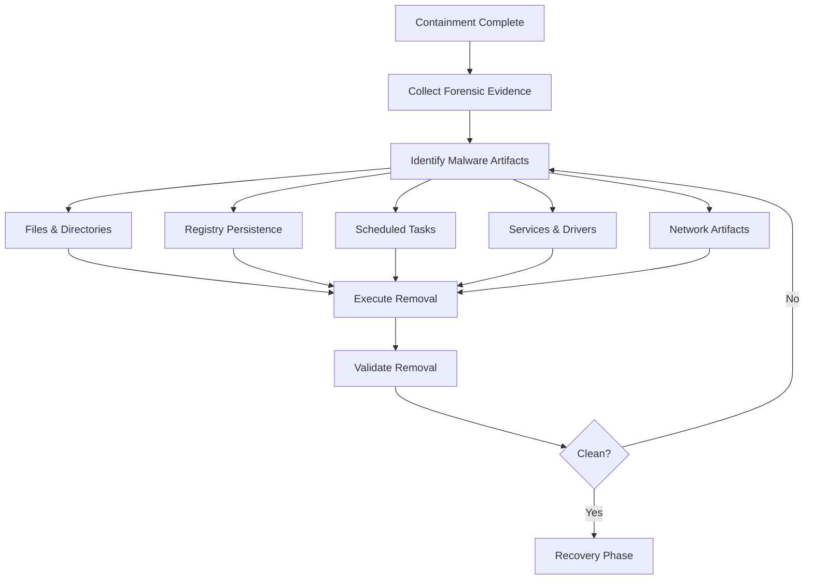
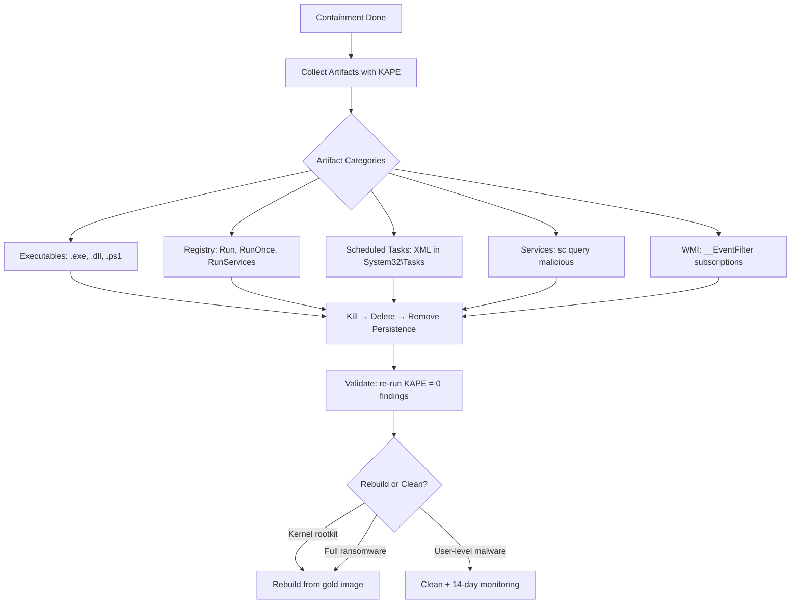

# Removing Malware and Deleting Malicious Artifacts

## TCM Exam Objectives

By mastering this module, you will be prepared to:

1. **Identify** all malware artifact categories: executables, registry keys, scheduled tasks, services, drivers, WMI persistence
2. **Use** KAPE to collect forensic artifacts from compromised systems into a structured output directory
3. **Execute** manual removal commands for processes, files, registry keys, scheduled tasks, services, and WMI subscriptions
4. **Validate** eradication completeness using endpoint queries and re-running artifact collection tools
5. **Apply** the rebuild vs. clean decision matrix based on kernel compromise, encryption status, and regulatory requirements
6. **Document** all removed artifacts with file paths, registry keys, and task names in the incident report
7. **Verify** zero artifact re-appearance through continuous monitoring for 14 days post-eradication
8. **Differentiate** between user workstation nuke-and-pave and server cleaning with uptime SLAs
9. **Detect** fileless malware persistence through WMI event subscriptions and PowerShell profile modifications
10. **Apply** the correct order of operations: kill process → remove files → remove persistence → validate

Removing malware and malicious artifacts is the eradication phase of incident response. After containment has stopped the active threat, eradication removes the attacker's foothold — the files, registry keys, scheduled tasks, persistence mechanisms, and dormant implants that could re-activate. Eradication must be methodical and verifiable. A single missed artifact can provide re-entry for the attacker.

- Identifying all malware artifacts through forensic analysis
- Removal techniques for files, registry, scheduled tasks, services, and drivers
- Eradication validation and re-infection checking
- When to rebuild rather than clean



📌 **Exam Tip:** KAPE is the gold standard for artifact collection in the PSAA. Run `kape.exe --tsource C: --tdest D:\case\artifacts --tflush --targets Malware` to collect all known malware artifact locations. Screenshot the KAPE output for your report — it shows examiners you used proper forensic methodology.

## Step 1 — Identify All Malware Artifacts

Before removing anything, you must know everything the malware placed on the system. Use a combination of automated tools and manual analysis.

### Artifact Categories

| Category | Examples | Tools to Identify |
|---|---|---|
| **Executables** | `.exe`, `.dll`, `.scr`, `.ps1`, `.vbs`, `.bin` | Sysinternals Autoruns, Process Explorer, KAPE |
| **Dropped Files** | `.txt`, `.dat`, `.log` (malware temp files) | USN Journal (ntfs-usn-journal), forensic timeline |
| **Registry Persistence** | `Run`, `RunOnce`, `RunServices`, `AppCertDlls` | Autoruns, reg query, Hayabusa |
| **Scheduled Tasks** | XML tasks in `\Windows\System32\Tasks` | `schtasks /query /v /fo csv`, KAPE |
| **Services** | `Services: malicious service name` | `sc query`, `Get-Service` |
| **Drivers** | Kernel-mode drivers | `fltmc`, `driverquery`, `chkrootkit` |
| **Network Artifacts** | C2 IPs in hosts file, proxy configuration | `Get-DnsClientCache`, `netstat -anob` |
| **WMI Persistence** | WMI event subscriptions | `Get-WmiObject __EventFilter`, `Get-WmiObject __FilterToConsumerBinding` |

### Automated Collection with KAPE

KAPE (Kroll Artifact Parser and Extractor) is the gold standard for artifact collection:

```
kape.exe --tsource C: --tdest D:\case001\artifacts --tflush --targets Malware
```

This command collects all known malware artifact locations into a structured output directory 【turn0search2】【turn0search6】.

## Step 2 — Execute Removal

### Manual Removal Commands

**Kill process:**
```
taskkill /F /IM malicious.exe
```

**Remove file:**
```
del C:\Users\Public\malicious.exe /F /Q
```

**Remove directory recursively:**
```
rmdir /S /Q C:\Users\Public\malware_folder
```

**Remove registry key:**
```
reg delete "HKCU\Software\Microsoft\Windows\CurrentVersion\Run" /V MalwareValue /F
```

**Remove scheduled task:**
```
schtasks /Delete /TN "MaliciousTaskName" /F
```

**Remove service:**
```
sc delete "MaliciousServiceName"
```

**Remove WMI persistence:**
```powershell
Get-WmiObject __EventFilter -Namespace root\subscription | Where-Object {$_.Name -like "*malicious*"} | Remove-WmiObject
Get-WmiObject __FilterToConsumerBinding -Namespace root\subscription | Where-Object {$_.Filter -like "*malicious*"} | Remove-WmiObject
```

## Step 3 — Removal Validation

Eradication is not complete until you verify the artifacts are gone and the system is clean.

### Validation Queries

```kusto
// Check that malicious process is no longer running
DeviceProcessEvents
| where DeviceName == "WORKSTATION-01"
| where FileName in~ ("malicious.exe", "evil.dll")
| where Timestamp > ago(1h)
| count
// Should return 0 for clean system
```

```powershell
# Validate registry key removed
Get-ItemProperty -Path "HKCU:\Software\Microsoft\Windows\CurrentVersion\Run" | Format-List
# Should not show MalwareValue
```

```powershell
# Validate scheduled task removed
Get-ScheduledTask -TaskName "MaliciousTaskName" -ErrorAction SilentlyContinue
# Should return null
```

```powershell
# Validate service removed
Get-Service -Name "MaliciousServiceName" -ErrorAction SilentlyContinue
# Should return null
```

📌 **Exam Tip:** In the PSAA exam, nuke-and-pave (rebuild from gold image) is the preferred answer for workstations. You can never prove a negative — you cannot guarantee every artifact was removed. For servers with uptime SLAs, recommend clean + enhanced monitoring for 14 days before returning to full production.

## Rebuild vs. Clean Decision Matrix

Some systems cannot be reliably cleaned. The decision to rebuild or clean depends on multiple factors:

| Factor | Clean In Place | Rebuild from Known-Good |
|---|---|---|
| Root-level (kernel) compromise | Risk of undetected persistence | Rebuild required |
| Known fileless malware | May be cleanable with memory dump analysis | Rebuild recommended |
| Ransomware (no encryption, early detection) | Cleanable after removal | Clean acceptable |
| Ransomware (full encryption) | Must rebuild | Rebuild required |
| EDR confirmed clean scan | Clean acceptable | Optional |
| EDR not deployed or evaded | Rebuild recommended | Rebuild required |
| Critical uptime requirement | Clean preferred | Scheduled rebuild |
| Regulatory requirement | Must rebuild | Rebuild required |

**PSAA Exam Guidance:** Unless the question explicitly says kernel-level rootkit or full ransomware encryption, cleaning is acceptable. However, in a professional SOC, rebuild is almost always preferred because you cannot prove a negative — you cannot be 100% certain every artifact was removed 【turn0search4】【turn0search8】.

| System Type | Typical Decision |
|---|---|
| User workstation | Rebuild (nuke-and-pave) |
| Server with uptime SLA | Clean + continuous monitoring |
| Domain controller | Rebuild from backup with elevation check |
| Cloud VM | Re-provision from clean AMI |

<details>
<summary>Playbook: Full Malware Eradication for a Workstation</summary>

**Scenario:** Workstation infected with a remote access trojan (RAT) via malicious email attachment. EDR detected and isolated. Containment completed. Now eradicating.

**Steps:**
1. **Collect:** Run KAPE with `--targets Malware` and `--targets PowerShellHistory`.
2. **Identify:** Autoruns reveals `Run` entry pointing to `C:\Users\public\svchost.exe`. KAPE finds three dropped DLLs. Scheduled task `Updater` runs the payload every hour.
3. **Kill:** `taskkill /F /IM svchost.exe`. Verify process no longer in Task Manager.
4. **Remove files:**
   ```
   del C:\Users\Public\svchost.exe /F /Q
   del C:\Users\Public\libcurl.dll /F /Q
   del C:\Users\Public\libssl.dll /F /Q
   rmdir /S /Q C:\Users\Public\.cache
   ```
5. **Remove persistence:**
   - Registry: `reg delete "HKCU\...\Run" /V svchost /F`
   - Task: `schtasks /Delete /TN "Updater" /F`
6. **Validate:**
   - Re-run KAPE malware targets. Zero findings.
   - Run EDR full scan. Clean.
   - Run `Get-ScheduledTask` for this host. No unknown tasks.
   - Run `netstat -anob`. No suspicious outbound connections.
7. **Continuous monitor:** Enable 14-day monitoring for any re-infection indicators before returning to production.
</details>



## Recap

Malware removal requires complete artifact identification before any cleaning action. Use KAPE or similar tools to collect all file, registry, task, service, and driver artifacts. Removal must be followed by thorough validation — re-running the same collections and confirming zero findings. The rebuild vs. clean decision depends on kernel compromise depth, fileless malware, encryption status, and regulatory requirements. Rebuild is always safer, but cleaning is acceptable for well-understood, non-root-level infections.
