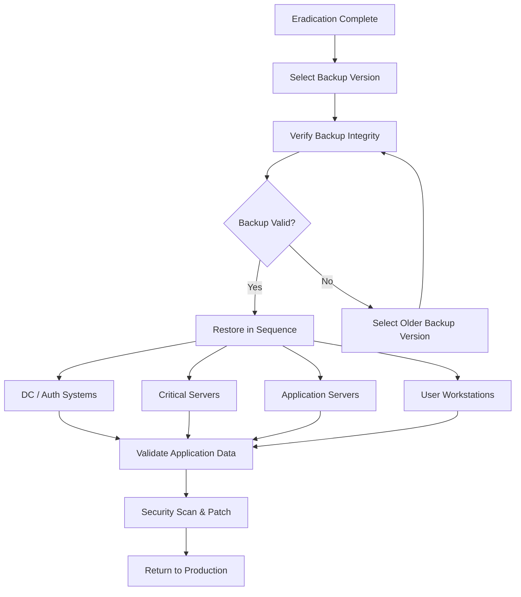
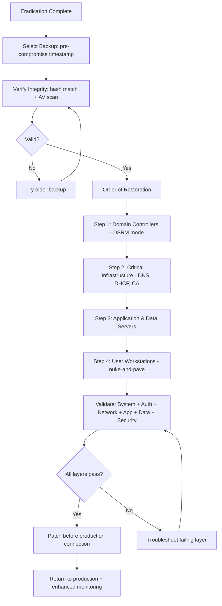

# Restoring Systems from Known-Good Backups

## TCM Exam Objectives

By mastering this module, you will be prepared to:

1. **Select** the appropriate backup version based on timestamp, integrity hash, completeness, and offline status
2. **Apply** the correct restoration sequence: domain controllers first, then infrastructure, application servers, workstations last
3. **Verify** backup integrity using hash comparison and scan for malware before restoration
4. **Execute** Active Directory authoritative restore using `ntdsutil` and Directory Services Restore Mode
5. **Validate** post-restoration readiness across system, authentication, network, application, data, and security layers
6. **Follow** proper evidence preservation procedures before overwriting compromised disks
7. **Implement** backup immutability with WORM storage, air-gapped networks, and MFA on backup admin accounts
8. **Avoid** common restoration pitfalls: restoring unpatched systems, reconnecting to compromised networks, missing service account rotations
9. **Document** restoration steps with timestamps, backup IDs, and validation results for compliance purposes
10. **Schedule** quarterly restore tests to validate backup integrity and restoration procedures

Restoring systems from known-good backups is the final recovery step after containment and eradication. A known-good backup is one that was taken before the compromise occurred and has been verified by integrity checks. The goal is to return the system to a fully operational state without reintroducing the vulnerability or the attacker's artifacts. Restoration requires careful planning, validation, and sequencing.

- Backup integrity verification and chain-of-custody
- Restoration sequencing (domain controllers first, workstations last)
- Application and data consistency checks
- Post-restoration validation and user notification



📌 **Exam Tip:** Always choose the oldest clean backup — typically 24-48 hours before the first indicator of compromise. A backup taken during the compromise window will restore the attacker's foothold along with the data. In the PSAA, cross-reference the forensic timeline with backup timestamps before selecting.

## Selecting the Right Backup Version

The backup must be from a point in time before the compromise began.

### Backup Selection Criteria

| Criteria | Requirement | Validation Method |
|---|---|---|
| **Timestamp** | Before earliest evidence of compromise | Correlate with forensic timeline |
| **Integrity** | Backup must pass hash verification | Compare backup metadata hash with stored value |
| **Completeness** | All required system data present | Verify backup manifest / file listing |
| **Exclusion** | No malicious files should be present | Scan backup with EDR or AV before restore |
| **Offline copy** | Must not have been accessible from compromised network | Check backup storage access logs |
| **Encryption** | Not encrypted by ransomware | Verify backup file headers / extensions |

### PSAA Exam Guidance

In the exam, always choose the oldest clean backup available — typically 24-48 hours before the initial compromise indicator. Never restore from a backup that overlaps with the compromise window 【turn0search1】【turn0search4】.

📌 **Exam Tip:** Domain controllers must be restored first — everything depends on them. Never restore a DC and connect it to a network where compromised systems still exist. Use a separate restore VLAN, patch the DC before production connection, and verify replication with `repadmin /replsum` before moving on.

## Restoration Sequencing

The order of restoration matters. Restoring domain controllers after workstations can create a cascade of trust failures.

### Step 1: Domain Controllers First

DCs provide authentication and directory services for everything else.

**Process:**
1. Restore the first DC from backup in Directory Services Restore Mode (DSRM).
2. Run `ntdsutil` authoritative restore if needed.
3. Verify replication: `repadmin /replsum`.
4. Patch and harden DC before connecting to production network.
5. Restore remaining DCs from the first restored DC via replication.

**Critical: Do not boot restored DCs on the same network where compromised systems still exist.**

### Step 2: Critical Infrastructure Servers

- Certificate Authority (restore, revoke compromised certs)
- DHCP and DNS
- Network monitoring and SIEM
- Patch management (WSUS, SCCM)

### Step 3: Application and Data Servers

- Database servers (restore data from backup, replay transaction logs)
- File servers (restore data, apply immutable ACLs)
- Email servers (restore mail stores, remove malicious rules)
- Web servers (restore from backup, apply WAF rules before reconnecting)

### Step 4: User Workstations

Workstations are restored last because they are the most vulnerable to re-infection.

**Preferred approach:** Nuke-and-pave (re-image from gold image) rather than restore from backup. Backups of workstations may contain the same malware.

## Validation After Restoration

### Verification by Layer

| Layer | Validation | Tool / Method |
|---|---|---|
| **System** | OS boots, services start, no errors | Event logs (no critical errors) |
| **Authentication** | Users can log in, group policies apply | `gpresult /h`, `nltest /dsgetdc` |
| **Network** | Connectivity restored, DNS resolves | `ping`, `nslookup`, `Test-NetConnection` |
| **Application** | All features functional | Application health check endpoints |
| **Data** | Data integrity and completeness | Data comparison with secondary source |
| **Security** | Patching current, AV active, EDR connected | Vulnerability scan, EDR status check |

### Data Integrity Validation

```sql
-- Compare row counts in restored database vs. known-good snapshot
SELECT COUNT(*) FROM restored_db;
SELECT COUNT(*) FROM known_good_table;
```

```powershell
# Compare file directory listing counts
$restored = Get-ChildItem -Path "D:\Shares\Finance" -Recurse | Measure-Object
$knownGood = Import-Csv "D:\backup_manifest_20250515.csv"
if ($restored.Count -ne $knownGood.Count) { Write-Warning "File count mismatch!" }
```

### Security Validation Checklist

- Vulnerability scan shows zero critical findings.
- EDR agent reports healthy and connected.
- Windows Defender or AV is up-to-date with latest signatures.
- All security patches through the current date are applied.
- Firewall rules are correctly configured.
- Backup of the restored system is taken immediately.

## Common Restoration Pitfalls

| Pitfall | Prevention |
|---|---|
| Restoring a backup that contains the malware | Always scan the backup before restoration |
| Restoring DC without patching | Patch before connecting to production |
| Plugging restored system into compromised network | Use separate restore VLAN, then migrate |
| Not maintaining backup isolation | Keep offline copies or immutable backup vaults |
| Forgetting service accounts or credentials | Have a password reset strategy for all service accounts |
| Missing application-specific restore steps | Document restore procedures for each application |

## Data Retention and Legal Hold

If the incident involves legal or regulatory implications:

1. Do not overwrite the compromised system's data after restoration.
2. Preserve the original compromised disk in an evidence vault.
3. Create a forensic image of the compromised system before restoration.
4. Maintain chain-of-custody documentation for all preserved evidence.
5. Ensure restored systems have enhanced logging enabled for the monitoring period.

<details>
<summary>Step-by-Step: Restoring a Domain Controller</summary>

**Scenario:** Ransomware encrypted the primary domain controller (PDC). Short-term containment isolated the network. Eradication confirmed the PDC is unrecoverable.

**Steps:**
1. **Select backup:** Choose a backup from 72 hours before the ransomware deployment (known-clean window).
2. **Verify backup:** `Get-Backup -BackupId "2025-06-26-0300" | Select IntegrityStatus`. Must show "Valid".
3. **Prepare environment:** Create a separate restore VLAN with no access to the production network.
4. **Boot DSRM:** Restart the restored DC and boot into Directory Services Restore Mode.
5. **Restore system state:**
   ```
   wbadmin start recovery -version:06/26/2025-03:00 -itemtype:Application -items:Active-Directory
   ```
6. **Authoritative restore (if needed):** `ntdsutil "authoritative restore" "restore object CN=JohnDoe,CN=Users,DC=contoso,DC=com" q q`
7. **Verify replication:**
   - `repadmin /replsum` — all partners showing "in sync".
   - `dcdiag /test:Replications` — passes.
8. **Patch:** Install all security patches for the current month.
9. **Harden:** Review security baseline and apply missing controls.
10. **Move to production:** Connect restored DC to production network after confirming no other compromised systems remain connected.
11. **Post-restore backup:** Take a full backup immediately after successful restoration.
</details>



## Recap

System restoration is the final step of the recovery phase and requires methodical planning. Select a backup from before the compromise window and verify its integrity before use. Restore in order: domain controllers first, then critical infrastructure, application servers, and workstations last. Validate every layer — system, authentication, network, application, data, and security. Avoid common pitfalls such as restoring unpatched systems into compromised networks. Preserve original compromised disks for legal hold if needed.
