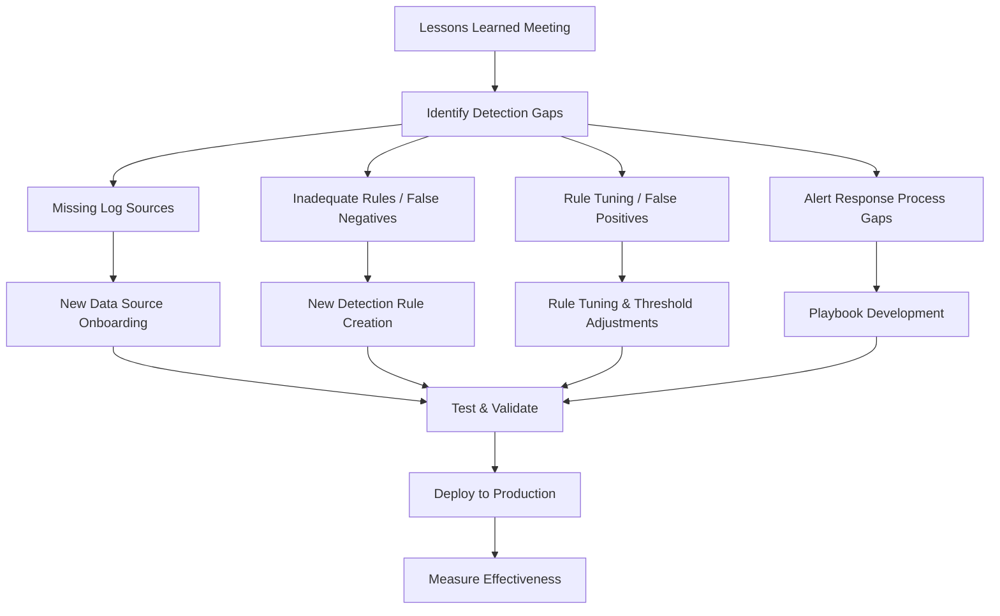
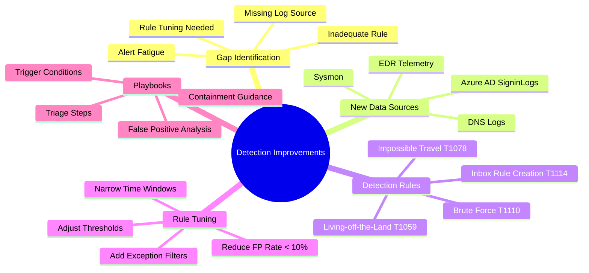
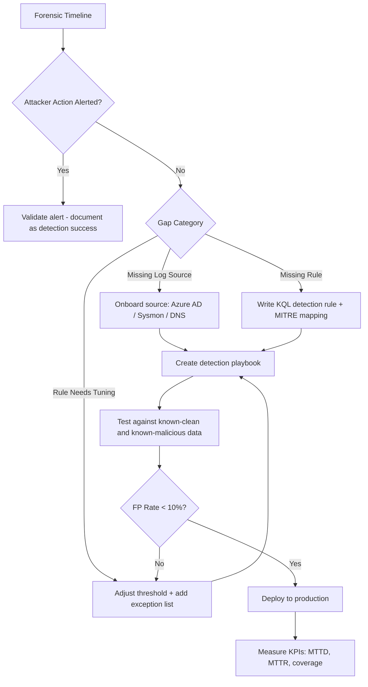

# Proposing Monitoring and Detection Improvements

## TCM Exam Objectives

By mastering this module, you will be prepared to:

1. **Map** forensic findings to detection gap categories: missing log sources, inadequate rules, rule tuning needs, alert fatigue
2. **Prioritize** missing log source onboarding based on detection value and implementation effort
3. **Convert** attacker actions into KQL detection rules with MITRE ATT&CK technique mapping
4. **Tune** existing rules by adding exception filters, adjusting thresholds, and narrowing time windows
5. **Design** detection playbooks with trigger conditions, triage steps, containment guidance, and false positive analysis
6. **Measure** detection improvement effectiveness with KPIs: MTTD, MTTR, detection coverage, false positive rate
7. **Create** rules for living-off-the-land binaries: `certutil`, `bitsadmin`, `mshta`, `powershell -enc`
8. **Implement** exception lists for known service accounts and benign processes
9. **Document** detection improvements with before-and-after query comparisons
10. **Integrate** new log sources (Azure AD SigninLogs, M365 Audit, Sysmon, EDR) into the SIEM pipeline

Post-incident monitoring and detection improvements are the primary strategic output of the lessons-learned phase. Every incident reveals detection gaps — events that the SIEM missed, rules that generated false negatives, or log sources that were not ingested. The goal is to convert the forensic timeline into concrete detection rules, new data sources, and tuning recommendations that prevent the same attack path from succeeding again.

- Converting forensic findings into detection rules
- Identifying and onboarding missing log sources
- Tuning existing rules to reduce false positives
- Creating detection playbooks and alert response procedures
- Measuring detection improvement effectiveness



## Step 1 — Identify Detection Gaps

Start by creating a timeline of attacker actions and identify at which points the SIEM failed to generate an alert.

### Gap Identification Template

| Timestamp | Attacker Action | SIEM Alerted? | Gap Type |
|---|---|---|---|
| 10:00:00 | Phishing email sent to target | Yes (email security) | Alert received |
| 10:05:00 | User clicked link, entered credentials | No (no credential entry monitoring) | **Missing log source** |
| 10:10:00 | Attacker logged in from Nigeria (impossible travel) | No (no geo-anomaly rule) | **Missing rule** |
| 10:15:00 | Inbox rule created for email forwarding | Yes (O365 audit enabled) | Alert received |
| 10:20:00 | Attacker downloaded 500 files from OneDrive | Yes (mass download rule) | Alert received |
| 10:25:00 | Data exfiltrated to external IP | No (outbound volume threshold too high) | **Rule tuning needed** |

**Common Gap Categories:**
- **Missing Log Source:** The data never reached the SIEM.
- **Inadequate Rule:** The data exists but no rule was written for this pattern.
- **Rule Tuning Needed:** The rule exists but thresholds are too high, generating false negatives.
- **Alert Fatigue:** The rule generates too many false positives, causing the analyst to miss real incidents.

## Step 2 — Onboard Missing Log Sources

For each missing log source, create an onboarding plan:

| Log Source | How to Onboard | Priority | Effort |
|---|---|---|---|
| **M365 Unified Audit Log** | Enable audit logging in Security & Compliance Center | High | Low |
| **Azure AD Sign-in Logs** | Stream to SIEM via Diagnostic Settings | High | Low |
| **Windows Event Log (Security)** | Enable via GPO, deploy WinRM or AzMon agent | High | Medium |
| **Sysmon** | Deploy via GPO, configure for process/network logging | High | Medium |
| **DNS Logs** | Enable debug logging, configure forwarder | Medium | Medium |
| **DHCP Logs** | Enable logging on DHCP server, ship with syslog | Medium | Low |
| **CloudTrail (AWS)** | Create trail, stream to S3, ingest via SIEM connector | High | Low |
| **EDR Telemetry** | Ensure EDR API integration is configured | High | Low |

**Example Implementation — Azure AD to Sentinel:**

```
Azure AD -> Diagnostic Settings -> Log Analytics Workspace -> Sentinel
```

This is a 15-minute configuration that provides SigninLogs, AuditLogs, and IdentityProtection events 【turn0search2】【turn0search5】.

## Step 3 — Create New Detection Rules

Convert forensic observations into detection logic.

### Rule Template

```kusto
// RULE NAME: Brute Force Followed by Successful Login
// DESCRIPTION: Detects brute-force pattern with password spray success
// MITRE: T1110, T1110.003
let failure_threshold = 10;
let time_window = 5m;
SigninLogs
| where TimeGenerated > ago(1h)
| where ResultType != 0
| summarize Failures = count() by UserPrincipalName, IPAddress
| where Failures >= failure_threshold
| join kind=inner (
    SigninLogs
    | where TimeGenerated > ago(1d)
    | where ResultType == 0
    | project UserPrincipalName, IPAddress, SuccessfulLoginTime = TimeGenerated
) on UserPrincipalName, IPAddress
| project UserPrincipalName, IPAddress, Failures, SuccessfulLoginTime
```

### Conversion Examples

| Forensic Finding | Detection Rule |
|---|---|
| Attacker used PowerShell -enc | Alert on PowerShell with base64-encoded argument (EventID 4104) |
| Attacker registered OAuth app | Alert on `ConsentToApplication` with high-risk permissions |
| Attacker used living-off-the-land binaries | Alert on `certutil -urlcache`, `bitsadmin /transfer`, `mshta` -->
| Attacker created local admin | Alert on EventID 4732: member added to Administrators |
| Attacker used RDP from non-corp IP | Alert on EventID 4624 Logon Type 10 from IP outside corp range |



## Step 4 — Tune Existing Rules

Rule tuning reduces false positives while maintaining detection coverage.

### Tuning Methodology

1. **Collect baseline data:** Capture 30 days of alert telemetry.
2. **Identify noise sources:** Common benign patterns that trigger false alerts.
3. **Add exception filters:** Exclude known-good processes, IPs, or users.
4. **Adjust thresholds:** Increase or decrease event count thresholds.
5. **Narrow time windows:** Reduce the aggregation window where appropriate.
6. **Re-test:** Run the updated rule against historical data to verify.

### Tuning Example

**Before:**
```kusto
SigninLogs
| where ResultType != 0
| summarize FailureCount = count() by UserPrincipalName
| where FailureCount > 5
// Fires for every user with 6+ failed logins, including forgotten-password scenarios
```

**After:**
```kusto
// Exclude MFA-denied (ResultType 500121) which is user mistake
// Exclude known service accounts
let excluded = dynamic(["svc-backup", "svc-monitor"]);
SigninLogs
| where ResultType != 0
| where ResultType != 500121
| where UserPrincipalName !in (excluded)
| summarize FailureCount = count(), IPs = make_set(IPAddress) by UserPrincipalName
| where FailureCount > 10 and array_length(IPs) < 3
// Fires for targeted attacks but not for simple password typos
```

📌 **Exam Tip:** Every detection rule should have a corresponding playbook with triage steps. In the PSAA, include at least one playbook in your report appendix showing: rule name, severity, trigger conditions, triage steps, containment guidance, and common false positive causes. This shows practical operationalization of your recommendations.

## Step 5 — Create Detection Playbooks

Each new or tuned rule should have a corresponding playbook.

### Playbook Template

| Section | Content |
|---|---|
| **Rule Name** | Impossible Travel Detection |
| **Severity** | High |
| **Trigger** | User logged in from two locations > 500 km apart within 1 hour |
| **Data Sources** | SigninLogs, AuditLogs, OfficeActivity |
| **Triage Steps** | 1. Verify user was aware of both logins 2. Check IP geolocation accuracy 3. Check DeviceInfo for trusted device |
| **Containment Guidance** | Disable account if malicious, revoke tokens |
| **MITRE ATT&CK** | T1078.004 - Cloud Accounts |
| **False Positive Causes** | Corporate VPN with POP at multiple sites |

## Measuring Effectiveness

Track improvements with simple KPIs:

| KPI | Baseline (Pre-Incident) | Target (Post-Improvement) |
|---|---|---|
| Mean time to detect (MTTD) | 12 hours | < 1 hour |
| Mean time to respond (MTTR) | 4 hours | < 30 minutes |
| Detection coverage by MITRE techniques | 25% | > 50% |
| False positive rate per rule | 50% | < 10% |
| Log source coverage | 60% of critical assets | > 95% |

<details>
<summary>Sample Detection Improvement Report</summary>

**Incident:** BEC via Phishing | **Date:** 2025-06-01

**Detection Gaps Found:**
1. No rule for inbox rule creation (despite having OfficeActivity logs)
2. Impossible travel rule existed, but threshold was set to 2,000 km within 1 hour — attacker rotated through VPN within 800 km radius
3. Azure AD sign-in logs were not ingested at all

**Improvements Implemented:**
1. **Deployed rule:** "Suspicious Inbox Rule Created" — alerts on any `New-InboxRule` or `Set-InboxRule` with external forwarding
2. **Tuned rule:** Impossible travel threshold reduced from 2,000 km to 500 km within 1 hour. Excluded known VPN egress IPs
3. **New data source:** Azure AD SigninLogs and AuditLogs streaming to SIEM within 2 days

**Validation:**
- Re-ran forensic timeline against new rules: 3 of 5 attacker actions now detected (vs 0 previously)
- False positive rate for tuned impossible travel rule: 5% (was 0% before, but because nothing fired at all)
</details>



## Recap

Monitoring and detection improvements are the primary strategic output of the post-incident phase. Map forensic findings to detection gaps and prioritize missing log sources, new rules, and rule tuning. New rules should follow a standard template with MITRE ATT&CK mapping. Tuning reduces false positives while tightening thresholds for real threats. Create playbooks for every new rule. Measure effectiveness with KPIs for MTTD, MTTR, detection coverage, and false positive rate.
