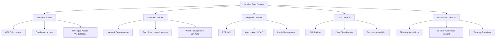
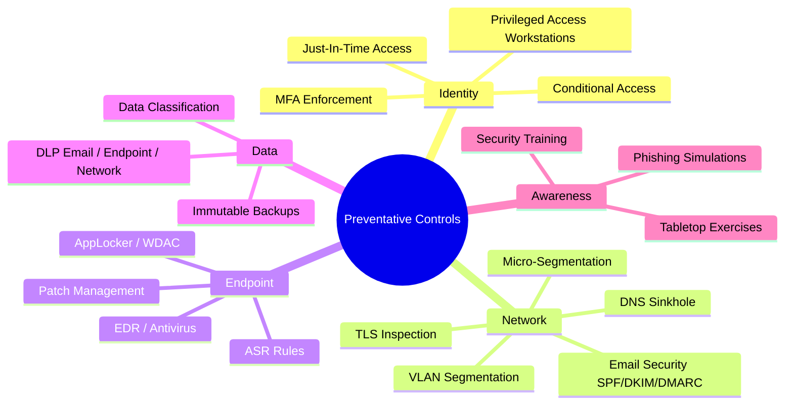
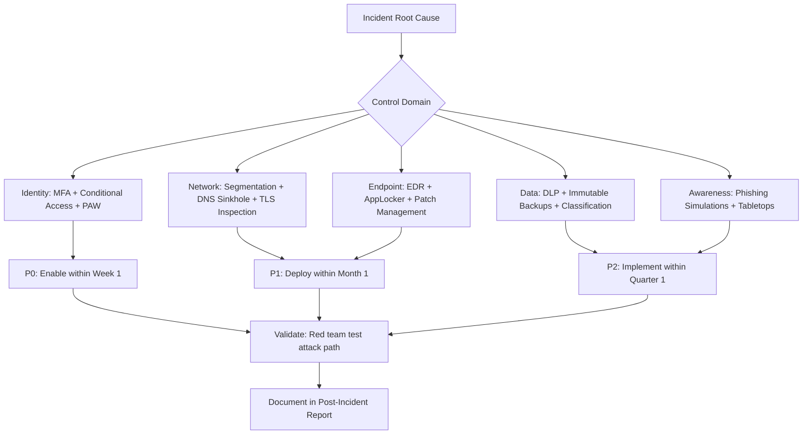

# Recommending Preventative Security Controls

## TCM Exam Objectives

By mastering this module, you will be prepared to:

1. **Categorize** preventative controls into identity, network, endpoint, data, and awareness domains
2. **Apply** the P0-P3 prioritization framework: urgency, impact, effort, and cost
3. **Recommend** MFA enforcement as the single most effective control against credential-based attacks
4. **Design** Conditional Access policies to block legacy authentication and require MFA for external access
5. **Propose** network segmentation with VLANs, micro-segmentation, and zero trust network access
6. **Suggest** endpoint controls: AppLocker, WDAC, ASR rules, and EDR deployment
7. **Recommend** backup immutability with WORM storage and air-gapped networks
8. **Implement** DLP policies for email, endpoint, and network data loss prevention
9. **Create** a phased implementation roadmap with week 1, month 1, and quarter 1 deliverables
10. **Build** cost-benefit analysis for each recommendation showing ROI against incident costs

Preventative security controls are the proactive measures that reduce the likelihood or impact of future incidents. Unlike detection improvements that help you see an attack, preventative controls stop the attack from succeeding in the first place. These recommendations are the most actionable deliverables in a post-incident report because they directly reduce risk. A well-prioritized list of preventative controls demonstrates strategic thinking beyond the immediate incident.

- Preventative control categories: identity, network, endpoint, data, and awareness
- Prioritization framework (urgency, impact, effort)
- Specific technical and procedural controls
- Cost-benefit and implementation roadmap

## Control Prioritization Framework

Not all controls can be implemented at once. Use a risk-based prioritization:

| Priority | Criteria | Examples |
|---|---|---|
| **P0 — Critical** | Directly prevented this incident, low cost, quick to implement | Enabling MFA, deploying a simple firewall rule |
| **P1 — High** | Would prevent similar incidents but requires moderate effort | Network segmentation, Conditional Access policies |
| **P2 — Medium** | Reduces blast radius or increases detection depth | AppLocker, DLP policies, endpoint hardening baselines |
| **P3 — Low** | Defense-in-depth, long-term security posture improvements | Zero Trust migration, full data classification |

**PSAA Guidance:** Recommend P0 and P1 controls in the exam report. P2 and P3 are acceptable as supplementary recommendations 【turn0search1】【turn0search6】.

## Identity and Access Controls

📌 **Exam Tip:** MFA blocks 99.9% of credential-based attacks. In the PSAA, always lead with MFA as your primary preventative recommendation. Include specific implementation guidance: enable via Conditional Access, block legacy authentication, and require MFA for all external access. Vague recommendations like "improve security" earn zero points.

### Multi-Factor Authentication (MFA)

The single most effective preventative control. MFA blocks over 99.9% of password-based attacks.

| Implementation | Effort | User Impact |
|---|---|---|
| **Microsoft 365 MFA** — Enable via Conditional Access | Low (hours) | Medium (users enroll authenticator) |
| **Azure AD Security Defaults** — Quick toggle | Low (minutes) | Low (enforced for all users) |
| **Windows Hello for Business** — PIN/biometric auth | Medium (GPO/config) | Low (better UX than passwords) |
| **FIDO2 Security Keys** — Phishing-resistant | High (hardware cost) | Low (tap-to-login) |

### Conditional Access Policies

Recommended policies (implement in report mode first):

1. **Block legacy authentication** (IMAP, POP, legacy Exchange ActiveSync).
2. **Require MFA for all external access** (non-corp IPs).
3. **Require compliant device** for access to sensitive apps.
4. **Block high-risk sign-ins** using Identity Protection.
5. **Require MFA for privileged roles** (Global Admin, Exchange Admin).

### Privileged Access Controls

| Control | Description | MITRE Mapping |
|---|---|---|
| **Privileged Access Workstations (PAW)** | Dedicated hardened workstations for admin tasks | T1078 — prevents credential harvesting |
| **Just-in-Time (JIT) Access** | Temporary elevation for admin tasks via PIM | T1098 — reduces standing privilege |
| **Separate Admin Accounts** | Dedicated admin accounts, never used for email/web | T1078 — makes credential theft visible |
| **Tier 0 / Tier 1 / Tier 2 Model** | Restrict which accounts can access which resources | T1021 — prevents lateral movement |

## Network Controls

### Segmentation

| Type | Implementation | What It Prevents |
|---|---|---|
| **VLAN-based** | Switch-level isolation between departments | Lateral movement from infected workstation to accounting server |
| **Micro-segmentation** | Per-workload firewall rules (NSX, Azure vNet) | Pivot from web server to database server |
| **Zero Trust** | Identity-aware, per-request access control (ZTNA) | Reliance on network trust for security |

### Web and DNS Filtering

- **DNS Sinkhole:** Block known-malicious domains at the DNS level.
- **Web Proxy:** Filter by URL category, block newly registered domains.
- **TLS Inspection:** Decrypt and inspect outbound HTTPS traffic.
- **Block known-bad IPs:** Automate IP block via threat intelligence feeds.

### Email Security

- **SPF/DKIM/DMARC:** Prevent domain spoofing.
- **Safe Links / Safe Attachments:** Pre-click URL scanning.
- **Anti-phishing policies:** Impersonation protection for executives.
- **External email warning banners:** Label all external emails.

## Endpoint Controls

### Application Control

| Technology | How It Works | Prevention |
|---|---|---|
| **AppLocker** | Whitelist approved executables, scripts, installers | Blocks unapproved malware execution |
| **Windows Defender Application Control (WDAC)** | Kernel-level code integrity policy | Blocks unsigned drivers and executables |
| **Attack Surface Reduction Rules (ASR)** | Built-in Windows Defender rules | Blocks Office child process creation, PS1 execution from Office |

### Endpoint Detection and Response (EDR)

- Deploy EDR on all endpoints (workstations and servers).
- Enable real-time response capabilities (isolate, kill, collect).
- Configure automated response playbooks for common detections.

### Patch Management

| Component | Recommendation |
|---|---|
| **Automation** | Use SCCM, WSUS, or Intune for patch deployment |
| **Critical patch SLA** | Deploy critical patches within 48 hours of release |
| **Vulnerability scanning** | Weekly internal scans, quarterly external |
| **Zero-day mitigation** | Deploy virtual patches (WAF, IDS rules) while waiting for vendor patch |

## Data Protection Controls

### Data Loss Prevention (DLP)

| DLP Type | What It Prevents | Examples |
|---|---|---|
| **Email DLP** | Sensitive data sent via email | Credit card numbers, PII in email body |
| **Endpoint DLP** | Data copied to USB, cloud uploads | File copy to personal OneDrive, USB drive |
| **Network DLP** | Data exfiltration over network protocols | Large outbound data transfer to unknown IP |

### Backup Immutability

Attackers target backups. Modern ransomware deletes or encrypts backup files.

**Immutable Backup Requirements:**
- Write-once-read-many (WORM) storage.
- Air-gapped or isolated backup network.
- Test restore quarterly.
- MFA on backup admin accounts.
- Offline / tape copy for critical systems.

## Awareness and Training Controls

### Phishing Simulations

| Frequency | Target Audience | Success Metric |
|---|---|---|
| Monthly | All employees | Click rate < 5% |
| Quarterly | High-risk departments (finance, exec) | Report rate > 50% |
| Annual | Phishing-resistant training | Re-test pass rate > 90% |

### Tabletop Exercises

Run exercise scenarios that mirror the recent incident:
- Ransomware tabletop (quarterly).
- BEC / phishing tabletop (quarterly).
- Insider threat tabletop (annually).

📌 **Exam Tip:** Use the P0-P3 prioritization framework in your PSAA report to show strategic thinking. P0 (critical, low effort) controls like enabling MFA should be recommended for week 1. P3 (defense-in-depth) controls like full data classification can be deferred to quarterly roadmaps. This demonstrates realistic, risk-based planning.

## Implementation Roadmap

| Timeline | Controls |
|---|---|
| **Week 1** | Enable MFA for all external access. Block legacy auth. |
| **Week 2** | Deploy DNS sinkhole. Block known-bad IPs on firewall. |
| **Week 3** | Deploy EDR if not present. Configure app control policies. |
| **Month 1** | Implement Conditional Access policies. Begin network segmentation. |
| **Month 2** | Deploy PAWs for IT admins. Enable JIT / PIM. |
| **Quarter 1** | Implement DLP policies. Achieve backup immutability. |
| **Quarter 2** | Complete network micro-segmentation. Full data classification. |

Cost-Benefit Analysis Example

**Recommendation:** Deploy Azure AD Conditional Access with MFA for all external users.

**Costs:**
- Licensing: Azure AD P1 ($6/user/month) needed for Conditional Access.
- Implementation: 8 hours of engineer time.
- User training: 2 hours per user for MFA enrollment.
- Help desk: Estimated 5% increase in call volume during first month.

**Benefits:**
- Blocks 99.9% of credential-based attacks (Microsoft research).
- The recent BEC incident caused $200k in financial impact. MFA would have prevented it entirely.
- Reduced account compromise detection and response effort by estimated 40 hours/year.

**ROI:**
- Annual cost: 500 users × $6 × 12 = $36,000 + labor.
- Incident cost avoided: $200,000 (conservative, one incident).
- **ROI in year 1:** ~400%.

**Recommendation:** Highly recommended. Implement within 1 week.

## Recap

Preventative controls stop attacks before they succeed. Prioritization follows a P0-P3 framework based on urgency, impact, and effort. Identity controls — especially MFA and Conditional Access — provide the highest risk reduction. Network segmentation and DNS filtering prevent lateral spread and C2 communication. Endpoint controls like AppLocker and EDR block malware execution. DLP and immutable backups protect data integrity. Awareness training reduces the human factor. The post-incident report should include a prioritized implementation roadmap with cost-benefit analysis where possible.
