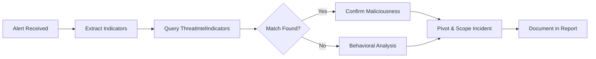
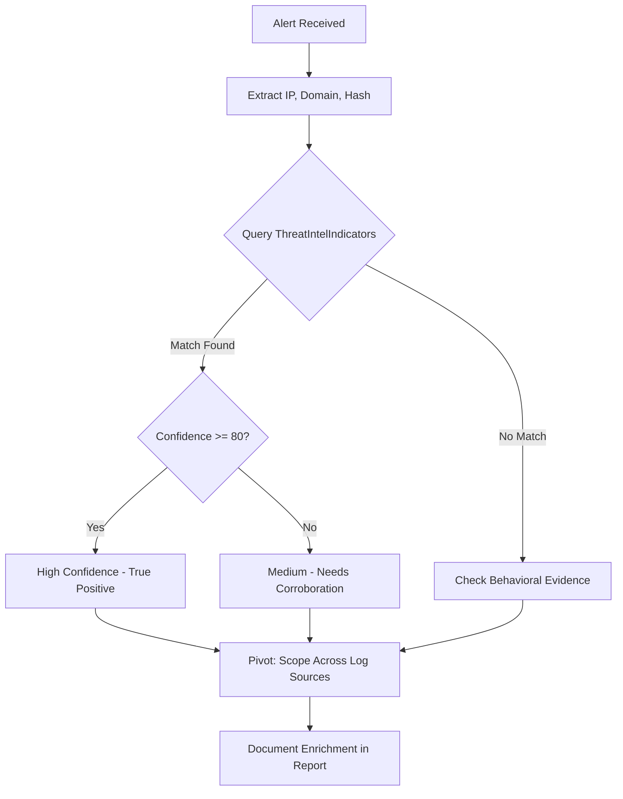
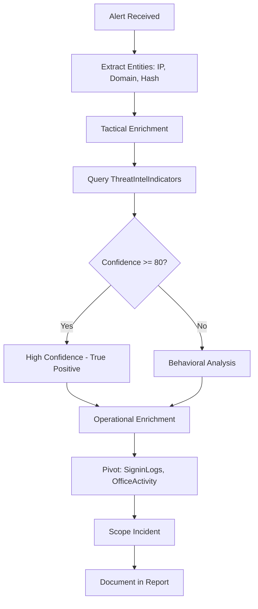

# Enriching Alerts with Threat Intelligence

## TCM Exam Objectives

- Apply the three-step enrichment framework: Extract Indicators, Query Threat Intelligence, Pivot and Expand
- Query the `ThreatIntelIndicators` table in Sentinel for IP, domain, URL, and file hash enrichment
- Write KQL enrichment queries that join alert data with threat intelligence tables
- Use the Sentinel Investigation Graph and Entity Pages for visual enrichment
- Correlate sign-in logs with threat intelligence using KQL `join` operations
- Distinguish between tactical enrichment (quick IOC check) and operational enrichment (campaign/actor context)
- Enrich multiple indicators simultaneously using KQL `datatable` and `in` operators
- Document enrichment results including source, confidence score, and threat type
- Identify false positives by cross-referencing TI results with behavioral evidence
- Recommend automated enrichment playbooks for continuous alert enhancement

Alert enrichment is the process of augmenting an alert's data with additional information from external or internal sources to provide context, validate maliciousness, and guide the response. In the PSAA exam, enrichment serves three critical functions: triage acceleration, investigation pivoting, and report evidence. It transforms a sparse alert into a well-evidenced incident.

- Three-step enrichment framework
- Sentinel threat intelligence tables
- KQL enrichment queries
- Investigation Graph and Entity Pages





> 📌 **Exam Tip:** Enrichment doesn't stop at confirming malice. After matching an IP in `ThreatIntelIndicators`, pivot to `SigninLogs`, `OfficeActivity`, and `CommonSecurityLog` to find all activity tied to that IOC. This scoping step is what separates basic enrichment from thorough investigation.

## Sentinel Threat Intelligence Tables

Microsoft Sentinel has transitioned to a STIX-based data model. The primary table is `ThreatIntelIndicators` with key columns: `IndicatorValue`, `IndicatorType` (ipv4-addr, domain-name, url, file-sha256), `ThreatType`, `ConfidenceScore` (0-100), `ThreatSeverity`, `Description`, `Tags`, and `ValidFrom`/`ValidUntil` 【turn0search1】.

Feeds that populate this table include Microsoft Threat Intelligence (built-in, high-quality), open-source feeds (AlienVault OTX, MISP), commercial feeds (Recorded Future, Anomali, CrowdStrike), and internal IOCs from past incidents.

## Three-Step Enrichment Framework

### Step 1: Extract Indicators from the Alert

Every alert comes with entities. In the Sentinel incident blade, the Entities tab lists IPs, accounts, hosts, domains, and file hashes directly.

| Entity Type | Example | Where Enriched |
| :--- | :--- | :--- |
| IP Address | `185.220.101.34` | `ThreatIntelIndicators` where `IndicatorType == "ipv4-addr"` |
| Domain | `phish.xyz` | `ThreatIntelIndicators` where `IndicatorType == "domain-name"` |
| URL | `https://evil.com/mal.doc` | `ThreatIntelIndicators` where `IndicatorType == "url"` |
| File Hash | `d41d8cd98f00b204e...` | `ThreatIntelIndicators` where `IndicatorType == "file-sha256"` |

> 📌 **Exam Tip:** Use the `datatable` operator in KQL to enrich multiple indicators in a single query. This is efficient when an alert contains several IPs, domains, or hashes. A single `where IndicatorValue in (AlertIndicators)` query can confirm or rule out all indicators at once.

### Step 2: Query Threat Intelligence

```kusto
// Basic IP reputation check
ThreatIntelIndicators
| where TimeGenerated > ago(90d)
| where IndicatorValue == "185.220.101.34"
| project IndicatorValue, IndicatorType, ThreatType, ConfidenceScore, Description, Tags
```

```kusto
// Check multiple indicators at once
let AlertIndicators = datatable (Indicator: string) ["185.220.101.34", "phish.xyz", "d41d8cd98f00b204e..."];
ThreatIntelIndicators
| where IndicatorValue in (AlertIndicators)
| project IndicatorValue, IndicatorType, ThreatType, ConfidenceScore, Description
```

If any indicator returns a high `ConfidenceScore` with `ThreatType` "Malicious," you have immediate confirmation of a true positive. This is tactical enrichment—quick, definitive, and directly usable in your IOC table 【turn0search2】.

### Step 3: Pivot and Expand

Enrichment does not stop at confirmation. Hunt for the same IOC across other log sources to scope the incident. Pull related threat actor or campaign info from `ThreatIntelObjects`. Assess historical exposure:

```kusto
SigninLogs | where IPAddress == "185.220.101.34" and TimeGenerated > ago(30d)
```

## Advanced KQL Enrichment Queries

```kusto
// Enrich sign-in alert with TI in one query
let AlertIP = "45.67.89.123";
SigninLogs
| where TimeGenerated > ago(1h)
| where IPAddress == AlertIP
| where ResultType != 0
| summarize FailureCount = count(), TargetedUsers = make_set(UserPrincipalName, 10) by IPAddress
| join kind=leftouter (
    ThreatIntelIndicators
    | where IndicatorType == "ipv4-addr"
    | project IPAddress=IndicatorValue, ThreatType, ConfidenceScore, Description
) on IPAddress
| project IPAddress, FailureCount, TargetedUsers, ThreatType, ConfidenceScore, Description
```

```kusto
// Enrich C2 beaconing alert
let SuspiciousIP = "192.0.100";
CommonSecurityLog
| where TimeGenerated > ago(3h)
| where DestinationIP == SuspiciousIP
| where CommunicationDirection == "Outbound"
| summarize ConnectionCount = count(), TotalBytes = sum(SentBytes) by SourceIP, DestinationIP
| join kind=leftouter (
    ThreatIntelIndicators
    | where IndicatorType == "ipv4-addr"
    | project DestinationIP=IndicatorValue, ThreatType, ConfidenceScore, Description, Tags
) on DestinationIP
```

## Investigation Graph and Entity Pages

When you open an incident in Sentinel and go to the Investigation tab, a graph connects the alert to its entities. Click an IP entity to see a side pane with threat intelligence matches. A red TI icon indicates the IP is flagged. Screenshot this pane for your report evidence 【turn0search3】.

Double-clicking an entity opens a full Entity Page aggregating:
- Timeline of activity for that entity
- Related alerts
- Threat intelligence matches
- Associated events from connected log tables

This is a pre-built enrichment dashboard. Screenshots from the entity page are acceptable and encouraged in your report.

<details>
<summary>Automated Enrichment with Playbooks</summary>

In a real SOC, automation rules and playbooks (Azure Logic Apps) enrich alerts as they fire. A typical flow:

1. Analytics rule fires, alert is created
2. Automation rule triggers, calling a playbook
3. Playbook extracts entities (IPs, domains, hashes)
4. Queries ThreatIntelIndicators or external APIs (VirusTotal)
5. Adds a comment to the alert with enrichment results
6. Optionally modifies alert severity if a critical indicator is found

**PSAA Report Mention:** "Implement an automation rule that enriches all sign-in alerts with IP reputation data from the ThreatIntelIndicators table. This would automatically annotate high-confidence malicious IPs, reducing triage time by an estimated 30%."
</details>

## Best Practices and Pitfalls

| Practice | Why | Pitfall | Why |
| :--- | :--- | :--- | :--- |
| Enrich early in triage | Instant yes/no on malice | Assuming no hit = benign | Zero-day infrastructure won't be in any feed |
| Enrich all related entities | The hash may be stronger signal than the IP | Relying on legacy table names | Use `ThreatIntelIndicators`, not deprecated `ThreatIntelligenceIndicator` |
| Combine TI with behavioral analysis | Layered context strengthens evidence | Ignoring confidence scores | Low confidence (<50) may be false positive |
| Document every enrichment step | Proves you didn't guess | Enriching only technical indicators | TTPs and actor profiles enrich report quality |

## Enriching a Phishing Alert: Walkthrough

**Scenario:** Medium severity alert: "Suspicious email link clicked - user jsmith." Entities include URL `https://login.contoso.xyz` and user IP `107.178.192.50`.

**Step 1:** Extract indicators: domain `login.contoso.xyz`, user IP.

**Step 2:** Query ThreatIntelIndicators for the domain:
- ThreatType: "Phishing"
- ConfidenceScore: 92
- Tags: "Credential Theft", "Targeting Microsoft 365"

The user IP returns no results (not malicious itself), but the domain confirms phishing.

**Step 3:** Pivot to OfficeActivity for post-click activity:
```kusto
OfficeActivity
| where TimeGenerated > ago(1h)
| where UserId == "jsmith@domain.com"
| where Operation in ("New-InboxRule", "Set-InboxRule")
```

You find a new inbox rule forwarding to an external address. The enrichment confirmed the phishing vector; the pivot discovered the exfiltration method.



## Recap

Alert enrichment turns a suspicious IP from a question mark into a confirmed threat, a suspicious domain into known phishing infrastructure, and a hash into a documented malware family 【turn0search1】【turn0search2】【turn0search3】. Master the KQL patterns in this module, use the investigation graph for visual confirmation, and document all enrichment results. Every minute saved with quick enrichment is a minute spent on deeper analysis and a higher-quality report.
