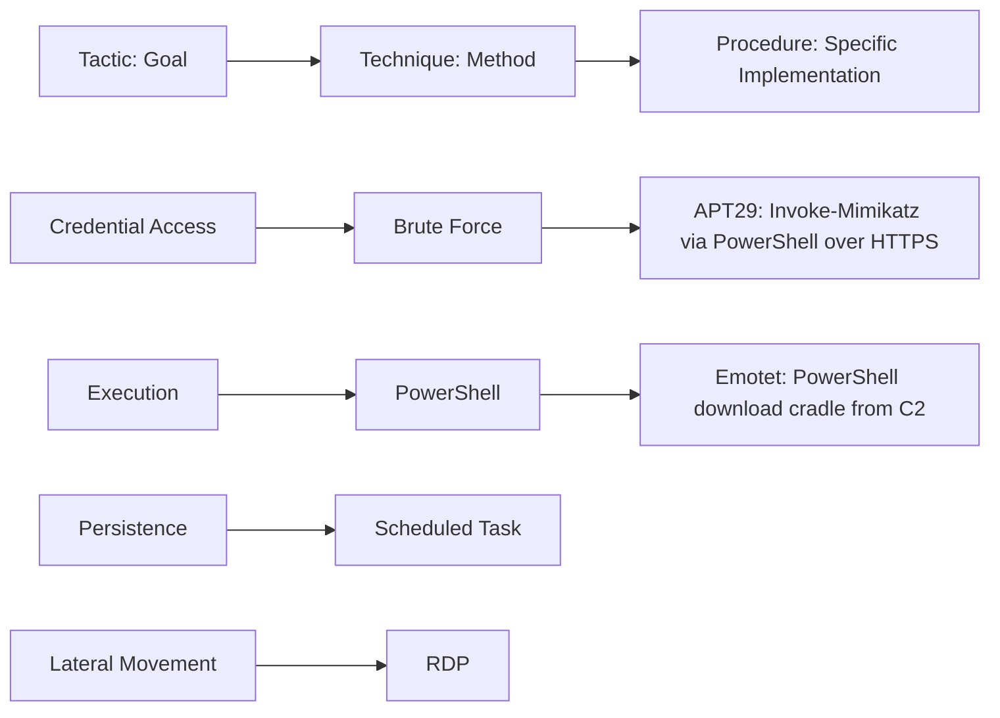
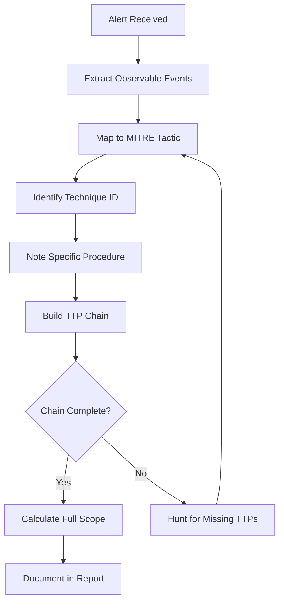
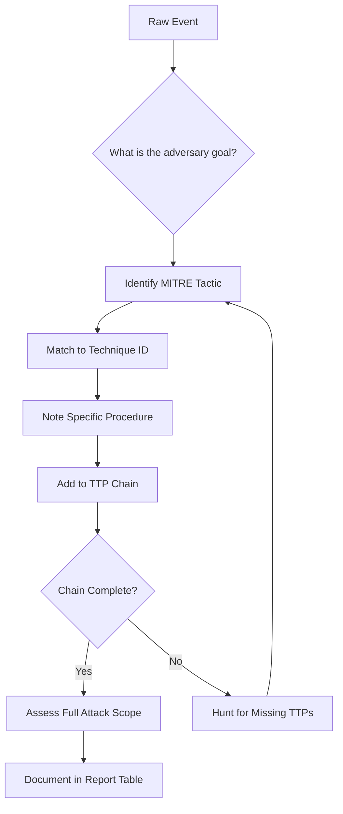

# Understanding Adversary Tactics, Techniques, and Procedures (TTPs)

## TCM Exam Objectives

- Distinguish between Tactic (goal), Technique (method), and Procedure (specific implementation) in adversary behavior
- Detect credential access TTPs (T1110 Brute Force, T1003.001 LSASS Memory) using KQL queries
- Identify execution TTPs (T1059.001 PowerShell) through encoded command and suspicious parameter detection
- Hunt for persistence TTPs (T1053.005 Scheduled Task, T1547.001 Registry Run Keys, T1098.005 Mail Forwarding)
- Detect lateral movement TTPs (T1021.001 RDP) using Event ID 4624 LogonType analysis
- Map observed events to MITRE ATT&CK techniques with supporting evidence from log sources
- Build complete TTP chains showing the full attack sequence from initial access to exfiltration
- Document TTP findings in structured tables with tactic, technique ID, observed activity, and evidence
- Apply sub-technique precision when evidence supports it, parent technique when uncertain
- Use TTP-driven investigation workflow to proactively hunt for undetected adversary activity

An IP address is ephemeral; a hash can be changed with a single recompile. What remains consistent across attacks is the behavior—the adversary's Tactics, Techniques, and Procedures (TTPs). In the PSAA exam, you are evaluated on whether you can identify how the attacker moved, what tools they used, and why they chose a particular path. TTP analysis is what separates a script-following Tier 1 analyst from a true investigator.

- TTP layers: Tactic, Technique, Procedure
- Detecting TTPs with KQL
- Mapping observed events to MITRE ATT&CK
- TTP-driven investigation workflow





> 📌 **Exam Tip:** Map TTPs as you investigate, not retroactively. When you see a PowerShell encoded command, immediately tag it as T1059.001. When you see LSASS access, tag it as T1003.001. This real-time mapping keeps your investigation focused and your report structured.

> 📌 **Exam Tip:** Map TTPs as you investigate, not retroactively. When you see a PowerShell encoded command, immediately tag it as T1059.001. When you see LSASS access, tag it as T1003.001. This real-time mapping keeps your investigation focused and your report structured by technique.

## TTP Layers

| Layer | Definition | Example |
| :--- | :--- | :--- |
| Tactic | The why—adversary's high-level goal | Credential Access, Lateral Movement, Exfiltration |
| Technique | The how—general method used | Brute Force, Pass-the-Hash, Remote Desktop Protocol |
| Procedure | The specific implementation | APT29 uses `Invoke-Mimikatz` via PowerShell downloaded from C2 over HTTPS |

In the PSAA, you work mostly at the Technique level, noting Procedures when threat intelligence reveals the specific group 【turn0search1】.

## Detecting TTPs with KQL

> 📌 **Exam Tip:** Focus on the most common PSAA techniques: T1059 (PowerShell), T1003 (Credential Dumping), T1021 (Remote Services), T1547 (Boot/Logon Autostart), T1566 (Phishing), and T1071 (Application Layer Protocol). These appear in the majority of exam scenarios and mastering them gives you the best return on study time.

### Credential Access

**Brute Force (T1110):**
```kusto
SigninLogs
| where TimeGenerated > ago(1h)
| where ResultType != 0
| summarize Attempts = count() by UserPrincipalName, IPAddress
| where Attempts > 10
```

**Password Spray (T1110.003):**
```kusto
SigninLogs
| where TimeGenerated > ago(2h)
| where ResultType != 0
| summarize DistinctUsers = dcount(UserPrincipalName) by IPAddress
| where DistinctUsers > 20
```

**Credential Dumping LSASS (T1003.001):**
```kusto
SecurityEvent
| where EventID == 4688
| where NewProcessName has_any ("procdump.exe", "mimikatz.exe", "rundll32.exe")
| where CommandLine contains "lsass" or CommandLine contains "sekurlsa"
| project TimeGenerated, Computer, NewProcessName, CommandLine
```

### Execution

**PowerShell (T1059.001):**
```kusto
SecurityEvent
| where EventID == 4688
| where NewProcessName has "powershell.exe"
| where CommandLine contains "-enc" or CommandLine contains "IEX" or CommandLine contains "DownloadString"
| project TimeGenerated, Computer, SubjectUserName, CommandLine
```

### Persistence

**Scheduled Task (T1053.005):**
```kusto
SecurityEvent
| where EventID == 4698
| project TimeGenerated, Computer, TaskName = TaskContent, SubjectUserName
```

**Registry Run Keys (T1547.001):**
```kusto
SecurityEvent
| where EventID == 4657
| where ObjectValueName has_any ("Run", "RunOnce")
| project TimeGenerated, Computer, SubjectUserName, ObjectValueName, NewValue
```

**Exchange Mail Forwarding (T1098.005):**
```kusto
OfficeActivity
| where Operation == "New-InboxRule"
| extend ForwardTo = tostring(parse_json(Parameters).ForwardTo)
| where isnotempty(ForwardTo)
| project TimeGenerated, UserId, ForwardTo, ClientIP
```

### Lateral Movement

**Remote Desktop Protocol (T1021.001):**
```kusto
SecurityEvent
| where EventID == 4624
| where LogonType == 10
| where AuthenticationPackageName == "NTLM" or AuthenticationPackageName == "Negotiate"
| project TimeGenerated, Computer, TargetUserName, IpAddress
```

### Collection and Exfiltration

**Mass SharePoint Downloads (T1530):**
```kusto
OfficeActivity
| where Operation == "FileDownloaded"
| summarize FileCount = count() by UserId, ClientIP
| where FileCount > 50
```

**Large Outbound Uploads (T1048):**
```kusto
CommonSecurityLog
| where CommunicationDirection == "Outbound"
| summarize TotalBytesSent = sum(SentBytes) by SourceIP, DestinationIP, DestinationPort
| where TotalBytesSent > 1e9
```

> 📌 **Exam Tip:** Focus on the most common PSAA techniques: T1059 (PowerShell), T1003 (Credential Dumping), T1021 (Remote Services), T1547 (Boot/Logon Autostart), T1566 (Phishing), and T1071 (Application Layer Protocol). These appear in the majority of exam scenarios.

## Mapping Events to ATT&CK

### TTP-Driven Investigation: Walkthrough

**Alert:** "Possible credential dumping - LSASS access detected" on CLIENT01. Process tree shows `cmd.exe` spawned `procdump.exe`.

**Step 1 - Gather all process activity:**
```kusto
SecurityEvent
| where Computer == "CLIENT01"
| where TimeGenerated between (datetime(2024-01-15T09:00:00Z) .. 1h)
| where EventID == 4688
| project TimeGenerated, Process=NewProcessName, CommandLine, SubjectUserName, CreatorProcessId
| order by TimeGenerated asc
```

**Step 2 - Map findings:**

| Time | Event | Tactic | Technique |
| :--- | :--- | :--- | :--- |
| 09:10 | PowerShell downloads procdump.exe | Execution | T1059.001 (PowerShell) |
| 09:10 | File download from suspicious IP | C2 | T1105 (Ingress Tool Transfer) |
| 09:12 | LSASS dump via procdump | Credential Access | T1003.001 (LSASS Memory) |
| 09:15 | File copy to network share | Exfiltration | T1048 (Exfiltration Over Alt Protocol) |

**Step 3 - Check for lateral movement using dumped credentials:**
```kusto
SecurityEvent
| where EventID == 4624
| where SubjectUserName == "svc_backup"
| where TimeGenerated > datetime(2024-01-15T09:12:00Z)
| project TimeGenerated, TargetComputer=Computer, TargetUserName, LogonType
```

Result: `svc_backup` logged into DC01 via RDP (LogonType 10) at 09:30 (T1021.001).

**Step 4 - Final TTP chain:** Execution (T1059.001) → Defense Evasion → Credential Access (T1003.001) → Lateral Movement (T1021.001) → Exfiltration (T1048).

<details>
<summary>Quick Reference: Common Event ID to ATT&CK Mapping</summary>

| Log Source | Event ID / Operation | Technique |
| :--- | :--- | :--- |
| SigninLogs | ResultType != 0, many attempts | T1110 (Brute Force) |
| SecurityEvent | 4624, LogonType 3 | T1021 (Remote Services) |
| SecurityEvent | 4688, `mimikatz.exe` | T1003 (OS Credential Dumping) |
| SecurityEvent | 4732, added to Domain Admins | T1098 (Account Manipulation) |
| SecurityEvent | 4698, unknown scheduled task | T1053.005 (Scheduled Task) |
| OfficeActivity | New-InboxRule | T1114.002 / T1098.005 |
| OfficeActivity | FileDownloaded, bulk | T1530 (Data from Cloud Storage) |
</details>

## Reporting TTPs in the PSAA Report

### MITRE ATT&CK Mapping Section

| Tactic | Technique ID | Technique Name | Observed Activity | Evidence |
| :--- | :--- | :--- | :--- | :--- |
| Execution | T1059.001 | PowerShell | `powershell.exe -enc SQBFAFgAIAAoAE4AZQB3...` | SecurityEvent 4688 on CLIENT01 |
| Credential Access | T1003.001 | LSASS Memory | `procdump.exe -accepteula -ma lsass.exe lsass.dmp` | SecurityEvent 4688 on CLIENT01 |
| Lateral Movement | T1021.001 | RDP | Successful logon of `svc_backup` to DC01 via LogonType 10 | SecurityEvent 4624 on DC01 |
| Exfiltration | T1048 | Exfiltration Over Alt Protocol | `copy lsass.dmp \\fileserver\share\` | SecurityEvent 4688 on CLIENT01 |

If the exact sub-technique is uncertain, use the parent technique and add a note: "Exact sub-technique unconfirmed without Sysmon; likely LSASS dump based on command line."

## Best Practices

Map as you investigate, not retroactively. Use ATT&CK's detection guidance for each technique—the MITRE website suggests data sources and event IDs. Link techniques to raw evidence. Consider sub-techniques when possible. Group multiple tactics if an action serves dual purposes (e.g., an inbox rule is both persistence and collection).

Common pitfalls include ignoring "how" and focusing only on "what," over-mapping every event as a unique technique, confusing tools with techniques (Procdump is a tool, T1003.001 is the technique), and neglecting cloud-side TTPs if the incident involves Azure AD.



## Recap

TTP analysis makes your investigation a story, not a spreadsheet 【turn0search1】【turn0search2】. By mastering MITRE ATT&CK mapping and KQL detection patterns, you can produce a report that demonstrates the highest level of SOC competency: understanding the adversary's mindset. Focus on common techniques: T1059, T1003, T1055, T1047, T1021, T1566, T1218—these appear frequently in PSAA scenarios.
