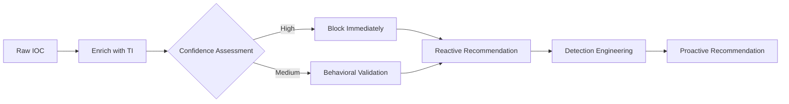
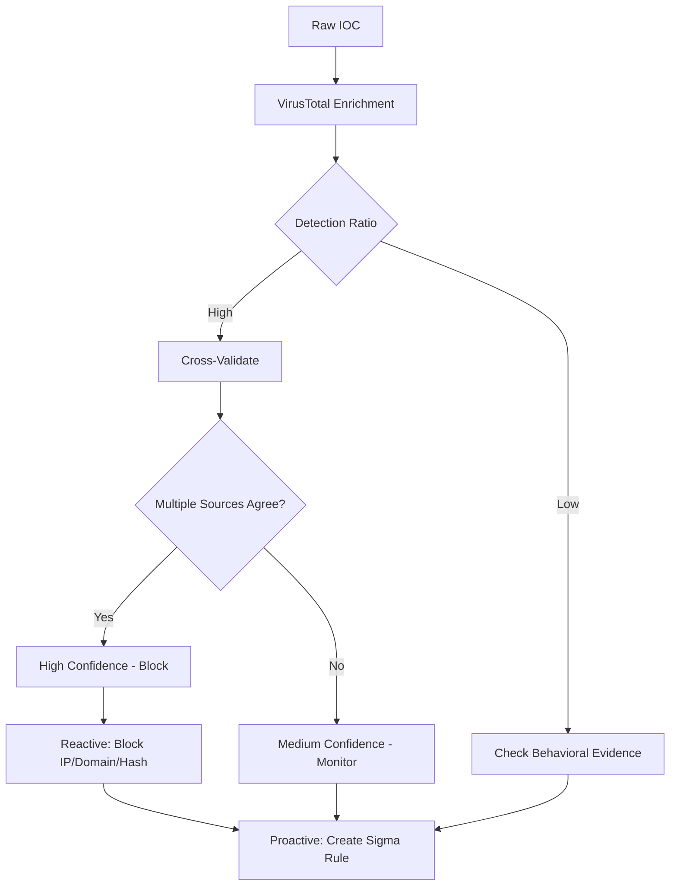
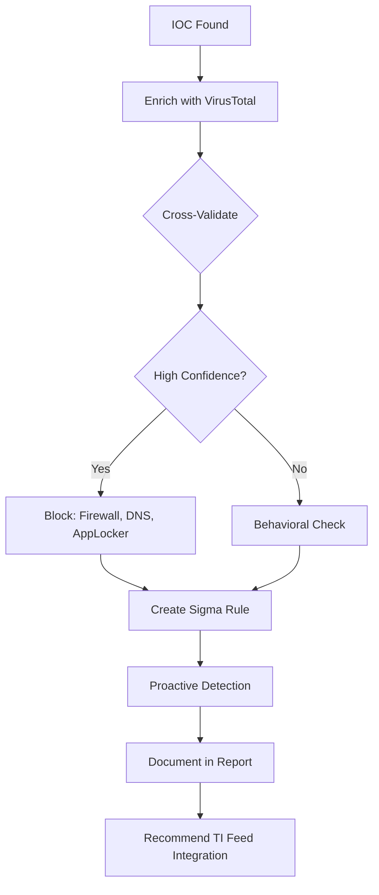

# Using Threat Intelligence for IOC Blocking and Detection

## TCM Exam Objectives

- Apply the Pyramid of Pain to prioritize IOC blocking and detection strategies
- Execute the enrichment workflow from raw IOC extraction to confidence assessment
- Produce blocking recommendations tied to specific security controls (firewall deny, DNS sinkhole, AppLocker)
- Create SIEM-agnostic detection rules using Sigma syntax from TI-derived artifacts
- Write KQL and SPL queries for proactive detection of adversary infrastructure
- Recommend reactive (immediate) and proactive (long-term) countermeasures for every IOC
- Cross-validate IOCs using multiple threat intelligence sources before blocking
- Document complete IOC tables with TI enrichment, blocking action, and detection recommendation columns
- Integrate TI feeds into SIEM threat intelligence lookup tables for automated alert enrichment
- Build behavioral detection rules that climb the Pyramid of Pain beyond simple IP/hash blocking

Threat intelligence is the bridge between finding an IOC and taking meaningful action. The PSAA exam requires you to not only identify IOCs but to enrich them with threat intelligence and translate that context into reactive blocking measures and proactive detection rules. Every IOC you find must lead to a recommendation that makes the environment stronger.

- Pyramid of Pain for prioritization
- Enrichment workflow from raw IOC to action
- Blocking recommendations
- Detection engineering with Sigma rules and SIEM queries



> 📌 **Exam Tip:** Every blocking recommendation must identify the exact IOC, reference the TI source, state the specific security control, and explain the expected outcome. Example: "Add IP 203.0.113.55 to the firewall deny list. Confirmed C2 server via VirusTotal (30/87) and AbuseIPDB (98% confidence)."

## Pyramid of Pain for Prioritization

| Level | IOC Example | Ease of Blocking | Pain to Attacker | PSAA Strategy |
| :--- | :--- | :--- | :--- | :--- |
| TTPs | Spear-phishing with macros | Hardest | Highest | Build behavioral detections |
| Tools | Cobalt Strike, Mimikatz | Moderate | High | Block hashes, create network signatures |
| Network/Host Artifacts | User-Agent strings, registry keys | Moderate | Medium-High | Hunting queries, custom rules |
| Domain Names | `evil-c2[.]xyz` | Easy | Medium | DNS sinkhole, proxy block |
| IP Addresses | `203.0.113.5` | Very easy | Low | Firewall deny, temporary measure |
| File Hashes | `e99a18c...` | Very easy | Trivial | Endpoint block, never alone |

A truly analyst-grade recommendation goes beyond "block the IP": "Because this IP is associated with Emotet (based on TI enrichment), we should also proactively hunt for related persistence mechanisms and create Sigma rules to detect them" 【turn0search1】【turn0search2】.



> 📌 **Exam Tip:** Every blocking recommendation must identify the exact IOC, reference the TI source, state the specific security control, and explain the expected outcome. Example: "Add IP 203.0.113.55 to the firewall deny list. Confirmed C2 server via VirusTotal (30/87) and AbuseIPDB (98% confidence)."

## TI Sources for Enrichment

| Source | What It Provides | Access |
| :--- | :--- | :--- |
| VirusTotal | File/URL scanning, IP/domain reputation | Web interface, API |
| AbuseIPDB | IP reputation, confidence scores | Web interface |
| URLScan.io | URL sandbox with screenshots | Web interface |
| AlienVault OTX | Threat pulses with IOC collections | Web interface |
| MISP | Structured threat intelligence platform | Web UI or API |

## Enrichment Workflow

1. Isolate the IOC from the raw log or alert.
2. Submit to VirusTotal (and AbuseIPDB for IPs). Check Detection tab, Community comments, and Relations.
3. For domains, check Whois registration date (registered 2 days ago is highly suspicious).
4. Cross-validate with a second source.
5. Determine confidence based on enrichment.
6. Document the enrichment in your report.

**Example enrichment note:**
> "IP 203.0.113.55 was enriched via VirusTotal: 12/87 vendors flagged as malicious. AbuseIPDB reported confidence 94% with reports of brute-force and SSH scanning over the past 7 days. The IP is also listed in an OTX pulse related to Emotet. Multi-source intelligence confirms malicious."

## Blocking IOCs

| IOC Type | Blocking Action | Report Example |
| :--- | :--- | :--- |
| Malicious IP | Firewall deny rule | "Add IP 45.33.32.156 to the firewall blocklist. Confirmed C2 server via VirusTotal (30/87) and AbuseIPDB (confidence 98%)." |
| Malicious Domain | DNS sinkhole or proxy block | "Sinkhole domain evil-c2[.]xyz at internal DNS. Registered 2 days ago, used by Emotet per threat intelligence." |
| Malicious URL | Proxy/web gateway block | "Add URL to email and web gateway block policies. Identified as credential harvesting page in phishing campaign." |
| Malicious File Hash | AppLocker/EDR block policy | "Add SHA256 hash to enterprise blocklist. Corresponds to Cobalt Strike beacon payload." |
| Compromised Account | Password reset, session revocation | "Immediate password reset and session revocation for user jsmith. Credential compromise confirmed." |

A proper blocking recommendation identifies the exact IOC, references the TI source, states the specific security control, and explains the expected outcome 【turn0search3】.

> 📌 **Exam Tip:** A truly analyst-grade recommendation goes beyond "block the IP." Pair every blocking action with a proactive detection recommendation. For example: "Block this IP at the firewall AND create a Sigma rule to detect the associated TTP across the environment."

> 📌 **Exam Tip:** A truly analyst-grade recommendation goes beyond "block the IP." Pair every blocking action with a proactive detection recommendation. For example: "Block this IP at the firewall AND create a Sigma rule to detect the associated TTP (encoded PowerShell commands) across the environment."

## Detection Engineering

Blocking is reactive. The real power of threat intelligence is driving proactive detection. Always complement a blocking recommendation with a detection recommendation.

### SIEM Detection Rules

```spl
# Splunk: Detect communication with known C2 IP
index=* (src_ip="203.0.113.55" OR dst_ip="203.0.113.55")
| stats count by host, src_ip, dst_ip, dest_port
```

```kql
# Elastic: Detect DNS queries to malicious domain
event.code : "22" AND dns.question.name : "evil-c2.xyz"
```

### Sigma Rules from TI

Sigma rules are the gold standard for SIEM-agnostic detection. If TI reveals a malware family uses a unique mutex `Global\IAmMalware`:

```yaml
title: Emotet Mutex Detected
status: experimental
logsource:
    product: windows
    category: create_mutex
detection:
    selection:
        MutexName: 'Global\IAmMalware'
    condition: selection
level: critical
```

In your report: "Deploy a Sigma rule to detect the creation of mutex `Global\IAmMalware` across all Windows endpoints, as this artifact is unique to the Emotet malware identified in this incident."

### YARA Rules for File-Level Detection

Where Sigma detects behavior in logs, YARA detects malware in files. Use YARA rules to scan forensic images, endpoint collections, or email attachments for malware families identified during TI enrichment.

```yara
rule emotet_mutex_and_strings {
    meta:
        description = "Detects Emotet malware by mutex and characteristic strings"
        author = "PSAA TI Workflow"
        date = "2024-06-01"
        reference = "TI enrichment from VirusTotal / OTX pulse"
    strings:
        $mutex = "Global\\IAmMalware"
        $reg_key = "Software\\Microsoft\\Windows\\CurrentVersion\\Run\\WindowsUpdate"
        $c2_domain = "evil-c2.xyz"
    condition:
        $mutex or ($reg_key and $c2_domain)
}

rule cobalt_strike_beacon {
    meta:
        description = "Detects Cobalt Strike beacon by named pipe pattern"
        author = "PSAA TI Workflow"
    strings:
        $named_pipe = "\\\\.\\pipe\\MSAgent_" nocase
        $metadata = "MZ" at 0  // PE header
    condition:
        $metadata and $named_pipe
}
```

**Exam workflow:** When TI enrichment identifies a malware family (e.g., "IP 203.0.113.55 is associated with Emotet per VirusTotal"), deploy a YARA rule alongside your Sigma rule. The YARA rule scans endpoints for the malware binary itself; the Sigma rule detects the behavior in logs. Together they provide defense-in-depth detection.

| Rule Type | What It Detects | Where It Runs | PSAA Use Case |
| :--- | :--- | :--- | :--- |
| Sigma | Behavioral patterns in logs | SIEM (Sentinel, Splunk, Elastic) | Alerting on C2 beacon patterns |
| YARA | File signatures and malware strings | Endpoints, forensic images | Scanning for malware binaries |
| KQL / SPL | Cloud and network events | SIEM | Pivoting on IPs, users, hosts |

<details>
<summary>Enrichment at Ingest</summary>

In a mature SOC, TI feeds are integrated directly into the SIEM so events are enriched in real time. Splunk's Threat Intelligence Framework and Elastic's TI integrations automatically compare IPs/domains against curated lists. While you won't configure this during the exam, understanding the concept lets you recommend: "Integrate the C2 IP into our SIEM's threat intelligence lookup table to automatically flag future connections from any host."

Operational dashboards are another form of detection. Build a SIEM dashboard panel showing all traffic to newly registered domains. For the PSAA, if TI identified a pattern (e.g., domains less than 30 days old), recommend creating a dashboard widget surfacing all DNS queries to recently registered domains.
</details>

## Documenting in the PSAA Report

### IOC Table with TI Context

| IOC | Type | Value | TI Enrichment | Blocking | Detection |
| :--- | :--- | :--- | :--- | :--- | :--- |
| IOC #1 | IP | `203.0.113.55` | VirusTotal: 12/87, AbuseIPDB: 94% | Firewall deny list | Splunk alert for connection attempts |
| IOC #2 | IP | `198.51.100.77` | VirusTotal: 45/87, Emotet C2 | Block outbound at firewall | SIEM watchlist, hunt for Emotet mutexes |
| IOC #3 | Domain | `evil-c2[.]xyz` | Registered 2 days ago, 10 vendors flag malicious | DNS sinkhole, proxy block | Sigma rule for newly registered domains |

### Recommendations Structure

**Reactive (Immediate):** Block IPs, domains, file hashes as detailed in IOC table. Force password reset for compromised accounts.

**Proactive (Long-term):** Integrate identified IOCs into SIEM TI feeds for continuous monitoring. Develop Sigma rules based on TTPs and artifacts observed. Recommend periodic threat hunting exercises. Enhance email filtering rules based on TI extracted from email headers.



## Recap

Threat intelligence is what separates a junior analyst who simply looks at logs from a professional analyst who actively improves the organization's security posture 【turn0search1】【turn0search2】【turn0search3】. In the PSAA, every IOC you find must lead to a recommendation that makes the environment stronger. Always pair a blocking recommendation with a detection recommendation, climb the Pyramid of Pain, and document the full TI lifecycle from IOC extraction to recommended action.
