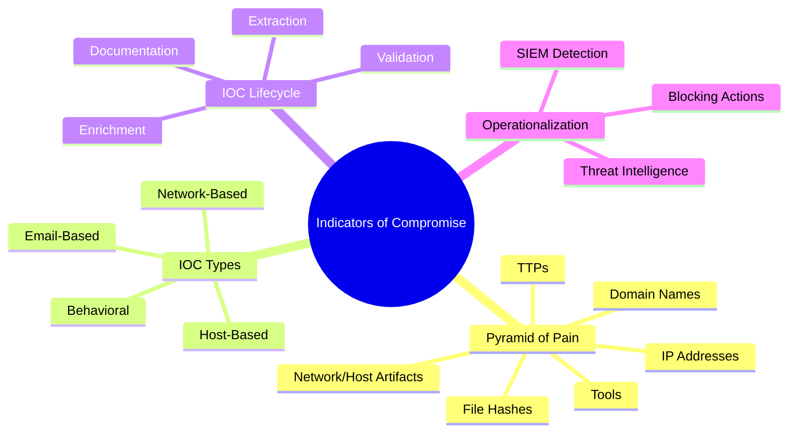
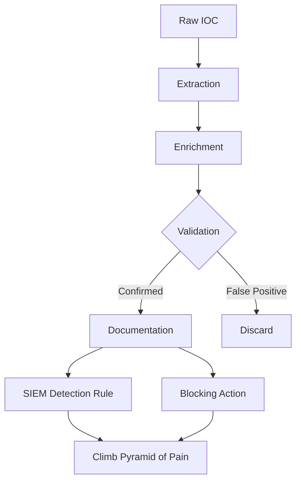
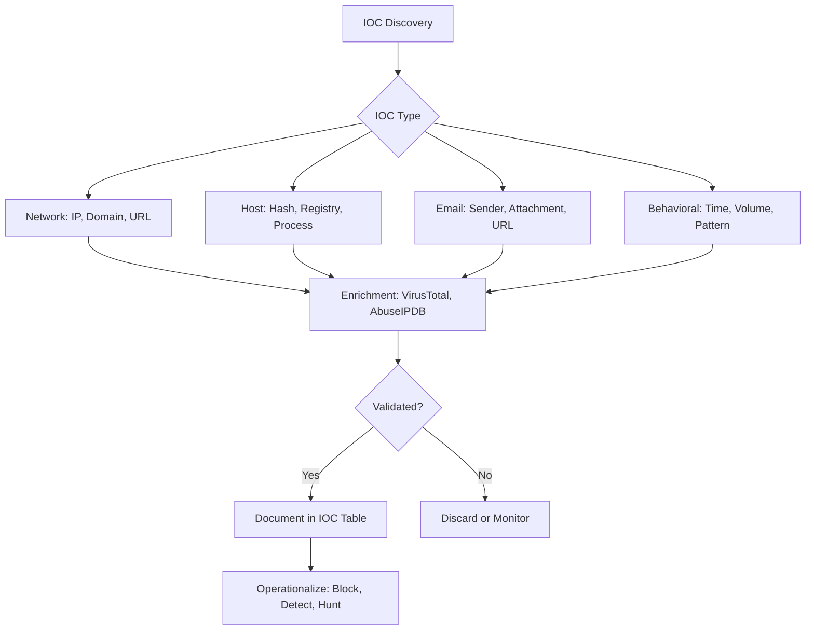

# Indicators of Compromise (IOCs)

## TCM Exam Objectives

- Distinguish between IOCs (reactive) and IOAs (proactive) in PSAA scenarios
- Apply the Pyramid of Pain framework to prioritize IOC response actions
- Extract network-based IOCs (IPs, domains, URLs) from firewall and DNS logs
- Identify host-based IOCs (file hashes, registry keys, process names) from Sysmon and Security Events
- Detect behavioral IOCs (impossible travel, anomalous login times, data exfiltration volume)
- Execute the full IOC lifecycle: extraction, enrichment, validation, and documentation
- Enrich raw IOCs using VirusTotal, AbuseIPDB, and `ThreatIntelIndicators`
- Validate IOCs by correlating across multiple log sources to eliminate false positives
- Document IOCs in a structured table with type, value, context, confidence, and source
- Operationalize validated IOCs into SIEM detection rules and blocking actions

An Indicator of Compromise (IOC) is a piece of forensic data such as a file hash, IP address, domain name, or unusual network activity that signals a potential or confirmed security breach. IOCs are the digital breadcrumbs left behind by attackers, and the PSAA exam expects you to extract, enrich, validate, and document them as part of every investigation.

- IOC vs. IOA distinction
- Pyramid of Pain framework
- Four IOC types: network, host, email, behavioral
- IOC lifecycle: extraction, enrichment, validation, documentation
- Operationalizing IOCs in SIEM detection



> 📌 **Exam Tip:** On the PSAA, always climb the Pyramid of Pain. Simply blocking an IP is the lowest-value response. Map the IOC to a TTP (e.g., "This IP is associated with Emotet C2 (T1071)") to demonstrate senior-level analytical thinking. The higher up the pyramid, the more credit you earn.

## IOC vs. IOA

An IOC is reactive evidence that a breach has already occurred, such as a known malicious file hash found on a system. An Indicator of Attack (IOA) is a proactive behavioral pattern indicating an attack is in progress, such as a PowerShell process spawning a network connection to a rare external port without known IOCs. The PSAA may present both types, and recognizing the difference demonstrates analyst maturity 【turn0search3】.



> 📌 **Exam Tip:** On the PSAA, always climb the Pyramid of Pain. Simply blocking an IP is the lowest-value response. Map the IOC to a TTP (e.g., "This IP is associated with Emotet C2 (T1071)") to demonstrate senior-level analytical thinking.

## Pyramid of Pain

Created by David J. Bianco, the Pyramid of Pain organizes indicators by how difficult they are for attackers to change when detected. The higher up the pyramid, the more disruption caused to the adversary.

| Pyramid Level | IOC Examples | Attacker Difficulty | PSAA Value |
| :--- | :--- | :--- | :--- |
| TTPs | Attack playbooks, macro-based phishing | Extremely high | Highest |
| Tools | Cobalt Strike, Metasploit | High | High |
| Network/Host Artifacts | User-Agent strings, registry keys | Medium | Medium-High |
| Domain Names | `evil-phish[.]ru` | Low | Medium |
| IP Addresses | C2 server IPs | Trivial | Low |
| File Hashes | MD5/SHA256 of malware | Trivial | Lowest |

Blocking hashes is like swatting flies. Detecting behaviors is like draining the swamp. In the PSAA, always aim to climb the pyramid: map attacker techniques to MITRE ATT&CK and identify TTPs, not just IPs 【turn0search1】【turn0search2】.

## Four IOC Types

> 📌 **Exam Tip:** When documenting IOCs in your PSAA report, include three things for every entry: the raw value, what enrichment source confirmed it (with confidence score), and the behavioral context. Context transforms an IOC from a data point into actionable intelligence that evaluators reward.

### Network-Based IOCs

| IOC Type | Example | Where to Find | Extraction Method |
| :--- | :--- | :--- | :--- |
| IP Addresses | `45.33.32.156` | Firewall logs, Sysmon EID 3, proxy logs | SIEM field extraction, VirusTotal |
| Domain Names | `malware-cdn[.]xyz` | DNS logs, Sysmon EID 22 | Passive DNS, WHOIS |
| URLs | `http://badsite.com/payload.exe` | Proxy logs, email headers | URLScan.io, VirusTotal |

**PSAA Pattern:** A ticket reports suspicious outbound traffic. Search `index=firewall dst_ip="198.51.100.77"` to find all internal hosts communicating with that C2 server, then pivot on internal IPs to find the root cause.

### Host-Based IOCs

| IOC Type | Example | Where to Find | Extraction Method |
| :--- | :--- | :--- | :--- |
| File Hashes | `e99a18c428cb38d5f260853678922e03` | Sysmon EID 1, EDR telemetry | `Get-FileHash`, VirusTotal |
| Registry Keys | `HKLM\...\Run\BadActor` | Windows Registry, Sysmon EID 12/13/14 | `reg query`, Sysmon analysis |
| Process Names | `C:\Users\Public\mydoc.exe` | Sysmon EID 1, Event ID 4688 | Process lineage analysis |
| Mutex Names | `Global\IAmMalware` | EDR telemetry, memory analysis | Sandbox analysis |

### Email-Based IOCs

| IOC Type | Example | Where to Find | Extraction Method |
| :--- | :--- | :--- | :--- |
| Spoofed Sender | `ceo@c0mpany.com` | Email headers | SPF/DKIM/DMARC validation |
| Attachment Hash | SHA256 of `.docm` file | Email gateway logs | VirusTotal |
| Phishing URL | `https://login-microsoft[.]com` | Email body, proxy logs | URLScan.io |
| Reply-To Mismatch | `From: legit@company.com` `Reply-To: attacker@evil.com` | Email headers | Header analysis |

### Behavioral IOCs

| IOC Type | Example | Where to Find |
| :--- | :--- | :--- |
| Anomalous Login Times | User logging in at 3 AM | Event ID 4624, Azure AD logs |
| Impossible Travel | Login from NY then Beijing in 15 min | Cloud auth logs |
| Data Exfiltration Volume | 5 GB outbound to personal cloud storage | Proxy logs, DLP alerts |
| Lateral Movement Patterns | Single IP authenticating to 50+ hosts | Event ID 4624 Logon Type 3 |

> 📌 **Exam Tip:** When documenting IOCs in your PSAA report, include three things for every entry: the raw value, what enrichment source confirmed it (with confidence score), and the behavioral context (e.g., "IP performed port scans on port 445 across 15 hosts"). Context transforms an IOC from a data point into actionable intelligence.

## IOC Lifecycle

### Extraction

Manual extraction from logs uses `grep` with regex on Linux or `findstr` on Windows. SIEMs parse logs and extract fields automatically—pivot on `source.ip`, `destination.ip`, `file.hash.sha256`, etc. Scripted extraction tools like `ioc_extractor.py` can parse IPs, hashes, domains, and CVEs from raw text 【turn0search4】.

### Enrichment

A raw IOC like `45.33.32.156` is meaningless without context. VirusTotal is the primary enrichment tool—submit the IOC, review detection ratio, community comments, and related indicators. Document the verdict: "IP flagged as malicious by 12/87 engines, AbuseIPDB confidence 94% for brute-force activity."

### Validation

Confirm the IOC is part of the incident by correlating across log sources. Does the IP appear in firewall, VPN, and web server logs? Does the first appearance align with the incident timeline? Always check for false positives—a flagged domain might be a legitimate CDN misclassified 【turn0search5】.

### Documentation

```markdown
| IOC | Type | Value | Context | Source |
| :--- | :--- | :--- | :--- | :--- |
| IOC #1 | IPv4 | `203.0.113.55` | Source IP of brute-force against WEB-01. VirusTotal: 12/87 engines, AbuseIPDB confidence 94% | Linux `/var/log/auth.log` |
| IOC #2 | SHA256 | `e3b0c44...` | Hash of malicious executable dropped via PowerShell download cradle. VirusTotal: 45/70 detections | Sysmon EID 1 |
| IOC #3 | Domain | `evil-c2[.]xyz` | C2 domain contacted by malware. Registered 2 days prior to incident | Sysmon EID 22 |
```

Each IOC must include: Type, Value, Context (enrichment results, timing, behavioral evidence), and Source.

### YARA Rules for File-Based IOCs

YARA rules turn file hashes, strings, and patterns into reusable detection logic. This is how you operationalize host-based IOCs (hashes, mutexes, registry keys) beyond simple hash blocking.

```yara
rule suspicious_powershell_download_cradle {
    meta:
        description = "Detects PowerShell download cradles commonly used in initial access"
        author = "PSAA IOC Workflow"
        strings:
            $wget = "wget" nocase
            $curl = "curl" nocase
            $invoke_web = "Invoke-WebRequest" nocase
            $download_string = "DownloadString" nocase
            $iex = "iex" nocase
            $from_web = "FromWeb" nocase
            $net_client = "System.Net.WebClient" nocase
        condition:
            ($invoke_web or $download_string or $net_client) and
            ($iex or $from_web or "IEX" or "-Command")
}

rule ioc_hash_match {
    meta:
        description = "Matches known malicious file hashes from IOC list"
        author = "PSAA IOC Workflow"
    condition:
        // Replace with actual SHA256 hashes from your IOC table
        filesize < 10MB and
        (hash.md5 == "e99a18c428cb38d5f260853678922e03" or
         hash.sha1 == "2aa60a8bb7e1d0d0e6a9c0d5f5e5d6c7b8f9a0b1" or
         hash.sha256 == "e3b0c44298fc1c149afbf4c8996fb92427ae41e4649b934ca495991b7852b855")
}
```

In the PSAA report, add a row to your IOC table: "Deploy YARA rule `ioc_hash_match` to scan all endpoints for known malware binaries identified during investigation."

## Operationalizing IOCs

Once validated, IOCs drive SIEM detection rules:

```spl
# Splunk: Detect communication with malicious IP
index=* (src_ip="45.33.32.156" OR dst_ip="45.33.32.156")
| stats count by host, src_ip, dst_ip, dest_port
```

```kql
# Elastic: Detect DNS queries to malicious domain
event.code : "22" AND dns.question.name : "evil-c2.xyz"
```

For blocking, add malicious IPs to firewall deny lists, sinkhole domains at the DNS level, and add hashes to application control policies. MISP (Malware Information Sharing Platform) is an open-source platform for storing, sharing, and correlating IOCs with structured formats and decay scores 【turn0search6】.

<details>
<summary>IOC Lifecycle Management</summary>

IOCs have a shelf life. An IP used for C2 today might be reassigned tomorrow. Mature SOCs use TIPs like MISP to manage IOC lifecycles with decay scoring. MISP allows:
- Structured IOC sharing with STIX/TAXII support
- Correlation engine for cross-incident IOC matching
- Automated SIEM integration (e.g., with Wazuh)
- Expiration and confidence scoring

In the PSAA, understanding MISP's role lets you recommend: "Import all confirmed IOCs into our MISP instance for cross-incident correlation and automated SIEM detection rule generation."
</details>



## Recap

IOCs are the atomic units of a SOC investigation─every alert triaged, every ticket investigated, and every report written during the PSAA revolves around identifying, extracting, enriching, validating, and documenting Indicators of Compromise 【turn0search1】【turn0search2】【turn0search3】. Master the Pyramid of Pain to prioritize, practice the full IOC lifecycle in your home lab with Atomic Red Team, and always climb from file hashes up to TTP mapping for maximum analyst impact.
