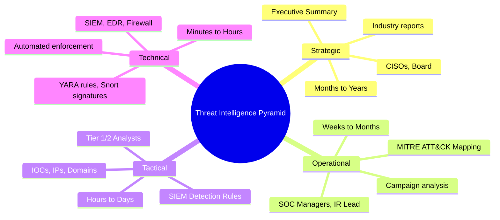
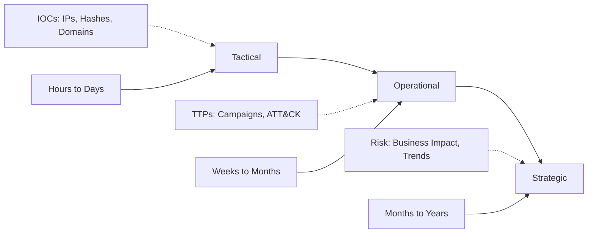
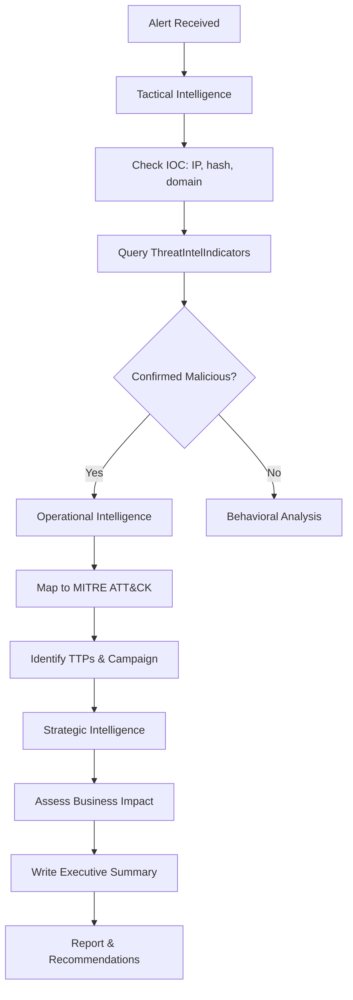

# Strategic, Operational, and Tactical Intelligence

## TCM Exam Objectives

- Differentiate between Strategic, Operational, Tactical, and Technical intelligence layers by audience and timeframe
- Write an Executive Summary section that demonstrates strategic thinking for CISO/board-level readers
- Map observed adversary behavior to MITRE ATT&CK techniques for operational intelligence reporting
- Query `ThreatIntelIndicators` for tactical IOC enrichment using KQL
- Apply the Intelligence Lifecycle (Direction, Collection, Processing, Analysis, Dissemination, Feedback) to exam workflow
- Correlate sign-in logs with threat intelligence feeds using KQL `join` operations
- Produce an IOC table with context, confidence scoring, and source attribution
- Frame investigation findings in terms of business risk and regulatory impact for executive audiences
- Demonstrate understanding of TTPs, campaign analysis, and adversary profiling for operational intelligence
- Recommend SIEM detection rules and blocking actions based on tactical intelligence findings

Threat Intelligence is organized into three layers that map to different audiences and timeframes: Strategic (executives, months to years), Operational (SOC managers, weeks to months), and Tactical (SOC analysts, hours to days). The PSAA exam primarily operates at the Tactical and Operational levels, but understanding all three elevates your report quality.

- Pyramid of intelligence levels
- Strategic intelligence and executive reporting
- Operational intelligence and MITRE ATT&CK
- Tactical intelligence and IOC hunting
- KQL integration with Sentinel threat intelligence tables





> 📌 **Exam Tip:** The PSAA primarily tests Tactical and Operational intelligence. Your report's Executive Summary fills the Strategic layer. Frame the incident in business terms: "The compromise of this finance executive's account resulted in exposure of PII, potentially triggering GDPR notification obligations."

## Threat Intelligence Pyramid

Cyber Threat Intelligence is most effective when organized into a hierarchy where each layer supports the one above it.

| Level | Audience | Timeframe | Core Question | Data Type |
| :--- | :--- | :--- | :--- | :--- |
| Strategic | CISOs, Executives, Board | Months to Years | Where should we invest? | Industry reports, geopolitical risk, threat actor profiles |
| Operational | SOC Managers, IR Lead, Threat Hunters | Weeks to Months | What campaigns are active? | TTPs, campaign analysis, threat actor attribution |
| Tactical | Tier 1/2 Analysts, Incident Responders | Hours to Days | What do I block or detect now? | IOCs: IPs, domains, file hashes, URLs |
| Technical | SIEM, EDR, Firewall (automated) | Minutes to Hours | What signature matches this traffic? | YARA rules, Snort signatures, machine-readable feeds |

The SOC 101 course includes a dedicated Threat Intelligence module, underscoring its importance in the PSAA syllabus 【turn0search3】.

## Strategic Intelligence

Strategic intelligence provides a high-level view of the cybersecurity landscape. It answers business questions: which threat actors target our industry, where to invest security budget, and what regulatory changes are on the horizon.

**Data sources:** Industry reports (Verizon DBIR, CrowdStrike Global Threat Report), geopolitical analysis, threat actor motivation assessments, dark web chatter about industry-specific targeting.

**PSAA Application:** The Executive Summary section of your exam report is where you demonstrate strategic thinking. Frame findings in terms of risk and business impact:

> "The compromise of user jdoe's account via brute force resulted in unauthorized access to Finance SharePoint data containing PII. This may trigger data breach notification obligations under GDPR and CCPA. Immediate remediation and MFA enforcement are recommended to prevent recurrence."

> 📌 **Exam Tip:** The Executive Summary is your only chance to demonstrate strategic thinking. Frame every incident in business terms: instead of "The attacker used PowerShell to download a payload," write "The compromise of this Finance executive's account resulted in exposure of PII, potentially triggering GDPR notification within 72 hours."

## Operational Intelligence

Operational intelligence bridges strategy and tactics. It focuses on adversary behavior: how adversaries operate, what tools they use, and how their campaigns evolve. It answers the "how" and "why" that tactical IOCs alone cannot.

**Core elements:**
- TTPs mapped to MITRE ATT&CK framework
- Campaign analysis across multiple victims
- Threat actor profiles with motivation and targets
- Infrastructure mapping of C2 servers, phishing domains, and delivery networks

**PSAA Application:** MITRE ATT&CK mapping is the operational intelligence centerpiece of your report. Map every observed event to a technique 【turn0search2】:

| Observed Activity | MITRE ATT&CK Technique | Classification |
| :--- | :--- | :--- |
| Failed logins from single IP | T1110 (Brute Force) | Credential Access |
| Login from geographically distant location | T1078 (Valid Accounts) | Initial Access |
| Inbox rule forwarding externally | T1114 (Email Collection) | Collection |
| PowerShell downloading encoded script | T1059.001 (PowerShell) | Execution |

> 📌 **Exam Tip:** During the exam, organize your investigation workflow by intelligence layer: start Tactical (check the IOC), move to Operational (map to ATT&CK, hunt for campaigns), and end Strategic (write the Executive Summary). This layered approach impresses evaluators.

> 📌 **Exam Tip:** Organize your PSAA investigation by intelligence layer: start Tactical (check the IOC immediately), move to Operational (map to ATT&CK, hunt for campaigns), and end Strategic (write the Executive Summary). This layered approach demonstrates the full spectrum of intelligence-driven analysis.

## Tactical Intelligence

Tactical intelligence deals in granular, machine-readable data: malicious IP addresses, domain names, file hashes, and URLs. This is the intelligence consumed by SOC analysts and security tools.

**Characteristics:**
- Highly structured and machine-readable
- Short-lived (IOCs can become stale in hours or days)
- Designed for automated enforcement
- Foundation for alert creation and triage

**PSAA Application:** When an alert presents a suspicious IP, validate it against threat intelligence, hunt for the same IOC across other log sources, and extract new IOCs 【turn0search1】:

```kusto
// Check if an IP is in threat intelligence
ThreatIntelIndicators
| where TimeGenerated > ago(30d)
| where IndicatorType == "ipv4-addr"
| where IndicatorValue == "203.0.113.45"
| project TimeGenerated, IndicatorValue, IndicatorType, ThreatType, ConfidenceScore
```

```kusto
// Correlate sign-in logs with threat intelligence
let KnownBadIPs = ThreatIntelIndicators
| where TimeGenerated > ago(7d)
| where IndicatorType == "ipv4-addr"
| where ConfidenceScore > 70
| project IndicatorValue;
SigninLogs
| where TimeGenerated > ago(24h)
| where IPAddress in (KnownBadIPs)
| project TimeGenerated, UserPrincipalName, IPAddress, ResultType, Location
```

## Applying TI in the PSAA Workflow

When you open a ticket during the exam, your investigation flows through the intelligence layers:

1. **Tactical (Immediate):** The alert fires. Check the IOC against Sentinel's threat intelligence tables. Block or escalate.

2. **Operational (Investigation):** Pivot on TTPs. Map actions to MITRE ATT&CK, build a timeline, correlate across log sources, identify persistence mechanisms.

3. **Strategic (Reporting):** Write the Executive Summary describing the impact, likely threat actor, and recommended investments (enforce MFA, deploy EDR, improve logging).

**Sources of threat intelligence** for the PSAA include internal SIEM logs and EDR telemetry, external OSINT feeds (AlienVault OTX, MISP), commercial feeds (Recorded Future, Anomali), government/CERT sources (US-CERT, NCSC), and security vendor reports 【turn0search4】.

<details>
<summary>Intelligence Lifecycle</summary>

A mature CTI program follows a cyclical process:

1. **Direction:** Define what intelligence is needed (What IPs are associated with this phishing campaign?)
2. **Collection:** Gather raw data from internal logs and external feeds
3. **Processing:** Normalize, deduplicate, and translate into usable format
4. **Analysis:** Contextualize the data—connect the IP to a campaign, assess confidence
5. **Dissemination:** Deliver finished intelligence to the right audience (tactical to SOC, strategic to leadership)
6. **Feedback:** Refine requirements based on what was useful and what was missing

Understanding this cycle helps you articulate your methodology in the exam report.
</details>

## Report Documentation

Your PSAA report must demonstrate that you understood the significance of threat intelligence, not just that you found IOCs:

| IOC | Type | Context | Confidence | Source |
| :--- | :--- | :--- | :--- | :--- |
| 203.0.113.45 | IPv4 | C2 server for Emotet campaign | High | ThreatIntelIndicators |
| 39b8a7f6d2e3c1... | SHA-256 | Malicious PowerShell script | High | SecurityEvent 4688 |
| evil-domain.xyz | Domain | Phishing landing page | Medium | OfficeActivity |

Tie remediation to threat intelligence: "The IP 203.0.113.45 is associated with the Emotet botnet. Recommend blocking at the perimeter firewall and hunting for related Emotet artifacts (registry keys, scheduled tasks) across all endpoints."



## Recap

Threat intelligence is organized into Strategic (executive, long-term), Operational (SOC management, campaign-focused), and Tactical (analyst, IOC-driven) layers 【turn0search1】【turn0search2】【turn0search3】. In the PSAA, tactical intelligence stops today's attack, operational intelligence prepares you for tomorrow's, and strategic intelligence ensures readiness for next year's. A strong report shows evaluators you understand all three.
