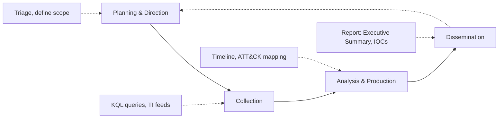
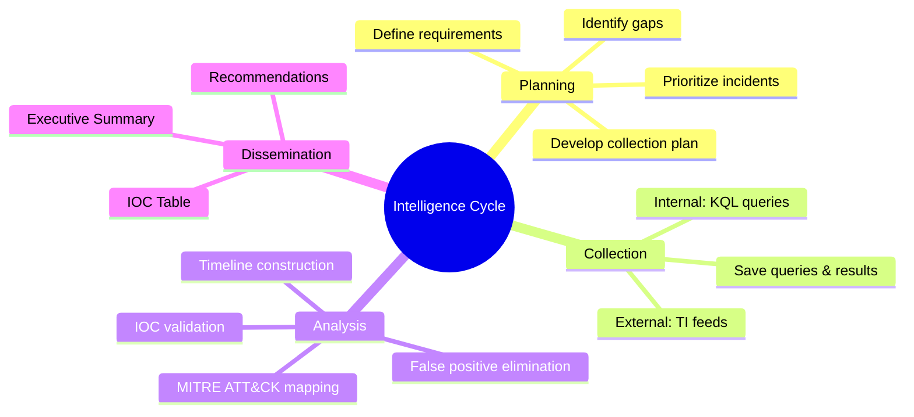
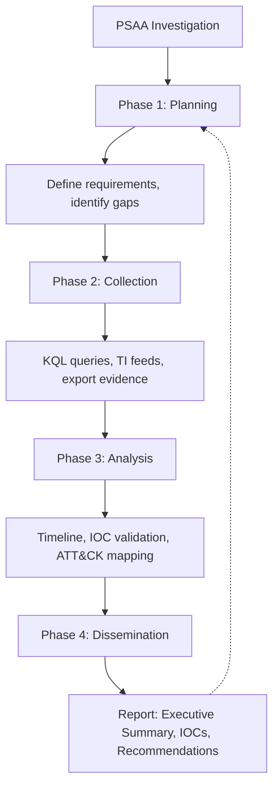

# The Intelligence Cycle: Planning, Collection, Analysis, and Dissemination

## TCM Exam Objectives

- Apply the four-phase Intelligence Cycle (Planning, Collection, Analysis, Dissemination) to PSAA investigation workflows
- Develop a collection plan with specific KQL queries targeting Sentinel log tables
- Construct a forensic timeline from raw log data using KQL `union` and `order by` operators
- Validate and eliminate false positives through cross-source correlation
- Map observed events to MITRE ATT&CK techniques for structured reporting
- Tailor intelligence dissemination for different audiences (executive, technical, operational)
- Document collection, analysis, and findings in a professionally formatted investigation report
- Demonstrate the intelligence feedback loop by proposing preventive detection rules
- Use `ThreatIntelIndicators` for tactical enrichment of IOCs during triage
- Integrate KQL operators (`summarize`, `join`, `extend`, `render`) across all four phases

The Intelligence Cycle is the structured methodology that turns raw data into actionable insight. It consists of four core phases: Planning and Direction (defining what you need to know), Collection (gathering raw data), Analysis and Production (connecting the dots), and Dissemination (delivering intelligence to the right audience). In the PSAA exam, this cycle maps directly to your investigation workflow from alert triage to final report.

- Four phases of the Intelligence Cycle
- Mapping each phase to PSAA exam tasks
- KQL-driven collection and analysis
- Audience-aware dissemination



> 📌 **Exam Tip:** On exam day, write your planning notes before writing a single KQL query. A clear plan prevents aimless log surfing and saves precious investigation time. Your planning notes double as the Investigation Summary section of your final report.

## Phase 1: Planning and Direction

Planning is where you define what intelligence you need, why you need it, and how you will obtain it. In the PSAA, this happens the moment you open an incident.

**Key activities:**
1. Understand the requirement: What triggered the alert? What entities are involved? What is the potential business impact?
2. Identify intelligence gaps: Is the source IP known? Has the user been compromised before? Were there other suspicious activities?
3. Develop a collection plan: Which log tables to query, what time range to cover, what specific questions each query should answer.
4. Prioritize: Tackle high-severity incidents first. Within one incident, prioritize IOCs that are easiest to block.

**PSAA Example:** Alert for possible brute-force attack with 50 failed logins for user jdoe from IP 203.0.113.45.

```markdown
Planning Notes:
- Requirement: Determine if jdoe's account was compromised. If so, what data was accessed?
- Gaps: Is 203.0.113.45 malicious? Did any failed attempts succeed?
- Collection Plan:
  1. Query ThreatIntelIndicators for IP reputation
  2. Query SigninLogs for all jdoe sign-ins last 24h
  3. If success found, pivot to OfficeActivity and AuditLogs
  4. Correlate IP across other user sign-ins
```

This plan becomes the outline of your report's Investigation Summary section 【turn0search3】.

## Phase 2: Collection

Collection is the execution of your plan. In the PSAA, collection is almost entirely KQL-driven against Sentinel log tables.

> 📌 **Exam Tip:** In the Collection phase, always collect more data than you think you need. Start broad with `union` across multiple tables, then narrow. You cannot re-collect data that has aged out of the SIEM, so a generous time window (72h before the first alert) protects against missed evidence.

**Internal collection** uses queries against `SigninLogs`, `SecurityEvent`, `OfficeActivity`, `AuditLogs`, `CommonSecurityLog`, etc. Best practices include starting broad with `union` then narrowing, using `take 10` for initial sampling, applying time filters first, and collecting more than you think you need.

```kusto
let TargetUser = "jdoe@domain.com";
let StartTime = datetime(2024-01-15T06:00:00Z);
union SigninLogs, OfficeActivity, AuditLogs
| where TimeGenerated > StartTime
| where UserPrincipalName == TargetUser or UserId == TargetUser
| project TimeGenerated, Source = $table, Operation, ResultType, IPAddress, ClientIP, Computer
| order by TimeGenerated asc
```

**External collection** uses threat intelligence tables:

```kusto
// Collect reputation data for a suspicious IP
ThreatIntelIndicators
| where IndicatorValue == "203.0.113.45"
| project IndicatorValue, IndicatorType, ThreatType, ConfidenceScore, Description
```

Save every query and its result during collection. Screenshot the output or keep a text file of queries run. This becomes the Evidence section of your report 【turn0search2】.



> 📌 **Exam Tip:** Your analysis section should tell a story, not just list logs. Use phrases like "The timeline reveals that..." and "This pattern is consistent with..." to demonstrate analytical reasoning. Evaluators reward narrative clarity over data dumps.

## Phase 3: Analysis and Production

Analysis connects events, assesses their significance, eliminates false positives, and builds a coherent narrative. The PSAA focuses on practical correlation and reasoning.

**Timeline construction:** Arrange all collected events chronologically. This often reveals the attack sequence instantly.

```kusto
| project TimeGenerated, EventType = Operation, Details = strcat("User: ", UserPrincipalName, ", IP: ", IPAddress)
| order by TimeGenerated asc
```

**IOC validation:** Not every suspicious IP is malicious. Validate by checking ThreatIntelIndicators, assessing whether the IP belongs to a cloud provider, and examining behavior (a single ping vs. beaconing every 30 minutes with large outbound transfers).

**MITRE ATT&CK mapping:** Map each observed event to a technique. This transforms logs into a structured threat profile 【turn0search1】:

| Observed Event | ATT&CK Technique | Tactic |
| :--- | :--- | :--- |
| 50 failed logins | T1110 (Brute Force) | Credential Access |
| Successful login from foreign IP | T1078 (Valid Accounts) | Initial Access |
| Inbox rule forwarding externally | T1114 (Email Collection) | Collection |
| Outbound connection to known-bad IP | T1071 (Application Layer Protocol) | C2 |

**False positive elimination:** Document why benign explanations were ruled out: "The IP 10.10.5.23 is our internal vulnerability scanner, so the failed logins are a false positive."

<details>
<summary>Structured Analytic Techniques for Deeper Analysis</summary>

For complex incidents, consider:
- Analysis of Competing Hypotheses: List all possible explanations, test each against evidence
- SWOT Analysis: Strengths, Weaknesses, Opportunities, Threats of the current detection posture
- Kill Chain Analysis: Map events to the Lockheed Martin Cyber Kill Chain stages

These techniques are not required for the PSAA but demonstrate advanced analytical maturity if referenced.
</details>

> 📌 **Exam Tip:** Your PSAA report must speak to three audiences: executives need business impact, SOC peers need technical details, and management needs risk-based recommendations. Structure your report accordingly, with an Executive Summary at the top, detailed analysis in the middle, and prioritized recommendations at the end.

## Phase 4: Dissemination

Dissemination delivers the right intelligence to the right audience in the right format. For the PSAA, the primary dissemination product is your final exam report.

**Audience-focused dissemination:**

| Report Section | Audience | Intelligence Level |
| :--- | :--- | :--- |
| Executive Summary | CISO, Board | Strategic |
| Timeline, IOC Table | SOC Analysts | Tactical |
| MITRE ATT&CK Mapping | SOC Manager, Threat Hunters | Operational |

**IOC Table for dissemination:**

| IOC | Type | Context | Confidence | Source |
| :--- | :--- | :--- | :--- | :--- |
| 203.0.113.45 | IPv4 | Brute-force source, Tor exit node | High | ThreatIntelIndicators, SigninLogs |
| 185.220.101.34 | IPv4 | Successful login, C2 communication | High | SigninLogs, CommonSecurityLog |
| Financials_Q4.zip | File Name | Large zip downloaded before exfiltration | Medium | OfficeActivity |

Writing style should be concise and factual with active voice: "The attacker logged in from IP X, created an inbox rule, and downloaded 15 files." Cite evidence for every claim and provide recommendations that are specific, actionable, and prioritized.

**Feedback phase (bonus):** In a real SOC, a lessons-learned session follows every incident. In your PSAA report, add a Preventive Measures section with suggestions for new analytics rules, logging policy changes, and training recommendations. This demonstrates you think beyond the exam 【turn0search5】.

## Integrating the Cycle with KQL

| Phase | KQL Operator/Table | Purpose |
| :--- | :--- | :--- |
| Planning | (Mental, documented in notes) | Define tables and time ranges |
| Collection | `union`, `search`, `where`, `take`, `ago()` | Gather raw events |
| Analysis | `summarize`, `join`, `extend`, `parse`, `render timechart` | Aggregate, correlate, visualize |
| Dissemination | `project` (for clean tables), screenshots, CSV export | Format for report |



## Recap

The Intelligence Cycle provides structure to every SOC investigation 【turn0search1】【turn0search2】【turn0search3】. Planning prevents aimless querying, Collection gathers comprehensive evidence, Analysis connects the dots and eliminates false positives, and Dissemination tailors intelligence for different audiences. Applying this cycle consciously during the PSAA transforms reactive alert triage into a structured, defensible investigation process.
