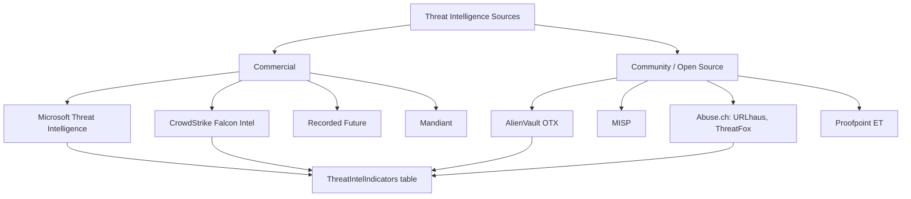
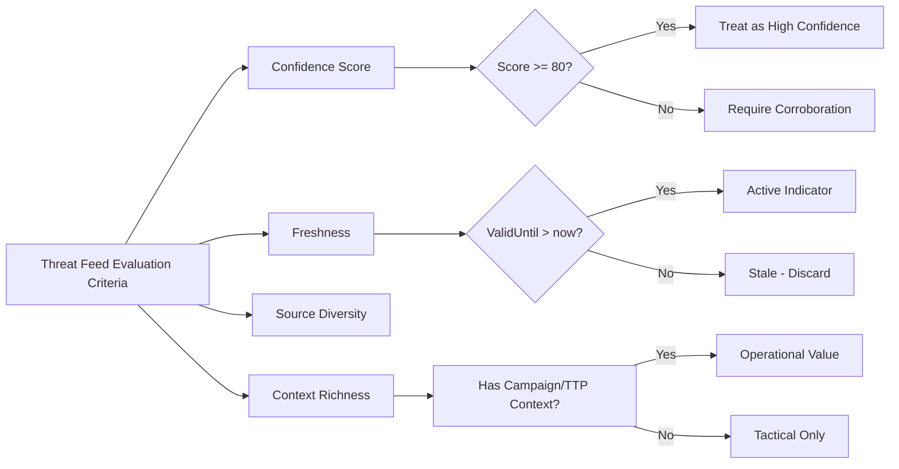
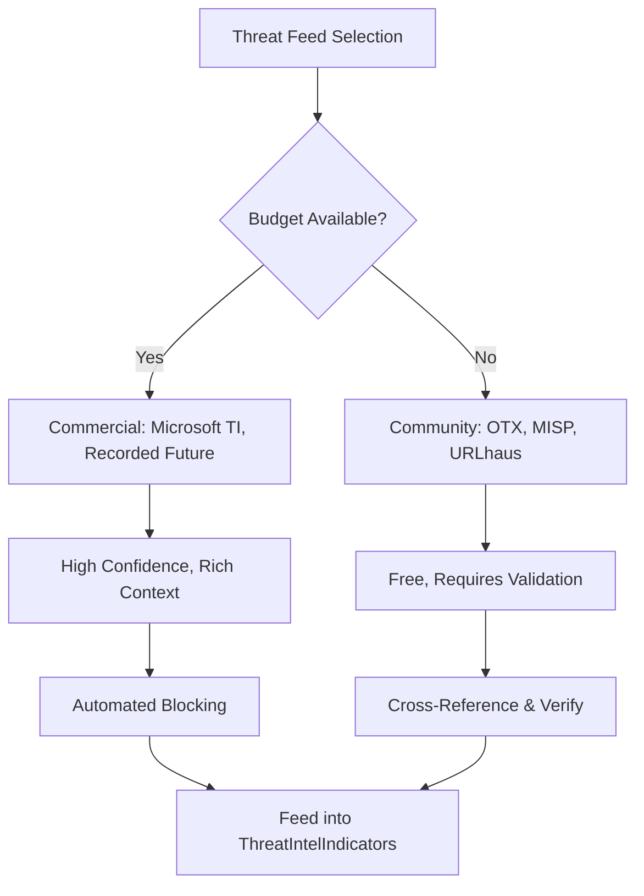

# Commercial and Community Threat Feeds

## TCM Exam Objectives

- Compare and contrast commercial vs. community threat feeds across cost, curation, context, and confidence
- Query Microsoft Threat Intelligence indicators from the `ThreatIntelIndicators` table using KQL
- Integrate AlienVault OTX and MISP community feeds into Sentinel for continuous enrichment
- Configure Abuse.ch feeds (URLhaus, ThreatFox, Feodo Tracker) for malware C2 detection
- Evaluate feed quality using confidence scoring, indicator freshness (`ValidFrom`/`ValidUntil`), and multi-source consensus
- Use KQL `join` to correlate sign-in logs with threat intelligence feeds
- Apply TAXII, STIX, and API-based ingestion methods for threat feed integration
- Validate community feed IOCs by cross-referencing with behavioral evidence
- Understand the role of Recorded Future, CrowdStrike Falcon Intel, and Mandiant as commercial alternatives
- Document feed source, confidence, and freshness for every IOC in the exam report

Threat feeds deliver millions of Indicators of Compromise daily, telling analysts which IPs are C2 servers, which domains host phishing pages, and which file hashes belong to malware. Two major categories exist: commercial feeds (subscription-based, highly curated, rich context) and community feeds (free, diverse, require validation). In the PSAA exam, understanding where intelligence comes from and how to evaluate its quality is essential for confident decision-making.

- Commercial vs. community feed comparison
- Microsoft Threat Intelligence and Sentinel integration
- Community feeds: OTX, MISP, Abuse.ch
- KQL query patterns for feeds
- Feed evaluation and confidence scoring





> 📌 **Exam Tip:** When multiple feeds flag the same IOC, that consensus is a powerful signal. In your report, document: "Confirmed by Microsoft TI (Confidence 95) and OTX (tags: Tor, BruteForce)." Multi-source corroboration significantly boosts your evidence credibility.

## Commercial vs. Community Feeds

| Feature | Commercial Feeds | Community Feeds |
| :--- | :--- | :--- |
| Cost | Subscription, often expensive | Free |
| Curation | Highly curated by dedicated research teams | Varies; automated with higher false-positive rates |
| Context | Threat actor names, campaigns, TTPs, kill chain | Mostly raw IOCs; minimal context |
| Confidence Scoring | Consistent, numeric (0-100) with methodology | May be present but not standardized |
| Update Frequency | Near-real-time | Varies; some near-real-time, some daily |
| False Positive Rate | Generally low, backed by SLAs | Higher; requires validation |
| Examples | Microsoft TI, CrowdStrike, Recorded Future, Mandiant | OTX, MISP, URLhaus, ThreatFox, ET |

In the PSAA, you will likely encounter Microsoft Threat Intelligence, which is built into Sentinel deployments. Community feeds may also be present 【turn0search1】.

## Microsoft Threat Intelligence

Microsoft's own feed aggregates signals from the Microsoft security graph (Windows Defender, Office 365, Azure), the Microsoft Threat Intelligence Center (MSTIC), and partner sources. Key advantages for the PSAA include no configuration needed, high-confidence indicators enriched with threat type and severity, automatic correlation via the Investigation Graph, and context you can directly cite in your report: "Microsoft Threat Intelligence classifies this IP as a Tor exit node with 95% confidence."

```kusto
// Query Microsoft TI for an IP
ThreatIntelIndicators
| where SourceSystem == "Microsoft Threat Intelligence"
| where IndicatorType == "ipv4-addr"
| where IndicatorValue == "185.220.101.34"
| project IndicatorValue, ThreatType, ConfidenceScore, Description, Tags
```

**Other commercial feeds:** Recorded Future excels at threat actor and campaign mapping. CrowdStrike Falcon Intelligence ties IOCs to adversary profiles. Mandiant Advantage provides detailed malware analysis and attribution. In Sentinel, all sources land in `ThreatIntelIndicators` with a `SourceSystem` field identifying the feed 【turn0search2】.

## Community Feeds

> 📌 **Exam Tip:** When multiple feeds flag the same IOC, that consensus is a powerful signal. In your report, document: "Confirmed by Microsoft TI (Confidence 95) and OTX (tags: Tor, BruteForce)." Multi-source corroboration significantly boosts your evidence credibility.

### AlienVault OTX

One of the largest open-source threat intelligence platforms. Provides pulses (IOC collections) created by users and AlienVault Labs. IOCs include IPs, domains, URLs, file hashes, and YARA rules. In Sentinel, connect OTX via a TAXII connector or a playbook that polls the OTX API.

### MISP (Malware Information Sharing Platform)

An open-source platform to store, share, and correlate IOCs. Many organizations run their own MISP instance and share data within ISACs and national CERTs. MISP feeds push to Sentinel via the Threat Intelligence Upload Indicators API using automation.

### Abuse.ch Feeds

- **URLhaus:** Malware distribution URLs
- **ThreatFox:** Community-shared IOCs focused on malware C2 servers
- **Feodo Tracker:** IPs and domains associated with Dridex, Emotet, and banking Trojans

### Limitations of Community Feeds

Community feeds have higher false-positive risk, variable update frequency, limited context (often just an IP with a tag), and may include stale IOCs. In the PSAA, treat community feed IOCs as clues rather than verdicts. Correlate with other data before escalating. Document confidence accordingly 【turn0search3】.

> 📌 **Exam Tip:** Always check indicator freshness using `ValidUntil > now()`. An IOC that expired yesterday should be treated as stale—blocking on outdated indicators wastes resources and may block legitimate traffic. Document freshness alongside confidence in your IOC table.

## TAXII, STIX, and API Integration

| Ingestion Method | Data Format | Use Case |
| :--- | :--- | :--- |
| TAXII connector | STIX 2.0 / 2.1 | Standardized pull from TAXII servers |
| Threat Intelligence Upload Indicators API | JSON array of indicator objects | Programmatic push from MISP or SOAR |
| Sentinel built-in connectors | Native service-to-service | Microsoft TI, Defender TI |

For the PSAA, you should understand these terms. If asked how to integrate MISP into Sentinel, answer: "By setting up a logic app or script that pushes indicators via the Threat Intelligence Upload Indicators API, or by using a TAXII server if MISP exposes one."

## KQL Query Patterns for Feeds

```kusto
// Explore available feeds
ThreatIntelIndicators
| summarize FirstSeen = min(TimeGenerated), LastSeen = max(TimeGenerated),
              IndicatorCount = count() by SourceSystem
| order by IndicatorCount desc
```

```kusto
// High-confidence IPs from Microsoft Intelligence
ThreatIntelIndicators
| where SourceSystem == "Microsoft Threat Intelligence"
| where IndicatorType == "ipv4-addr"
| where ConfidenceScore >= 80
| project IndicatorValue, ThreatType, ThreatSeverity, Description
```

```kusto
// Check an alert IP against all feeds
let AlertIP = "185.220.101.34";
ThreatIntelIndicators
| where IndicatorValue == AlertIP
| where IndicatorType == "ipv4-addr"
| project Source=SourceSystem, ThreatType, ConfidenceScore, Tags
```

If multiple feeds flag the same IP, it is a strong signal. Document: "Confirmed by Microsoft TI (Confidence 95) and OTX (tags: Tor, BruteForce)."

```kusto
// Join sign-in logs with all feeds
SigninLogs
| where TimeGenerated > ago(1h)
| join kind=inner (
    ThreatIntelIndicators
    | where IndicatorType == "ipv4-addr"
    | where ConfidenceScore >= 70
    | project IPAddress=IndicatorValue, ThreatType, ConfidenceScore, SourceSystem
) on IPAddress
| project TimeGenerated, UserPrincipalName, IPAddress, ThreatType, ConfidenceScore, SourceSystem
```

> 📌 **Exam Tip:** Community feeds are free but noisy. In the PSAA, treat community feed IOCs as clues rather than verdicts. Always cross-reference with behavioral evidence: "The IP appears in OTX with tag 'BruteForce,' and our SigninLogs show 50 failed logins from this IP—behavioral and TI evidence align."



## Feed Evaluation

A skilled analyst does not trust every feed blindly. In your report, demonstrate feed quality understanding by commenting on confidence scoring, consensus across feeds, indicator freshness using `ValidFrom`/`ValidUntil`, and false positive handling 【turn0search4】:

```kusto
| where ValidUntil > now()
```

Feed diversity is important. The ideal SOC uses a combination of commercial and community feeds for defense in depth. If an IOC is flagged only by a low-confidence community feed with no corresponding behavior, you may close as false positive and justify by citing feed reliability.

## Recap

Commercial feeds (Microsoft TI, CrowdStrike, Recorded Future) provide high confidence, rich context, and low false positive rates, while community feeds (OTX, MISP, URLhaus) are free, diverse, and require validation 【turn0search1】【turn0search2】【turn0search3】. In the PSAA, always check indicator freshness with `ValidUntil > now()`, use multiple feeds for cross-verification, and document the source and confidence of every IOC in your report's IOC table.
