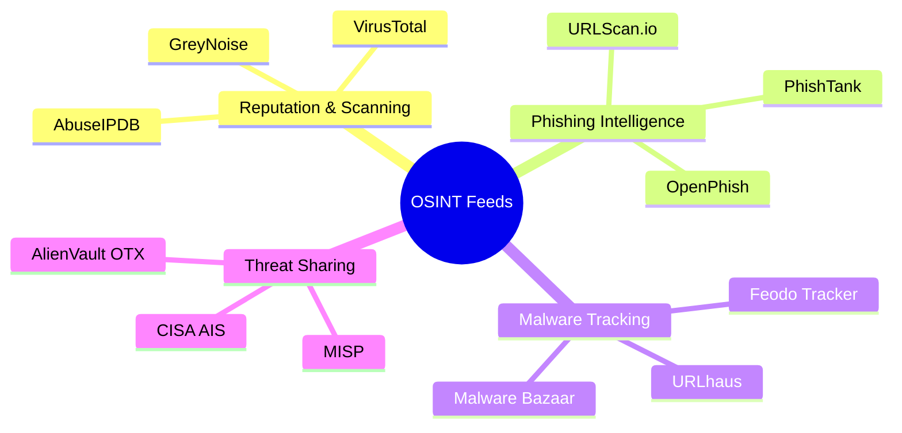
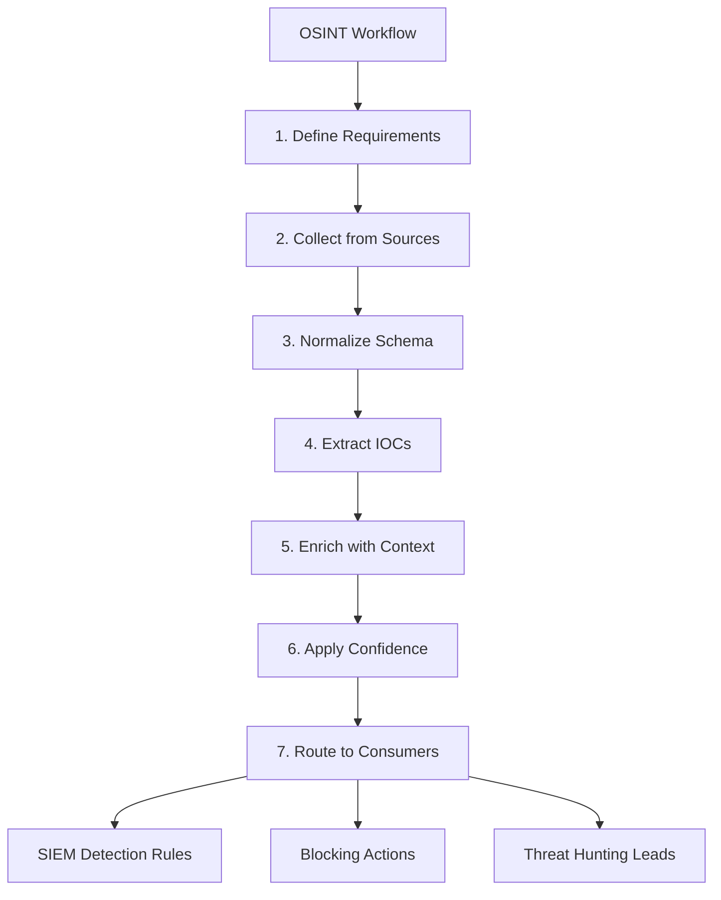
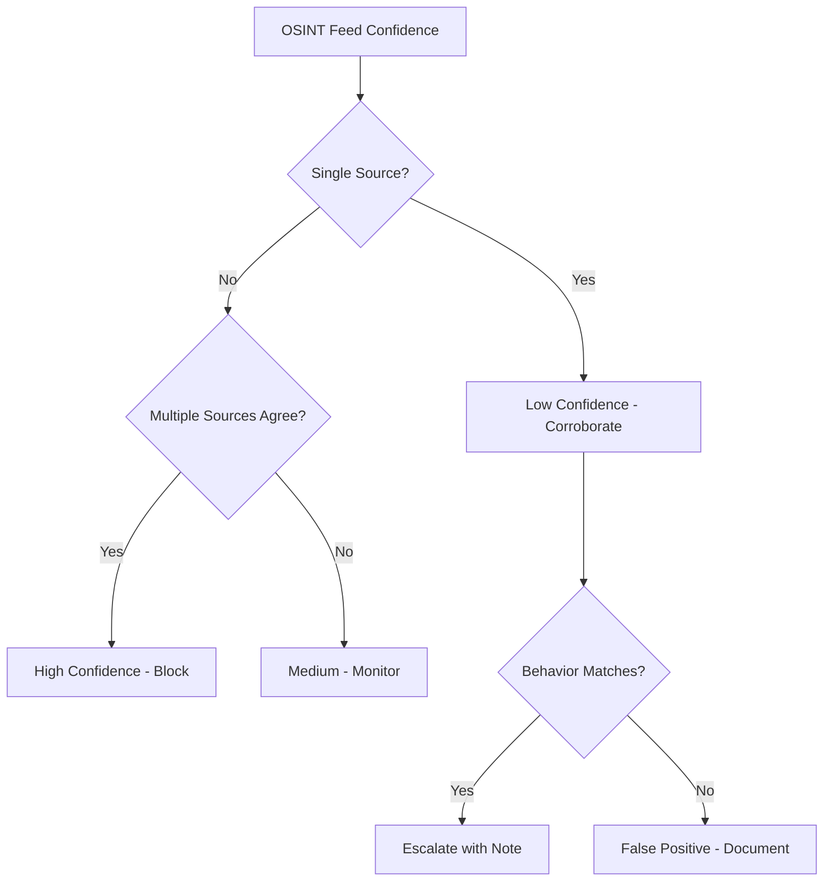

# Open-Source Intelligence (OSINT) Feeds

## TCM Exam Objectives

- Leverage VirusTotal for multi-engine file, URL, IP, and domain enrichment
- Use AbuseIPDB to quickly assess IP reputation with confidence scoring
- Query AlienVault OTX pulses for curated IOC collections and campaign context
- Integrate MISP as a centralized threat intelligence platform for IOC sharing
- Validate phishing URLs using PhishTank and URLScan.io
- Apply GreyNoise to filter internet background noise and isolate targeted attacks
- Execute the seven-step OSINT workflow from requirements definition to output routing
- Configure SIEM threat intelligence integrations for automated enrichment
- Apply confidence scoring methodology to OSINT sources for report documentation
- Document OSINT-sourced IOCs in a structured table with source, confidence, and verdict

Open-Source Intelligence (OSINT) is the collection and analysis of publicly available information without bypassing access controls. For the SOC analyst, OSINT feeds are the bridge connecting raw internal alerts to validated external context, turning a suspicion into a confirmed incident. The PSAA exam tests your ability to leverage OSINT to enrich investigations and document findings with proper attribution.

- Core OSINT feeds for SOC analysts
- OSINT workflow: collection to operationalization
- SIEM integration
- Legal and ethical considerations





> 📌 **Exam Tip:** In the PSAA, you won't have live internet access to VirusTotal or AbuseIPDB. However, the exam data may include pre-populated `ThreatIntelIndicators` with OSINT-derived data. Practice querying this table with KQL as your primary enrichment method.

## Core OSINT Feeds

The following feeds are most relevant to the PSAA exam and real-world SOC operations 【turn0search1】【turn0search2】【turn0search3】:

| Feed | Function | What It Provides | PSAA Use Case |
| :--- | :--- | :--- | :--- |
| VirusTotal | Multi-engine file/URL/IP/domain scanning | Detection results from 70+ engines, sandbox reports, community comments | Primary enrichment for hashes, IPs, URLs |
| AbuseIPDB | IP reputation | Confidence scores based on reported malicious activity | Quick check if source IP is known bad |
| AlienVault OTX | Community threat exchange | Pulses of curated IOCs with STIX support | Search for IOC in threat pulses, SIEM integration |
| MISP | Threat intelligence platform | Structured IOC sharing, correlation engine, ATT&CK integration | Central IOC management, export detection rules |
| PhishTank | Phishing URL database | Community-submitted and verified phishing URLs | Validate URLs from suspicious emails |
| URLhaus | Malware URL distribution | URLs for malware distribution, payload hashes | Identify malware delivery infrastructure |
| GreyNoise | Internet background noise | Identifies mass scanning vs. targeted malicious activity | Filter out scanner noise to focus on real attacks |
| URLScan.io | URL sandbox | Screenshots, associated domains/IPs, request chains | Analyze suspicious URLs without risk |

## OSINT Workflow

### Step 1: Define Intelligence Requirements

Document what you need to know before collecting. Which threat actors target your sector? Which CVEs are being actively exploited? These questions dictate which feeds to prioritize.

### Step 2: Collect from Curated Sources

A widely cited research blog post is worth more than an unattributed paste. A confirmed CISA advisory is worth more than a social media rumor. Curate sources and automate collection using RSS, GitHub repository watches, API polling, and SIEM-native TI integrations 【turn0search3】.

### Step 3: Normalize into Common Schema

OSINT arrives in every format—Markdown, PDF, STIX, plain text, JSON. Normalize into a consistent structure: source, collected timestamp, raw content, extracted IOCs, confidence, tags.

### Step 4: Extract IOCs Automatically

Use text-mining tools or scripts to extract hashes, IPs, domains, URLs, and CVE IDs from unstructured OSINT. Apply defanging/refanging logic and a validator to reject false positives.

### Step 5: Enrich IOCs with Context

Every extracted IOC should be enriched before reaching detection engineering. Query VirusTotal or AbuseIPDB to determine if a domain has C2 history. Pre-filter noise and highlight indicators needing immediate action.

> 📌 **Exam Tip:** Prioritize OSINT sources by confidence tier. A CISA advisory or Microsoft TI match (Confidence 90+) should trigger immediate action. A single VirusTotal detection with one engine flagging is Low confidence and requires behavioral corroboration before escalation.

### Step 6: Apply Confidence Scoring

| Source | Confidence Level |
| :--- | :--- |
| CISA advisory | High |
| CISA + Talos + OTX pulses | Very High |
| Single VirusTotal detection | Low |

### Step 7: Route Outputs to Consumers

- Tactical IOCs (IPs, domains, hashes) → detection engineering and blocking
- Operational insights (campaign tracking, TTPs) → threat hunting leads
- Strategic findings (threat actor profiles) → executive briefings

> 📌 **Exam Tip:** In the PSAA report, document every OSINT-sourced IOC with its source and confidence score. Use a structured table format: IOC, Type, Value, OSINT Source, Confidence, Verdict. This structured approach is exactly what evaluators look for in professional threat intelligence reporting.

## SIEM Integration

Operationalizing OSINT is the endgame. In Splunk, use the Threat Intelligence Framework to upload a CSV of malicious IPs/domains and automatically correlate with firewall, proxy, and endpoint logs. In Elastic, configure threat intelligence integrations under Stack Management to import indicators. Wazuh integrates with MISP and AlienVault OTX for continuous threat sync 【turn0search4】.

```spl
# Splunk: Detect communication with MISP-derived IPs
| tstats count from datamodel=Network_Traffic.All_Traffic
  where All_Traffic.dest_ip IN (threat_ioc_list)
  groupby All_Traffic.src_ip All_Traffic.dest_ip
```

```kql
# Elastic: Detect DNS queries to Spamhaus DBL entry
event.dataset: "dns" AND dns.question.name: "*.blocked-domain.com"
```

IntelMQ is an open-source solution for streamlining collection and processing of security feeds. Knowing such automation frameworks exist lets you recommend: "Implement an IntelMQ pipeline to automate OSINT feed collection, normalization, and deduplication before SIEM ingestion."

> 📌 **Exam Tip:** In the OSINT confidence scoring section of your PSAA report, be specific. Instead of "IP confirmed malicious," write "IP confirmed with high confidence: VirusTotal 45/87 detections, AbuseIPDB 96% confidence, cross-referenced in OTX Emotet pulse." Multiple corroborating sources significantly strengthen your evidence chain.



## Common Pitfalls

| Pitfall | Description | Mitigation |
| :--- | :--- | :--- |
| Source sprawl | Too many feeds without quality control, leading to alert fatigue | Curate a short list of high-fidelity feeds |
| Ignoring confidence | Treating single detection equal to CISA advisory | Document confidence in report |
| Manual ingestion | Feeds break when off-shift | Automate with API or scheduled jobs |
| No feedback loop | Never removing underperforming feeds | Recommend quarterly feed review |
| Acting on unenriched IOC | Blocking shared cloud IP falsely flagged | Always enrich before blocking |

## Legal and Ethical Considerations

OSINT collection is legal when it respects access controls and data protection rules. Do not bypass access controls, register fake personas on forums requiring verification, or scrape behind login walls. Respect data protection regulations (GDPR/CCPA) for personal data. Attribute sources when quoting intelligence and protect sources and methods 【turn0search5】.

## Documenting OSINT in the PSAA Report

For every IOC, provide its OSINT source and confidence rating:

| IOC | Type | Value | OSINT Source | Confidence | Verdict |
| :--- | :--- | :--- | :--- | :--- | :--- |
| IOC #1 | IPv4 | `203.0.113.55` | AbuseIPDB (94%), OTX (2 pulses), VirusTotal (12/87) | High | Malicious C2 |
| IOC #2 | Domain | `evil-c2[.]xyz` | URLhaus (Emotet), VirusTotal (10 detections) | High | Malicious C2 |
| IOC #3 | URL | `http://phish-site[.]com/login` | PhishTank (verified), OpenPhish (active feed) | Medium | Phishing |

**Proactive recommendation:** "Integrate AbuseIPDB, AlienVault OTX, URLhaus, and OpenPhish into our SIEM's threat intelligence lookup tables for continuous, automated enrichment. Establish a quarterly review of feed performance."

## Recap

OSINT feeds transform raw internal alerts into externally validated incidents and fuel proactive hunting 【turn0search1】【turn0search2】【turn0search3】. Master the six most impactful feeds: VirusTotal, AbuseIPDB, AlienVault OTX, URLhaus, PhishTank/OpenPhish, and GreyNoise. Practice the full OSINT lifecycle─extract, enrich, score confidence, document, recommend blocking and detection─for every home lab investigation.
