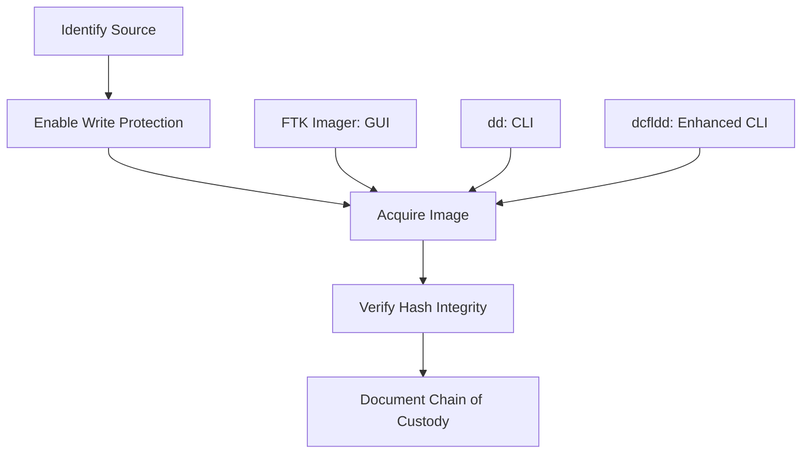
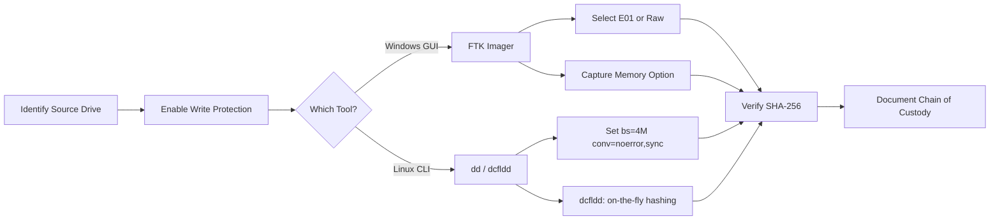

# Disk Imaging Tools (FTK Imager, dd, dcfldd)

## TCM Exam Objectives

- Execute the five-step forensically sound imaging workflow: Identify, Write-protect, Acquire, Hash-verify, Document
- Create disk images using FTK Imager (GUI) with E01 and raw dd formats including embedded metadata
- Perform command-line acquisition using dd and dcfldd with proper block sizes and error handling
- Compare forensic imaging formats (DD, E01, AFF) by compression, hashing, and metadata support
- Verify image integrity using SHA-256 hashing before and after acquisition
- Capture volatile memory using FTK Imager as part of live forensics
- Mount forensic images read-only for analysis without altering original evidence
- Write complete imaging documentation including tool version, hash values, chain of custody, and examiner details

Disk imaging is the foundation of digital forensics—the process of creating a verified, bit-for-bit copy of digital storage that captures every sector including deleted files, unallocated space, and file slack. Two tools dominate this space: FTK Imager (Windows, GUI-based) and `dd` (Linux, command-line). Both create bit-for-bit copies preserving raw disk contents, and understanding both is essential for the PSAA.

- Tool comparison: FTK Imager vs. dd vs. dcfldd
- Five-step forensically sound imaging workflow
- Practical walkthroughs for both tools
- Forensic imaging formats: DD vs. E01



## Tool Comparison

| Feature | FTK Imager | `dd` | `dcfldd` |
| :--- | :--- | :--- | :--- |
| Platform | Windows (GUI) | Linux, macOS, Unix (CLI) | Linux (CLI) |
| Ease of Use | High | Moderate | Moderate |
| Imaging Formats | Raw (dd), E01, SMART, AFF | Raw only | Raw only |
| Built-in Hashing | MD5, SHA-1, SHA-256 | No (separate step) | MD5, SHA-1, SHA-256 |
| Error Handling | Configurable | `conv=noerror,sync` | Same as dd |
| Memory Capture | Yes | No | No |
| Write Blocking | Software on destination | `blockdev --setro` | Same as dd |
| Compression | Yes (E01) | Pipe to gzip | No |
| File Splitting | Yes | No (use `split`) | Yes |

FTK Imager is best for Windows GUI-driven workflows with memory capture and E01 output. `dd` is best for Linux, SSH-only environments, or when a lightweight scriptable tool is needed. `dcfldd` is preferred for forensically sound Linux acquisition with on-the-fly hashing 【turn0search1】【turn0search2】.

## Five-Step Imaging Workflow

> 📌 **Exam Tip:** Never guess the source device when imaging. Imaging the wrong drive can destroy evidence and cause an investigation to fail. Always verify the drive model, serial number, and capacity against documented evidence before starting acquisition.

### Step 1: Identify and Document the Source

Before touching any tool, document what you are imaging. In FTK Imager, note the physical drive number, model, serial number, and capacity. With `dd`, use `lsblk` to identify the device, then document with `hdparm -I /dev/sdb` and `smartctl -i /dev/sdb`. Never guess the source device—imaging the wrong drive can destroy evidence.

### Step 2: Enable Write Protection

Write blocking prevents accidental modification of original evidence. FTK Imager reads the source disk at a low level and does not write to it. For `dd`, enable software write blocking:
```bash
blockdev --setro /dev/sdb
blockdev --getro /dev/sdb  # Must return 1
```

### Step 3: Acquire the Image

This is the core acquisition step. The tool reads every sector and writes to a destination file or device.

### Step 4: Verify Integrity with Cryptographic Hashing

SHA-256 is the gold standard. FTK Imager computes hashes simultaneously during acquisition. For `dd`, compute the source hash before acquisition, then hash the image file and compare. `dcfldd` computes hashes on-the-fly.

### Step 5: Document the Chain of Custody

Record the collector's name, role, timestamps, storage location, hash verification results, and any observations. This proves evidence was handled properly from collection to presentation.

## FTK Imager Walkthrough

### Creating a Disk Image

1. Launch FTK Imager as Administrator
2. File → Create Disk Image
3. Select source type: Physical Drive (entire disk, recommended), Logical Drive (partition), or Image File (convert format)
4. Select source drive, verify by serial number and capacity
5. Configure destination: Raw (dd) for uncompressed, E01 for compression with embedded metadata
6. Enter case information (embedded in E01 file)
7. Click Start, monitor progress, do not interrupt
8. Document MD5 and SHA-1 hash values upon completion, click Verify to re-check

### Capturing Memory

FTK Imager can capture live system RAM, critical for preserving volatile evidence:
1. File → Capture Memory
2. Select destination on forensically prepared external drive (never save to target system's own disk)
3. Click Capture Memory
4. Document hash values provided at completion

### Mounting an Image Read-Only

File → Image Mounting → browse to image file → select Read-Only mount mode → choose mount point. The image appears as a drive letter in Windows Explorer without altering the original evidence 【turn0search3】.

## dd and dcfldd Walkthrough

```bash
# Identify the source device
lsblk -o NAME,SIZE,TYPE,MOUNTPOINT,MODEL
fdisk -l /dev/sdb

# Enable software write blocking
blockdev --setro /dev/sdb
blockdev --getro /dev/sdb

# Document source drive information
mkdir -p /cases/case-2024-001/{images,hashes,logs,notes}
hdparm -I /dev/sdb > /cases/case-2024-001/notes/source_drive_info.txt

# Pre-hash the source device
sha256sum /dev/sdb | tee /cases/case-2024-001/hashes/source_hash_before.txt

# Acquire the image with error handling and progress
dd if=/dev/sdb \
   of=/cases/case-2024-001/images/evidence.dd \
   bs=4M \
   conv=noerror,sync \
   status=progress 2>&1 | tee /cases/case-2024-001/logs/dd_acquisition.log

# Hash the resulting image
sha256sum /cases/case-2024-001/images/evidence.dd | tee /cases/case-2024-001/hashes/image_hash.txt
```

The `bs=4M` block size optimizes speed. `conv=noerror,sync` ensures read errors don't stop the process and bad sectors are padded with null bytes, preserving offset alignment.

### Enhanced Imaging with dcfldd

```bash
dcfldd if=/dev/sdb \
       of=/cases/case-2024-001/images/evidence.dd \
       bs=4M \
       conv=noerror,sync \
       hash=sha256,md5 \
       hashlog=/cases/case-2024-001/hashes/dcfldd_hashes.txt \
       status=progress
```

The `hash` parameter computes hashes simultaneously. The `hashlog` saves values to a file for documentation.

> 📌 **Exam Tip:** For the PSAA, remember that E01 format embeds metadata (case number, examiner name, hash values) directly into the image file, while raw DD format requires separate hash verification. E01 is preferred for court-admissible forensic images due to its built-in integrity checks.

## Forensic Imaging Formats

| Format | Type | Metadata Support | Compression | Hashing | Tool Support |
| :--- | :--- | :--- | :--- | :--- | :--- |
| Raw (`.dd`, `.img`) | Sector-by-sector byte stream | None | No | Manual | Universal |
| E01 (Expert Witness) | Structured forensic container | Embedded case info | Yes (lossless) | MD5, SHA-1 embedded | FTK Imager, EnCase, Autopsy |
| AFF (Advanced Forensic Format) | Open-source container | Embedded metadata | Yes (configurable) | MD5, SHA-1, SHA-256 | Autopsy, Sleuth Kit |

The raw `dd` format provides no internal integrity verification—hash verification must be performed and documented manually. E01 embeds integrity checks and case metadata directly into the image file 【turn0search4】.

<details>
<summary>PSAA Report: Imaging Documentation</summary>

| Element | Example |
| :--- | :--- |
| Source identification | Physical Drive 1: Seagate ST1000DM010, SN: Z9A1B2C3, 1000 GB |
| Write protection method | Hardware: Tableau T8 Forensic Bridge |
| Imaging tool and version | FTK Imager 4.7.1 |
| Image format and destination | Raw (dd), stored on `/cases/2024-001/images/evidence.dd` |
| Hash algorithm and values | SHA-256: `e3b0c44...` (source) / `e3b0c44...` (image) - MATCH |
| Date/time of acquisition | 2026-05-19 14:30:00 UTC |
| Examiner name | Analyst J. Smith |
</details>



## Recap

Disk imaging with FTK Imager and `dd`/`dcfldd` creates the verified, bit-for-bit evidence copies that form the foundation of every defensible investigation 【turn0search1】【turn0search2】【turn0search3】. Follow the five-step workflow: Identify, Write-protect, Acquire, Hash-verify, Document. Master both the Windows GUI and Linux CLI approaches, and always compute and compare SHA-256 hashes before and after acquisition.
