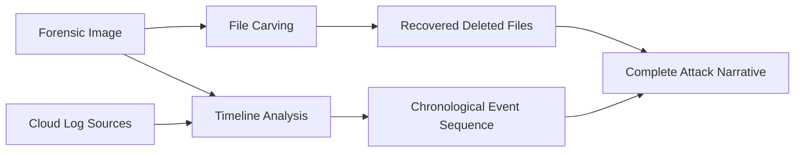

# File Carving and Timeline Analysis

## TCM Exam Objectives

- Apply three carving methodologies (header/footer, header/size, metadata-based) to recover deleted files from forensic images
- Use carving tools (Foremost, Scalpel, PhotoRec, Bulk Extractor) to extract hidden artifacts and IOCs
- Execute file system timeline analysis using fls and mactime to generate MAC timestamp timelines
- Build super timelines with Plaso (log2timeline.py, psort.py) for comprehensive event reconstruction
- Carve key file types by recognizing magic bytes (JPEG: FF D8 FF, ZIP: 50 4B 03 04, PE: 4D 5A, PDF: 25 50 44 46)
- Integrate carving results with timeline data to build a complete attack narrative
- Use Bulk Extractor for rapid IOC identification including emails, URLs, and domains
- Connect recovered artifacts to the incident timeline to prove when events occurred

Once you have a forensic image, file carving recovers hidden data fragments based on content signatures while timeline analysis arranges events chronologically to tell the story of an attack. Together, these two disciplines answer what happened and when it happened. The PSAA exam expects you to use these techniques to recover deleted evidence and reconstruct attack sequences. The exam also increasingly covers cloud forensics — Azure AD Audit Logs, M365 Unified Audit Log, and SharePoint/OneDrive artifacts — which follow the same timeline-analysis mind-set without requiring disk images.

- Three carving methodologies: header/footer, header/size, metadata-based
- Carving tools: Foremost, Scalpel, PhotoRec, Bulk Extractor
- File system timelines and super timelines with Plaso
- Integrating carving and timeline analysis
- Cloud forensics: Azure AD, M365, SharePoint, OneDrive



## Cloud Forensics (PSAA Exam Priority)

The PSAA exam now emphasizes cloud forensic analysis over traditional disk carving. Most exam scenarios involve Azure AD / M365 compromise where the evidence resides in cloud audit logs, not forensic images.

### Azure AD Audit Logs

Azure AD logs all sign-in and management activity. These are the cloud equivalent of a forensic timeline.

| Log Type | Contents | Forensic Value |
| :--- | :--- | :--- |
| Sign-in Logs | Successful/failed logins, IP, location, device, app | Impossible travel, credential compromise |
| Audit Logs | User/group changes, app registrations, directory updates | Privilege escalation, backdoor creation |
| Provisioning Logs | Automated user provisioning events | Suspicious account creation |

```kusto
// Cloud forensic timeline: reconstruct attacker activity
union SigninLogs, AuditLogs
| where TimeGenerated between (datetime(2024-06-01) .. datetime(2024-06-02))
| project TimeGenerated, Operation, ResultType, IPAddress,
          UserPrincipalName, TargetResources, InitiatedBy
| order by TimeGenerated asc
```

### M365 Unified Audit Log (OfficeActivity)

Captures Exchange, SharePoint, Teams, and Power BI activity. Critical for data-exfiltration investigations.

| Operation | What It Reveals |
| :--- | :--- |
| `MailboxLogin` | Direct mailbox access by attacker |
| `New-InboxRule` / `Set-InboxRule` | Email forwarding/exfiltration rule creation |
| `FileDownloaded` | Bulk data download from SharePoint/OneDrive |
| `FileDeleted` | Cover-up behavior after exfiltration |
| `Add app role assignment grant to user` | OAuth consent grant abuse |

```kusto
// Detect email exfiltration via inbox rule
OfficeActivity
| where Operation in ("New-InboxRule", "Set-InboxRule")
| where TimeGenerated > ago(48h)
| extend RuleName = tostring(Parameters[0].Value)
| extend ForwardTarget = tostring(Parameters[4].Value)
| where ForwardTarget contains "@"
| project TimeGenerated, UserId, Operation, RuleName, ForwardTarget
```

### SharePoint / OneDrive Artifacts

SharePoint and OneDrive store file metadata including version history, sharing links, and download events.

```kusto
// Identify bulk file access by compromised user
OfficeActivity
| where Operation == "FileDownloaded"
| where TimeGenerated > ago(24h)
| summarize FileCount = count() by UserId, ClientIP
| where FileCount > 20
| order by FileCount desc
```

The timeline-analysis and IOC-triage mindset from traditional forensics applies directly to cloud logs — the tools change (KQL instead of Plaso), but the investigative logic is identical.

## File Carving fundamentals

> 📌 **Exam Tip:** You only need to know the four key magic bytes for the exam: JPEG: `FF D8 FF`, ZIP/DOCX: `50 4B 03 04`, PE executable: `4D 5A`, PDF: `25 50 44 46`. Carving depth beyond these basics is low-yield for the PSAA — prioritize cloud forensics workflows.

File carving recovers deleted files from unallocated disk space using content signatures. The three methodologies are:

| Methodology | How It Works | Best For | Example Tool |
| :--- | :--- | :--- | :--- |
| **Header/Footer** | Finds start and end signatures | JPEG, PDF, ZIP (contiguous files) | Foremost, Scalpel |
| **Header/Size** | Reads embedded file length from header | BMP, WAV (size in header) | Scalpel |
| **Metadata-Based** | Uses residual file-system metadata | Files with partial MFT records | `icat`, `fls` |

### Tool Quick Reference

| Tool | Use Case | Basic Command |
| :--- | :--- | :--- |
| **Foremost** | Fast triage, all types | `foremost -i evidence.dd -o /output/` |
| **Scalpel** | Targeted recovery, configurable | `scalpel -c scalpel.conf -i evidence.dd -o /output/` |
| **PhotoRec** | Media and document recovery | `photorec evidence.dd` (interactive) |
| **Bulk Extractor** | IOC extraction (emails, URLs, domains) | `bulk_extractor -o /output/ evidence.dd` |

**Key exam behaviors:**
- Run Bulk Extractor first for rapid IOC triage (emails, URLs, domains)
- Use Foremost/Scalpel only when you need to recover a specific deleted file type
- Always log the carving command and results — attach to your report appendix

## Timeline Analysis

> 📌 **Exam Tip:** Always use UTC and include the log source for every event. For the PSAA, your timeline will primarily come from SIEM logs and cloud audit logs rather than file-system MAC times. Build a `union` KQL query across SigninLogs, AuditLogs, and OfficeActivity as your primary timeline tool.

### Cloud-Centric Timeline with KQL

The most exam-relevant timeline technique is a `union` query across multiple log sources — this is the cloud equivalent of a Plaso super timeline.

```kusto
// Cloud super timeline — covers sign-ins, admin actions, email, and file activity
union SigninLogs, AuditLogs, OfficeActivity
| where TimeGenerated between (datetime(2024-06-01) .. datetime(2024-06-02))
| project TimeGenerated, Source = $table, Operation, UserPrincipalName,
          ResultType, IPAddress, TargetResources
| order by TimeGenerated asc
```

### File System Timelines (Quick Reference)

The four MAC timestamps answer file-level questions when a disk image *is* available:

| Timestamp | Abbreviation | Forensic Significance |
| :--- | :--- | :--- |
| Modified | mtime | Document edits, log appends |
| Accessed | atime | File opening (may be disabled) |
| Changed | ctime | Permission changes, renaming |
| Birth/Created | crtime | First appearance on volume |

```bash
# Quick file system timeline (for when a disk image is in scope)
fls -r -m C: /cases/evidence.dd > /cases/bodyfile.txt
mactime -b /cases/bodyfile.txt -z UTC > /cases/filesystem_timeline.csv
```

### Super Timelines with Plaso (When Images Are Available)

```bash
log2timeline.py --storage-file /cases/output.plaso /cases/evidence.dd
psort.py -o l2tcsv -w /cases/super_timeline.csv /cases/output.plaso
```

**Exam note:** Plaso depth (registry, prefetch, event logs) adds richness but the PSAA rarely provides a full image requiring Plaso. Invest study time in cloud log timeline queries first.

<details>
<summary>Integrated Investigation Scenario: Hybrid (Cloud + Disk)</summary>

**Incident:** SIEM alert for impossible travel (Chicago → Moscow in 30 min) on user `jsmith@corp.com`.

**Step 1: Cloud Forensic Timeline.** Run `union SigninLogs, AuditLogs, OfficeActivity`. Find: 08:10 UTC Chicago login, 08:15 UTC Moscow login (Tor IP), 08:20 UTC inbox rule creation forwarding to `evil@gmail.com`, 08:25 UTC bulk SharePoint file downloads.

**Step 2: Host Timeline (if disk image acquired).** File system timeline shows `payload.exe` in `C:\Users\Public\` at 08:12 UTC — consistent with credential theft tool.

**Step 3: IOC Extraction.** Bulk Extractor on the forensic image extracts C2 domain `evil-c2[.]xyz`.

**Step 4: Complete Narrative.** Phishing → credential theft → cloud login → inbox rule → data exfiltration.

</details>

## Recap

For the PSAA, prioritize cloud forensic timelines (union KQL across SigninLogs, AuditLogs, OfficeActivity) over traditional disk-based timeline analysis. Know the four magic bytes (`FF D8 FF`, `50 4B 03 04`, `4D 5A`, `25 50 44 46`), the basic carving tool commands, and the MAC timestamp concepts — but allocate the majority of your timeline-building effort to cloud audit log queries.
