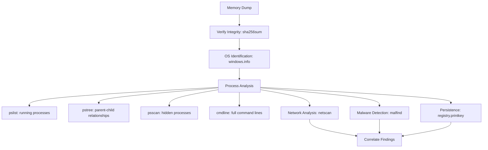
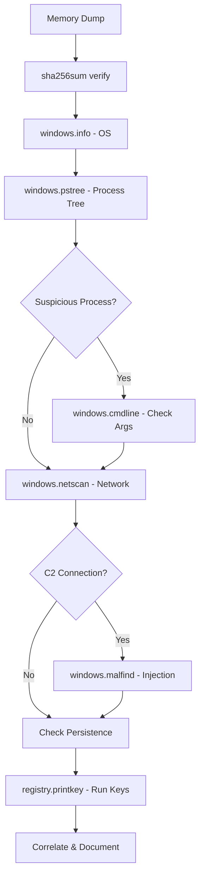

# Memory Forensics with Volatility

## TCM Exam Objectives

- Execute the Volatility 3 workflow: verify image integrity, identify OS, analyze processes, check network connections, detect injected code, and uncover persistence
- Run key Volatility plugins (pslist, pstree, psscan, cmdline, netscan, malfind, registry.printkey) and interpret their output
- Detect fileless malware and process injection through malfind analysis of abnormal memory permissions
- Correlate Volatility findings with SIEM logs and threat intelligence for comprehensive investigations
- Document memory forensics findings in the PSAA report with process-to-network-to-persistence mapping
- Identify suspicious parent-child process relationships (e.g., winword.exe spawning powershell.exe)
- Use netscan to map suspicious PIDs to C2 infrastructure for evidence chain construction
- Apply the forensic mindset: start broad with pslist, deep-dive on suspicious PIDs, correlate findings

When attackers use fileless malware that operates entirely in volatile memory, disk-based forensics finds nothing. Memory forensics analyzes the contents of a computer's RAM to uncover hidden processes, network connections, injected code, and decrypted passwords. Volatility 3 is the industry-standard framework for this task, and the PSAA expects you to understand how to use and interpret its output.

- Volatility 3 architecture and symbol tables
- Process analysis: pslist, pstree, psscan, cmdline
- Network connection analysis with netscan
- Malware detection with malfind
- Persistence analysis via registry printkey



## Volatility 3 Advantages

Volatility is an open-source, Python-based framework for analyzing memory dumps. Volatility 3 introduced key improvements:
- **No more profiles:** Automatically identifies the OS using symbol tables
- **Cross-platform:** Analyzes Windows, Linux, and macOS memory dumps
- **Plugin-driven:** Modular design with specific plugins for each artifact

This focus on extracting actionable intelligence aligns with the PSAA's goal of testing analytical efficiency 【turn0search1】.

## Practical Volatility Workflow

### Evidence Integrity and System Context

Before any analysis, verify the evidence hash and identify the operating system:

```bash
# Verify integrity of the evidence
sha256sum memory.raw

# Identify OS and kernel version
vol -f memory.raw windows.info
```

> 📌 **Exam Tip:** The pstree plugin is the most valuable starting point. An abnormal parent-child relationship like `winword.exe → powershell.exe → cmd.exe` is a classic macro attack chain. Always start with pstree to identify anomalies before diving deeper.

### Process Analysis

Attackers often hide malware by naming it similarly to legitimate system processes. A Volatility investigation follows a hierarchy:

```bash
# List all running processes
vol -f memory.raw windows.pslist

# Show full parent-child process tree
vol -f memory.raw windows.pstree

# Scan for hidden or unlinked processes (rootkit technique)
vol -f memory.raw windows.psscan

# Display full command-line arguments
vol -f memory.raw windows.cmdline
```

The `pstree` plugin is particularly valuable—it can reveal abnormal relationships like `winword.exe` spawning `powershell.exe`, a classic indicator of a malicious macro attack 【turn0search2】.

> 📌 **Exam Tip:** Correlate netscan findings with SIEM logs in your report. If netscan shows PID 4492 connected to IP 185.243.x.x, cross-reference that IP in ThreatIntelIndicators in Sentinel. Combining memory forensics with SIEM data creates a powerful evidence chain.

### Network Connections

After identifying a suspicious process, check if it is communicating with a C2 server:

```bash
# Display all active network connections and owning processes
vol -f memory.raw windows.netscan
```

This maps network sockets back to a specific PID. In your PSAA report, correlate this with the process list to link a suspicious process to a malicious external IP.

### Detecting Injected Code with Malfind

Advanced malware uses process injection to hide code inside legitimate processes like `explorer.exe`:

```bash
# Scan all processes for memory regions with injected code
vol -f memory.raw windows.malfind
```

Malfind looks for memory regions with abnormal permissions like `PAGE_EXECUTE_READWRITE`, a telltale sign of injected shellcode. The output shows injected code that can be dumped for further analysis.

### Uncovering Persistence in the Registry

Attackers often create malicious entries in Windows Registry Run keys:

```bash
# Print contents of Run and RunOnce registry keys
vol -f memory.raw windows.registry.printkey --key "Microsoft\Windows\CurrentVersion\Run"
vol -f memory.raw windows.registry.printkey --key "Microsoft\Windows\CurrentVersion\RunOnce"
```

A randomly named executable set to launch from these keys is a high-confidence IOC.

<details>
<summary>Weaving Memory Forensics into Your PSAA Report</summary>

**Example report section:**

> **Investigation of PID 4492 (hxzcyr.exe)**
>
> **Triage:** Initial process analysis with `windows.pstree` revealed an anomalous process, `hxzcyr.exe` (PID 4492), running from `C:\Users\[REDACTED]\AppData\Local\Temp\`. Legitimate processes rarely execute directly from a temporary folder.
>
> **Network Correlation:** `windows.netscan` showed PID 4492 had an established TCP connection to known-malicious external IP `185.243.xxx.xxx`, confirmed via threat intelligence.
>
> **Conclusion:** High-confidence IOC exhibiting both suspicious execution and network beaconing behavior.

A table structures your findings effectively in the Evidence or IOC sections.
</details>

## Forensic Mindset Best Practices

- **Master the triage mindset:** Start broad with `pslist` and `netscan`, then deep-dive on suspicious PIDs. The goal is rapid identification, not exhaustive analysis.
- **Evidence integrity is everything:** The first thing to document is the verified hash of the memory image.
- **Correlate, don't isolate:** A process is slightly suspicious on its own. That same process with an active C2 connection, loaded from a temporary directory, and injected into `svchost.exe` is incontrovertible evidence.
- **Trust but verify:** Cross-reference suspicious IPs found with Volatility against threat intelligence platforms or SIEM logs.



## Quick Reference

| Category | Command | Key Artifact |
| :--- | :--- | :--- |
| Integrity | `sha256sum memory.raw` | SHA256 hash of evidence |
| Context | `vol -f memory.raw windows.info` | OS version, build, system time |
| Processes | `vol -f memory.raw windows.pslist` | Running processes and PIDs |
| Processes | `vol -f memory.raw windows.pstree` | Parent-child relationships |
| Processes | `vol -f memory.raw windows.cmdline` | Full command-line arguments |
| Malware | `vol -f memory.raw windows.malfind` | Injected code, process hollowing |
| Network | `vol -f memory.raw windows.netscan` | Active TCP/UDP connections |
| Persistence | `vol -f memory.raw windows.registry.printkey` | Autorun registry keys |

## Recap

Memory forensics with Volatility 3 allows analysts to find threats that disk-based forensics cannot 【turn0search1】【turn0search2】. Master the practical workflow: verify integrity → identify OS → enumerate processes → check network connections → detect injected code → uncover persistence. Correlate findings across plugins to build a complete picture of the compromise. In the PSAA, even if you don't run Volatility directly, you must understand its output and how to interpret its artifacts.
