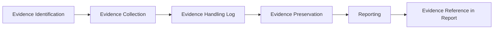
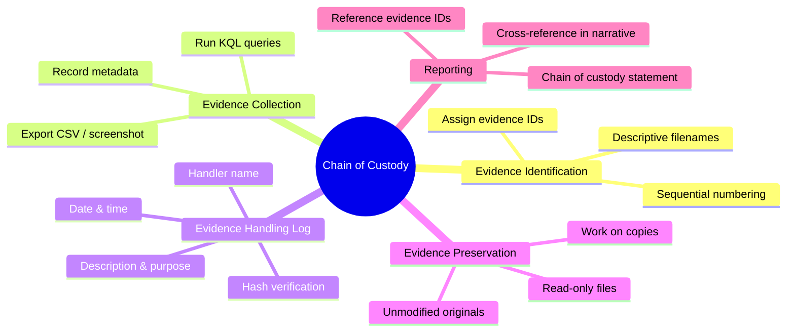

# Chain of Custody and Documentation

## TCM Exam Objectives

- Implement the three pillars of chain of custody (Integrity, Authentication, Accountability) for digital evidence
- Assign evidence IDs and maintain a continuous timestamped investigation journal
- Document KQL queries with exact text, execution time, and output summaries for reproducibility
- Preserve evidence through read-only exports, hash verification, and unmodified screenshots
- Build evidence handling logs that track collection time, source, format, and analyst
- Write chain of custody statements suitable for the PSAA exam report
- Apply consistent naming conventions and UTC time zones for all evidence references
- Transform raw findings into a professional report narrative with proper evidence cross-referencing

Chain of custody is the chronological documentation recording the seizure, custody, control, transfer, analysis, and disposition of evidence. Its purpose is to demonstrate that evidence is exactly as it was when first obtained—unmodified, uncorrupted, and handled only by authorized individuals. In the PSAA exam, your evidence is digital: log query results, screenshots, exported CSV files, and workbooks. Strong documentation can elevate an average technical investigation into a standout report.

- Three pillars: integrity, authentication, accountability
- Evidence types and preservation in SIEM investigations
- The investigator's journal
- Custody workflow from collection to report



## The Three Pillars

| Pillar | Meaning | PSAA Application |
| :--- | :--- | :--- |
| Integrity | Evidence remains unchanged | Hash verification, unmodified exports |
| Authentication | Evidence can be proven to come from claimed source | Query text, time range, source table documented |
| Accountability | Every handler identified | Evidence log with analyst name, timestamps |

In traditional forensics, this involves signed forms and tamper-evident bags. In the PSAA, your evidence is digital and you must prove it has not been altered, can be traced back to the original source, was handled only by you, and is accompanied by metadata so anyone can independently verify it 【turn0search1】.

## Evidence Types and Preservation

| Evidence Type | How to Collect | How to Preserve | Key Metadata |
| :--- | :--- | :--- | :--- |
| Raw query results | Screenshot or CSV export | Capture immediately, do not edit | Query text, time run, time range, table |
| Investigation graph | Screenshot in Sentinel | Full-screen with URL bar visible | Incident ID, time of capture |
| Entity page details | Screenshot | Include Sentinel UI timestamp | Entity identifier, time of capture |
| Exported CSV | Download from query results | Rename descriptively, note original query | File name, query, export time |
| Alert/incident comments | Screenshot of comment history | Each comment has timestamp and author | Incident ID, author, timestamp |

### Hashing Digital Evidence

```powershell
Get-FileHash -Path "C:\Evidence\SigninLogs_export.csv" -Algorithm SHA256
```

Even if the exam environment does not allow hashing, the act of noting that you would and explaining the concept in your report shows forensic awareness.

> 📌 **Exam Tip:** Start your investigation journal the moment you open an incident. Record every query, every finding, and every decision with UTC timestamps. This journal becomes the backbone of your PSAA report and proves your methodology was systematic.

## The Investigator's Journal

Documentation is the written record of your investigation. It is the story of your evidence handling. Record:

- Date and time (UTC) of every significant action
- Action taken (e.g., "Opened incident #1234," "Ran KQL query X," "Exported results to CSV")
- Reason for action
- Results summary
- Evidence reference (filename or ID)
- Next steps

**Example journal entry:**
```
[2024-01-15 09:45 UTC] Opened incident #567 - "Impossible travel - user asmith"
[09:47 UTC] Reviewed alert entities: user=asmith@company.com, IPs=74.x.x.x (Chicago), 5.x.x.x (Moscow)
[09:50 UTC] Ran query: SigninLogs | where UserPrincipalName == "asmith@company.com" | where TimeGenerated > ago(7d)
             Results exported as Evidence_01_SigninLogs.csv
[09:55 UTC] Moscow IP flagged as Tor exit node by ThreatIntelIndicators (Confidence 95). Screenshot: Evidence_02_TI_Match.png
[10:00 UTC] Pivot to OfficeActivity: found inbox rule forwarding to external. Screenshot: Evidence_03_InboxRule.png
```

Document KQL queries with exact text, time run, and output summary:

```
Query 1: User sign-in collection
Kusto: SigninLogs | where UserPrincipalName == "asmith@company.com" | where TimeGenerated > ago(7d) | project TimeGenerated, IPAddress, Location, ResultType
Run: 2024-01-15 09:50 UTC
Output: Evidence_01_SigninLogs.csv (238 rows)
```

## Custody Workflow

### Step 1: Evidence Identification
Assign an evidence reference ID prefix (e.g., "INC-567-E"). Every piece of evidence gets a sequential number.

### Step 2: Evidence Collection
Run your query, immediately export or screenshot results, record file name, time collected, query used, and source table.

### Step 3: Evidence Handling Log
| Evidence ID | Description | Source | Collection Time | Format | Analyst |
| :--- | :--- | :--- | :--- | :--- | :--- |
| INC-567-E01 | Sign-in logs for asmith | SigninLogs, Query 1 | 09:50 UTC | CSV | Analyst name |

### Step 4: Evidence Preservation
Do not modify screenshots. Keep original CSV unchanged. Work on copies for filtering. Note derivatives in journal.

### Step 5: Reporting
Include each evidence item with its ID, a caption, and a reference back to the chain of custody log. Include a Chain of Custody statement:

> "All evidence was collected directly from Microsoft Sentinel using KQL queries against the live log environment. Each query output was immediately exported to CSV or captured via screenshot without modification. Evidence items were sequentially numbered and recorded in an evidence log."

> 📌 **Exam Tip:** When documenting evidence in your PSAA report, always include the evidence ID, source table, time range, and query used. A well-documented evidence entry allows an independent analyst to reproduce your findings exactly—a key indicator of forensic professionalism.

## Documentation Standards

- **Incident identifier:** Use Sentinel incident number
- **Time zone:** Always UTC
- **Naming conventions:** Consistent, descriptive (`INC-1220-E01_SigninLogs_2026-05-20.csv`)
- **Read-only preservation:** Mark evidence files as read-only after collection

<details>
<summary>Practical PSAA Scenario: Account Compromise</summary>

**Incident:** Alert "Suspicious sign-in from Tor exit node - user bsmith."

**Evidence Log:**
| Evid ID | Description | Source | Collection Time |
| :--- | :--- | :--- | :--- |
| INC-1220-E01 | SigninLogs for bsmith, last 48h | SigninLogs | 12:05 UTC |
| INC-1220-E02 | TI match for IP 45.67.89.123 | ThreatIntelIndicators | 12:07 UTC |
| INC-1220-E03 | OfficeActivity for bsmith (file downloads) | OfficeActivity | 12:15 UTC |

**Journal:**
```
[12:00 UTC] Alert INC-1220 opened. User: bsmith@corp.com, IP: 45.67.89.123.
[12:05] Collected SigninLogs (Query 1, exported as E01).
[12:07] IP is Tor exit node, Confidence 95 (screenshot E02).
[12:15] Collected OfficeActivity (Query 3, exported as E03). Found 67 file downloads.
[12:30] Conclusion: Account compromise, data exfiltration.
```
</details>

## Best Practices and Pitfalls

| Best Practice | Common Pitfall |
| :--- | :--- |
| Start a journal immediately upon opening an incident | Failing to document time range of a query |
| Assign evidence IDs as you go | Cropping screenshots so source is hidden |
| Keep raw data separate from analysis | Altering original data |
| Use built-in Sentinel timestamps for screenshots | Assuming "it's in the cloud" is enough |
| Log every query even if it returns no results | Not referencing evidence in the narrative |



## Recap

Chain of custody and documentation are the hallmarks of a professional security analyst 【turn0search1】. In the PSAA, strong documentation elevates an average technical investigation into a standout report. Assign unique evidence IDs, maintain a continuous timestamped journal, preserve unaltered originals, and reference every piece of evidence in your report narrative. Treat every query like a piece of forensic evidence.
