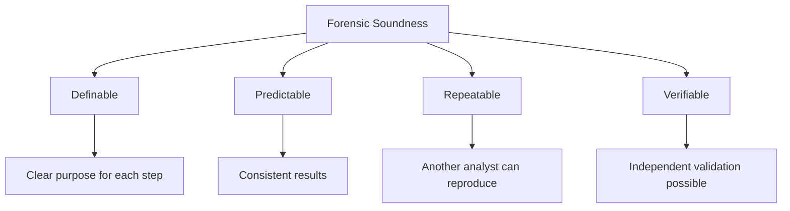
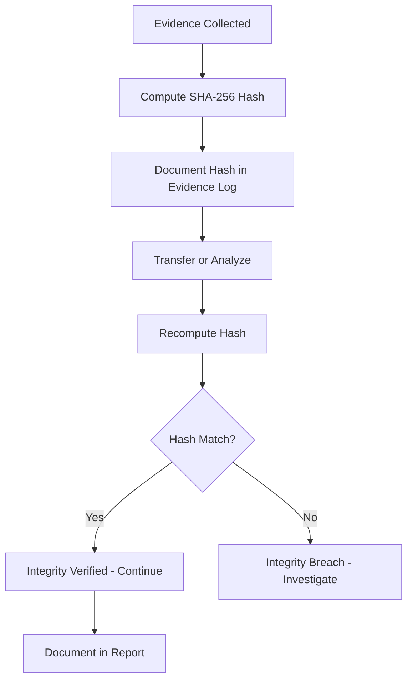

# Forensic Soundness and Evidence Integrity

## TCM Exam Objectives

- Apply the four pillars of forensic soundness (Definable, Predictable, Repeatable, Verifiable) to SIEM-based investigations
- Implement ACPO principles for digital evidence handling within a SOC context
- Use cryptographic hashing (SHA-256) to verify evidence integrity throughout the investigation lifecycle
- Document chain of custody for every exported log, screenshot, and KQL result
- Apply the Order of Volatility when prioritizing evidence collection from live systems
- Distinguish between write-blocked acquisition and live forensics methodologies
- Build a defensible evidence integrity section in the PSAA exam report
- Recommend SIEM log integrity measures including centralized forwarding and tamper detection

Forensic soundness is the quality of an acquisition and investigation process that preserves original evidence with minimal changes, ensuring a complete and accurate representation that can be validated for authenticity and integrity. In the PSAA exam, forensic soundness is the standard that elevates your investigation from a collection of screenshots to a defensible, professional analysis.

- Four pillars of forensic soundness
- ACPO principles and NIST SP 800-86
- Cryptographic hashing for evidence integrity
- Chain of custody and order of volatility
- SIEM log integrity measures

## Four Pillars of Forensic Soundness

| Pillar | Meaning | PSAA Application |
| :--- | :--- | :--- |
| Definable | Purpose and outcome of each step can be clearly stated | Explain why you ran a specific SIEM query |
| Predictable | Process produces consistent results when applied correctly | Same SPL search with same time window returns same events |
| Repeatable | Another qualified analyst can obtain same results | Report documents every query, filter, enrichment |
| Verifiable | Authenticity and integrity can be validated independently | File hashes before/after transfers, chain of custody documented |

When your evaluator reads your report, they ask: "If I sat down at this SIEM, could I follow these exact steps and arrive at the same conclusion?" If yes, your investigation is forensically sound 【turn0search1】.

## Legal and Procedural Framework

> 📌 **Exam Tip:** In your PSAA report, include a brief evidence integrity statement: "All evidence was collected from the SIEM using documented KQL queries. Query outputs were exported to CSV and verified with SHA-256 hashes before analysis." This one paragraph demonstrates forensic awareness.

### ACPO Principles

The Association of Chief Police Officers Good Practice Guide for Digital Evidence sets the global benchmark:

- **Principle 1:** No action should change data held on a digital device that may be relied upon in court. Forensic images must be created before analysis.
- **Principle 2:** Anyone accessing original data must be competent to do so and able to give evidence explaining their actions.
- **Principle 3:** An audit trail of all processes applied to digital evidence should be created and preserved. An independent third party should be able to examine those processes and achieve the same result.
- **Principle 4:** The person in charge of the investigation has overall responsibility for adhering to these principles.

**How to apply ACPO in the PSAA:** Your SIEM query history, timestamped screenshots, and step-by-step report narrative form your audit trail (Principle 3). Always work from copies of data rather than modifying original endpoints (Principle 1).

### NIST SP 800-86

NIST SP 800-86, "Guide to Integrating Forensic Techniques into Incident Response," describes processes for performing effective forensics activities. Key concepts for the PSAA: forensic data should be collected in a structured, repeatable manner; evidence integrity must be maintained through documented procedures; different data sources require different collection techniques 【turn0search2】.

## Cryptographic Hashing

Hashing is the single most important technical control for proving evidence integrity.

### How Hashing Proves Integrity

1. Compute hash of original evidence before acquisition
2. Document the hash value and algorithm
3. After any transfer, copy, or analysis step, recompute the hash
4. If hashes match, integrity is intact. If they differ, evidence has been altered

### Common Hash Algorithms

| Algorithm | Bit Length | Status | PSAA Guidance |
| :--- | :--- | :--- | :--- |
| MD5 | 128 bits | Broken (collision attacks) | Avoid alone; use SHA-256 |
| SHA-1 | 160 bits | Weakened | Acceptable for non-adversarial checks |
| SHA-256 | 256 bits | Secure | Gold standard |

### Hashing in the PSAA Context

- **File hashes:** Extract suspicious file hash, note SHA-256, verify against VirusTotal
- **Log export hashes:** Compute hash of exported CSV and include in report
- **IOC validation:** Document the algorithm used to verify

A matching hash proves integrity but not authenticity. Authenticity is established through documented chain of custody.

> 📌 **Exam Tip:** The Order of Volatility is a favorite exam concept. Remember the priority: RAM first (most volatile), then network state, temp files, disk, then backups (least volatile). In the PSAA, note that you would capture memory before powering down a live endpoint.

## Chain of Custody

Every transfer or significant handling of evidence must be logged with: date and time, name and role of handler, description of evidence, purpose, location, and hash value before and after transfer.

| Date/Time (UTC) | Handler | Action | Evidence | Hash (SHA-256) | Purpose |
| :--- | :--- | :--- | :--- | :--- | :--- |
| 2026-05-19 14:05 | Analyst J. Smith | Initial collection | Sysmon EID 1 log export | `a1b2c3...` | Investigation of alert #1034 |
| 2026-05-19 14:30 | Analyst J. Smith | Copy to workstation | Same log export | `a1b2c3...` (verified) | Offline analysis |

## Order of Volatility

| Priority | Data Type | Volatility | PSAA Relevance |
| :--- | :--- | :--- | :--- |
| 1 (Highest) | Registers, CPU cache | Milliseconds | Rarely collected in SOC |
| 2 | RAM, network state | Seconds to minutes | Memory dumps, netstat output |
| 3 | Temporary file systems | Hours to days | `/tmp`, pagefile.sys |
| 4 | Disk | Persistent | Forensic disk images |
| 5 (Lowest) | Backups, logs | Months to years | SIEM archived logs |

In the exam, you work inside a SIEM with pre-collected logs. Demonstrate awareness by recommending volatile data capture from live endpoints before powering them down.

## Forensically Sound Acquisition

**Write blockers** prevent modification to original evidence. Hardware write blockers physically intercept write commands. The principle in the PSAA: never alter original evidence—when you query a SIEM, you read without modifying; when you export logs, you work from a copy.

**Forensic imaging** creates a verified bit-for-bit copy including deleted files and unallocated space. Always includes write-blocking, hashing before and after, and documentation of tool, method, and hashes.

**Live forensics** involves collecting evidence from a running system. Capture RAM and network state first (per order of volatility), then move to disk.

## Ensuring SIEM Log Integrity

Logs must be centralized and immutable. All endpoints should synchronize in real time to an independent SIEM platform with encrypted transmission. Tamper-evident logging uses cryptographic hash chaining—each log entry contains a hash of the previous entry. File Integrity Monitoring and SIEM detections should monitor for log clearance:

- Event ID 1102 (Security audit log cleared)
- Sysmon driver unload events

**PSAA Recommendations:**
- Enable Windows Event Log forwarding to centralized SIEM with TLS
- Implement hash-verified log exports for major investigations
- Create SIEM alert for Event ID 1102
- Establish minimum log retention in WORM storage

PSAA Report: Evidence Integrity Section

| Evidence Item | Source | Collection Method | Hash (SHA-256) | Verified? |
| :--- | :--- | :--- | :--- | :--- |
| Sysmon EID 1 logs (14:00-15:00) | DESKTOP-CLIENT1 | Splunk export to CSV | `a1b2c3...` | Yes |
| Firewall connection logs | Perimeter-FW-01 | Splunk export to CSV | `d4e5f6...` | Yes |
| Malicious payload.exe | DESKTOP-CLIENT1 | Manual extraction | `e3b0c4...` | Yes - matched VirusTotal |

**Chain of Custody Narrative:**
"All evidence was collected from the SIEM using documented search queries. The raw logs were exported to CSV files, each with SHA-256 hash computed immediately upon export. Hashes were verified before any offline analysis. No modifications were made to exported data."

## Recap

Forensic soundness and evidence integrity validate every other forensic skill 【turn0search1】【turn0search2】. When you find a C2 IP, hash the log export and document the query. When you extract a malware hash, verify it against VirusTotal and note the algorithm. When you write your report, ensure every step is repeatable. The four pillars—definable, predictable, repeatable, verifiable—are the lens through which all other skills are validated.
