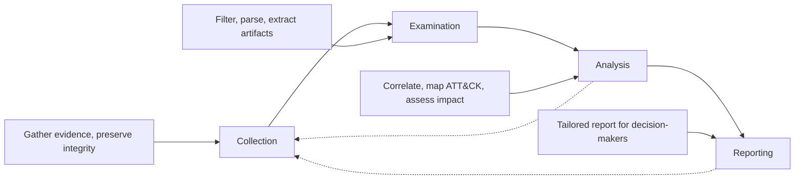
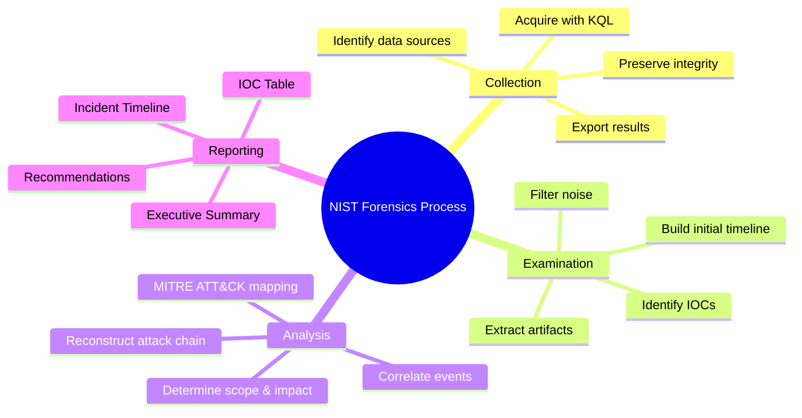

# The NIST Forensics Process (SP 800-86)

## TCM Exam Objectives

- Apply the four-phase NIST forensic process (Collection, Examination, Analysis, Reporting) to SIEM-based investigations
- Execute broad KQL collection queries using union, where, and project to gather evidence across Sentinel tables
- Filter noise and extract artifacts during the Examination phase using parse, extract, and extend operators
- Correlate events across multiple log sources and reconstruct attack chains using join and summarize
- Produce a professionally formatted forensic report with Executive Summary, Timeline, MITRE Mapping, and IOCs
- Map incident types (brute force, phishing, malware) to primary and secondary Sentinel log tables
- Demonstrate evidence integrity through query documentation and chain of custody practices
- Write analysis sections that connect raw data to root cause, scope, impact, and attribution

The NIST Forensic Process, formalized in NIST SP 800-86, provides a structured four-phase approach: Collection, Examination, Analysis, and Reporting. In the PSAA exam, this process applies to logs, cloud activity, network traffic, and SIEM data—not physical hard drives. Applying this methodology ensures you capture all relevant evidence, prevent premature conclusions, and produce a professional, defensible report.

- Four phases: Collection, Examination, Analysis, Reporting
- KQL-driven workflows for each phase
- Incident type to log table mapping
- Report structure aligned with PSAA expectations



## Phase 1: Collection

Collection is about identifying, acquiring, and preserving digital evidence. In the PSAA SIEM-centric environment, collection means extracting the right log data before it rolls off.

> 📌 **Exam Tip:** During Collection, use `union` to gather data from all relevant tables in one query. This ensures you don't miss cross-table correlations. Follow the incident type table to choose the right primary and secondary tables for your specific scenario.

### Identifying Data Sources

| Incident Type | Primary Tables | Secondary Tables |
| :--- | :--- | :--- |
| Brute-force / Account compromise | `SigninLogs` | `OfficeActivity`, `AuditLogs`, `SecurityEvent` |
| Phishing / Email-based attack | `OfficeActivity` (Exchange), `EmailEvents` | `SigninLogs`, `AuditLogs` |
| Malware / C2 activity | `SecurityEvent`, `CommonSecurityLog` | `VMConnection`, `ThreatIntelIndicators` |
| Data exfiltration | `OfficeActivity`, `CommonSecurityLog` | `SigninLogs`, `AuditLogs` |
| Lateral movement | `SecurityEvent` (4624, 4688) | `WindowsFirewall`, `Syslog` |

### Acquiring Evidence with KQL

```kusto
// Broad user-centric collection
let targetUser = "jsmith@domain.com";
let startTime = datetime(2024-01-15T06:00:00Z);
let endTime = datetime(2024-01-15T12:00:00Z);
union SigninLogs, OfficeActivity, AuditLogs
| where TimeGenerated between (startTime .. endTime)
| where UserPrincipalName == targetUser or UserId == targetUser
| project TimeGenerated, Source = $table, Operation, ResultType, IPAddress, ClientIP, Computer
| order by TimeGenerated asc
```

```kusto
// IOC-based collection (pivot on malicious IP)
let badIP = "185.220.101.34";
let startTime = ago(7d);
union SigninLogs, OfficeActivity, CommonSecurityLog
| where TimeGenerated > startTime
| where IPAddress == badIP or ClientIP == badIP or SourceIP == badIP
| project TimeGenerated, Source = $table, Operation, UserPrincipalName, DestinationIP, ResultType
| order by TimeGenerated asc
```

### Preserving Evidence Integrity

- Export query results to CSV when appropriate—freezes a snapshot
- Take full-screen screenshots with timestamp, query text, and results
- Save all KQL queries as acquisition notes
- Record metadata: table, time range, query logic, reason

<details>
<summary>Collection Checklist</summary>

- Read the alert and list all entities (user, IP, host, domain)
- Identify relevant log tables for each entity
- Determine appropriate time window (include 24h before first alert)
- Run broad collection queries using `union`
- Export/download critical query results
- Take screenshots of raw collected data
- Log each collection step in investigation journal
</details>

## Phase 2: Examination

Examination sifts through collected data to locate artifacts relevant to the incident. In the PSAA, this phase is dominated by KQL filtering, parsing, and extraction.

### Filtering Out Irrelevant Noise

```kusto
union SigninLogs, OfficeActivity
| where TimeGenerated between (startTime .. endTime)
| where UserPrincipalName == targetUser
| where ResultType != 0 or Operation in ("FileDownloaded", "New-InboxRule")
```

Remove known internal IPs, service accounts, and scheduled tasks:
```kusto
| where IPAddress !startswith "10.10." and IPAddress !startswith "192.168."
| where UserPrincipalName !endswith "svc_"
```

### Extracting and Normalizing Artifacts

```kusto
// Extract IPs from a log message
| extend ExtractedIP = extract(@"\b(\d{1,3}\.\d{1,3}\.\d{1,3}\.\d{1,3})\b", 1, EventDescription)

// Parse structured syslog message
| parse SyslogMessage with "Failed password for " User " from " SourceIP " port " Port

// Extract file names from OfficeActivity parameters
| extend FileName = tostring(parse_json(Parameters).SourceFileName)
```

### Building the Initial Timeline

```kusto
| project TimeGenerated, EventType = Operation, Details = strcat("User: ", UserPrincipalName, ", IP: ", IPAddress)
| order by TimeGenerated asc
```

### Identifying IOCs

```kusto
| where isnotempty(IPAddress)
| summarize EventCount = count() by IPAddress
| where IPAddress !startswith "10." and IPAddress !startswith "192.168."
| order by EventCount desc
```

> 📌 **Exam Tip:** In the Analysis phase, always reconstruct the full attack chain using MITRE ATT&CK. Map each event to a technique ID and organize them chronologically. This turns a log dump into a compelling attack narrative that evaluators can follow easily.

## Phase 3: Analysis

Analysis turns raw data into intelligence. Your analysis must answer: root cause, timeline, scope, impact, and attribution.

### Correlating Events Across Tables

```kusto
// Correlate suspicious sign-in with subsequent Office operations
let SuspiciousSignins = SigninLogs
| where TimeGenerated > ago(24h)
| where IPAddress == "45.67.89.123"
| project TimeGenerated, UserPrincipalName;
OfficeActivity
| where TimeGenerated > ago(24h)
| join kind=inner SuspiciousSignins on UserPrincipalName
| where TimeGenerated >= TimeGenerated1
| project TimeGenerated, Operation, UserId, ClientIP, SourceFileName
```

### Reconstructing the Attack Chain

Map the sequence to a kill chain or MITRE ATT&CK:

1. **Initial Access:** Valid credentials obtained via phishing (T1566)
2. **Execution:** PowerShell download cradle (T1059.001)
3. **Credential Access:** LSASS dump (T1003.001)
4. **Lateral Movement:** RDP to domain controller (T1021.001)
5. **Exfiltration:** Files copied via outbound HTTPS (T1048)

### Determining Scope and Impact

- **Accounts affected:** List users with unusual activity via `SigninLogs` and `AuditLogs`
- **Systems affected:** Identify hosts with malicious processes or suspicious logons
- **Data accessed:** Quantify from `OfficeActivity` and `CommonSecurityLog`

## Phase 4: Reporting

### Report Structure

1. **Executive Summary:** 2-3 paragraphs for non-technical stakeholders
2. **Investigation Summary:** Steps taken, tools used, false leads eliminated
3. **Incident Timeline:** Table with UTC timestamp, event description, log source, analyst notes
4. **MITRE ATT&CK Mapping:** Tactic, Technique ID, Technique Name, Observed Activity, Evidence
5. **Indicators of Compromise:** IOC, Type, Context, Confidence, Source
6. **Evidence Section:** Screenshots with captions referenced in narrative
7. **Impact Assessment:** Accounts, systems, data affected, quantified where possible
8. **Remediation and Recommendations:** Immediate actions and long-term improvements
9. **Appendix:** Full list of KQL queries used

### Writing with NIST Principles

- **Accuracy:** Every statement supported by evidence
- **Objectivity:** State facts, not assumptions
- **Repeatability:** Include exact queries for reproduction
- **Audience awareness:** Executive Summary for management, IOC table for engineers

| Phase | Key Actions | KQL / Tools |
| :--- | :--- | :--- |
| Collection | Identify tables, define time window, run broad queries, export | `union`, `where TimeGenerated > ago()`, `project` |
| Examination | Filter noise, extract artifacts, build timeline, list IOCs | `where`, `parse`, `extract`, `extend`, `order by` |
| Analysis | Correlate events, map ATT&CK, reconstruct attack chain | `join`, `summarize`, `render timechart`, Investigation Graph |
| Reporting | Write Executive Summary, Timeline, MITRE Mapping, IOCs | Clean `project` for tables, captioned screenshots |



## Recap

The NIST Forensic Process is a framework for structured, defensible investigations 【turn0search1】【turn0search2】【turn0search3】. In the PSAA, ability to collect comprehensively, examine meticulously, analyze rigorously, and report clearly separates passing submissions from exceptional ones. Every query written and every screenshot taken is a piece of evidence—treat it with the same care a court-certified forensic examiner would.
