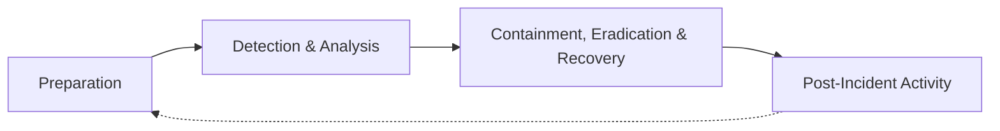
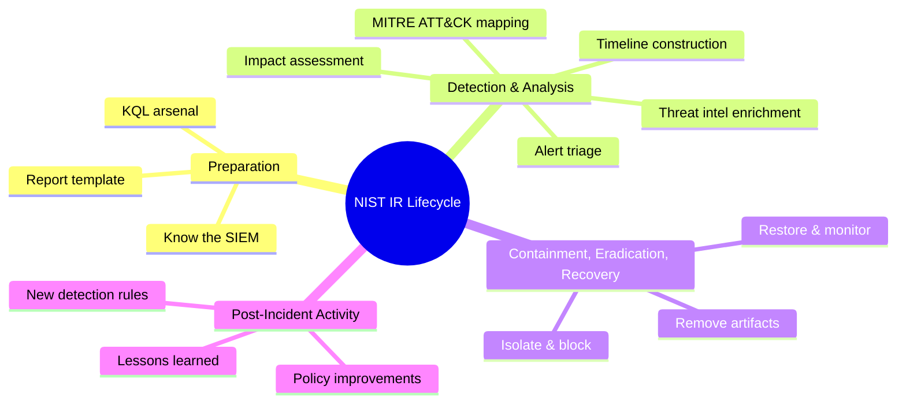

# NIST Incident Response Lifecycle (SP 800-61)

## TCM Exam Objectives

- Apply the four-phase NIST Incident Response Lifecycle (Preparation, Detection & Analysis, Containment Eradication & Recovery, Post-Incident Activity) to PSAA scenarios
- Execute comprehensive detection and analysis using KQL for timeline construction and root cause determination
- Write actionable containment, eradication, and recovery recommendations grouped by phase
- Produce post-incident activity findings including lessons learned and new detection rule proposals
- Build a complete investigation workflow from the first alert through to preventive recommendations
- Use the lifecycle as a report structure template for PSAA submissions
- Demonstrate understanding of the iterative feedback loop between post-incident activity and preparation
- Map NIST phases to specific KQL operations such as union, join, summarize, and render

The NIST Incident Response Lifecycle, formalized in NIST SP 800-61 Revision 2, provides a four-phase framework for handling security incidents: Preparation, Detection & Analysis, Containment Eradication & Recovery, and Post-Incident Activity. Every PSAA investigation should be structured around these phases.

- Four-phase NIST Incident Response Lifecycle
- PSAA mapping for each phase
- KQL-driven investigation workflow
- Practical walkthrough and reporting guidance



## The NIST Lifecycle at a Glance

| Phase | Core Objective | PSAA Equivalent |
| :--- | :--- | :--- |
| **Preparation** | Build capabilities before an incident | Know the SIEM, have queries ready, report template prepared |
| **Detection & Analysis** | Identify incidents, determine scope and root cause | Triage alerts, run KQL investigations, map to MITRE ATT&CK |
| **Containment, Eradication & Recovery** | Stop damage, remove threat, restore operations | Recommend specific containment, eradication, and recovery actions |
| **Post-Incident Activity** | Learn and improve | Lessons learned, new detection rules, policy recommendations |

The first two phases happen during your 48-hour investigation window. The last two are articulated in your 48-hour report.

## Phase 1: Preparation

Preparation is everything done before an incident occurs. In the PSAA, you don't configure Sentinel or write the IR plan, but you walk in with a prepared mind and toolkit.

### Preparation Checklist

- **Know the SIEM:** Navigate Microsoft Sentinel confidently—log tables, investigation graph, alert rules, entity pages
- **Have a KQL arsenal:** Personal cheat sheet of go-to queries for brute force, impossible travel, data exfiltration, C2
- **Prepare a report template:** Skeleton with Executive Summary, Timeline, MITRE ATT&CK, IOCs, Recommendations
- **Understand the IR policy:** Standard SOC containment strategies are expected knowledge
- **Know log retention:** Which tables are available, approximate retention periods

<details>
<summary>KQL Arsenal for PSAA Preparation</summary>

```kusto
// Brute force detection
SigninLogs
| where TimeGenerated > ago(1h)
| where ResultType != 0
| summarize FailedAttempts = count() by UserPrincipalName, IPAddress
| where FailedAttempts > 10

// Impossible travel
SigninLogs
| where TimeGenerated > ago(1h)
| summarize Locations = make_set(Location) by UserPrincipalName
| where array_length(Locations) > 1

// New account creation
AuditLogs
| where OperationName == "Add user"
| where TimeGenerated > ago(24h)
```
</details>

## Phase 2: Detection & Analysis

This is where you spend the bulk of your 48 investigation hours. Detection & Analysis covers everything from the first alert to a complete understanding of what happened.

> 📌 **Exam Tip:** During Detection & Analysis, document negative findings as well as positive ones. Writing "No lateral movement was detected from the compromised host" proves you checked thoroughly and demonstrates analytical rigor to the evaluators.

### Detection: From Alert to Confirmed Incident

Detection starts when an alert fires. The first task is **triage**—deciding if it is a true positive, false positive, or suspicious enough to investigate.

- Examine the alert: severity, title, entities, timestamp, MITRE tactics
- Correlate with threat intelligence: query `ThreatIntelIndicators` for IPs, domains, hashes
- Check for related alerts: investigation graph and related alerts in Sentinel

### Analysis: Scoping and Root Cause

Once confirmed, analysis aims to answer:
- What was the initial access vector? (phishing, brute force, RDP, valid accounts)
- What did the attacker do? (run commands, create persistence, move laterally, access data)
- Which systems and accounts are affected?
- What data was accessed or exfiltrated?

```kusto
// Build a broad timeline for the affected user
let target = "user@domain.com";
let start = ago(7d);
union SigninLogs, OfficeActivity, AuditLogs
| where TimeGenerated > start
| where UserPrincipalName == target or UserId == target
| project TimeGenerated, Source = $table, Operation, ResultType, IPAddress, ClientIP
| order by TimeGenerated asc
```

### Analysis Workflow

1. **Broad collection** — Pull all relevant activity for the compromised entity
2. **Timeline construction** — Order everything chronologically, annotate with interpretation
3. **Persistence hunting** — Check for inbox rules (OfficeActivity), scheduled tasks (Event ID 4698), registry changes (Event ID 4657)
4. **Lateral movement detection** — Query Event ID 4624 Logon Type 3 and 10 from compromised hosts
5. **Exfiltration assessment** — Summarize file downloads, outbound bytes, forwarded emails
6. **MITRE ATT&CK mapping** — Every attack step gets a technique ID

```kusto
// Hunt for persistence: new inbox rules
OfficeActivity
| where TimeGenerated > ago(24h)
| where Operation == "New-InboxRule"
| where UserId == "user@domain.com"
| project TimeGenerated, Parameters

// Lateral movement: network logons
SecurityEvent
| where EventID == 4624 and LogonType in (3, 10)
| where IpAddress == "10.1.1.56"
| project TimeGenerated, TargetComputer = Computer, TargetUserName
```

<details>
<summary>Documentation During Analysis</summary>

- Maintain a chronological investigation journal (timestamps, actions, findings)
- For every significant finding, capture a screenshot and assign an evidence ID
- Keep a running list of IOCs (IPs, domains, hashes, rule names)
- Note negative findings: "No lateral movement observed" is valuable documentation
</details>

### The Impact Assessment

The Detection & Analysis phase concludes with an impact statement: e.g., "Approximately 500 files containing financial data were downloaded. Two domain admin accounts were compromised. No ransomware was deployed." This demonstrates understanding of business impact, not just technical events.

## Phase 3: Containment, Eradication & Recovery

In a live incident, this is where you act. In the PSAA, you recommend these actions in your report. The quality of recommendations can make or break your score.

### Containment: Stop the Damage

| Action | PSAA Recommendation Example |
| :--- | :--- |
| **User accounts** | "Immediately force password reset and disable compromised accounts" |
| **Network isolation** | "Disconnect compromised hosts from the network via VLAN isolation" |
| **IP/Domain blocking** | "Block attacker IPs at perimeter firewall and in Azure AD Conditional Access" |
| **Cloud containment** | "Revoke refresh tokens, block external forwarding rules in Exchange Online" |

### Eradication: Remove the Threat

| Action | PSAA Recommendation Example |
| :--- | :--- |
| **Remove persistence** | "Delete malicious inbox rules, scheduled tasks, registry run keys" |
| **Delete malware** | "Run full endpoint scan, delete identified malicious files" |
| **Close access vector** | "Patch vulnerable software, enforce MFA, block sender domain" |
| **Rotate credentials** | "Reset all service account passwords and Kerberos tickets" |

### Recovery: Return to Normal

| Action | PSAA Recommendation Example |
| :--- | :--- |
| **Restore from backup** | "Restore affected systems from backups verified clean" |
| **Rebuild hosts** | "Rebuild compromised hosts from trusted image if root compromise suspected" |
| **Re-enable accounts** | "Re-enable accounts only after password reset and MFA setup" |
| **Monitor closely** | "Enhanced logging and monitoring for 72 hours post-recovery" |

In your report, list recommendations grouped under Containment, Eradication, and Recovery. Show the logical sequence: stop first, clean second, restore third.

```kusto
// Identity compromise: find all sign-ins from the malicious IP
SigninLogs
| where IPAddress == "45.67.89.123"
| where ResultType == 0
| summarize SuccessfulLogins = count() by UserPrincipalName

// Find all hosts that need credential rotation
SecurityEvent
| where TargetUserName == "jsmith"
| where EventID == 4624
| summarize Computers = make_set(Computer) by TargetUserName
```

> 📌 **Exam Tip:** Structure your containment, eradication, and recovery recommendations as a numbered, sequential checklist. Show the evaluator the logical order: stop first (containment), clean second (eradication), restore third (recovery). This demonstrates operational maturity.

## Phase 4: Post-Incident Activity

This phase is about learning and improving. The PSAA explicitly expects a lessons-learned component in your report.

### Lessons Learned Questions

- What went well? (e.g., "The impossible travel rule detected the compromise within 15 minutes")
- What went wrong? (e.g., "Lack of PowerShell logging prevented full command-line visibility")
- What gaps existed? (e.g., "No MFA on the compromised account allowed brute force to succeed")
- How can we improve detection? (e.g., "Create custom analytics rule for mass file downloads")
- How can we prevent recurrence? (e.g., "Enforce MFA for all cloud identities")

### New Detection Rules and Policy Updates

Propose specific new Sentinel analytics rules based on what you found. If you discovered a brute force that slipped under the radar, suggest a custom rule with a lower threshold.

Also recommend policy improvements: "Implement a stricter password policy," "Deploy EDR on all servers," "Conduct quarterly phishing simulations."

| Gap Found | Recommendation |
| :--- | :--- |
| Account lacked MFA | "Enforce MFA for all users via Conditional Access policy" |
| Inbox rule forwarding not monitored | "Create Sentinel rule for New-InboxRule with external forwarding" |
| Tor exit nodes not blocked | "Automate ThreatIntelIndicators feed to block Tor IPs at firewall" |

## Practical PSAA Walkthrough

**Scenario:** Alert: "Impossible travel - user jdoe signed in from New York and Moscow within 30 minutes."

**Phase 1: Preparation (Before Exam)**
- KQL cheat sheet, report template, ATT&CK mapping ready

**Phase 2: Detection & Analysis**
- Detection: Open incident, Moscow IP 185.220.101.34
- Triage: ThreatIntelIndicators shows Tor exit node, Confidence 95. True positive.
- Analysis: Collect SigninLogs (Moscow login 08:15), OfficeActivity (New-InboxRule 08:20 forwarding to external Gmail), file downloads (50 files from Finance SharePoint at 08:25)
- MITRE ATT&CK: T1078 (Valid Accounts), T1114 (Email Collection), T1530 (Data from Cloud Storage), T1048 (Exfiltration)

**Phase 3: Containment, Eradication & Recovery**
- Containment: Disable jdoe account, revoke sessions, block IP 185.220.101.34
- Eradication: Remove malicious inbox rule, delete forwarded emails, rotate credentials
- Recovery: Restore deleted files from backup, re-enable account with MFA enforced

**Phase 4: Post-Incident Activity**
- Lessons learned: Alert worked, but account lacked MFA
- Recommendations: Enforce MFA for all users, enable impossible travel rule, create rule for external inbox forwarding, block Tor exit nodes via TI feed automation



## Best Practices and Pitfalls

| Practice | Why | Pitfall | Why |
| :--- | :--- | :--- | :--- |
| Start with end in mind | Report structure guides investigation | Skipping containment in report | Critical omission even if not executable |
| Treat every alert as incident until proven | Ensures thoroughness | Confusing eradication with recovery | Different phases with distinct objectives |
| Make recommendations specific | Shows operational maturity | Forgetting negative findings | "No lateral movement" is valuable data |
| Always include lessons learned | Demonstrates analyst maturity | Neglecting post-incident activity | Report incomplete without improvements |

## Quick Reference

| Phase | PSAA Action | Key Deliverables |
| :--- | :--- | :--- |
| **Preparation** | Template, cheat sheet, Event IDs ready | Prepared mind, toolkits, note-taking system |
| **Detection & Analysis** | Triage, collect logs, correlate, map ATT&CK, assess impact | Investigation journal, timeline, IOC table |
| **Containment, Eradication & Recovery** | Recommend specific actions | Actionable recommendations section |
| **Post-Incident Activity** | Lessons learned, new rules, policy improvements | Final report with preventive measures |

## Recap

The NIST Incident Response Lifecycle provides the compass for every PSAA investigation. By consciously moving through Preparation, Detection & Analysis, Containment Eradication & Recovery, and Post-Incident Activity, you transform a chaotic alert into a structured, professional response. Your exam report must demonstrate this lifecycle explicitly—from the first KQL query to the final lessons-learned recommendation 【turn0search1】【turn0search2】.
