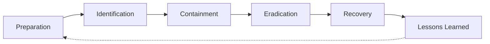
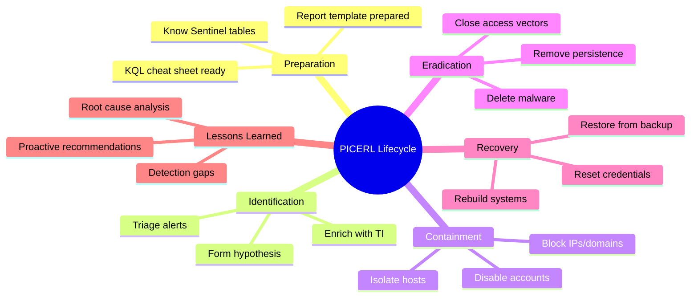

# SANS PICERL Incident Response Model

## TCM Exam Objectives

- Apply the six-phase PICERL lifecycle (Preparation, Identification, Containment, Eradication, Recovery, Lessons Learned) to every PSAA investigation
- Execute the Identification phase through triage, threat intelligence enrichment, and hypothesis formation
- Write specific, evidence-based containment and eradication recommendations for compromised systems
- Develop recovery plans including credential rotation, system rebuilds, and enhanced monitoring
- Translate lessons learned into proactive detection rules and policy improvements
- Map each PICERL phase to a corresponding section in the PSAA exam report
- Use PICERL headings to structure the final report for evaluator clarity
- Demonstrate the iterative nature of the lifecycle with feedback loops between phases

The SANS PICERL model is the industry-standard framework for structuring incident response into six phases: Preparation, Identification, Containment, Eradication, Recovery, and Lessons Learned. Every PSAA investigation should follow this cycle from ticket receipt to final report.

- Six-phase incident response lifecycle
- PSAA mapping for each phase
- KQL query examples and reporting structure
- End-to-end walkthrough



## The Six Phases of PICERL

| Phase | Objective | PSAA Application |
| :--- | :--- | :--- |
| **Preparation** | Build capability before an incident | Know your SIEM, have a report template ready, understand the exam environment |
| **Identification** | Detect and confirm the incident | Triage alerts, enrich IOCs, map to MITRE ATT&CK |
| **Containment** | Stop the damage | Recommend isolating hosts, blocking IPs, disabling accounts |
| **Eradication** | Remove the threat | Delete malware, remove persistence, close access vectors |
| **Recovery** | Restore normal operations | Restore from backup, rebuild systems, reset credentials |
| **Lessons Learned** | Improve future response | Proactive recommendations, detection rule proposals, policy updates |

## Phase 1: Preparation

Preparation is everything done before an incident occurs. In the PSAA context, this means arriving with a prepared mind, a KQL cheat sheet, a report template, and familiarity with the Microsoft Sentinel environment 【turn0search1】.

### Preparation Checklist

- Know the Sentinel log tables: `SigninLogs`, `OfficeActivity`, `SecurityEvent`, `CommonSecurityLog`, `ThreatIntelIndicators`
- Have pre-written KQL snippets for common scenarios (brute force, impossible travel, data exfiltration)
- Prepare a report skeleton with sections for Executive Summary, Timeline, MITRE ATT&CK, IOCs, and Recommendations
- Understand the investigation methodology: triage, pivot, scope, assess, contain, eradicate, recover, learn

```kusto
// Quick inventory of available log tables
search *
| where TimeGenerated > ago(1h)
| summarize Count = count() by $table
| order by Count desc
```

## Phase 2: Identification

Identification is where the incident is detected and confirmed. Every PSAA ticket begins here. The analyst must triage the alert, enrich indicators, and decide whether it is a true positive.

### Identification Workflow

1. **Receive alert or ticket** - Open the Sentinel incident
2. **Initial triage** - Check severity, entities, and alert description
3. **Threat intelligence enrichment** - Query `ThreatIntelIndicators` for IPs, domains, hashes
4. **Hypothesis formation** - Based on the alert, form a working theory
5. **Evidence collection** - Pivot across log sources to validate

<details>
<summary>KQL Triage Queries</summary>

```kusto
// Check IP against threat intelligence
ThreatIntelIndicators
| where IndicatorValue == "185.220.101.34"
| project IndicatorValue, ThreatType, ConfidenceScore, Description

// Count recent failed logins for affected user
SigninLogs
| where TimeGenerated > ago(1h)
| where UserPrincipalName == "jsmith@domain.com"
| where ResultType != 0
| summarize FailedAttempts = count()
```
</details>

### Identification in the PSAA Report

The Identification section should document the alert source, initial severity, key IOCs discovered, and the ATT&CK techniques observed. Conclude with whether the alert was confirmed as a true positive.

> 📌 **Exam Tip:** Containment recommendations must be specific and tied to evidence. Instead of "isolate the compromised host," write: "Immediately disconnect DESKTOP-CLIENT1 from the network via VLAN isolation. Evidence: confirmed C2 connection to IP 203.0.113.55 (VirusTotal: 45/87 detections) at 14:22 UTC."

## Phase 3: Containment

Containment stops the incident from causing further damage. In the PSAA, containment is expressed as recommendations in the report. Short-term containment is immediate; long-term containment is temporary while eradication proceeds.

| Containment Action | PSAA Example |
| :--- | :--- |
| Isolate affected endpoints | "Recommend immediate network isolation of DESKTOP-CLIENT1" |
| Block malicious IPs/domains | "Add IP 203.0.113.55 to firewall deny rule" |
| Disable compromised accounts | "Disable jsmith account and force password reset" |
| Suspend affected services | "Take web portal offline pending investigation" |

Containment recommendations must be specific, actionable, and tied to evidence. For example: "Based on the confirmed C2 connection to IP 203.0.113.55 (VirusTotal: 45/87 detections), we recommend immediately adding this IP to the perimeter firewall deny list" 【turn0search2】.

```kusto
// Identify all hosts communicating with a known malicious IP
CommonSecurityLog
| where TimeGenerated > ago(24h)
| where DestinationIP == "203.0.113.55"
| summarize ConnectionCount = count() by SourceIP, DestinationIP
```

## Phase 4: Eradication

Eradication removes all traces of the attacker from the environment. This goes beyond containment to permanently delete malware, persistence mechanisms, backdoors, and unauthorized accounts.

### Common Eradication Targets

| Artifact | Detection Method | Removal Action |
| :--- | :--- | :--- |
| Malware binaries | Sysmon EID 1, file hash lookup | Delete file, block hash via AppLocker |
| Scheduled tasks | Event ID 4698 | Remove with `schtasks /delete` |
| Registry run keys | Sysmon EID 13 | Delete key from `HKCU\Software\Microsoft\Windows\CurrentVersion\Run` |
| Backdoor accounts | Event ID 4720, 4732 | Delete account, revoke group memberships |
| Web shells | Web server logs, suspicious `.asp/.php` files | Delete file, patch upload vulnerability |

```kusto
// Find scheduled tasks created during the attack window
SecurityEvent
| where TimeGenerated between (datetime(2026-05-19 14:00) .. datetime(2026-05-19 16:00))
| where EventID == 4698
| project TimeGenerated, AccountName, TaskName, Command
```

## Phase 5: Recovery

Recovery returns affected systems to normal operations safely. This includes restoring from clean backups, rebuilding compromised hosts, resetting credentials, and monitoring for signs of re-infection.

| Recovery Action | Description |
| :--- | :--- |
| Restore from clean backup | Rebuild from a backup verified to predate the compromise |
| Rebuild from scratch | Fresh OS installation when root-level compromise is suspected |
| Reset credentials | All passwords and Kerberos tickets for affected accounts |
| Enhanced monitoring | Dedicated dashboards for 72 hours post-recovery |

Critical note: Recovery must follow eradication. If the root cause is not fixed before restoration, the attacker will re-compromise the system through the same vulnerability.

> 📌 **Exam Tip:** The Lessons Learned section is where you score top marks. Always propose specific, measurable recommendations. Instead of "improve detection," write "Create a Sentinel analytics rule for Event ID 4698 (scheduled task creation) with a threshold of 1 occurrence within 1 hour on non-admin workstations."

## Phase 6: Lessons Learned

The final phase is a post-incident review that identifies what went well, what went wrong, and what can be improved. In the PSAA, this translates directly into proactive recommendations.

### Key Lessons Learned Questions

1. What was the root cause?
2. How was the incident detected? Could detection have been faster?
3. Were containment actions effective?
4. What gaps existed (missing logs, insufficient visibility, outdated playbooks)?
5. What new IOCs were identified?
6. Which ATT&CK techniques were observed but not covered by existing detections?

### Turning Lessons into Recommendations

| Lesson Learned | Proactive Recommendation |
| :--- | :--- |
| Initial access via spear-phishing that bypassed email filter | "Implement email security gateway with sandbox detonation; conduct quarterly phishing simulations" |
| Malware persisted via scheduled task not caught by SIEM | "Deploy Sigma rule for Event ID 4698 alerting on non-standard parent processes" |
| Logs from critical servers were not centralized | "Integrate all server event logs into Sentinel within 30 days" |

## End-to-End PICERL Walkthrough

**Ticket #1042 - Suspicious Outbound RDP Connection**

**Alert:** SIEM rule detected outbound RDP from host FINANCE-PC (10.1.1.56) to external IP 198.51.100.77. RDP outbound to internet is against policy.

**Preparation:** SIEM ingests firewall, Windows Event, Sysmon, and proxy logs. Baseline policy prohibits outbound RDP.

**Identification:**
- Triage: High severity per egress policy violation
- Query firewall logs: confirmed connection at 14:22 UTC
- Sysmon EID 3 shows `mstsc.exe` connecting to 198.51.100.77
- VirusTotal: 20/87 detections, known malicious RDP server
- ATT&CK Mapping: T1021.001 (Remote Desktop Protocol), T1071.001 (C2)

**Containment:**
- Isolate FINANCE-PC from network
- Block 198.51.100.77 at firewall
- Force password reset for logged-on user `fin_user`

**Eradication:**
- Found scheduled task `RDP_Proxy` created 5 minutes before connection
- Delete task and associated registry run keys
- Scan for other backdoor executables

**Recovery:**
- Restore FINANCE-PC from clean backup dated 2026-05-18
- Reset all credentials active on the system
- Monitor rebuilt system for 72 hours with enhanced logging

**Lessons Learned:**
- Firewall policy gap allowed RDP egress
- Scheduled task persistence was not monitored
- Proactive recommendations: block outbound RDP via firewall rule, deploy Sigma rule for scheduled task creation, conduct hunt for T1021.001 across environment

<details>
<summary>Complete KQL Investigation for RDP Incident</summary>

```kusto
// Step 1: Confirm the outbound RDP connection
CommonSecurityLog
| where TimeGenerated between (datetime(2026-05-19 14:00) .. datetime(2026-05-19 15:00))
| where SourceIP == "10.1.1.56" and DestinationPort == 3389
| project TimeGenerated, SourceIP, DestinationIP, DestinationPort, Protocol

// Step 2: Find the process that initiated the connection
SecurityEvent
| where TimeGenerated between (datetime(2026-05-19 14:00) .. datetime(2026-05-19 15:00))
| where Computer == "FINANCE-PC"
| where EventID == 4688
| where ProcessName endswith "mstsc.exe"
| project TimeGenerated, ParentProcessName, CommandLine

// Step 3: Check for persistence mechanisms
SecurityEvent
| where TimeGenerated between (datetime(2026-05-19 13:00) .. datetime(2026-05-19 15:00))
| where Computer == "FINANCE-PC"
| where EventID == 4698
| project TimeGenerated, AccountName, TaskName, Command
```
</details>

## Documenting PICERL in the PSAA Report

Suggested report structure per incident:

1. **Executive Summary** - One paragraph covering incident, impact, and key recommendations
2. **Identification Summary** - Detection method, initial triage, IOC table
3. **Investigation Details** - Step-by-step analysis with queries, screenshots, and findings
4. **Containment Actions** - Short-term and long-term containment with evidence links
5. **Eradication Actions** - Detailed removal steps for each artifact
6. **Recovery Actions** - Restoration steps, credential resets, monitoring plan
7. **Lessons Learned & Recommendations** - Root cause analysis, gaps identified, prioritized improvements



## Best Practices and Pitfalls

| Practice | Why | Pitfall | Why |
| :--- | :--- | :--- | :--- |
| Follow PICERL in order | Ensures no phase is skipped | Skipping Lessons Learned | Report loses proactive recommendations |
| Tie recommendations to evidence | Shows analytical rigor | Vague recommendations | "Improve security" is not actionable |
| Document negative findings | Proves thorough investigation | Forgetting to scope laterally | Missing secondary compromised systems |
| Use PICERL headings in report | Makes structure explicit | Confusing eradication with recovery | Different objectives require distinct actions |

## Recap

The SANS PICERL model provides the operational backbone for every PSAA investigation. Master the six phases—Preparation, Identification, Containment, Eradication, Recovery, Lessons Learned—and apply them to every ticket. Your report must demonstrate that you can move through each phase deliberately, recommending specific actions tied to evidence. A well-structured PICERL investigation is the difference between a reactive log review and a professional incident response 【turn0search1】【turn0search2】.
