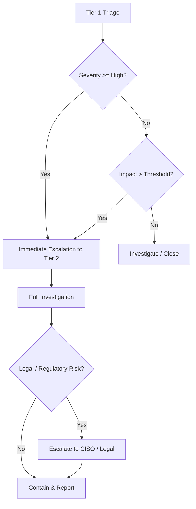
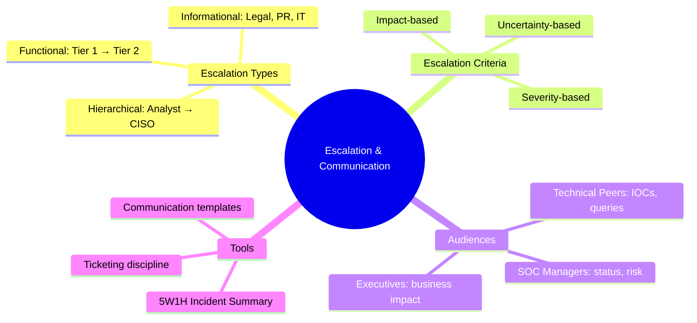

# Escalation Procedures and Communication

## TCM Exam Objectives

- Distinguish between functional, hierarchical, and informational escalation types in a SOC environment
- Apply severity-based and impact-based escalation criteria to determine when to transfer incident ownership
- Write clear escalation handover notes using the 5W1H framework for Tier 1-to-Tier 2 transitions
- Tailor communication for technical peers, SOC managers, and executive audiences in exam reports
- Document escalation decision matrices and rationales in the incident timeline
- Recognize when uncertainty justifies escalation and articulate the reasoning
- Produce audience-specific summaries including executive briefings and technical handover notes
- Recommend cross-functional escalation paths involving Legal, IT, and PR based on incident impact
- Simulate real-world ticketing discipline with timestamped comments and escalation flags

Escalation and communication define how a SOC transfers incident ownership and informs stakeholders. In the PSAA, even though you operate as a solo analyst, your report must demonstrate that you know when and how to escalate, what to communicate, and to whom.

- Types of escalation: functional, hierarchical, informational
- Severity-based and impact-based escalation criteria
- Audience-specific communication
- Escalation documentation in the PSAA report



## What Is Escalation in a SOC?

Escalation is the process of transferring an incident or task to a higher tier when it exceeds the current analyst's authority, skill set, or scope. Three types exist:

| Escalation Type | Description | PSAA Example |
| :--- | :--- | :--- |
| **Functional (Vertical)** | Tier 1 to Tier 2 to Tier 3 for deeper analysis | "Escalating to Tier 2 for lateral movement investigation" |
| **Hierarchical** | Informing management for business impact decisions | "Notifying SOC Manager of confirmed data exfiltration" |
| **Informational** | Notifying other teams (IT, Legal, HR, PR) | "Advising Legal of potential GDPR breach notification" |

In the PSAA, you are the entire chain. You escalate to yourself for investigation, but you must document what you would do in a real SOC.

## Escalation Criteria

> 📌 **Exam Tip:** When escalating in your PSAA report, always include the specific severity/impact threshold that triggered the escalation. For example: "Escalated to Tier 2 because severity = High (credential theft) AND the affected account was a Finance manager with access to PII."

### Severity-Based Escalation

| Severity | Tier 1 Action | Escalation |
| :--- | :--- | :--- |
| **Informational** | Acknowledge and close | No escalation |
| **Low** | Investigate briefly, resolve if simple | Escalate only if unusual or recurring |
| **Medium** | Triage, collect initial data, check IOCs | Escalate to Tier 2 for full investigation |
| **High** | Immediate triage, notify shift lead, begin containment | Escalate to Tier 2 immediately; notify SOC manager |
| **Critical** | Declare incident, invoke emergency response | Escalate to Tier 2/3 and management simultaneously |

In your report, note severity-based escalation: "Due to the high severity (credential theft with confirmed exfiltration), this incident warrants immediate hierarchical escalation to the SOC Manager and CISO per our IR plan."

### Impact-Based Escalation

Severity is a starting point; actual impact overrides it. Always escalate if:
- Sensitive data (PII, PHI, financial) is involved
- The affected account is privileged (domain admin, global admin)
- The affected system is business-critical (domain controller, payment system)
- The attack is active and ongoing

```kusto
// Identify privileged accounts affected
SecurityEvent
| where EventID == 4624
| where TargetUserName in ("Administrator", "svc_domainadmin")
| summarize LatestLogon = max(TimeGenerated) by TargetUserName, Computer
```

### Uncertainty-Based Escalation

If you cannot determine whether an alert is malicious within the Tier 1 time window (e.g., 15 minutes), escalate. Uncertainty that could hide a real threat is a valid escalation reason.

<details>
<summary>Escalation Decision Matrix</summary>

| Scenario | Triage Finding | Action |
| :--- | :--- | :--- |
| Medium alert, unknown IP, no TI hit | Uncertain, no confirmation of malice | Escalate to Tier 2 with note: "Unable to confirm benign; recommend deeper analysis" |
| High alert, confirmed TI match | True positive, active threat | Escalate immediately to Tier 2 + SOC Manager |
| Low alert, internal scanner IP | Known false positive | Close with documentation |
| Medium alert, C-level executive affected | Impact overrides severity | Escalate hierarchically regardless of severity |
</details>

## Escalation Procedures

### Tier 1 to Tier 2 Escalation

1. Identify the need to escalate using severity/impact criteria
2. Document initial findings in the incident ticket
3. Include alert summary, affected entities, IOCs found, actions taken, escalation reason
4. Transfer ownership (in PSAA, assign to self as Tier 2 but note the transition)

**Example Handover Note:**
> **Incident #1245 - Possible Credential Dumping on CLIENT01**
>
> **Triage Summary:** Alert triggered by lsass.exe access from procdump.exe (PID 4492, parent process cmd.exe). Command line: `-accepteula -ma lsass.exe lsass.dmp`. Source user: `svc_backup` (low-privilege account that should not require LSASS access).
>
> **IOCs:** File hash of procdump.exe (pending analysis)
> **Initial Action:** Collected process creation log (Event ID 4688), initiated TI lookup on parent cmd.exe
> **Escalation Reason:** Potential credential dumping is a High severity indicator of active attack. Requires Tier 2 deep dive.
> **Status:** Escalated to Tier 2 for full investigation.

### Tier 2 to Tier 3 / Specialist Escalation

If investigation reveals sophisticated threats requiring reverse engineering or advanced forensics:

> "During investigation, we identified a previously unknown rootkit that hooks the SSDT. This is beyond my scope as a Tier 2 analyst. I recommend immediate Tier 3 escalation for advanced memory forensics and rootkit removal."

### Hierarchical Escalation

| Role | When to Notify |
| :--- | :--- |
| **SOC Lead / Shift Supervisor** | All High/Critical incidents |
| **SOC Manager** | Incidents affecting multiple business units |
| **CISO / VP of Security** | Legal, regulatory, or PR implications |
| **General Counsel / Legal** | Data breach notification laws may apply |
| **Public Relations** | Incident may become public |

**Example in report:** "Given that this incident involved exfiltration of PII for over 1,000 customers, I recommend immediate notification of the Chief Legal Officer to assess data breach notification obligations under GDPR and CCPA" 【turn0search1】.

> 📌 **Exam Tip:** In your PSAA report, embed the 5W1H framework at the top of every incident summary. It forces you to be concise and ensures no critical detail is omitted. Evaluators can quickly assess your understanding when the who-what-when-where-why-how is clearly stated.

## Communication in the SOC

### The Three Audiences

| Audience | What They Need | Format | PSAA Report Section |
| :--- | :--- | :--- | :--- |
| **Technical Peers** | Detailed IOCs, queries, timelines | Ticket comments, handover notes | Investigation Summary, IOCs |
| **SOC Managers** | Status, risk level, resources needed | Status updates, briefings | Executive Summary, Impact Assessment |
| **Executives / Board** | Business impact, recovery timeline | Executive briefing, one-page summary | Executive Summary |

Your PSAA report must contain all three voices, segmented appropriately.

### The 5W1H Incident Summary

Every escalation needs a concise summary. Use the 5W1H framework:

- **Who?** Affected users, systems, or data
- **What?** What happened (credential theft, data exfiltration, ransomware)
- **When?** Timeframe (UTC)
- **Where?** Which environment (cloud, on-prem, specific servers)
- **Why?** Root cause, attacker motivation
- **How?** Brief technical flow

**Example:**
> "On 15 January 2024 at 08:15 UTC, user jdoe's credentials were compromised via a brute-force attack from IP 45.67.89.123. The attacker logged in successfully from a Tor exit node, created a hidden inbox rule to forward all email externally, and downloaded 50 files from the Finance SharePoint. No lateral movement detected. Incident is contained; credential rotation is in progress."

### Ticketing Discipline

In Sentinel, every comment on an incident is a permanent record. Simulate real-world communication:

- **Initial triage:** "I'm starting triage. IP is a known Tor exit node. Will check for successful logins."
- **Investigation progress:** "Found a successful login at 08:15. Pivoting to OfficeActivity for potential mailbox rule."
- **Containment action:** "Recommend immediate password reset and session revocation for jdoe."
- **Closure:** "Incident contained, malware removed, user restored with MFA. Lessons learned documented."

## Escalation and Communication in the PSAA Report

### Incident Timeline with Escalation Flags

| Time (UTC) | Event | Analyst Action | Escalation / Status |
| :--- | :--- | :--- | :--- |
| 08:05 | Alert fired: Impossible travel for asmith | Opened incident, triaged alert | Tier 1 Triage |
| 08:20 | Confirmed malicious Tor IP | True positive decision | **Escalated to Tier 2** |
| 09:00 | Found inbox rule and file downloads | Collected all OfficeActivity | Tier 2 Investigation |
| 10:00 | Scope determined: single user, data exfiltrated | Containment recommendations drafted | **Escalation to SOC Manager recommended** |

### Recommendations with Escalation Statements

> - **SOC Manager / CISO:** Brief immediately on data exfiltration of HR documents. Assess legal obligations under data protection regulations.
> - **IT Operations:** Disable compromised user account, reset all related service account passwords within 2 hours.
> - **Legal Department:** Evaluate breach notification requirements for 120 affected employees' personal data.
> - **Corporate Communications:** Prepare draft internal notice if employee data exposure is confirmed.

### Lessons Learned: Communication Gaps

> "The incident response plan lacked a clear hierarchical escalation path for cloud-based data exfiltration. I recommend creating a cloud incident playbook with specific notification templates for the Legal and Privacy teams. Incident ticket templates should include a mandatory 'Escalation Justification' field to ensure consistent handovers."

## Practical Scenario

**Alert:** "Multiple failed login attempts for user jdoe from IP 45.67.89.123." Severity: Medium.

**Tier 1 Triage:**
- Check IP: ThreatIntelIndicators shows malicious, Confidence 95, Tor exit node
- Check login outcome: Successful login at 08:15 after 10 failures
- Decision: True positive. Escalate to Tier 2. Notify SOC Lead because user is in Finance.

**Escalation Note:**
> "Incident #1300 - Brute force on jdoe with successful login from Tor IP. Escalated to Tier 2 for full investigation. Pinging SOC Lead for awareness because the user is a Finance manager. Initial IOCs: IP 45.67.89.123, user jdoe. Recommending immediate password reset."

**Final Report Escalation Summary:**
> - **Tier 1 to Tier 2:** 08:20 UTC, due to successful credential-based attack
> - **Tier 2 to SOC Manager:** 08:25 UTC, due to Finance user compromise
> - **SOC Manager to CISO:** 10:00 UTC, after confirming exfiltration of sensitive financial documents



## Best Practices and Pitfalls

| Practice | Why | Pitfall | Why |
| :--- | :--- | :--- | :--- |
| Use standard escalation template | Consistency prevents omissions | Failing to escalate | Delays response and increases damage |
| Escalate early on high-impact incidents | Better safe than sorry | Over-escalating every alert | Creates alarm fatigue |
| Include "why" in escalation | Receiving analyst shouldn't guess | Technical jargon with management | They need risk and impact, not process IDs |
| Document all communications | Protects analyst and SOC | Not following up after escalation | Ticket is yours until ownership accepted |

## Recap

Escalation and communication are the threads that tie a SOC together. They ensure the right people act on the right information at the right time. In the PSAA, embedding clear escalation logic, audience-appropriate summaries, and cross-functional recommendations into your report proves you understand the team dynamics of a real SOC. Even as a solo analyst, your documentation must reflect the professional communication standards expected in any mature operations center 【turn0search1】【turn0search2】.
