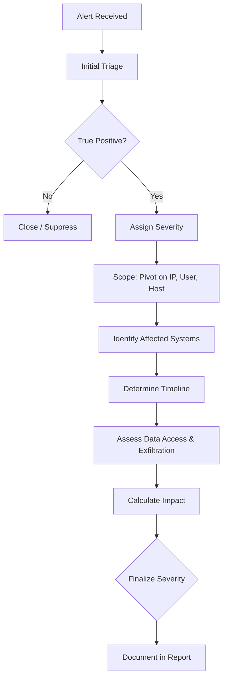
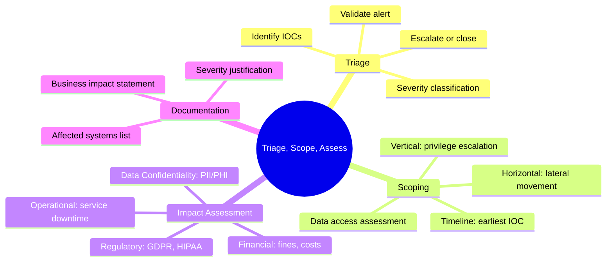

# Initial Triage, Scoping, and Impact Assessment

## TCM Exam Objectives

- Apply a structured triage methodology to determine alert validity, severity, and escalation priority
- Execute scoping techniques using pivot fields (IP, user, host, file hash) to define the incident blast radius
- Assess business, regulatory, and operational impact across multiple dimensions
- Classify severity levels (Critical, High, Medium, Low) with justifications tied to evidence
- Conduct horizontal scoping for lateral movement and vertical scoping for privilege escalation
- Build an integrated triage-scope-impact workflow that iterates as new evidence emerges
- Write impact assessment statements that quantify data exposure and regulatory obligations
- Use the severity classification framework to drive escalation and reporting decisions

Initial triage, scoping, and impact assessment are the three decision-making pillars every SOC analyst uses when a ticket arrives. Triage determines urgency, scoping defines the blast radius, and impact assessment quantifies the business consequences.

- Structured triage methodology
- Scoping techniques with pivot fields
- Impact assessment dimensions
- Integrated workflow for the PSAA exam



## The Three Pillars

| Pillar | Question Answered | PSAA Deliverable |
| :--- | :--- | :--- |
| **Triage** | Is this alert real? How urgent is it? | Severity classification, escalation decision |
| **Scoping** | What exactly is affected? | List of hosts, accounts, data, timeline |
| **Impact Assessment** | How bad is the damage? | Business, regulatory, and operational consequences |

These three processes are not linear—they iterate. Scoping may reveal more affected systems, which raises impact, which may escalate severity.

## Initial Triage: The First 10 Minutes

Triage is the rapid evaluation of an alert to determine whether it warrants escalation. The PSAA presents multiple tickets; effective triage ensures you invest time on the incidents that matter most.

> 📌 **Exam Tip:** During triage, always check three things first: the SIEM-assigned severity, whether the asset is business-critical, and whether the account involved is privileged. These three factors drive your initial severity assessment and determine how quickly you escalate.

### Key Triage Questions

| Question | Why | PSAA Data Source |
| :--- | :--- | :--- |
| Is this a known false positive? | Avoids wasted investigation | Alert history, SIEM documentation |
| What rule triggered this alert? | High-fidelity rules carry more weight | Alert details, underlying search logic |
| What is the SIEM-assigned severity? | Does it match reality? | Alert severity field |
| What asset is affected? | Criticality determines urgency | Hostname, CMDB data, ticket context |
| What user account is involved? | Privilege level affects risk | Event ID 4624, group memberships |
| Is the threat active? | Active C2 requires immediate action | Sysmon EID 3, firewall logs |

### Severity Classification Framework

| Severity | Definition | PSAA Example |
| :--- | :--- | :--- |
| **Critical** | Active compromise of critical asset with data exfiltration or ransomware | Domain Controller shows C2 beaconing, credential dumping, lateral movement |
| **High** | Confirmed compromise of production system or high-privilege account | Web server compromised via SQLi with webshell deployed |
| **Medium** | Suspicious activity likely indicating attempted compromise | User workstation with blocked malware download |
| **Low** | Policy violations, informational alerts, known false positives | Outbound connection to flagged CDN endpoint confirmed benign |

```kusto
// Quick triage: IP reputation check
ThreatIntelIndicators
| where IndicatorValue == "45.67.89.123"
| project ThreatType, ConfidenceScore, Tags

// Quick triage: count failed logins for user
SigninLogs
| where TimeGenerated > ago(1h)
| where UserPrincipalName == "jsmith@domain.com"
| where ResultType != 0
| summarize FailedAttempts = count()
```

<details>
<summary>Triage Decision Flow for Common Scenarios</summary>

| Scenario | Triage Steps | Typical Decision |
| :--- | :--- | :--- |
| Phishing alert with URL | Check URL in ThreatIntelIndicators, check user clicked, check post-click activity | Escalate if user clicked and indicator is malicious |
| Brute force alert | Count failed vs. successful logins, check source IP reputation | Escalate if any successful login from malicious IP |
| Malware detection | Check file hash reputation, check parent process, check persistence | Escalate if confirmed malware with execution |
| Policy violation | Check asset criticality, check data accessed, check user intent | Close if no malicious intent, escalate if data exfiltration suspected |
</details>

## Scoping: Defining the Blast Radius

Once an alert is confirmed as a true positive, scoping determines the full extent of the compromise. Scoping answers: what else did the attacker touch, which systems and accounts are involved, and when did the activity occur?

### Primary Pivot Fields for Scoping

| Pivot Field | What It Reveals | PSAA Query |
| :--- | :--- | :--- |
| **Source IP** | Other hosts communicating with the same attacker | `CommonSecurityLog` where `SourceIP == "10.1.1.56"` |
| **Destination IP** | All hosts targeted by the attacker | `CommonSecurityLog` where `DestinationIP == "198.51.100.77"` |
| **User Account** | Every logon, file access, and process by the compromised user | `union SigninLogs, OfficeActivity` where `UserPrincipalName == "jsmith@domain.com"` |
| **File Hash** | Every endpoint with the same malware binary | `SecurityEvent` where `InitiatingProcessSHA256 == "hashvalue"` |
| **Process Name** | Other hosts running the same malicious process | `SecurityEvent` where `ProcessName endswith "payload.exe"` |
| **Domain** | All hosts resolving the attacker's domain | `DnsEvents` where `QueryName contains "evil-c2.xyz"` |

### Horizontal vs. Vertical Scoping

**Horizontal scoping** identifies lateral movement across the network. Look for Event ID 4624 Logon Type 3 (network logon), Sysmon EID 3 to SMB ports (445), and RDP connections (3389).

**Vertical scoping** identifies privilege escalation. Look for Event ID 4672 (special logon with admin privileges), Token Manipulation (Sysmon EID 10 to `lsass.exe`), and new user creation (Event ID 4720, 4732).

```kusto
// Horizontal scoping: find lateral movement from compromised host
SecurityEvent
| where TimeGenerated > ago(24h)
| where EventID == 4624 and LogonType == 3
| where IpAddress == "10.1.1.56"
| project TimeGenerated, TargetComputer = Computer, TargetUserName, LogonType

// Vertical scoping: find privilege escalation
SecurityEvent
| where TimeGenerated > ago(24h)
| where EventID == 4672
| where Account == "jsmith"
| project TimeGenerated, Account, PrivilegeList
```

### Scoping the Timeline

The attacker may have been inside the environment for days. Use timeline analysis to find the earliest indicator of compromise. Search for the first appearance of the attacker's IP, the first execution of a suspicious tool, or the earliest phishing email.

Critical question: **Is the attacker still active?** Check for recent outbound C2 connections (last hour). If active, containment must be immediate.

### Scoping Data Access

Wherever the compromised account had access, the attacker potentially had access. Check:
- File shares accessed (Event ID 5140)
- Databases queried (DB audit logs)
- Cloud applications accessed (Azure AD sign-in logs)
- Email accessed (Exchange audit logs)

## Impact Assessment: How Bad Is It?

Impact assessment goes beyond technical scope to evaluate business, legal, regulatory, and reputational consequences. For the PSAA, your impact assessment justifies the severity and shapes recommendations.

### Dimensions of Impact

| Dimension | Questions | PSAA Data Sources |
| :--- | :--- | :--- |
| **Operational** | Is a critical service down? How long will recovery take? | Ticket description, function of affected server |
| **Data Confidentiality** | Was PII/PHI/financial data accessed or exfiltrated? | File audit logs, DLP alerts, data classification |
| **Data Integrity** | Was data altered, deleted, or encrypted? | File modification timestamps, ransomware notes |
| **Regulatory** | Does this trigger breach notification obligations? | GDPR Article 33, HIPAA breach notification, PCI DSS |
| **Reputational** | Could this damage customer trust? | Public-facing breach or defacement |
| **Financial** | What are the estimated costs? | Regulatory fines, incident response costs |

### Impact-to-Severity Mapping

| Impact Level | Description | Severity |
| :--- | :--- | :--- |
| **Severe** | Data exfiltration of PII/PHI, critical system downtime, ransomware encryption | Critical |
| **High** | Unauthorized access to sensitive data without confirmed exfiltration | High |
| **Moderate** | Malware on non-critical workstation, phishing click with no follow-on | Medium |
| **Low** | Reconnaissance, failed brute-force, benign policy alert | Low |

<details>
<summary>Impact Assessment Example for PSAA Report</summary>

"The incident resulted in unauthorized access to FILE-SERVER01, which hosts customer financial records (PII). Audit logs indicate the attacker enumerated `\\fileserver\finance\` and staged `stolen_data.zip` on the compromised host. This represents a confirmed data breach. Under GDPR, this triggers mandatory notification within 72 hours. The financial impact includes potential regulatory fines and costs of customer notification. Severity is escalated to Critical based on confirmed PII exfiltration."
</details>

> 📌 **Exam Tip:** Your impact assessment must go beyond technical impact. Always mention regulatory obligations (GDPR, HIPAA, PCI DSS) if PII or financial data is involved. This demonstrates business awareness and is exactly what evaluators expect from a senior analyst.

## Integrated Workflow: Triage, Scope, Assess

These three processes iterate. As you scope, you find more affected systems, raising impact, which may escalate severity.

**Practical Walkthrough:**

Ticket #1055 - User reported clicking a phishing link. SIEM alert shows outbound connection to known-malicious IP.

**Step 1: Triage (5 minutes)**
- Alert source: EDR rule + user report. High-fidelity.
- Asset: DESKTOP-MARKETING, standard workstation
- User: `mjones`, standard domain user
- IOC: Destination IP 45.33.32.156 flagged by VirusTotal as Cobalt Strike C2
- Initial Severity: High

**Step 2: Scoping (30 minutes)**
- Pivot on host: phishing email at 09:15, `winword.exe` spawned `powershell.exe` at 09:17, outbound C2 at 09:18
- Pivot on user: logins only on DESKTOP-MARKETING
- Pivot on C2 IP: no other hosts communicating with 45.33.32.156
- Timeline: 09:15 to 10:02 (C2 still active)
- Scope: Single host, single user, no lateral movement

**Step 3: Impact Assessment**
- Data accessed: `Customer_List.xlsx` (PII - names and emails)
- Exfiltration: 15 MB outbound traffic to C2 over 45 minutes
- Regulatory: GDPR notification likely required
- Severity escalated to Critical due to confirmed data loss



## Best Practices and Pitfalls

| Practice | Why | Pitfall | Why |
| :--- | :--- | :--- | :--- |
| Validate alert before scoping | Avoids chasing false positives | Assuming scope limited to alerting host | Missing lateral movement victims |
| Pivot on all entities | Finds hidden compromises | Ignoring timeline | Missing earliest compromise or active status |
| Assess data access, not just systems | Low-value assets may hold sensitive data | Not updating severity | Impact may exceed initial classification |
| Document all decisions | Proves analytical rigor | Vague impact statements | "Some data was accessed" is not actionable |

## Recap

Initial triage, scoping, and impact assessment transform a raw alert into a structured incident response plan. Triage separates true threats from noise. Scoping maps the full extent of the compromise. Impact assessment quantifies the business consequences. In the PSAA, these three processes must be documented clearly in your report to demonstrate professional SOC analyst judgment 【turn0search1】【turn0search2】.
