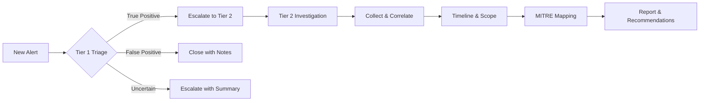
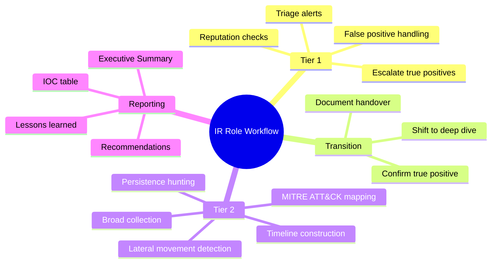

# The Role of a Tier 1 and Tier 2 Analyst in Incident Response

## TCM Exam Objectives

- Differentiate between Tier 1 (triage, false positive handling) and Tier 2 (deep investigation, correlation) responsibilities in a SOC
- Execute the Tier 1 triage workflow using KQL for rapid alert assessment and reputation checking
- Apply the Tier 2 investigation methodology for timeline construction, persistence hunting, and lateral movement detection
- Demonstrate the transition process from Tier 1 to Tier 2 with proper documentation handover
- Utilize KQL toolkits specific to each tier for effective incident management
- Manage PSAA time across both tiers, prioritizing true positives while documenting false positives
- Produce Tier 1 journal entries and Tier 2 investigation reports with appropriate depth
- Identify common false positive patterns and justify closure decisions with analytical reasoning
- Map Tier 2 findings to MITRE ATT&CK techniques for structured reporting

In the PSAA exam, you must operate as both a Tier 1 alert analyst and a Tier 2 incident responder. Understanding the distinct responsibilities of each role—and knowing when to switch between them—is essential to managing the investigation window and producing a professional report.

- Tier 1 triage and false positive handling
- Tier 2 deep investigation and correlation
- Transition between roles during an incident
- KQL toolkit for each tier



## Tier 1 vs. Tier 2: The Classic Distinction

| Attribute | Tier 1 (Alert Analyst) | Tier 2 (Incident Responder) |
| :--- | :--- | :--- |
| **Primary Goal** | Rapidly assess alerts, separate true threats from false positives | Determine scope, root cause, and impact; correlate across data sources |
| **Time per Incident** | 10-30 minutes (triage) | Hours to days |
| **Skill Depth** | Broad familiarity with log sources, basic KQL, SIEM navigation | Advanced KQL, attack lifecycle, threat hunting, forensic analysis |
| **Typical Tools** | SIEM (Sentinel), alert queue, runbooks, TI lookup | SIEM, KQL, EDR, threat intelligence platforms, reporting tools |
| **Output** | Escalation ticket with initial findings | Full incident report with timeline, MITRE mapping, recommendations |
| **Decision Authority** | Escalate or close as false positive | Declare incident, recommend containment, lead investigation |

In a large SOC, Tier 1 feeds Tier 2. In the PSAA, you are the entire SOC. You must flow seamlessly from triage to in-depth analysis and document everything like a senior analyst.

## The Tier 1 Hat

When a new alert appears, you are a Tier 1 analyst. Your job is to answer three questions within minutes:

1. **Is this alert a true positive, false positive, or uncertain?**
2. **What are the immediate IOCs (IPs, accounts, hosts, files)?**
3. **Should I escalate or close the ticket?**

> 📌 **Exam Tip:** In the PSAA, always start with the Tier 1 hat. Triage every open alert before deep-diving on any single incident. This prevents spending hours on a false positive while a critical true positive sits unattended. Set a timer for 15 minutes per alert during triage.

### Tier 1 Triage Workflow

1. Open the Sentinel incident - read title, description, severity
2. Check the Entities tab - user, IP, host, application
3. Run quick reputation check on external IPs/domains via `ThreatIntelIndicators`
4. Glance at alert evidence for obvious signs of malice
5. Apply runbook logic: "If source IP is Tor exit node and user is not on VPN, this is a true positive"
6. Document triage decision in incident comments

### Tier 1 KQL Toolkit

```kusto
// IP reputation check
ThreatIntelIndicators
| where IndicatorValue == "45.67.89.123"
| project ThreatType, ConfidenceScore, Tags

// Count recent failed logins
SigninLogs
| where TimeGenerated > ago(1h)
| where UserPrincipalName == "alert_user@domain.com"
| where ResultType != 0
| summarize count()

// View last 10 sign-ins for context
SigninLogs
| where UserPrincipalName == "alert_user@domain.com"
| top 10 by TimeGenerated desc
| project TimeGenerated, Location, IPAddress, ResultType
```

<details>
<summary>Common Tier 1 False Positive Patterns</summary>

| Alert Type | Common False Positive Pattern | How to Identify |
| :--- | :--- | :--- |
| Impossible travel | VPN concentrator or cloud backup service routing through multiple regions | Check user agent, source IP ranges match known provider |
| Malware detection | Security scanner or penetration testing tool | Check source IP is internal scanner range |
| Brute force | Misconfigured application retrying authentication | Check source IP is application server, consistent timing |
| Data exfiltration | Legitimate backup or sync tool transferring data | Check process name is known backup agent, destination is cloud backup provider |
</details>

### False Positive Handling

The PSAA rewards you for correctly identifying false positives and documenting why they are benign.

**Example:**
> "Alert: 'Impossible travel' for user `svc_backup`. Investigation revealed this is a service account used by a cloud backup solution that routes traffic through multiple geographic regions. User agent and source IP ranges match known backup provider. Closed as benign positive."

This shows critical thinking, not laziness.

## The Tier 2 Hat

Once triaged as a true positive, shift into Tier 2 mode. Now you are an investigator who must answer:

- How did the attacker get in? (Root cause)
- What exactly did they do? (Timeline and TTPs)
- Which systems, accounts, and data were affected? (Scope)
- What is the business impact? (Quantify)
- How can we contain and recover? (Recommendations)
- How can we prevent this in the future? (Lessons learned)

### Tier 2 Investigation Flow

1. **Broad collection** - Pull all activity for the compromised entity across all tables
2. **Timeline construction** - Order chronologically, annotate with interpretation
3. **Persistence hunting** - Look for inbox rules, scheduled tasks, registry modifications, new accounts
4. **Lateral movement detection** - Check for logon events from compromised source
5. **Exfiltration assessment** - Summarize file downloads, outbound bytes, forwarded emails
6. **MITRE ATT&CK mapping** - Every attack phase gets a technique ID
7. **Threat intelligence enrichment** - Correlate IOCs with ThreatIntelIndicators
8. **Hypothesis testing** - Form theory, query to confirm or refute, document result

### Tier 2 KQL Toolkit

```kusto
// Comprehensive user timeline
let target = "compromised@domain.com";
let start = ago(7d);
union SigninLogs, OfficeActivity, AuditLogs
| where TimeGenerated > start
| where UserPrincipalName == target or UserId == target
| project TimeGenerated, Source=$table, Operation, ResultType, IPAddress, ClientIP, Computer
| order by TimeGenerated asc

// Lateral movement: network logons from compromised host
SecurityEvent
| where EventID == 4624
| where LogonType in (3, 10)
| where IpAddress == "10.10.5.200"
| project TimeGenerated, TargetComputer=Computer, TargetUserName, LogonType

// Data exfiltration volume
OfficeActivity
| where Operation == "FileDownloaded"
| where UserId == target
| summarize FileCount=count(), Files=make_set(SourceFileName, 50) by bin(TimeGenerated, 1h)

// Persistence: new scheduled tasks
SecurityEvent
| where EventID == 4698
| where TimeGenerated > start
| project TimeGenerated, AccountName, TaskName, Command
```

> 📌 **Exam Tip:** When writing your PSAA report, present a clear Tier 2 output even for incidents you triaged quickly. Include a full IOC table, MITRE mapping, and prioritized recommendations. Evaluators reward depth over breadth—a shallow investigation of every alert scores lower than a thorough deep-dive on the critical incident.

> 📌 **Exam Tip:** Use the "Practical Scenario: Dual Role" section in your report as a template. Show the evaluator that you consciously managed time across both tiers by documenting your triage phase (hour 1) separately from your deep investigation phase (hours 2+).

### The Tier 2 Mindset

Think like an attacker. Ask yourself:

- "If I were the attacker with these credentials, what would I do next?"
- "Does this sequence of events make sense for a human, or is it automated?"
- "Is there any attempt to cover tracks (log clearing, timestomping)?"

This mindset leads you to hunt for artifacts the alert did not mention—and that is where high scores are earned.

## The Transition: Tier 1 to Tier 2

The transition moment is when you conclude "this is a true positive." Signal this shift in your notes.

**Tier 1 Journal Entry:**
```
[09:00 UTC] Alert #1234 "Brute force - jdoe" opened.
15 failed logins from IP 45.67.89.123.
ThreatIntel shows IP malicious (Confidence 90).
No MFA on account. True positive.
Decision: Escalate to full investigation.
```

**Tier 2 Journal Entry:**
```
[09:05 UTC] Tier 2 investigation started.
Collecting all sign-in and Office activity for jdoe for last 24h.
Query: union SigninLogs, OfficeActivity... (Evidence E01).
```

This clear delineation demonstrates to evaluators that you understand the SOC workflow.

## Documentation Differences

| Task | Tier 1 Documentation | Tier 2 Documentation |
| :--- | :--- | :--- |
| **Alert assessment** | "Closed as false positive: internal IP 10.10.1.5" | "Confirmed true positive: credential theft via brute force. Full timeline in Section 3" |
| **Evidence** | Screenshot of alert + reputation check | Multiple screenshots of timeline, queries, investigation graph, MITRE table |
| **IOC reporting** | Single IP/domain noted | Comprehensive IOC table with confidence scores and sources |
| **Recommendations** | None (escalation ticket) | Full containment, eradication, recovery plan, and preventive measures |

In your final PSAA report, present a Tier 2 output. Even false positives closed should be summarized briefly as Tier 2 would in a post-incident review.

## PSAA Time Management: Wearing Both Hats

| Time Block | Activity | Role |
| :--- | :--- | :--- |
| Hour 1 | Triage all alerts, close false positives, identify priorities | Tier 1 |
| Hours 2-20 | Deep investigation on true positives | Tier 2 |
| Final 6 hours | Review evidence, fill gaps, finalize notes | Tier 2 |

The exam is not about investigating everything—it is about investigating the right things thoroughly.

## Demonstrating Dual Competency in the Report

Evaluators look for:
- **Triage documentation:** Which alerts were closed and why? (Tier 1)
- **Investigation depth:** Full timeline, ATT&CK mapping, correlation? (Tier 2)
- **Recommendations:** Actionable and prioritized? (Tier 2+)
- **Lessons learned:** Detection improvements proposed? (Tier 2 strategic thinking)

A report with only Tier 1 observations (e.g., "saw a malicious IP") is insufficient. A report that dives deep on one incident but ignores all other alerts may miss expected breadth.

## Practical Scenario: Dual Role

**Environment:** Sentinel with multiple open incidents.

**Tier 1 Phase (Hour 1):**
- Alert A: "Impossible travel - user asmith." Quick check: Tor IP, no VPN. True positive. Mark for Tier 2.
- Alert B: "Suspicious file download - 3 files." User is finance manager, files are routine report downloads from internal IP. False positive. Close with note.
- Alert C: "Brute force - user bjones." 200 failed logins. True positive. Mark for Tier 2.

**Tier 2 Phase (Hours 2-20):**
- Incident A (asmith): Collect all activity, find inbox rule and 50 file downloads. Moscow IP. Map T1078, T1114, T1530. Recommend password reset, MFA, IP block.
- Incident C (bjones): No successful login, brute force from multiple Tor IPs, attack blocked. Document as "Attempted brute force - no breach." Recommend MFA.

**Reporting Phase:** Write report with two major incidents and summary of closed false positives. Include lessons learned.



## Best Practices and Pitfalls

| Practice | Why | Pitfall | Why |
| :--- | :--- | :--- | :--- |
| Document triage immediately | Reasoning fades quickly | Staying in Tier 1 mode all time | Produces shallow report |
| Switch consciously between roles | Clear investigation narrative | Jumping to Tier 2 on every alert | Burns time on false positives |
| Use runbook mindset for Tier 1 | Fast, consistent decisions | Not demonstrating Tier 2 thinking | IOC table without analysis not enough |
| Prioritize ruthlessly | Invest where impact highest | Ignoring containment recommendations | Tier 2 analysts advise on response |

## Quick Reference

| Role | Key Actions | KQL / Tools | Deliverable |
| :--- | :--- | :--- | :--- |
| **Tier 1** | Triage, reputation check, count events, decide escalate/close | ThreatIntelIndicators, simple SigninLogs queries | Incident comment with triage decision |
| **Tier 2** | Broad collection, timeline, persistence/lateral movement hunting, ATT&CK mapping, impact assessment | union, join, summarize, make_set, render | Investigation journal, timeline, ATT&CK table, IOC list |
| **Reporting** | Synthesize findings into executive summary, evidence, recommendations | Clean project for tables, screenshots | Final PSAA report |

| Transition Cue | Action |
| :--- | :--- |
| Alert confirmed true positive | Begin Tier 2 collection and timeline |
| First hour of investigation | Triage all open alerts before deep diving |
| Discovery of new IOC during Tier 2 | Pivot back to collection for that IOC |
| End of investigation | Review journal, ensure all findings documented |

## Recap

The PSAA exam tests your ability to think and act like a professional SOC analyst. Know when to be fast and decisive (Tier 1) and when to be deep and meticulous (Tier 2). By consciously adopting the right mindset for each phase, you produce a report that reflects the full spectrum of incident response skill—exactly what the exam evaluators look for 【turn0search1】【turn0search2】.
