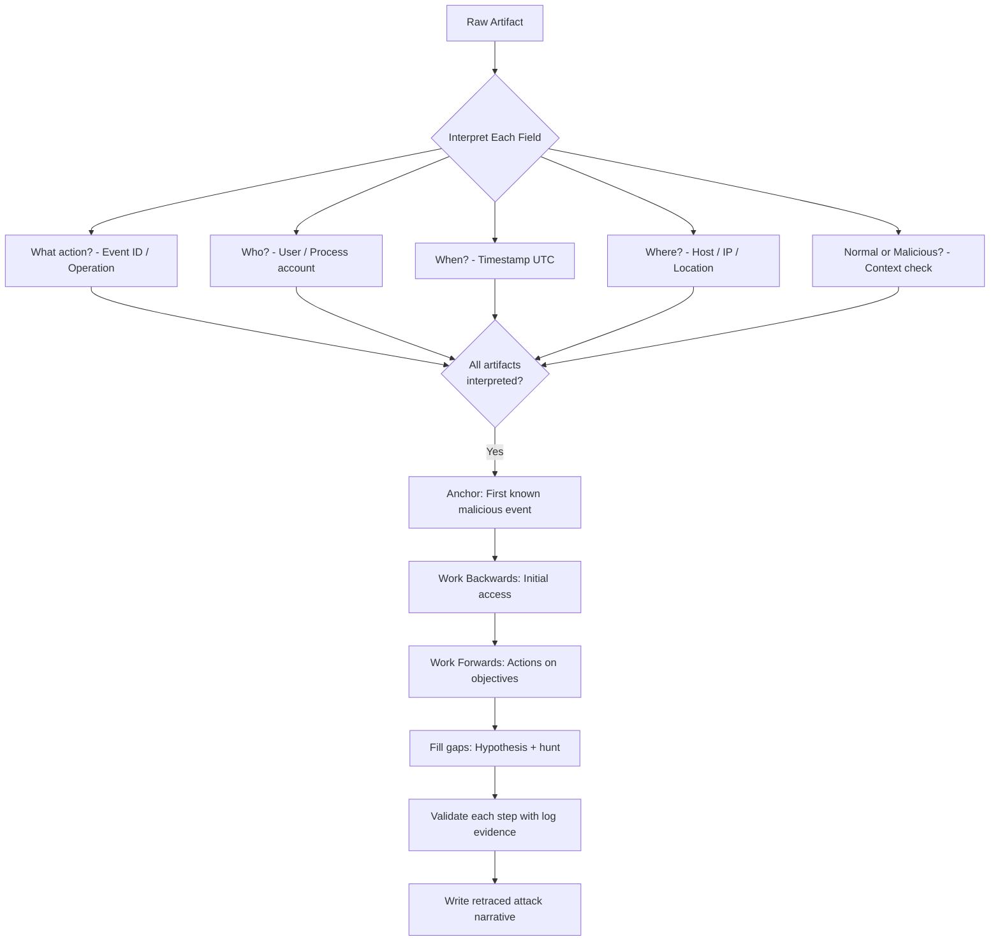
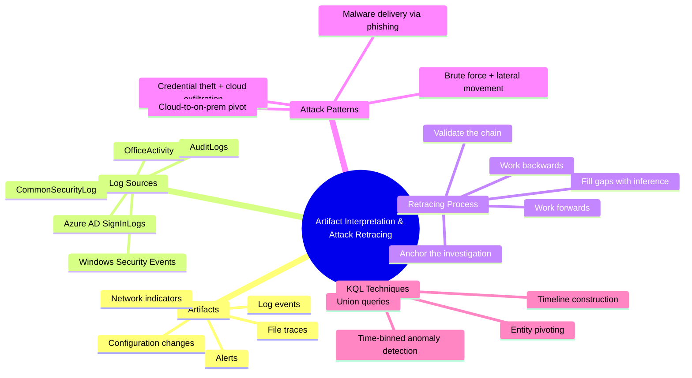
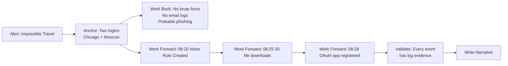

# Ability to Interpret Artifacts and Retrace Attacks

## TCM Exam Objectives

- Interpret Windows Security Event IDs (4624, 4625, 4688, 4732, 4698, etc.) for malicious vs benign context
- Analyse Azure AD SignInLogs to identify impossible travel, Tor usage, and risky sign-in patterns
- Detect email exfiltration by interpreting OfficeActivity operations such as New-InboxRule and FileDownloaded
- Recognise persistence mechanisms through AuditLogs including OAuth app registration and role assignment
- Retrace an attacker's full kill chain by anchoring on an alert and working backwards then forwards
- Build a unified KQL timeline query using union across SigninLogs, OfficeActivity, AuditLogs, and SecurityEvent
- Infer probable initial access vectors (phishing, brute force) from contextual artifact patterns
- Distinguish between on-premises and cloud artifact trails in hybrid attack scenarios
- Present retraced attack narratives in the PSAA report with artefact-grounded timelines
- Document analytical limitations clearly when data gaps require inference rather than direct evidence

A malicious IP appears in a log. A suspicious process runs on a workstation. A new inbox rule forwards email outside the organization. In isolation, these are just data points—artifacts. The PSAA exam places you inside Microsoft Sentinel with 48 hours to investigate. Your ability to interpret artifacts—to read the language of logs—and retrace attacks—to reconstruct the attacker's exact steps—is what transforms raw data into a compelling, evidence-backed narrative.

- Systematic artifact interpretation across Windows, Azure AD, and Microsoft 365 logs
- Tracing attacker actions through KQL and Sentinel investigation tools
- Inferring attacker intent from incomplete data
- Presenting retraced attack timelines in the PSAA report





## Artifacts: The Footprints of an Attacker

In the context of log-based SIEM investigation, an artifact is any discrete piece of evidence that results from an action taken by a user, a system, or an attacker. Artifacts can be log events, alerts, configuration changes, network indicators, or file traces. In Sentinel, every row in a log table is an artifact.

### The Interpretive Mindset

Every artifact must be interpreted. For each artifact, ask what action it represents, who performed it, when and where it occurred, whether it is normal for that entity, and how it fits into the larger attack chain. Answering these questions turns a raw event into a meaningful piece of the puzzle.

## Interpreting Common PSAA Artifacts

> 📌 **Exam Tip:** Create a one-page Event ID cheat sheet and keep it visible throughout the exam. The most frequently tested Event IDs are 4624 (logon with LogonType), 4625 (failed logon), 4688 (process creation with command line), 4732 (group membership change), and 4698 (scheduled task). For each event, memorise the key fields to pivot on — SubjectUserName, TargetUserName, LogonType, NewProcessName, and CommandLine.

### Windows Security Events

| Event ID | Artifact Description | Benign Indication | Malicious Indication |
|----------|----------------------|-------------------|----------------------|
| 4624 | Successful logon | Normal user login | Attacker with stolen credentials; lateral movement (LogonType 3, 10) |
| 4625 | Failed logon | Mistyped password | Brute force attack, password spray |
| 4672 | Special privileges assigned | Admin logging on | Attacker using privileged account |
| 4688 | New process created | Launching legitimate app | Malware execution, PowerShell attack, credential dumper |
| 4697 | Service installed | Software installation | Malware service persistence |
| 4698 | Scheduled task created | IT maintenance | Persistence mechanism |
| 4720 | User account created | New employee onboarding | Backdoor account |
| 4732 | Member added to local group | Normal group management | Privilege escalation |
| 5145 | Network share accessed | File share access | Data staging, lateral movement via SMB |
| 5156 | Windows Filtering Platform allowed connection | Application network access | C2 beaconing, data exfiltration |

**Interpretation Example - Event 4688:**
```
NewProcessName: C:\Users\jsmith\AppData\Local\Temp\payload.exe
CommandLine: payload.exe --upload
SubjectUserName: jsmith
```
A file named `payload.exe` ran from a temporary folder—a highly unusual location. The `--upload` argument suggests data exfiltration. Combined with user `jsmith` as the subject, this is a strong indicator of malware.

<details>
<summary>🔧 Detailed Event ID Reference for SOC Analysts</summary>

Event ID 4624 LogonTypes:
- LogonType 2: Interactive (user at keyboard)
- LogonType 3: Network (connecting to a share or network resource)
- LogonType 4: Batch (scheduled task)
- LogonType 5: Service (service startup)
- LogonType 7: Unlock (unlocking workstation)
- LogonType 8: NetworkClearText (IIS basic auth)
- LogonType 9: NewCredentials (runas /netonly)
- LogonType 10: RemoteInteractive (RDP)

Event ID 4688 includes `CreatorProcessId` and `ProcessId` which enable process tree reconstruction. Enable command-line logging via GPO for full visibility into attacker commands.

Event ID 5156 requires Windows Filtering Platform audit policies. It captures outbound connections from processes, making it essential for C2 detection when Sysmon is not available.

</details>

### Azure AD Sign-In Logs (SigninLogs)

| Field | Artifact | Benign Meaning | Malicious Meaning |
|-------|----------|----------------|-------------------|
| `ResultType` | 0 (success) / non-0 (failure) | Normal login | Successful attack / brute force |
| `IPAddress` | Source IP | Corporate IP | Tor, known C2 IP, foreign country |
| `Location` | City, Country | Normal location | Impossible travel |
| `DeviceDetail` | Device information | Known device | Unknown attacker machine |
| `RiskDetail` | From Identity Protection | None | Leaked credentials, impossible travel |
| `AppDisplayName` | Application accessed | Office 365, corporate app | Unusual app access |

**Interpretation Example:**
```
Time: 03:15 UTC
User: jsmith@corp.com
IPAddress: 45.67.89.123
ResultType: 0
Location: Moscow, Russia
```
A successful login for a US-based user at an unusual hour from a Russian IP. When cross-referenced with `ThreatIntelIndicators`, this IP is a known Tor exit node. This artifact alone indicates account compromise.

### Office 365 Activity (OfficeActivity)

| Operation | Artifact | Benign | Malicious |
|-----------|----------|--------|-----------|
| `New-InboxRule` with `ForwardTo` | Email forwarding rule | User organising mail | Attacker exfiltrating all incoming mail |
| `FileDownloaded` (bulk) | Downloading SharePoint/OneDrive files | Normal work | Mass data exfiltration |
| `MailItemsAccessed` | Email access | User reading mail | Attacker reading sensitive emails |
| `Set-Mailbox` with `ForwardingSmtpAddress` | Mailbox-level forwarding | Delegation | Persistent email theft |
| `Add-MailboxPermission` (FullAccess) | Granting mailbox permissions | Admin task | Persistent mail access |

**Interpretation Example:**
```
Operation: New-InboxRule
Parameters: {"Name":".","ForwardTo":"evil@gmail.com"}
```
A rule named "." (a single dot) is often used by attackers because it is inconspicuous. Forwarding to an external Gmail address confirms email exfiltration.

### Azure AD Audit Logs (AuditLogs)

| Operation | Artifact | Malicious Meaning |
|-----------|----------|-------------------|
| `Add member to role` | User granted a directory role | Privilege escalation to Global Admin |
| `Add service principal` | New enterprise application registered | Malicious OAuth app for persistence |
| `Add delegated permission grant` | OAuth consent to read mail/files | Token theft allowing silent data access |
| `Update user` | User properties modified | Attacker changing MFA phone number |
| `Add member to group` | Added to sensitive group | Persistent access to resources |

> 📌 **Exam Tip:** The single `union` KQL query across SigninLogs, OfficeActivity, AuditLogs, and SecurityEvent is the most powerful tool in your PSAA arsenal. Build this query template with a placeholder for `compromisedUser` and save it before the exam. When you identify a compromised entity, paste the query, replace the placeholder, and instantly see the full attack timeline. This one query can save 30+ minutes per investigation.

## Retracing Attacks: The Art of Reconstruction

Once you know how to interpret individual artifacts, the next step is to connect them into a logical, chronological sequence.

### The Retracing Process

1. **Anchor the investigation** – Identify the first known malicious event
2. **Work backwards** – Ask how the attacker got here; look for initial access vector
3. **Work forwards** – Trace each subsequent action
4. **Fill gaps with hunches** – Hypothesise and hunt for missing evidence
5. **Validate the chain** – Every step must be supported by a concrete log artifact

### Using KQL to Reconstruct a Timeline

```kusto
let compromisedUser = "asmith@corp.com";
let startTime = datetime(2024-01-15T06:00:00Z);
let endTime = datetime(2024-01-15T12:00:00Z);
union SigninLogs, OfficeActivity, AuditLogs, SecurityEvent
| where TimeGenerated between (startTime .. endTime)
| where UserPrincipalName == compromisedUser or UserId == compromisedUser or TargetUserName == compromisedUser
| project TimeGenerated, Source = $table, Operation = coalesce(Operation, tostring(EventID)),
          Details = coalesce(IPAddress, ClientIP, CommandLine, tostring(parse_json(Parameters).ForwardTo))
| order by TimeGenerated asc
```



### Retracing an Attack: Practical Walkthrough

**Alert:** "Impossible travel - user asmith from Chicago and Moscow within 30 min."

**Step 1 - Anchor:** The alert itself is the anchor. Two successful logins: one normal (Chicago), one suspicious (Moscow, Tor IP).

**Step 2 - Work Backwards:** Query for signs of phishing or brute force before the Moscow login. No brute force observed. No phishing email logs. The initial access vector remains probable phishing.

**Step 3 - Work Forwards:** After the Moscow login at 08:15 UTC:
- 08:20 - `New-InboxRule` forwarding to `evil@gmail.com`
- 08:25 - 50 file downloads from Finance SharePoint
- 08:28 - `Add service principal` for app "Outlook Helper"

**Step 4 - Fill Gaps:** No immediate C2 connection. Hypothesis: The attacker used the OAuth app to silently read mail and access files.

**Step 5 - Validate:** Every event is supported by a specific log entry.

**The Retraced Attack Narrative:**
> On January 15, 2024, the attacker (using IP `185.220.101.34`, a Tor exit node) successfully authenticated as `asmith@corp.com`, likely using credentials obtained via phishing. Within 10 minutes, the attacker created a hidden inbox forwarding rule to `evil@gmail.com` and downloaded approximately 50 files from the Finance SharePoint. They then registered a malicious OAuth application named "Outlook Helper" to maintain persistent access.

## Overcoming Missing Data: Inference and Gap Analysis

In many PSAA investigations, you will lack complete visibility. Endpoint logs might be missing, or email logs might not be in Sentinel. You can still retrace attacks by inference.

<details>
<summary>🔧 Inference Techniques for Missing Data</summary>

**Inferring Phishing from Context:**
If you see a sudden login from a malicious IP with valid credentials, no prior failed logins, and a forwarding rule created immediately after login, you can reasonably infer the initial access was credential theft, most likely phishing.

**Inferring Process Execution from Registry or Network Artifacts:**
Even without event ID 4688, you might find a new service creation (4697), a new registry Run key (4657), or network connections to a C2 IP. You can infer malware execution even if the exact command line was not captured.

**Documenting Limitations in Your Report:**
Always be transparent: "No endpoint telemetry was available for the user's workstation, so the exact malware command line could not be retrieved. However, the presence of the scheduled task and outbound C2 connection provides high confidence that malware was active on the system."

</details>

## Common Attack Patterns and Retracing Guidance

### Credential Theft to Cloud Data Exfiltration

**Artifact Trail:**
1. Unusual sign-in (Impossible travel, Tor IP)
2. Inbox rule created (`New-InboxRule`)
3. Mass file downloads (`FileDownloaded`)
4. OAuth app registration (`Add service principal`)

### Brute Force to On-Prem Lateral Movement

**Artifact Trail:**
1. Many failed logins (Event 4625) from a single IP
2. A successful login (Event 4624) from that IP
3. Suspicious process creation (Event 4688) on the logged-in workstation
4. Network logons (Event 4624, LogonType 3) to other servers
5. New service or scheduled task on target servers

### Malware Delivery via Phishing Attachment

**Artifact Trail:**
1. Process creation of `winword.exe` spawning `cmd.exe` or `powershell.exe`
2. PowerShell downloading a second-stage payload
3. Outbound connection to a C2 domain
4. Persistence via scheduled task or registry Run key

## Retracing Across Cloud and On-Premises Boundaries

### The Cloud-to-On-Prem Pivot

Attacker compromises a cloud user who also has an on-premises AD account (hybrid identity). They may use the same credentials to VPN in or RDP to a workstation.

```kusto
let cloudUser = "asmith@corp.com";
let onpremUser = "asmith";
union SigninLogs, SecurityEvent
| where (UserPrincipalName == cloudUser) or (TargetUserName == onpremUser)
| project TimeGenerated, Source = $table, Action = coalesce(Operation, tostring(EventID)), IP = coalesce(IPAddress, IpAddress)
| order by TimeGenerated asc
```

### The On-Prem-to-Cloud Pivot

Attacker compromises an on-prem server, dumps credentials, and discovers a synced Azure AD account with privilege.

| Stage | On-Prem Artifacts | Cloud Artifacts |
|-------|-------------------|-----------------|
| Initial compromise | Event 4624, 4688 | - |
| Credential dumping | Event 4688 (Mimikatz), Event 4672 | - |
| Cloud access | - | SigninLogs from unusual IP |
| Privilege escalation | - | AuditLogs role assignment |

## Presenting Your Retraced Attack in the PSAA Report

### The Incident Timeline

| Time (UTC) | Artifact Description | Log Source | Interpretation |
|------------|---------------------|------------|----------------|
| 08:10 | Successful login from Chicago | SigninLogs | User's normal activity |
| 08:15 | Successful login from Moscow (Tor IP) | SigninLogs | Attacker access using stolen credentials |
| 08:20 | Inbox rule created, forwarding to `evil@gmail.com` | OfficeActivity | Email exfiltration mechanism |
| 08:25 | 50 files downloaded from SharePoint | OfficeActivity | Mass data exfiltration |
| 08:28 | OAuth app "Outlook Helper" registered | AuditLogs | Persistence mechanism |

### The Investigation Summary

Convert the timeline into a flowing narrative showing how the artifacts connect. This demonstrates that you can not only identify events but also tell the attack story.

## Best Practices and Common Pitfalls

| Best Practices | Common Pitfalls |
|----------------|-----------------|
| Always interpret an artifact before adding it to your timeline | Including benign events without context |
| Use `union` to build a master timeline | Failing to retrace backwards |
| Anchor on the alert, but don't be limited by it | Assuming artifacts are always reliable |
| Infer when necessary, but label it clearly | Ignoring the cloud side in hybrid investigations |
| Retrace in both directions | Writing a timeline without analyst interpretation |
| Document your pivot points | Spending too long on a single dead end |

## Quick Reference Card

| Artifact Source | Key Artifacts | Typical Attacker Meaning |
|-----------------|--------------|--------------------------|
| SigninLogs | Impossible travel, Tor IP, risky sign-in | Credential theft, initial access |
| OfficeActivity | New-InboxRule, FileDownloaded (bulk) | Data exfiltration, collection |
| AuditLogs | Add service principal, Add member to role | Persistence, privilege escalation |
| SecurityEvent | 4625, 4624, 4688, 4698, 4732 | Brute force, lateral movement, execution |
| CommonSecurityLog | Outbound connections, beaconing | C2, exfiltration |

**KQL Master Timeline Formula:**
```kusto
let user = "target@domain.com";
let start = ago(7d);
union SigninLogs, OfficeActivity, AuditLogs, SecurityEvent, CommonSecurityLog
| where TimeGenerated > start
| where * has user
| project TimeGenerated, Source = $table, Details = coalesce(Operation, tostring(EventID), CommunicationDirection), IP = coalesce(IPAddress, ClientIP, SourceIP)
| order by TimeGenerated asc
```

## Recap

Artifact interpretation transforms raw log data into actionable evidence. The retracing process requires anchoring on the alert, working backwards to find initial access, working forwards to find actions on objectives, pivoting on entities, filling gaps with labelled inference, and validating with cross-table correlation. The master timeline KQL query using `union` across `SigninLogs`, `OfficeActivity`, `AuditLogs`, `SecurityEvent`, and `CommonSecurityLog` is the single most powerful tool for retracing. Every step in the attack chain must be supported by concrete log evidence, and gaps should be clearly documented as probable rather than confirmed.
