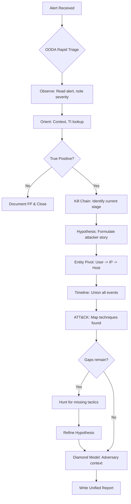
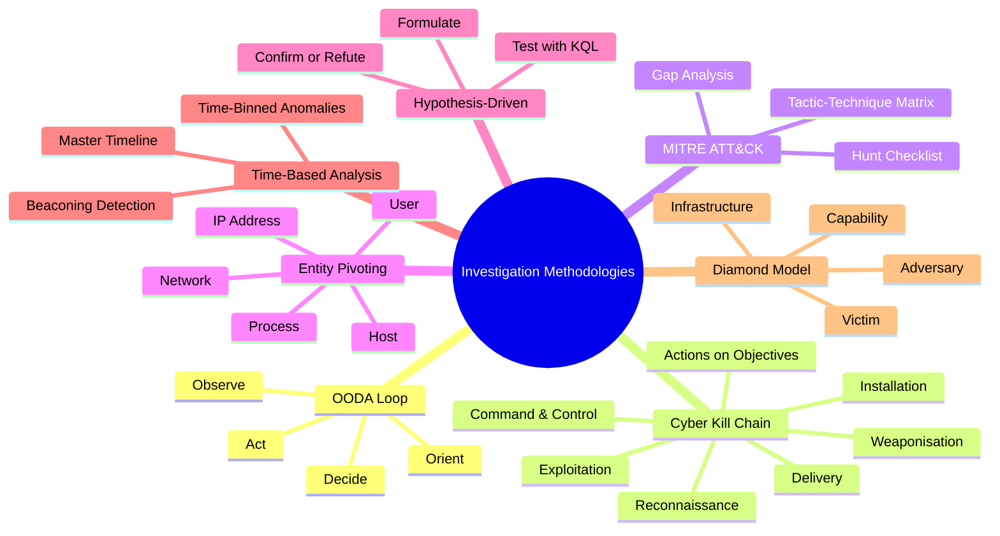
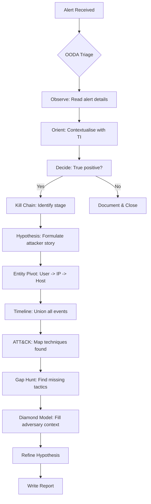

# Application of Investigation Methodologies

## TCM Exam Objectives

- Apply the OODA Loop (Observe, Orient, Decide, Act) for rapid triage of security alerts
- Use the Cyber Kill Chain to structure investigations chronologically and identify missing stages
- Leverage MITRE ATT&CK as a live investigation checklist to ensure comprehensive coverage
- Perform entity-based pivoting across users, IP addresses, and hosts to expand incident scope
- Formulate and test hypotheses with targeted KQL queries to confirm or refute attacker actions
- Build a master incident timeline by unioning multiple log sources in Sentinel
- Detect C2 beaconing using time-binned anomaly detection and interval analysis
- Apply the Diamond Model to integrate threat intelligence and adversary profiling
- Combine multiple methodologies in a single investigation workflow from triage to report
- Conduct gap hunts by mapping observed techniques and deliberately hunting for missing tactics

An alert fires. You open the incident. You have 48 hours to find the truth. Without a method, you are just typing KQL at random. With a structured investigation methodology, you move deliberately from signal to source, from symptom to root cause, and from a single alert to a complete attack narrative. The PSAA exam tests whether you can apply systematic investigative reasoning to a complex, multi-source dataset using Microsoft Sentinel.

- OODA Loop for rapid triage
- Cyber Kill Chain for chronological structuring
- MITRE ATT&CK as an investigation checklist
- Entity-based pivoting
- Hypothesis-driven investigation
- Time-based analysis and beaconing detection
- Diamond Model for threat intelligence integration





## The SOC Investigation Mindset: Triage, Orient, Act

> 📌 **Exam Tip:** The OODA Loop is your first-read defence against alarm fatigue. When you open a ticket, force yourself to complete all four phases — Observe, Orient, Decide, Act — before running a single query. The Decide phase is the most critical: if you decide "False Positive" after orientation, document the reasoning and close it immediately. Do not spend 30 minutes investigating an alert you already judged as benign.

### The OODA Loop in the PSAA

The OODA loop (Observe, Orient, Decide, Act) is a decision-making cycle adapted from military strategy that works perfectly for a Tier-1/Tier-2 analyst.

| Phase | What You Do |
|-------|-------------|
| **Observe** | Open the alert. Note its title, severity, MITRE tactics, and entities (user, IP, host, URL). Look at raw evidence. |
| **Orient** | Contextualise: Is this user a VIP? Is the IP in your threat intelligence? Have you seen this pattern before? |
| **Decide** | Is this a true positive, false positive, or uncertain? Document the decision. |
| **Act** | Execute: write a triage comment, run your first confirmation query, and either close or pivot to deep analysis. |

**Applying OODA: A Brute-Force Alert Example**

Alert: "Possible brute-force attack: 80 failed logins for user `jdoe` from IP `45.67.89.123`."

- **Observe:** Alert details: user jdoe, IP 45.67.89.123, 80 failures in last hour. MITRE tactic: Credential Access.
- **Orient:** `jdoe` is a finance user. IP is not internal. Quick threat intelligence lookup:
  ```kusto
  ThreatIntelIndicators
  | where IndicatorValue == "45.67.89.123"
  ```
  Returns: "Tor exit node, confidence 95."
- **Decide:** High likelihood of true positive. Escalate to full investigation.
- **Act:** Add incident comment and begin collection of all sign-ins and Office activity.

## The Cyber Kill Chain: Structuring the Investigation Chronologically

The Lockheed Martin Cyber Kill Chain provides a seven-step model of an intrusion. Even though logs rarely show every stage, the kill chain helps you ask what should have happened before this event and what likely came next.

### Mapping the Alert to a Kill Chain Stage

| Kill Chain Stage | Log Sources to Investigate |
|------------------|----------------------------|
| Delivery | Email logs (OfficeActivity, EmailEvents), web proxy logs, network scan logs |
| Exploitation | Application crashes, exploit signatures, process creation anomalies |
| Installation | Malicious process creation (4688), new services, scheduled tasks, registry modifications |
| Command & Control | Outbound connections (CommonSecurityLog), unusual DNS queries, beaconing patterns |
| Actions on Objectives | Data exfiltration, email forwarding, lateral movement, privilege escalation |

### Using the Kill Chain to Hunt Missing Stages

If you have an alert for a successful login from a malicious IP, use the kill chain to ask: Was there a Delivery? (Check email logs.) Was there Installation? (Check host for new processes.) Is there further Actions on Objectives? (Look for exfiltration.)

```kusto
let compromisedUser = "jdoe@corp.com";
union SigninLogs, OfficeActivity, SecurityEvent
| where TimeGenerated > ago(24h)
| where UserPrincipalName == compromisedUser or UserId == compromisedUser or TargetUserName == compromisedUser
| extend Stage = case(
    $table == "SigninLogs" and ResultType != 0, "Reconnaissance / Credential Access",
    $table == "SigninLogs" and ResultType == 0, "Actions on Objectives (Access)",
    $table == "OfficeActivity" and Operation == "New-InboxRule", "Actions on Objectives (Persistence/Collection)",
    $table == "OfficeActivity" and Operation == "FileDownloaded", "Actions on Objectives (Exfiltration)",
    $table == "SecurityEvent" and EventID == 4624 and LogonType == 3, "Lateral Movement",
    "Other")
| project TimeGenerated, Stage, Details = strcat($table, ": ", Operation, " ", tostring(EventID))
| order by TimeGenerated asc
```

## MITRE ATT&CK as an Investigation Checklist

MITRE ATT&CK is more than a reporting framework—it is a powerful investigation methodology. For each tactic, techniques exist that you can hunt for deliberately.

<details>
<summary>🔧 ATT&CK-Driven Hunt Checklist</summary>

When your alert indicates **Credential Access**, the next logical step is to check for:
- **Discovery** (T1087, T1016): `net user /domain`, `whoami`, `nltest`, `systeminfo`
- **Lateral Movement** (T1021): Network logons, RDP connections, SMB access
- **Persistence** (T1053, T1547): Scheduled tasks, registry run keys, new accounts, OAuth apps
- **Defense Evasion** (T1070): Log clearing, VSS deletion, indicator removal

Example discovery hunt for user `jdoe`'s machine:
```kusto
SecurityEvent
| where EventID == 4688
| where Computer == "CLIENT01"
| where NewProcessName has_any ("net.exe", "nltest.exe", "whoami.exe", "systeminfo.exe")
| project TimeGenerated, Process=NewProcessName, CommandLine
```

</details>

### The ATT&CK Navigation Method

During investigation, keep an ATT&CK matrix and check off techniques as you find evidence:

| Tactic | Technique | Evidence Found? |
|--------|-----------|-----------------|
| Initial Access | T1078 Valid Accounts | Yes - successful login from malicious IP |
| Execution | T1059.001 PowerShell | Not yet |
| Persistence | T1053.005 Scheduled Task | Not yet |
| Privilege Escalation | T1068 Exploitation | Not yet |
| Defense Evasion | T1070 Indicator Removal | Not yet |
| Credential Access | T1003 OS Credential Dumping | Suspicious process `procdump.exe` |
| Discovery | T1016 System Network Discovery | Not yet |
| Lateral Movement | T1021.001 RDP | Not yet |
| Collection | T1114 Email Collection | Yes - inbox rule |
| Command & Control | T1071.001 Web Protocols | Yes - connection to C2 IP |
| Exfiltration | T1048 Exfiltration Over Alternative Protocol | Yes - file download spike |

## Entity-Based Investigation: The Pivot Engine

Once you have identified an initial compromised entity, use that entity as a pivot point to find all other related activity.

### The Three Core Entities

| Entity | How to Pivot |
|--------|--------------|
| **User** (UPN, UID, TargetUserName) | Query all tables (SigninLogs, OfficeActivity, AuditLogs, SecurityEvent) where the user appears |
| **IP Address** | Find every user who authenticated from that IP, every host that connected to/from that IP |
| **Host** (Computer) | Find all processes run on that host, logons from/to that host, network connections |

### Pivot Example: User to Host to Lateral Movement

1. User `jdoe` was compromised via phishing.
2. Query `SigninLogs` for `jdoe` and discover the user logged into `CLIENT01` immediately after the malicious sign-in.
3. Pivot to `CLIENT01`:
   ```kusto
   SecurityEvent
   | where Computer == "CLIENT01"
   | where EventID == 4688
   | where TimeGenerated > datetime(2024-01-15T08:00:00)
   | project TimeGenerated, NewProcessName, CommandLine, ProcessId, CreatorProcessId
   ```
4. Discover `powershell.exe` running an encoded command.
5. Pivot to network connections from `CLIENT01`:
   ```kusto
   VMConnection
   | where Computer == "CLIENT01"
   | where TimeGenerated > datetime(2024-01-15T08:00:00)
   | project TimeGenerated, Direction, DestinationIp, DestinationPort, Protocol
   ```
6. Find outbound traffic to a known C2 IP. Complete chain: Phishing -> Credential theft -> Login to CLIENT01 -> PowerShell download cradle -> C2 connection.

## Hypothesis-Driven Investigation: Scientific Method in the SOC

Hypothesis-driven investigation forces you to articulate what you think happened and then test it with evidence.

### Formulating a Hypothesis

Based on the alert and initial evidence, formulate a concise hypothesis:
> "The attacker obtained user `jdoe`'s credentials via a phishing email, then logged in from a Tor IP to exfiltrate financial data via email forwarding and SharePoint downloads."

Break it into sub-hypotheses:
- H1: The attacker gained credentials through phishing
- H2: The attacker used Tor to log in
- H3: The attacker set up email forwarding
- H4: The attacker downloaded sensitive files

### Testing with KQL

Each hypothesis becomes a KQL query:
- **H2 (Tor):** Query `ThreatIntelIndicators` for the IP
- **H3 (Email forwarding):**
  ```kusto
  OfficeActivity
  | where UserId == "jdoe@corp.com"
  | where Operation == "New-InboxRule"
  | extend ForwardTo = tostring(parse_json(Parameters).ForwardTo)
  | where isnotempty(ForwardTo)
  ```
- **H4 (File downloads):**
  ```kusto
  OfficeActivity
  | where UserId == "jdoe@corp.com"
  | where Operation == "FileDownloaded"
  | summarize count() by SourceFileName
  ```

If all sub-hypotheses are confirmed, the overall hypothesis is supported.

## Time-Based Analysis

### Building a Master Timeline

```kusto
let user = "asmith@corp.com";
let start = datetime(2024-01-15T06:00:00Z);
union SigninLogs, OfficeActivity, AuditLogs, SecurityEvent
| where TimeGenerated > start
| where UserPrincipalName == user or UserId == user or TargetUserName == user
| project TimeGenerated, Source = $table, Event = strcat(Operation, " ", tostring(EventID)), Details = coalesce(IPAddress, ClientIP, CommandLine)
| order by TimeGenerated asc
```

### Time-Binned Anomaly Detection

Attackers often cause volume spikes. Use `summarize ... by bin(TimeGenerated, 1h)` to create histograms:

```kusto
OfficeActivity
| where UserId == "asmith@corp.com"
| where Operation == "FileDownloaded"
| summarize Downloads = count() by bin(TimeGenerated, 1h)
| render timechart
```

A spike from a baseline of 0-5 to 50 is a glaring red flag.

### Interval Analysis for Beaconing Detection

C2 traffic often recurs at regular intervals:

```kusto
let min_interval = 5m;
CommonSecurityLog
| where TimeGenerated > ago(1d)
| where CommunicationDirection == "Outbound"
| sort by TimeGenerated asc
| extend nextTime = next(TimeGenerated, 1)
| extend delta = (nextTime - TimeGenerated) / 1m
| where delta between (min_interval - 1 .. min_interval + 1)
| summarize BeaconCount = count() by SourceIP, DestinationIP, delta
| where BeaconCount > 10
```



## The Diamond Model: Adversary-Victim-Infrastructure-Capability

The Diamond Model focuses on four core features and is especially useful when connecting your incident to known groups or campaigns.

| Vertex | Description | Example |
|--------|-------------|---------|
| **Victim** | The compromised user, host, or organisation | User `asmith@corp.com`, Finance dept |
| **Infrastructure** | The attacker's IPs, domains, C2 servers | IP `185.220.101.34` (Tor), `evil@gmail.com` |
| **Capability** | The malware, tools, or TTPs used | Password theft, email forwarding rule, OAuth app |
| **Adversary** | Known threat group (if attributable) | Unknown; Tor + OAuth app suggests financially motivated |

## Combining Methodologies: A Full Walkthrough

**Alert:** "Suspicious OAuth app consent" - user `asmith` granted permissions to "Outlook Helper" from IP `45.67.89.123`.

**Step 1 - OODA:** OAuth grant from non-admin user. IP reputation returns "Tor exit node." True positive.

**Step 2 - Kill Chain:** The alert represents Installation and Persistence. Hunt backwards for Initial Access and forwards for Exfiltration.

**Step 3 - Hypothesis:** The attacker phished `asmith`, then from Tor IP consented a malicious OAuth app to access mail.

**Step 4 - Entity Pivot:** Query `SigninLogs` for `asmith` over 7 days. Find login from Tor IP 10 minutes before OAuth consent. Pivot on IP `45.67.89.123` - only `asmith` appears.

**Step 5 - Timeline:** Build timeline using `union` with the user and OAuth app events.

**Step 6 - ATT&CK Mapping:**
- T1566 (Phishing) - likely but not directly observed
- T1078 (Valid Accounts) - stolen credentials used
- T1550.001 (Application Access Token) - OAuth app
- T1114 (Email Collection) - app reads mail

**Step 7 - Diamond Model:**
- Victim: `asmith`
- Infrastructure: Tor IP, OAuth app
- Capability: OAuth consent phishing, malicious app
- Adversary: Unknown

**Step 8 - Report:** Include findings with evidence references. Containment: revoke OAuth grant, disable user, reset password + MFA.

> 📌 **Exam Tip:** The strongest PSAA candidates combine multiple methodologies fluidly rather than applying them in sequence. When you pivot on a user entity, you are simultaneously doing Entity Pivoting (methodology) and building a Timeline (time-based analysis). When you map a technique to ATT&CK, you are also checking where it falls in the Kill Chain. The goal is not to force every methodology onto every case, but to know which lens to apply at which moment.

## Best Practices and Common Pitfalls

| Best Practices | Common Pitfalls |
|----------------|-----------------|
| Always start with structured triage (OODA) | Analysis paralysis: trying to map everything perfectly |
| Use the kill chain to find missing links | Losing the big picture in a single artifact |
| Let hypotheses guide your queries | Ignoring negative results (disproven hypotheses are still valuable) |
| Document every pivot step | Not pivoting on all available entities |
| Combine ATT&CK mapping with investigation, not after | Overcomplicating when simple queries suffice |
| Apply the Diamond Model if TI is available | Failing to transition from investigation to report |

## Quick Reference Card

| Methodology | Key Idea | PSAA Application |
|-------------|----------|------------------|
| **OODA Loop** | Observe, Orient, Decide, Act | Rapid triage of each alert |
| **Cyber Kill Chain** | Seven-stage attack model | Hunt backwards and forwards from the alert's stage |
| **MITRE ATT&CK** | Tactic-technique matrix | Use as a checklist to ensure all tactics are covered |
| **Entity Pivoting** | User -> IP -> Host -> Process -> Network | Expand scope from one indicator to the full incident |
| **Hypothesis-Driven** | Formulate and test | Prove or disprove specific attacker actions with KQL |
| **Time-Based Analysis** | Timelines and time-bin anomalies | Detect bursts, beacons, and reconstruct sequence |
| **Diamond Model** | Adversary, Victim, Capability, Infrastructure | Integrate threat intelligence and attribution context |

**Workflow Recipe:**
1. Triage (OODA) -> 2. Kill Chain Staging -> 3. Hypothesis Formulation -> 4. Entity Pivot -> 5. Timeline Construction -> 6. ATT&CK Mapping -> 7. Gap Hunt -> 8. Diamond Model (optional) -> 9. Refine Hypotheses -> 10. Write Report

## Recap

Investigation methodologies are the engine of effective SOC analysis. The OODA loop enables rapid triage, the Cyber Kill Chain structures chronological investigation, MITRE ATT&CK serves as a hunt checklist, entity pivoting expands scope from a single indicator, hypothesis-driven investigation ensures analytical rigor, time-based analysis reveals anomalies and beaconing, and the Diamond Model integrates threat intelligence context. Master these mental models to approach every PSAA incident with confidence.
