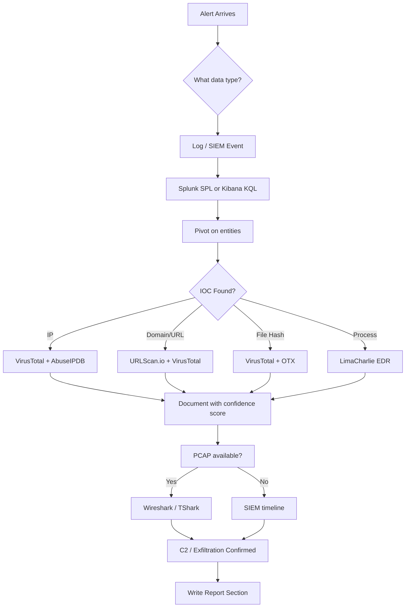
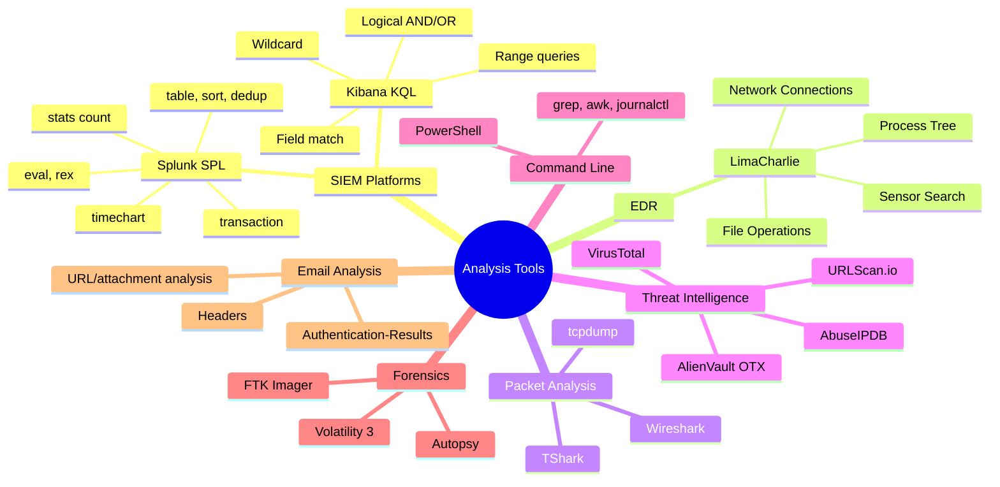

# Proficiency with Analysis Tools

## TCM Exam Objectives

- Execute core Splunk SPL commands to search, aggregate, and pivot across log data
- Construct Kibana KQL queries using field matches, wildcards, ranges, and logical operators
- Navigate EDR platforms (LimaCharlie) to trace process trees, network connections, and file operations
- Use Wireshark filters to isolate malicious traffic, follow TCP streams, and identify beaconing
- Enrich IOCs using VirusTotal, AbuseIPDB, URLScan.io, and AlienVault OTX with confidence scoring
- Parse Windows Event Logs and Sysmon events using PowerShell command-line tools
- Analyse Linux logs with grep, awk, and journalctl for SSH brute force and process anomalies
- Apply forensic tools (FTK Imager, Volatility 3, Autopsy) for memory and disk analysis
- Inspect email headers and authentication results to identify phishing and spoofing indicators
- Document every tool query with exact syntax, time window, and evidence reference for the PSAA report

The PSAA certification validates your ability to use actual tools that a SOC analyst uses daily—SIEMs, EDRs, packet analyzers, and threat intelligence platforms—to identify Indicators of Compromise. Proficiency means knowing exactly which tool to reach for when you see a specific data type, executing core queries without hesitation, interpreting output correctly, and capturing your tool usage so your report is reproducible and defensible.

- SIEM platforms: Splunk (SPL) and Kibana (KQL)
- Endpoint Detection and Response: LimaCharlie
- Packet analysis: Wireshark, TShark, tcpdump
- Threat intelligence: VirusTotal, AbuseIPDB, URLScan.io, OTX
- Command-line log parsing: PowerShell and Linux
- Forensic tools: FTK Imager, Volatility 3, Autopsy
- Email analysis: headers, authentication, artifacts





## SIEM Platforms: Splunk and Kibana

> 📌 **Exam Tip:** The PSAA does not test tool knowledge in isolation — it tests whether you can choose the right tool for the data type and interpret the output correctly. When you see a process creation alert, reach for the EDR. When you see a network connection, open Wireshark or check the SIEM firewall logs. When you have an IP or hash, go to VirusTotal. Memorise this mapping: **Process → EDR, Network → Packet/SIEM, IOC → Threat Intel, File → VT/Forensics**.

### Splunk (SPL) Essential Commands

| Command | Purpose | PSAA Example |
|---------|---------|--------------|
| `index=*` | Search across all indexes | `index=windows EventCode=4625` |
| `stats count by field` | Aggregate event counts | `index=linux_secure "Failed password" | stats count by src_ip` |
| `transaction` | Group related events within a time window | `index=windows (4625 OR 4624) | transaction src_ip startswith="4625" endswith="4624" maxspan=2m` |
| `table` | Display selected fields | `... | table _time, src_ip, user, EventCode` |
| `sort - _time` | Sort by time descending | `... | sort - _time` |
| `dedup` | Remove duplicates | `... | dedup src_ip` |
| `eval` | Create or manipulate fields | `... | eval length=len(CommandLine)` |
| `rex` | Extract fields using regex | `... | rex field=CommandLine "DestinationIp=(?<dst_ip>\d+\.\d+\.\d+\.\d+)"` |
| `lookup` | Enrich data from CSV | `... | lookup malicious_ips.csv ip AS src_ip OUTPUT threat_category` |
| `timechart` | Time-based aggregation | `index=firewall action="denied" | timechart span=1h count by src_ip` |

### Kibana / Elastic (KQL) Essential Patterns

| Query Type | KQL Syntax | PSAA Example |
|------------|------------|--------------|
| Field match | `field : value` | `event.code : "4625"` |
| Wildcard | `field : value*` | `user.name : admin*` |
| Range | `field > value` | `destination.bytes > 1000000` |
| Logical AND/OR | `field1 : value1 AND field2 : value2` | `source.ip : "10.1.1.45" AND event.code : ("4624" or "4625")` |
| Negation | `NOT field : value` | `NOT user.name : "SYSTEM"` |
| Exists query | `field : *` | `dns.question.name : *` |
| Phrase match | `field : "exact phrase"` | `process.command_line : "powershell.exe -enc *"` |

<details>
<summary>🔧 SIEM Navigation Tips for the PSAA</summary>

**Splunk:**
- Field pivoting: In search results, click any value and select "Add to search" or "New search with this value"
- Time range picker: Always ensure your time window is broad enough (±2 hours around the alert anchor)
- Raw event view: Switch to "List" or "Raw" view to see unformatted logs for full command lines
- Export: Use `| outputcsv` or the export button; immediately hash the CSV for chain of custody

**Kibana:**
- Index pattern: Start with the broadest relevant index pattern (e.g., `logs-*` or `security-*`)
- JSON view: Always click the JSON tab to see the raw, unparsed document
- Field browser: Left sidebar shows all available fields; click a field to see top values
- Filters: Use "+ Add filter" for precision drilling

</details>

**Documenting SIEM Queries:**
> "I executed the following Splunk search to identify all failed logins from the attacker's IP:
> `index=windows EventCode=4625 src_ip="203.0.113.55" | stats count by user`
> This returned 547 results targeting 12 usernames, confirming a brute-force attack."

## Endpoint Detection and Response: LimaCharlie

Key capabilities you must be fluent in:
- **Process Tree / Timeline:** View hierarchical parent-child relationships of process executions
- **Network Connections:** Filter by process to see outbound/inbound connections
- **File Operations:** See when a process creates, modifies, or deletes files
- **Sensor Search / IOC Hunting:** Search across all endpoints for a file hash, IP, or command-line pattern

**Typical EDR Investigation Flow:**
1. Start from the SIEM alert
2. Open LimaCharlie, navigate to the host, lock onto the alert timestamp
3. Examine Network Connections to confirm the alert's destination IP/port
4. Click on the process to view its Process Tree
5. Check File Operations to see what files the process touched
6. Extract the hash and use Sensor Search to scope across all endpoints

**Documenting EDR Usage:**
> "Using LimaCharlie, I examined the process tree on DESKTOP-CLIENT1 at 14:02 UTC. The C2 connection was initiated by `payload.exe` (PID 0x1a4), spawned by `powershell.exe`, which was spawned by `winword.exe` running `invoice.docm`. This confirms macro-based execution."

## Packet Analysis: Wireshark, TShark, tcpdump

### Wireshark Essential Skills

| Task | Filter / Method | PSAA Application |
|------|----------------|------------------|
| Filter traffic by IP | `ip.addr == 203.0.113.55` | Isolate suspect IP communication |
| Filter by protocol | `http`, `dns`, `tcp.port == 4444` | Find C2 on non-standard ports |
| Follow TCP Stream | Right-click -> Follow -> TCP Stream | Reconstruct full conversation |
| Export HTTP objects | File -> Export Objects -> HTTP | Extract files (malware downloads) |
| Identify beaconing | I/O Graph or periodic filter | Spot C2 traffic at regular intervals |
| Analyze DNS queries | `dns.qry.name` field | Identify DGA domains or known-bad domains |
| Detect scanning | `tcp.flags.syn == 1 and tcp.flags.ack == 0` | Port scans from a single source |

### TShark Command Line

```bash
# Extract all unique destination IPs
tshark -r incident.pcap -T fields -e ip.dst | sort -u

# Extract all DNS queries
tshark -r incident.pcap -Y "dns.flags.response == 0" -T fields -e dns.qry.name -e dns.qry.type | sort -u

# Export HTTP objects automatically
tshark -r incident.pcap --export-objects http,/output/directory
```

### tcpdump

```bash
# Capture traffic to/from a specific host
sudo tcpdump -i eth0 host 203.0.113.55 -w /cases/capture.pcap

# Read a capture and filter for HTTP GET
sudo tcpdump -r capture.pcap -A 'tcp port 80 and (tcp[((tcp[12:1] & 0xf0) >> 2):4] = 0x47455420)'
```

> 📌 **Exam Tip:** For every IOC in your PSAA report, you must include the enrichment source and confidence level. A bare IOC table with no context is a red flag to exam evaluators. Always paste the VirusTotal detection ratio (e.g., "35/72"), AbuseIPDB confidence score, or URLScan.io screenshot reference. This demonstrates you verified each IOC rather than blindly copying it from a log.

## Threat Intelligence Platforms

| IOC Type | Lookup Method | Key Fields to Review |
|----------|--------------|---------------------|
| File Hash (SHA-256) | Paste hash or upload file | Detection ratio, Behavior tab, file names, Relations |
| IP Address | Paste IP | Detection ratio, Community comments, Relations |
| Domain | Paste domain | Detection ratio, WHOIS registration date, Relations |
| URL | Paste URL | Detection ratio, Content tab, final destination |

<details>
<summary>🔧 Interpreting VirusTotal Results</summary>

- **High detection (30+/70) with consistent malware family tags:** Confirmed malicious
- **Low detection (1-5/70) with generic/heuristic detections:** Potential false positive; requires more context
- **Community comments mentioning "Cobalt Strike C2" or "Emotet":** High-confidence intelligence
- **Domain registered within the last 7 days:** High indicator of phishing or C2

**AbuseIPDB:** Provides a confidence score (0-100%). Score >90% with reports of brute-force, SSH scanning, or C2 is strong corroboration.

**URLScan.io:** Safely visits a URL and takes a screenshot. Use it to see if a phishing link renders a fake login page.

**AlienVault OTX:** Search for IPs, domains, or hashes to see if they appear in curated "Pulses." A match to a pulse titled "Emotet Epoch 4 C2 Infrastructure" adds powerful context.

</details>

## Command-Line Log Parsing

### Windows PowerShell

```powershell
# Search Security log for failed logins from a specific IP
Get-WinEvent -LogName Security | Where-Object { $_.Id -eq 4625 -and $_.Message -match "203.0.113.55" } | Format-Table TimeCreated, Id, Message -Wrap

# Get the last 100 Sysmon Operational events
Get-WinEvent -LogName "Microsoft-Windows-Sysmon/Operational" -MaxEvents 100 | Format-List

# Compute file hash for chain of custody
Get-FileHash -Path "C:\Cases\exported_logs.csv" -Algorithm SHA256
```

### Linux

```bash
# Extract all IPs that failed SSH authentication, with counts
sudo grep "Failed password" /var/log/auth.log | awk '{print $(NF-3)}' | sort | uniq -c | sort -nr

# Search syslog for a specific process
grep "payload.exe" /var/log/syslog

# View SSH logs for a time range
sudo journalctl -u ssh --since "2026-05-19 12:00:00" --until "2026-05-19 14:00:00"
```

## Forensic Tools: FTK Imager, Volatility 3, Autopsy

### FTK Imager

| Task | Method |
|------|--------|
| Create Disk Image | File -> Create Disk Image -> Physical Drive -> Raw or E01 format |
| Capture Memory | Click memory chip icon -> save to external media |
| Mount Image Read-Only | File -> Image Mounting -> select image, read-only |
| Export Files | Right-click file -> Export File Hash List |

### Volatility 3 Memory Analysis Essentials

```bash
# Identify OS profile
vol -f memory.dump windows.info

# List running processes
vol -f memory.dump windows.pslist
vol -f memory.dump windows.pstree

# Scan for network connections
vol -f memory.dump windows.netscan

# Display command line for all processes
vol -f memory.dump windows.cmdline

# Extract suspicious process
vol -f memory.dump windows.dumpfiles --pid <PID>

# Scan for injected code
vol -f memory.dump windows.malfind
```

### Autopsy

Autopsy builds on The Sleuth Kit and provides:
- **Timeline:** Unified timeline of file system events, web history, and registry activity
- **File Carving:** Recovers deleted files from unallocated space
- **Keyword Search:** Indexed search across the entire image

## Email Analysis

| Header Field | What It Reveals |
|--------------|-----------------|
| `Received:` (bottom to top) | Email path; bottom-most is the original sending server |
| `From:`, `Reply-To:`, `Return-Path:` | Mismatch between From and Reply-To indicates malicious |
| `Authentication-Results:` | SPF, DKIM, DMARC results; spf=fail, dkim=none, dmarc=fail are phishing indicators |
| `X-Originating-IP:` | Original sender's IP |
| `Message-ID:` | Sometimes reveals the actual sender's hostname |

## Developing Tool Proficiency

| Step | Activity | Time Estimate |
|------|----------|---------------|
| 1 | Install SIEM (Splunk Free or ELK) and ingest Windows Event Logs + Sysmon | 1 day |
| 2 | Simulate attacks with Atomic Red Team | 2-3 days |
| 3 | Investigate using full toolset: SIEM -> EDR -> Wireshark -> command line | Ongoing |
| 4 | Practice the pivot chain: SIEM -> VirusTotal -> URLScan.io -> SIEM | 1-2 days |
| 5 | Time yourself: brute-force detection under 20 minutes | 1 day |

## Recap

Proficiency with analysis tools bridges the gap between knowing what to look for and finding it under pressure. Master Splunk SPL and Kibana KQL for SIEM investigation, LimaCharlie for EDR process trees, Wireshark/TShark for packet analysis, VirusTotal/AbuseIPDB for IOC enrichment, PowerShell and Linux CLI for direct log parsing, and FTK Imager/Volatility 3 for forensic analysis. Every tool command should be documented in your PSAA report with the exact query string, tool used, time window, and evidence reference.
