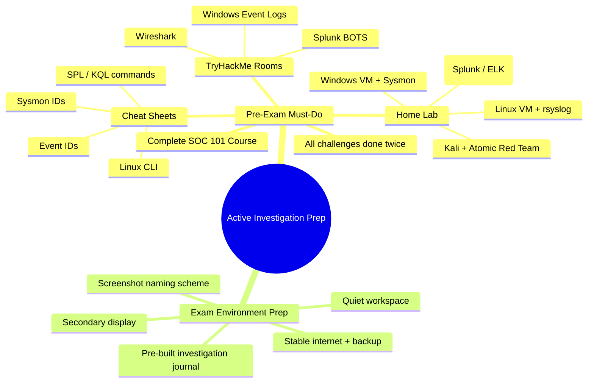
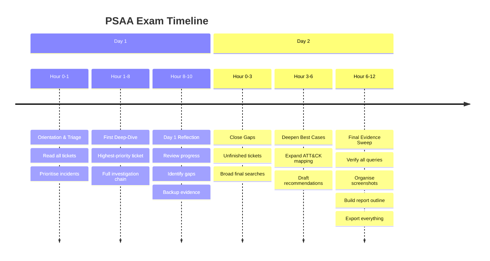
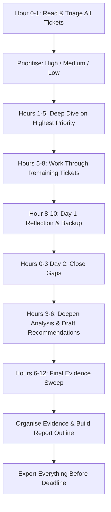

# Two Days of Active Investigation

## TCM Exam Objectives

- Execute a structured 48-hour investigation plan with clear phase transitions
- Triage and prioritise multiple incident tickets by severity and asset criticality
- Apply the full SOC investigation methodology under timed exam conditions
- Capture and preserve evidence with hash-verified chain of custody in real time
- Build a report outline and evidence inventory during the investigation phase
- Manage time effectively across high-, medium-, and low-priority tickets
- Correlate IOCs across multiple tickets to identify single-attack narratives
- Use pre-exam preparation (lab, cheat sheets, templates) to maximise investigation time
- Transition smoothly from investigation to report writing before the environment closes
- Maintain analytical composure and avoid common time-wasting pitfalls under pressure

The PSAA exam gives you two full days (48 hours) to investigate and analyze the incidents presented in your tickets. When the investigation window closes, you lose access to the exam environment. Every minute spent configuring tools or searching for resources during the exam is a minute lost from investigation. This module translates your technical skills into a concrete battle plan for the 48-hour hands-on exam period.

- Complete exam timeline and phase expectations
- Pre-examination preparation checklist
- Hour-by-hour time management strategy
- Investigation methodology applied under pressure
- Evidence capture and chain of custody
- Smooth transition to the report writing phase

## The Exam Landscape

| Phase | Duration | What You Do | Significance |
|-------|----------|-------------|--------------|
| **Active Investigation** | 48 hours | Investigate tickets using SIEMs, EDRs, packet analyzers. Gather evidence, form hypotheses, answer questions. | Hands-on phase where all technical skills are applied. Evidence collected here is the sole basis for your report. |
| **Report Writing** | 48 hours | Document findings, investigation steps, IOCs, and recommendations into a professional report. | Equally critical. A technically perfect investigation fails if the report is unclear. |

The two phases are consecutive. When the 48-hour investigation window closes, you lose access to the exam environment. All evidence must be exported before that deadline.

## Pre-Examination Preparation

### Complete the SOC 101 Course

The PSAA is based entirely on the Security Operations (SOC) 101 course. Students who follow the course in its entirety, including all challenges, score the highest on the PSAA.

**Non-negotiable steps:**
- Complete the entire course with detailed notes, especially commands and search queries
- Do all challenges, possibly more than once for difficult topics
- The entire course is valuable; complete it fully

### Build and Practice in a Home Lab

| Component | Purpose | Configuration Notes |
|-----------|---------|-------------------|
| SIEM (Splunk Free or ELK Stack) | Ingest Windows Event Logs and Sysmon | Splunk Free limited to 500MB/day; ELK has no ingestion limit |
| Windows 10/11 VM | With Sysmon and PowerShell logging enabled | Enable module logging and script block logging via GPO |
| Linux VM | Generate authentication and web server logs | Configure rsyslog to forward to SIEM |
| Kali Linux VM | Simulate attacks | Use Atomic Red Team for safe, repeatable attack simulation |

### Additional Practice on TryHackMe

The course challenges provide helpful practice, but the following TryHackMe rooms are particularly useful for PSAA preparation:
- **Wireshark rooms** - For packet analysis skills and C2 traffic identification
- **Splunk rooms** (BOSS OF THE SOC style) - For SIEM search proficiency and SPL mastery
- **Windows Event Logs / Sysmon / Windows Event Viewer rooms** - For endpoint log analysis and Event ID recognition

### Read the Official Exam and Prep Guides

The creator of the PSAA, Andrew Prince, has provided a guide on how to pass the exam. Read it carefully before starting. The TCM Security page for the PSAA certification lists the exam format, prerequisites, and expectations. Know them before you begin.

### Prepare Your Investigation Environment

- **Stable internet connection** with backup (mobile hotspot)
- **Quiet workspace** for uninterrupted work
- **SOC 101 notes** in searchable digital format
- **Quick-reference cheat sheets:** Event IDs, Sysmon IDs, SPL/KQL commands, Linux CLI
- **Pre-configured note-taking system** for building report outline as you investigate
- **Screenshot tool** with consistent naming convention (e.g., `TicketID_Description_Timestamp.png`)
- **Secondary display** if possible

### The Pre-Exam Mindset

Trust the process learned in the SOC 101 course. It is easy to have self-doubt when some parts feel too easy—you start to think you must have missed something. Take a step back, think about your methodology, and believe in yourself.

## The 48-Hour Investigation: Time Management Strategy

> 📌 **Exam Tip:** The 30-minute rule is the single most important time management strategy. If you cannot make progress on a ticket after 30 minutes, document what you have found, note the open question, and move to the next ticket. A later ticket may contain the pivot data you need to solve the earlier one. Never let one difficult ticket consume more than 10% of your total investigation time.

### Guiding Principles

- Never spend more than 30 minutes stuck on a single problem. Move on and return later.
- Take regular short breaks (5-10 minutes every 2 hours). Mental fatigue leads to missed evidence.
- Document as you go, never after the fact. Every query and IOC must be captured in real time.
- The clock stops for nothing. Set alarms for phase transitions.

### Hour-by-Hour Plan

**Hour 0-1: Orientation and Triage**
- Read every ticket completely. Do not start investigating yet.
- For each ticket, note incident type, primary assets, initial severity.
- Prioritise tickets:
  - **High Priority:** Critical assets (domain controllers, public-facing servers) or confirmed active C2
  - **Medium Priority:** Compromised workstations, policy violations
  - **Low Priority:** Informational alerts, likely false positives
- Identify quick wins to build momentum
- Create a working document with a section per ticket

**Hours 1-5: First Deep-Dive**
- Start with the highest-priority ticket
- Full SOC methodology: Triage -> Hypothesis -> SIEM Evidence -> Pivot -> IOC Enrichment -> ATT&CK -> Scope -> Impact
- Capture screenshots of every SIEM query result and IOC enrichment
- Export critical log excerpts to CSV; hash the export for chain of custody

**Hours 5-8: Breadth and Depth**
- Move to the next-highest priority ticket
- Continuously cross-reference IOCs across tickets
- A phishing IP that also appears in a C2 alert connects two incidents

**Hour 8-10: Day 1 Reflection**
- Review every ticket. Have you answered the core questions?
- Note specific gaps for tickets where you are stuck
- Ensure all screenshots and notes are backed up
- For each ticket, ask: have I found the initial access vector? Have I traced all actions? Have I scoped all affected systems?
- Prepare a list of the top 3 unanswered questions to address first on Day 2
- Sleep. A full night's rest improves analytical reasoning more than three extra hours of exhausted investigation

**Day 2, Hours 0-3: Close the Gaps**
- Start with incomplete tickets with fresh eyes
- Run a final broad SIEM search on primary pivot fields
- If truly stuck, document what you found, note where it stalled, and move on

**Hours 3-6: Deepen the Best Cases**
- Expand ATT&CK mapping, identify additional persistence
- Begin drafting recommendations in your notes
- Verify every IOC has enrichment and screenshot evidence

**Hours 6-12: Final Evidence Sweep and Organization**
- Re-run key SIEM queries one last time to confirm consistency
- Organise screenshots into folders by ticket with descriptive names
- Review hash values for all exports
- Build report outline with populated ticket summaries, IOC tables, and timelines
- Export all notes, screenshots, and evidence files to a location accessible during report writing

## Investigation Methodology Applied Under Pressure

| Step | Action | Time Budget |
|------|--------|-------------|
| **1. Triaging Alerts** | Read ticket, determine severity, evaluate business impact | 5 min per ticket |
| **2. Investigation & Hypothesis** | Structured questions: Who, What, When, Where. Identify IOCs. | 15-30 min |
| **3. Collecting Evidence** | SIEM queries, process trees, network artifacts, VirusTotal | 30-60 min |
| **4. Making a Decision** | Benign or malicious? True positive or false positive? | 5-10 min |
| **5. Documenting the Incident** | What was observed? What actions taken? Final outcome? | Ongoing |

## Common Pitfalls

| Pitfall | Consequence | Solution |
|---------|-------------|----------|
| Getting stuck on one ticket for hours | Lost time on other tickets | Set a hard 30-minute limit per dead end |
| Delaying evidence capture | Cannot go back after investigation ends | Screenshot and export in real time |
| Neglecting report preparation time | Report phase starts with disorganised notes | Organise during final hours of investigation |
| Writing report without structure | Confusing, hard-to-follow document | Use the provided template exactly |
| Working without breaks | Mental fatigue and missed evidence | 5-10 min break every 2 hours |

## Practical Exercise: The 48-Hour Simulation

To truly prepare, simulate the exam experience at least once before the real exam.

**Setup:**
- Your home lab with SIEM, Windows VM (Sysmon enabled), Linux VM, and Kali Linux
- A timer set for exactly 48 hours
- Three pre-written tickets (or have a study partner create them)

**Scenario Tickets:**
- **Ticket 1:** A phishing email with a malicious attachment that leads to a C2 beacon on a workstation
- **Ticket 2:** An SSH brute-force attack against a Linux web server, followed by a reverse shell and data staging
- **Ticket 3:** A lateral movement alert from the workstation in Ticket 1 to a file server

**Execution:**
- Hour 0-1: Read all tickets, prioritise, set up note-taking system
- Hours 1-8 (Day 1): Investigate using full methodology; capture screenshots as you go
- Day 2: Close gaps, deepen analysis, organise evidence, build report outline
- Days 3-4: Write the full report using the PSAA report template structure

**Self-Assessment:**
- Did you complete all tickets within 48 hours?
- Was your evidence organised and ready for report writing?
- Could another analyst follow your report and reach the same conclusions?

🔧 Evidence Handling and Chain of Custody

During the investigation, every piece of evidence must be handled with forensic soundness:

**Export logs:**
- Export SIEM query results to CSV
- Record the SHA-256 hash of every exported file
- Name files consistently: `TicketID_Source_Timestamp.csv`

**Screenshots:**
- Capture the full query bar, results pane, and timestamp in each screenshot
- Use a naming convention: `Ticket01_ImpossibleTravel_QueryResult.png`
- Reference screenshots by filename in your investigation notes

**IOC tracking:**
- Maintain a running IOC table with columns: Type, Value, Source, Confidence, Enrichment Result
- Enrich every IOC with at least one external threat intelligence source
- Record the enrichment source and result alongside the IOC

**Chain of custody documentation:**
- Record the date and time each piece of evidence was collected
- Note the tool used to collect it (SIEM query, EDR export, command-line output)
- Record the hash of every exported file
- This chain of custody goes into Appendix B of your final report

> 📌 **Exam Tip:** The 15 minutes before the investigation window closes are the most critical. Create a single ZIP file containing all screenshots (organised by ticket), CSV exports of SIEM queries, IOC master list, and your investigation journal. Name it `CandidateID_Evidence_Export.zip` and store it in at least two locations. Once the environment closes, there is no going back for a missed screenshot or export.

## Transitioning to the Report Phase

**Before the investigation window closes:**
- Export all SIEM search results you need
- Verify every screenshot is saved and named
- Confirm all IOC enrichment results are documented
- Ensure report outline is populated with key findings
- Back up everything to external drive or cloud storage

**During the report phase:**
- Follow the provided template exactly
- For each incident, document: summary, investigation steps, answers with evidence, IOC list, recommendations
- Structure clearly so another analyst can follow your analysis and reach the same conclusion

## Recap

The 48-hour active investigation phase requires disciplined time management: Hour 0-1 for orientation and triage, Hours 1-8 for deep investigation, Day 2 for closing gaps and organizing evidence. Preparation is critical—complete the SOC 101 course, build a home lab, prepare cheat sheets and your note-taking system. Document every SIEM query and IOC in real time, never spend more than 30 minutes stuck on a single problem, take regular breaks, and ensure all evidence is exported before the investigation window closes.
